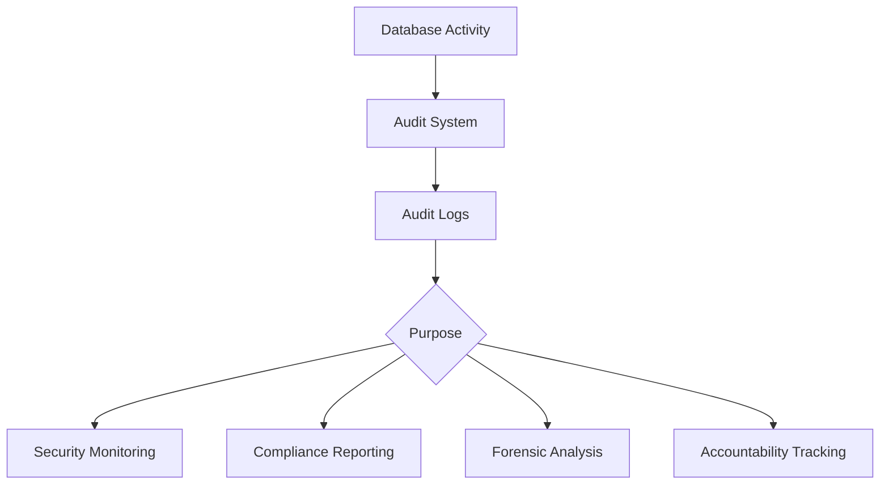

# Database Auditing

## Introduction

Database auditing is a crucial security feature that allows database administrators to track and record events and activities occurring within a database system. Think of it as a security camera for your database - it monitors who did what, when, and how. For organizations handling sensitive data, proper auditing is not just good practice but often a compliance requirement for regulations like GDPR, HIPAA, and SOX.

In this guide, you'll learn what database auditing is, why it's important, how to implement it, and best practices to follow. Whether you're preparing for a security audit or just want to improve your database security posture, understanding database auditing is an essential skill for any database administrator.

## What is Database Auditing?

Database auditing is the process of monitoring and recording selected actions of database users. These actions may include:

- Login attempts (successful and failed)
- Data modifications (INSERT, UPDATE, DELETE operations)
- Data access (SELECT operations)
- Schema changes (CREATE, ALTER, DROP statements)
- Security changes (granting or revoking privileges)
- Administrative actions

The collected audit data is typically stored in audit logs or tables that can be analyzed later for security investigations, compliance reporting, or performance tuning.

## Why is Database Auditing Important?

Database auditing serves several critical purposes:

1. **Security Monitoring**: Identifies unauthorized access attempts and potential security breaches
2. **Compliance Requirements**: Helps meet regulatory requirements like GDPR, HIPAA, PCI DSS, and SOX
3. **Forensic Analysis**: Provides evidence for investigating security incidents
4. **Accountability**: Establishes who performed what actions and when
5. **Deterrence**: Discourages malicious activities when users know their actions are being monitored



## Types of Database Auditing

There are several approaches to database auditing, each with its own advantages and limitations:

### 1. Statement-Level Auditing

Captures the SQL statements executed against the database.

**Pros:**
- Provides context about what users were trying to do
- Relatively low performance impact

**Cons:**
- Doesn't show what data was actually accessed or modified
- May miss some operations performed through stored procedures

### 2. Object-Level Auditing

Records operations performed on specific database objects (tables, views, procedures).

**Pros:**
- More focused approach that reduces audit volume
- Better performance than auditing everything

**Cons:**
- Might miss important activities if not all relevant objects are audited

### 3. Value-Based Auditing

Captures the before and after values of modified data.

**Pros:**
- Provides complete visibility into data changes
- Essential for sensitive data monitoring

**Cons:**
- Higher performance impact
- Generates larger audit logs

### 4. Fine-Grained Auditing

Allows auditing based on complex conditions, such as when certain columns are accessed or specific WHERE clauses are used.

**Pros:**
- Highly customizable and precise
- Can focus on truly important events

**Cons:**
- More complex to set up and maintain
- May have higher performance overhead depending on implementation

## Implementing Database Auditing

Let's look at how to implement basic auditing in some popular database systems.

### MySQL Audit Implementation

MySQL offers built-in audit capabilities through the MySQL Enterprise Audit plugin.

#### Enabling the Audit Plugin

```sql
INSTALL PLUGIN audit_log SONAME 'audit_log.so';
```

#### Configuring Audit Settings

You can configure audit settings in the `my.cnf` file:

```
[mysqld]
audit_log_format=JSON
audit_log_file=/var/mysql/audit.log
audit_log_policy=ALL
```

#### Checking Audit Status

```sql
SHOW VARIABLES LIKE 'audit%';
```

Output:
```
+--------------------+-------------+
| Variable_name      | Value       |
+--------------------+-------------+
| audit_log_format   | JSON        |
| audit_log_file     | audit.log   |
| audit_log_policy   | ALL         |
| ...                | ...         |
+--------------------+-------------+
```

### PostgreSQL Audit Implementation

PostgreSQL provides auditing through its extension called `pgaudit`.

#### Installing pgAudit

```sql
CREATE EXTENSION pgaudit;
```

#### Configuring pgAudit

Edit the `postgresql.conf` file:

```
pgaudit.log = 'write, ddl'
pgaudit.log_catalog = on
pgaudit.log_parameter = on
pgaudit.log_relation = on
```

#### Viewing Audit Logs

PostgreSQL audit logs are written to the standard PostgreSQL log file. You can query them using:

```sql
SELECT * FROM pg_catalog.pg_read_file('pg_log/postgresql.log');
```

### SQL Server Audit Implementation

SQL Server provides a comprehensive auditing framework.

#### Creating a Server Audit

```sql
CREATE SERVER AUDIT DataAudit
TO FILE (FILEPATH = 'C:\AuditLogs\')
WITH (ON_FAILURE = CONTINUE);
```

#### Creating Audit Specifications

```sql
CREATE SERVER AUDIT SPECIFICATION ServerAuditSpec
FOR SERVER AUDIT DataAudit
ADD (FAILED_LOGIN_GROUP),
ADD (SUCCESSFUL_LOGIN_GROUP)
WITH (STATE = ON);

CREATE DATABASE AUDIT SPECIFICATION DatabaseAuditSpec
FOR SERVER AUDIT DataAudit
ADD (SELECT, INSERT, UPDATE, DELETE ON SCHEMA::dbo BY public)
WITH (STATE = ON);
```

#### Enabling the Audit

```sql
ALTER SERVER AUDIT DataAudit
WITH (STATE = ON);
```

#### Viewing Audit Data

```sql
SELECT * FROM sys.fn_get_audit_file 
    ('C:\AuditLogs\*.sqlaudit', DEFAULT, DEFAULT);
```

Output:
```
+---------------+-------------+----------+--------+-------+
| event_time    | action_id   | username | object | ...   |
+---------------+-------------+----------+--------+-------+
| 2025-03-18... | SCHEMA_...  | sa       | dbo    | ...   |
| 2025-03-18... | INSERT      | appuser  | users  | ...   |
| ...           | ...         | ...      | ...    | ...   |
+---------------+-------------+----------+--------+-------+
```

## Creating Custom Audit Tables

For simpler databases or when native auditing tools are unavailable, you can implement your own auditing system using triggers and audit tables.

### Step 1: Create an Audit Table

```sql
CREATE TABLE audit_log (
    audit_id INT AUTO_INCREMENT PRIMARY KEY,
    table_name VARCHAR(100) NOT NULL,
    operation VARCHAR(10) NOT NULL,
    record_id INT NOT NULL,
    old_values TEXT,
    new_values TEXT,
    changed_by VARCHAR(100) NOT NULL,
    changed_at TIMESTAMP DEFAULT CURRENT_TIMESTAMP
);
```

### Step 2: Create Audit Triggers

Here's an example of an UPDATE trigger that logs changes to a `customers` table:

```sql
CREATE TRIGGER customers_audit_update
AFTER UPDATE ON customers
FOR EACH ROW
BEGIN
    INSERT INTO audit_log (
        table_name, 
        operation, 
        record_id, 
        old_values, 
        new_values, 
        changed_by
    )
    VALUES (
        'customers',
        'UPDATE',
        NEW.customer_id,
        JSON_OBJECT(
            'name', OLD.name,
            'email', OLD.email,
            'phone', OLD.phone
        ),
        JSON_OBJECT(
            'name', NEW.name,
            'email', NEW.email,
            'phone', NEW.phone
        ),
        CURRENT_USER()
    );
END;
```

Similar triggers can be created for INSERT and DELETE operations.

### Step 3: Query Audit Data

```sql
SELECT * FROM audit_log 
WHERE table_name = 'customers' 
AND changed_at > '2025-03-01'
ORDER BY changed_at DESC;
```

Output:
```
+----------+-------------+-----------+-----------+-------------------+-------------------+-------------+---------------------+
| audit_id | table_name  | operation | record_id | old_values        | new_values        | changed_by  | changed_at          |
+----------+-------------+-----------+-----------+-------------------+-------------------+-------------+---------------------+
| 147      | customers   | UPDATE    | 42        | {"name":"John"... | {"name":"John"... | admin@local | 2025-03-18 14:22:35 |
| 146      | customers   | INSERT    | 55        | NULL              | {"name":"Mary"... | app_user    | 2025-03-17 09:15:12 |
| ...      | ...         | ...       | ...       | ...               | ...               | ...         | ...                 |
+----------+-------------+-----------+-----------+-------------------+-------------------+-------------+---------------------+
```

## Best Practices for Database Auditing

To get the most out of your database auditing while minimizing performance impact:

### 1. Be Selective

Audit what matters, not everything. Focus on:
- Sensitive tables and data
- Authentication and authorization events
- Schema changes
- Privileged user actions

### 2. Define Retention Policies

Determine how long to keep audit data based on:
- Regulatory requirements
- Internal policies
- Storage constraints

### 3. Protect Audit Logs

Audit logs are security-critical and should be:
- Stored securely with restricted access
- Backed up regularly
- Protected from unauthorized modification

### 4. Monitor Performance Impact

Auditing can affect database performance. Regularly monitor:
- Query execution times
- Audit log size and growth rate
- System resource usage

### 5. Regular Reviews

Set up a schedule to review audit logs for:
- Suspicious activities
- Policy violations
- Usage patterns

### 6. Establish Alert Mechanisms

Configure alerts for critical events:
- Failed login attempts exceeding thresholds
- Modifications to sensitive data
- Schema or security changes

### 7. Document Your Audit Strategy

Maintain documentation that includes:
- What is being audited and why
- Retention policies
- Review procedures
- Response processes for suspicious activities

## Real-World Application: HIPAA Compliance Auditing

Let's consider a healthcare application that needs to comply with HIPAA regulations:

```sql
-- Create an audit specification for patient data
CREATE DATABASE AUDIT SPECIFICATION HIPAACompliance
FOR SERVER AUDIT DataAccessAudit
ADD (SELECT, INSERT, UPDATE, DELETE ON SCHEMA::dbo.PatientRecords BY public),
ADD (EXECUTE ON SCHEMA::dbo.PatientProcedures BY public)
WITH (STATE = ON);

-- Create a function to detect unauthorized access patterns
CREATE FUNCTION dbo.CheckUnusualAccess()
RETURNS TABLE
AS
RETURN
(
    SELECT 
        username, 
        COUNT(*) as access_count,
        MIN(event_time) as first_access,
        MAX(event_time) as last_access
    FROM sys.fn_get_audit_file('C:\AuditLogs\*.sqlaudit', DEFAULT, DEFAULT)
    WHERE object_name = 'PatientRecords'
    AND DATEPART(hour, event_time) BETWEEN 22 AND 5 -- After hours access
    GROUP BY username
    HAVING COUNT(*) > 10 -- Threshold for suspicious activity
);

-- Create a job to check for unusual activity every hour
EXEC msdb.dbo.sp_add_job @job_name = 'HIPAA Access Monitoring';
EXEC msdb.dbo.sp_add_jobstep 
    @job_name = 'HIPAA Access Monitoring',
    @step_name = 'Check unusual access',
    @subsystem = 'TSQL',
    @command = 'INSERT INTO SecurityAlerts SELECT * FROM dbo.CheckUnusualAccess();';
EXEC msdb.dbo.sp_add_schedule 
    @schedule_name = 'Hourly',
    @freq_type = 4, -- Daily
    @freq_interval = 1,
    @freq_subday_type = 8, -- Hours
    @freq_subday_interval = 1;
EXEC msdb.dbo.sp_attach_schedule 
    @job_name = 'HIPAA Access Monitoring',
    @schedule_name = 'Hourly';
EXEC msdb.dbo.sp_add_jobserver 
    @job_name = 'HIPAA Access Monitoring';
```

## Summary

Database auditing is a critical component of database security and compliance strategies. It provides visibility into database activities, helps detect security incidents, supports compliance requirements, and establishes accountability.

Key points to remember:
- Choose the right level of auditing based on your security and compliance needs
- Balance comprehensive auditing with performance considerations
- Protect audit logs as sensitive security information
- Regularly review audit data for suspicious activities
- Establish clear procedures for responding to audit findings

By implementing proper database auditing, you can significantly enhance your database security posture and meet regulatory requirements while maintaining database performance.

## Additional Resources and Exercises

### Resources
- Database vendor documentation for auditing features
- Regulatory compliance guidelines relevant to your industry
- OWASP Database Security Cheat Sheet

### Exercises

1. **Basic Auditing Setup**
   Set up basic login auditing on a test database and generate some test logins. Review the audit logs.

2. **Custom Audit Table**
   Create a custom audit table and triggers for a simple application with at least three tables.

3. **Audit Analysis**
   Write SQL queries to analyze audit logs and identify:
   - Most active users
   - Most frequently accessed tables
   - Access patterns by time of day

4. **Compliance Scenario**
   Design an auditing strategy for a fictional application that must comply with either PCI DSS, GDPR, or HIPAA.

5. **Performance Testing**
   Measure the performance impact of different auditing configurations on a test database.