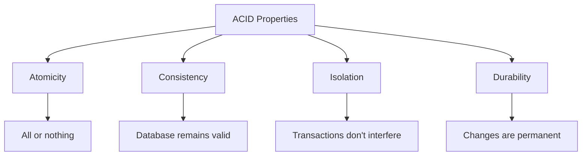
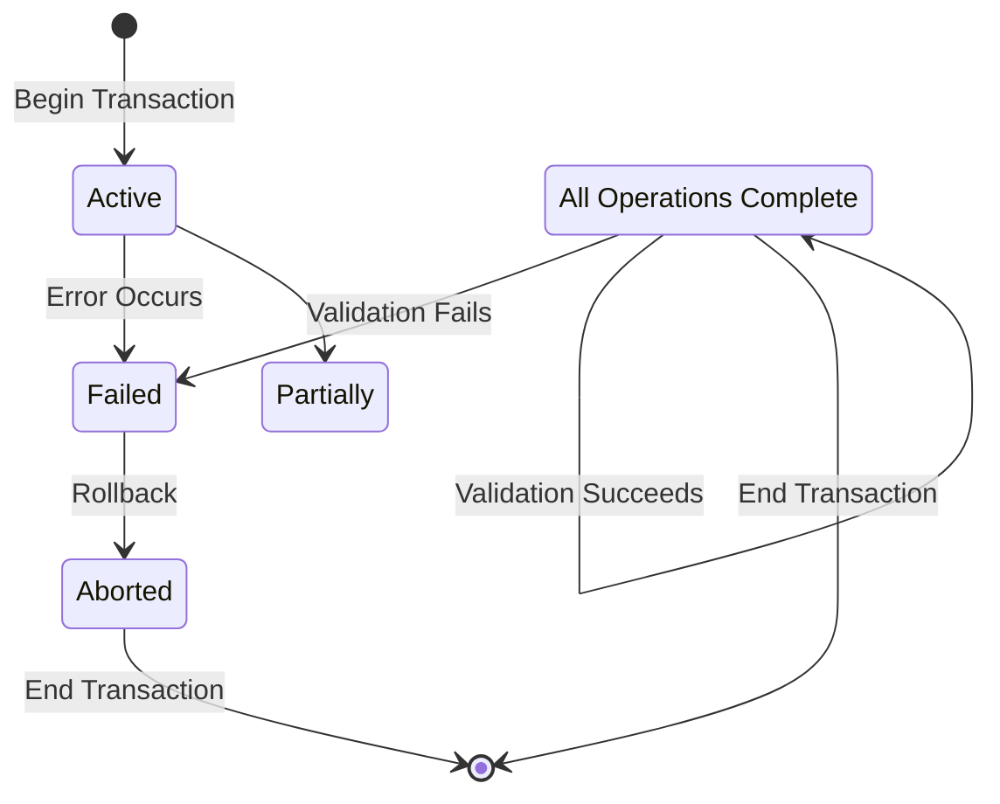

# Transaction Concepts

## Introduction

In the world of databases and information systems, a **transaction** is a sequence of operations performed as a single logical unit of work. Think of a transaction like a complete task that either succeeds entirely or doesn't happen at all—there's no in-between state.

For example, when you transfer money from one bank account to another, multiple operations occur:
1. Check if you have enough funds
2. Deduct money from your account
3. Add money to the recipient's account
4. Record the transaction in the history

If any of these steps fail, the entire transaction should be canceled to prevent issues like money disappearing or being duplicated.

## Why Transactions Matter

Transactions are essential for maintaining data integrity in applications where multiple operations need to be executed as a single unit. Without proper transaction management, your database could end up in an inconsistent state when:

- System failures occur
- Multiple users access the same data simultaneously
- Network interruptions happen
- Power outages strike

## ACID Properties of Transactions

Transactions follow four key properties, commonly known as **ACID**:



### Atomicity

Atomicity guarantees that a transaction is treated as a single, indivisible unit that either completely succeeds or completely fails.

- If all operations succeed, the transaction is committed
- If any operation fails, all changes are rolled back to their previous state

```java
// Example of atomicity in pseudocode
try {
    beginTransaction();
    withdrawFromAccount(accountA, 100);
    depositToAccount(accountB, 100);
    commitTransaction();
} catch (Exception e) {
    rollbackTransaction();
}
```

### Consistency

Consistency ensures that a transaction brings the database from one valid state to another valid state, maintaining all predefined rules and constraints.

For example, if a database rule states that all accounts must have a non-negative balance:

```java
// Example of enforcing consistency
boolean isTransferValid(Account from, double amount) {
    return from.getBalance() >= amount;
}

try {
    beginTransaction();
    if (isTransferValid(accountA, 100)) {
        withdrawFromAccount(accountA, 100);
        depositToAccount(accountB, 100);
        commitTransaction();
    } else {
        // Don't even start the transaction if it would violate consistency
        System.out.println("Insufficient funds");
    }
} catch (Exception e) {
    rollbackTransaction();
}
```

### Isolation

Isolation ensures that concurrent execution of transactions leaves the database in the same state as if the transactions were executed sequentially.

```java
// Without proper isolation:
// Transaction 1
beginTransaction();
int balance = getAccountBalance(accountA); // Reads $1000
// (Transaction 2 executes here and withdraws $200, balance now $800)
withdrawFromAccount(accountA, balance); // Incorrectly sets balance to $0 instead of $800-$1000=$-200
commitTransaction();

// With proper isolation:
// Transaction uses appropriate isolation level to prevent the issue
```

### Durability

Durability guarantees that once a transaction is committed, its effects persist even in the case of system failures.

```java
// Example of ensuring durability
try {
    beginTransaction();
    withdrawFromAccount(accountA, 100);
    depositToAccount(accountB, 100);
    
    // Write to transaction log first
    writeToTransactionLog("Transfer $100 from A to B");
    
    // Then commit changes
    commitTransaction();
    
    // Confirm to user only after successful commit
    showMessage("Transfer successful");
} catch (Exception e) {
    rollbackTransaction();
    showMessage("Transfer failed");
}
```

## Transaction States

A transaction goes through several states during its lifecycle:



1. **Active**: The initial state when a transaction begins and operations are being executed
2. **Partially Committed**: When the final operation has been executed, but the changes haven't been permanently stored
3. **Committed**: When all changes have been permanently stored in the database
4. **Failed**: When normal execution can't continue, and the transaction must be rolled back
5. **Aborted**: When the transaction has been rolled back, and the database is restored to its state before the transaction began

## Transaction Control Commands

Here are the basic SQL commands for controlling transactions:

```sql
-- Start a new transaction
BEGIN TRANSACTION;

-- Save changes permanently
COMMIT;

-- Undo changes and return to previous state
ROLLBACK;

-- Create points to roll back to without undoing the entire transaction
SAVEPOINT save1;

-- Roll back to a specific savepoint
ROLLBACK TO save1;
```

### Example of a Simple Bank Transfer Transaction

```sql
-- Start a new transaction for transferring $100 from Account A to Account B
BEGIN TRANSACTION;

-- Withdraw $100 from Account A
UPDATE Accounts 
SET Balance = Balance - 100 
WHERE AccountID = 'A';

-- Deposit $100 to Account B
UPDATE Accounts 
SET Balance = Balance + 100 
WHERE AccountID = 'B';

-- Check if Account A has sufficient funds after withdrawal
DECLARE @BalanceA INT;
SELECT @BalanceA = Balance FROM Accounts WHERE AccountID = 'A';

IF @BalanceA >= 0
    -- Complete the transaction
    COMMIT;
ELSE
    -- Undo the transaction
    ROLLBACK;
```

## Transaction Concurrency Problems

When multiple transactions execute simultaneously, several problems can occur:

### 1. Lost Update

When two transactions read and update the same data, one transaction's changes might overwrite the other's without incorporating its modifications.

```
Time | Transaction 1              | Transaction 2
-----|----------------------------|---------------------------
1    | Read balance (1000)        |
2    |                            | Read balance (1000)
3    | Subtract 100               |
4    | Write balance (900)        |
5    |                            | Add 200
6    |                            | Write balance (1200)
```

Result: Transaction 1's update is lost. The final balance is 1200 instead of 1100.

### 2. Dirty Read

When one transaction reads data that has been modified but not yet committed by another transaction, and the other transaction later rolls back.

```
Time | Transaction 1              | Transaction 2
-----|----------------------------|---------------------------
1    | Update balance to 900      |
2    |                            | Read balance (900)
3    |                            | Make decisions based on 900
4    | Rollback (balance now 1000)|
```

Result: Transaction 2 made decisions based on data that was never actually committed.

### 3. Non-repeatable Read

When a transaction reads the same data multiple times and gets different results because another transaction has modified the data in between reads.

```
Time | Transaction 1              | Transaction 2
-----|----------------------------|---------------------------
1    | Read balance (1000)        |
2    |                            | Update balance to 900
3    |                            | Commit
4    | Read balance again (900)   |
```

Result: Transaction 1 reads different values for the same query.

### 4. Phantom Read

When a transaction reads a set of rows that satisfy a condition, another transaction inserts new rows that satisfy that condition, and the first transaction reads again, seeing the new "phantom" rows.

```
Time | Transaction 1                 | Transaction 2
-----|-------------------------------|---------------------------
1    | Count accounts with >500 (5)  |
2    |                               | Insert new account with 600
3    |                               | Commit
4    | Count accounts with >500 (6)  |
```

Result: Transaction 1 sees different results for the same query.

## Transaction Isolation Levels

To address concurrency problems, databases provide different isolation levels, each with different trade-offs between consistency and performance:

| Isolation Level     | Dirty Read | Non-repeatable Read | Phantom Read | Performance |
|---------------------|------------|---------------------|--------------|-------------|
| READ UNCOMMITTED    | Possible   | Possible            | Possible     | Highest     |
| READ COMMITTED      | Prevented  | Possible            | Possible     | High        |
| REPEATABLE READ     | Prevented  | Prevented           | Possible     | Medium      |
| SERIALIZABLE        | Prevented  | Prevented           | Prevented    | Lowest      |

You can set the isolation level in SQL:

```sql
-- Set the transaction isolation level
SET TRANSACTION ISOLATION LEVEL READ COMMITTED;

-- Begin the transaction
BEGIN TRANSACTION;
```

## Implementing Transactions in Java

Java provides several ways to manage transactions. Here's an example using JDBC:

```java
Connection conn = null;
try {
    // Disable auto-commit
    conn = dataSource.getConnection();
    conn.setAutoCommit(false);
    
    // Perform multiple operations as part of the transaction
    PreparedStatement withdrawStmt = conn.prepareStatement(
        "UPDATE Accounts SET Balance = Balance - ? WHERE AccountID = ?");
    withdrawStmt.setDouble(1, 100.00);
    withdrawStmt.setString(2, "A");
    withdrawStmt.executeUpdate();
    
    PreparedStatement depositStmt = conn.prepareStatement(
        "UPDATE Accounts SET Balance = Balance + ? WHERE AccountID = ?");
    depositStmt.setDouble(1, 100.00);
    depositStmt.setString(2, "B");
    depositStmt.executeUpdate();
    
    // If everything went well, commit the transaction
    conn.commit();
    System.out.println("Transaction completed successfully!");
    
} catch (SQLException e) {
    // Something went wrong, roll back the transaction
    if (conn != null) {
        try {
            conn.rollback();
            System.out.println("Transaction rolled back due to an error.");
        } catch (SQLException ex) {
            ex.printStackTrace();
        }
    }
    e.printStackTrace();
} finally {
    // Reset auto-commit to default and close connection
    if (conn != null) {
        try {
            conn.setAutoCommit(true);
            conn.close();
        } catch (SQLException e) {
            e.printStackTrace();
        }
    }
}
```

## Real-World Applications

### E-commerce Order Processing

When a customer places an order, multiple tables need to be updated:
- Inventory table (reduce stock)
- Orders table (create new order)
- Customer table (update purchase history)
- Payment table (record payment)

All of these must succeed or fail as a unit to prevent issues like charging customers for out-of-stock items.

### Banking Systems

Financial applications rely heavily on transactions to ensure that money is neither created nor destroyed during transfers, withdrawals, and deposits.

### Flight Reservation Systems

When booking a flight, the system must:
- Check seat availability
- Reserve the seat
- Process payment
- Generate booking confirmation

If any step fails, the entire booking should be rolled back to avoid double bookings or charging for unsuccessful reservations.

## Summary

Transactions are fundamental to maintaining data integrity in systems where multiple operations need to be treated as a single unit of work. They follow the ACID properties (Atomicity, Consistency, Isolation, Durability) to ensure reliable operation even in the face of failures and concurrent access.

Key points to remember:
- Transactions are all-or-nothing operations
- ACID properties guarantee reliable processing
- Different isolation levels handle concurrency issues with different trade-offs
- Proper transaction management is essential for applications dealing with critical data

## Exercises

1. Write a transaction to transfer money between two accounts, ensuring the source account doesn't go negative.
2. Identify which isolation level you would use for:
   - A report that needs to see a consistent snapshot of data
   - A high-throughput logging system where occasional inconsistencies are acceptable
3. Implement a transaction with savepoints to handle complex operations with partial failures.
4. Analyze a real-world application and identify where transactions are necessary to maintain data integrity.

## Additional Resources

- [Database Design and Implementation](https://www.oreilly.com/library/view/database-design-and/9781492057604/)
- [SQL Performance Explained](https://use-the-index-luke.com/)
- [Java Persistence with JPA and Hibernate](https://www.manning.com/books/java-persistence-with-jpa-and-hibernate)