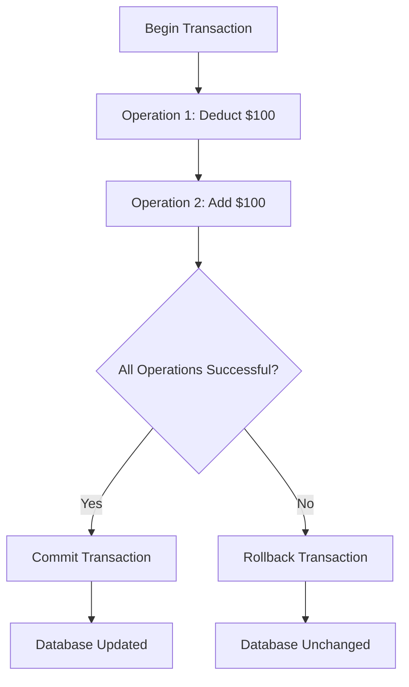
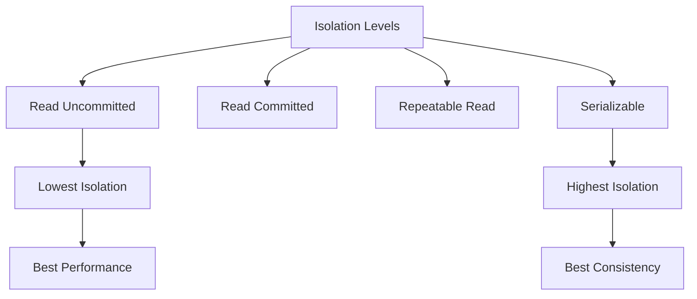
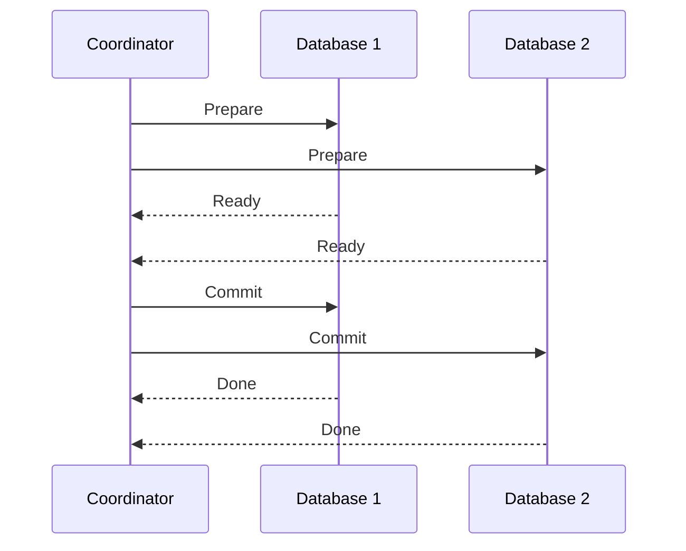

# ACID Properties in Database Transactions

## Introduction

When you're building applications that interact with databases, ensuring data integrity is paramount. Imagine transferring money between bank accounts - if the system fails mid-transaction, you could end up with money disappearing or being duplicated! This is where **ACID properties** come into play.

ACID is an acronym that represents four critical properties of database transactions:

- **A**tomicity
- **C**onsistency
- **I**solation
- **D**urability

These properties guarantee that database transactions are processed reliably, even in the face of errors, power failures, or other problems. Let's explore each of these properties in detail.

## What is a Transaction?

Before diving into ACID, let's clarify what a transaction is. A **transaction** is a sequence of one or more database operations (such as inserts, updates, or deletes) that are executed as a single logical unit of work.

For example, when transferring $100 from Account A to Account B:
1. Deduct $100 from Account A
2. Add $100 to Account B

These two operations together form a single transaction.

```sql
-- Example transaction in SQL
BEGIN TRANSACTION;
  UPDATE accounts SET balance = balance - 100 WHERE account_id = 'A';
  UPDATE accounts SET balance = balance + 100 WHERE account_id = 'B';
COMMIT;
```

## ACID Properties Explained

### Atomicity

**Atomicity** guarantees that a transaction is treated as a single, indivisible unit of work. Either all operations within the transaction are successfully completed, or none of them are applied.

#### Real-world Example

Consider our bank transfer example:

```sql
BEGIN TRANSACTION;
  UPDATE accounts SET balance = balance - 100 WHERE account_id = 'A';
  -- Imagine the system crashes here
  UPDATE accounts SET balance = balance + 100 WHERE account_id = 'B';
COMMIT;
```

If the system crashes after deducting money from Account A but before adding it to Account B, atomicity ensures that the entire transaction is rolled back. This means Account A would return to its original balance, preventing money from disappearing.

#### How Atomicity Works

Database systems maintain a transaction log that tracks all operations. If a transaction fails, the system uses this log to undo (rollback) any changes made by the incomplete transaction.



### Consistency

**Consistency** ensures that a transaction can only bring the database from one valid state to another. Any data written to the database must adhere to all defined rules, including constraints, cascades, and triggers.

#### Real-world Example

If we have a rule that accounts cannot have negative balances, consistency would prevent the transaction from completing if Account A would end up with a negative balance after the transfer.

```sql
-- Account A has a balance of $50
BEGIN TRANSACTION;
  UPDATE accounts SET balance = balance - 100 WHERE account_id = 'A'; -- Would result in -$50
  UPDATE accounts SET balance = balance + 100 WHERE account_id = 'B';
COMMIT; -- This would fail if consistency is enforced
```

#### How Consistency Works

Databases enforce consistency through:
- Primary key constraints
- Foreign key constraints
- Check constraints
- Triggers
- Database rules

Here's an example of a check constraint that enforces non-negative balances:

```sql
CREATE TABLE accounts (
  account_id VARCHAR(10) PRIMARY KEY,
  balance DECIMAL(10,2) CHECK (balance >= 0)
);
```

### Isolation

**Isolation** ensures that concurrent transactions do not interfere with each other. Even though multiple transactions may execute simultaneously, the result should be the same as if they were executed sequentially.

#### Isolation Problems

Without proper isolation, several problems can occur:

1. **Dirty Read**: Reading uncommitted data from another transaction
2. **Non-repeatable Read**: Getting different results when reading the same data twice in the same transaction
3. **Phantom Read**: When a row appears in a query result that wasn't there before

#### Isolation Levels

Databases offer different isolation levels to balance performance and data integrity:



#### Example: Race Condition

Imagine two customers trying to book the last seat on a flight simultaneously:

```sql
-- Transaction 1 (Customer A)
BEGIN TRANSACTION;
  SELECT seat_count FROM flights WHERE flight_id = 'FL123'; -- Returns 1
  -- Customer A decides to book the last seat
  UPDATE flights SET seat_count = seat_count - 1 WHERE flight_id = 'FL123';
COMMIT;

-- Transaction 2 (Customer B) - running concurrently
BEGIN TRANSACTION;
  SELECT seat_count FROM flights WHERE flight_id = 'FL123'; -- Also returns 1
  -- Customer B also decides to book the last seat
  UPDATE flights SET seat_count = seat_count - 1 WHERE flight_id = 'FL123';
COMMIT;
```

With proper isolation, one transaction would wait for the other to complete, preventing overbooking.

### Durability

**Durability** guarantees that once a transaction is committed, its effects remain permanent even in the event of a system failure. Committed data should never be lost.

#### How Durability Works

Databases achieve durability through:
1. **Transaction Logs**: Writing all changes to a log before applying them to the database
2. **Checkpoints**: Periodic saves of the database state
3. **Storage Redundancy**: Multiple copies of data on different physical devices

#### Example

```sql
BEGIN TRANSACTION;
  UPDATE accounts SET balance = balance - 100 WHERE account_id = 'A';
  UPDATE accounts SET balance = balance + 100 WHERE account_id = 'B';
COMMIT; -- Once committed, this change persists even if the system crashes
```

With durability, after seeing the confirmation of the transaction, both the bank and the customer can be confident that the money transfer has been permanently recorded.

## ACID Properties in Different Database Systems

Different database systems implement ACID properties in various ways:

### Relational Databases (e.g., MySQL, PostgreSQL, Oracle)

Relational databases fully support ACID transactions and provide robust mechanisms for maintaining data integrity.

```sql
-- PostgreSQL transaction example
BEGIN;
  INSERT INTO orders (customer_id, product_id, quantity) VALUES (101, 201, 5);
  UPDATE inventory SET stock = stock - 5 WHERE product_id = 201;
COMMIT;
```

### NoSQL Databases

Many NoSQL databases sacrifice some ACID properties for better scalability and performance:

- **MongoDB**: Supports ACID transactions at the document level and, since version 4.0, for multi-document transactions
- **Cassandra**: Provides "eventual consistency" rather than strict ACID compliance
- **Redis**: Offers atomic operations but not full ACID transactions by default

## Real-world Applications of ACID Properties

### E-commerce Order Processing

When a customer places an order, multiple database operations occur:
1. Create an order record
2. Reduce inventory quantities
3. Process payment
4. Create shipping information

ACID properties ensure that either all these steps complete successfully or none of them do, preventing issues like charging a customer for an out-of-stock item.

### Banking Systems

Financial institutions rely heavily on ACID properties to ensure:
- Money isn't created or destroyed during transfers
- Account balances are always accurate
- Financial regulations are met
- Transaction history is permanent and reliable

### Airline Reservation Systems

When booking flights, ACID properties prevent:
- Double-booking of seats
- Lost reservations
- Inconsistent pricing
- Overbooking flights

## Implementation Example: Building a Simple Banking System

Let's see how to implement a simple banking system that respects ACID properties using Node.js and a SQL database:

```javascript
// Banking transaction with ACID properties using Node.js and mysql2
async function transferMoney(fromAccountId, toAccountId, amount) {
  const connection = await pool.getConnection();
  
  try {
    // Start transaction
    await connection.beginTransaction();
    
    // Check if sender has sufficient funds
    const [rows] = await connection.execute(
      'SELECT balance FROM accounts WHERE account_id = ? FOR UPDATE',
      [fromAccountId]
    );
    
    const senderBalance = rows[0]?.balance || 0;
    
    if (senderBalance < amount) {
      throw new Error('Insufficient funds');
    }
    
    // Deduct from sender
    await connection.execute(
      'UPDATE accounts SET balance = balance - ? WHERE account_id = ?',
      [amount, fromAccountId]
    );
    
    // Add to receiver
    await connection.execute(
      'UPDATE accounts SET balance = balance + ? WHERE account_id = ?',
      [amount, toAccountId]
    );
    
    // Commit the transaction
    await connection.commit();
    
    return { success: true, message: 'Transfer completed successfully' };
  } catch (error) {
    // Rollback on error
    await connection.rollback();
    return { success: false, message: error.message };
  } finally {
    // Release connection
    connection.release();
  }
}
```

## Common Challenges with ACID Transactions

### Performance Considerations

ACID compliance can impact performance, especially in high-concurrency systems. Locks required for isolation can lead to contention and reduced throughput.

### Scaling ACID Databases

Scaling ACID-compliant databases horizontally (across multiple servers) is challenging. This is why many large-scale systems use a combination of:

1. ACID-compliant databases for critical transactions
2. Eventually consistent systems for less critical operations

### Distributed Transactions

When transactions span multiple databases or services, maintaining ACID properties becomes even more complex. This is where patterns like the Two-Phase Commit protocol come into play.



## Summary

ACID properties form the foundation of reliable database transactions:

- **Atomicity**: Transactions are all-or-nothing
- **Consistency**: Transactions maintain database validity
- **Isolation**: Concurrent transactions don't interfere
- **Durability**: Committed changes are permanent

Understanding these properties is essential for building robust applications that maintain data integrity, especially for financial, healthcare, and other critical systems.

## Exercises

1. Design a simple flight booking system schema that enforces ACID properties.
2. Identify potential isolation issues in a concurrent shopping cart system.
3. Implement a transaction that transfers items between two inventories, ensuring all ACID properties are maintained.
4. Research how a NoSQL database of your choice implements (or doesn't implement) ACID properties and what trade-offs it makes.
5. Write pseudocode for a two-phase commit protocol implementation.

## Additional Resources

- Database design books
- SQL reference documentation
- Transaction processing fundamentals
- NoSQL data consistency models
- Distributed systems theory