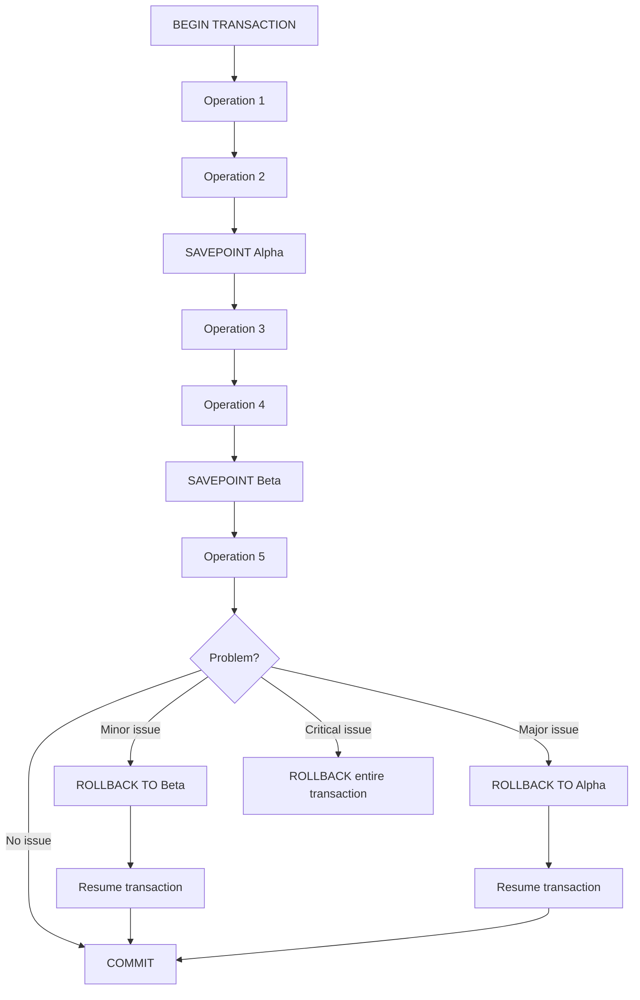

# Savepoints in Transaction Management

## Introduction

When working with databases, you'll often need to group multiple operations into a single unit of work called a **transaction**. Transactions ensure that either all operations succeed or none of them do, maintaining data integrity. But what if you need more fine-grained control within a transaction? That's where **savepoints** come in.

A savepoint is like creating a checkpoint or bookmark within a transaction. It allows you to roll back to a specific point in your transaction without having to undo everything. Think of it as creating intermediate save points in a video game - if you make a mistake, you can return to a previous save rather than starting the entire game over.

## Understanding Savepoints

### Basic Transaction Review

Before diving into savepoints, let's quickly review how a basic transaction works:

```sql
BEGIN TRANSACTION;
    -- SQL operations here
COMMIT;  -- Save all changes permanently
-- or
ROLLBACK;  -- Undo all changes
```

The limitation here is that `ROLLBACK` undoes *all* operations within the transaction. This is where savepoints provide more flexibility.

### Savepoint Syntax

The basic syntax for creating and using savepoints looks like this:

```sql
BEGIN TRANSACTION;
    -- Some SQL operations
    
    SAVEPOINT save_point_name;
    
    -- More SQL operations
    
    ROLLBACK TO save_point_name;  -- Roll back to the savepoint
    
    -- Continue with other operations
COMMIT;  -- or ROLLBACK to undo everything
```

## How Savepoints Work

Savepoints operate on these key principles:

1. **Creation**: You establish a savepoint at a specific point within a transaction
2. **Identification**: Each savepoint is given a unique name for reference
3. **Partial Rollback**: You can roll back to any previously created savepoint
4. **Scope**: Savepoints exist only within the current transaction

Let's visualize this with a diagram:



## Practical Examples

Let's explore some real-world examples of using savepoints in different database systems.

### Example 1: Basic Savepoint in PostgreSQL

In this example, we'll manage a bank account transfer with savepoints:

```sql
BEGIN;
    -- Check account balance
    UPDATE accounts SET balance = balance - 1000 WHERE account_id = 'A123';
    
    SAVEPOINT before_deposit;
    
    -- Deposit to second account
    UPDATE accounts SET balance = balance + 1000 WHERE account_id = 'B456';
    
    -- Oops! Wrong account, roll back just the deposit
    ROLLBACK TO before_deposit;
    
    -- Correct the deposit
    UPDATE accounts SET balance = balance + 1000 WHERE account_id = 'C789';
COMMIT;
```

In this example:
1. We withdraw money from account A123
2. We create a savepoint called `before_deposit`
3. We incorrectly deposit to account B456
4. We roll back to our savepoint, undoing only the deposit
5. We make the correct deposit to account C789
6. We commit the transaction

### Example 2: Multiple Savepoints in MySQL

This example shows how multiple savepoints can be used in a product inventory system:

```sql
START TRANSACTION;
    -- Update product quantity
    UPDATE products SET stock = stock - 5 WHERE product_id = 101;
    
    SAVEPOINT quantity_updated;
    
    -- Record the order
    INSERT INTO orders (customer_id, product_id, quantity) VALUES (1001, 101, 5);
    
    SAVEPOINT order_created;
    
    -- Update customer loyalty points
    UPDATE customers SET loyalty_points = loyalty_points + 50 WHERE customer_id = 1001;
    
    -- Oops! The loyalty point calculation was incorrect
    ROLLBACK TO order_created;
    
    -- Correct the loyalty points
    UPDATE customers SET loyalty_points = loyalty_points + 25 WHERE customer_id = 1001;
COMMIT;
```

Here we use multiple savepoints to handle different stages of an order process.

### Example 3: Nested Operations in Oracle

This example demonstrates a more complex scenario with nested operations:

```sql
BEGIN TRANSACTION;
    -- Create new project
    INSERT INTO projects (project_name, start_date) 
    VALUES ('Website Redesign', CURRENT_DATE);
    
    SAVEPOINT project_created;
    
    -- Add team members to project
    INSERT INTO project_team (project_id, employee_id) 
    VALUES (project_id_seq.currval, 101);
    
    INSERT INTO project_team (project_id, employee_id) 
    VALUES (project_id_seq.currval, 102);
    
    SAVEPOINT team_added;
    
    -- Allocate budget
    INSERT INTO project_budget (project_id, amount, category) 
    VALUES (project_id_seq.currval, 5000, 'Design');
    
    INSERT INTO project_budget (project_id, amount, category) 
    VALUES (project_id_seq.currval, 8000, 'Development');
    
    -- Client changed mind about team composition
    ROLLBACK TO team_added;
    
    -- Add different team members
    INSERT INTO project_team (project_id, employee_id) 
    VALUES (project_id_seq.currval, 103);
    
    INSERT INTO project_team (project_id, employee_id) 
    VALUES (project_id_seq.currval, 104);
    
    -- Now add the budget
    INSERT INTO project_budget (project_id, amount, category) 
    VALUES (project_id_seq.currval, 5000, 'Design');
    
    INSERT INTO project_budget (project_id, amount, category) 
    VALUES (project_id_seq.currval, 8000, 'Development');
COMMIT;
```

This complex example shows how savepoints can help manage multi-step business processes where changes might be needed at various stages.

## Savepoint Limitations

While savepoints are powerful, they do have limitations:

1. **Transaction Boundaries**: Savepoints only exist within the current transaction; they disappear once the transaction ends
2. **Database Support**: Not all database systems implement savepoints exactly the same way
3. **Naming Restrictions**: Savepoint names usually must follow your database's identifier naming rules
4. **Resource Consumption**: Many savepoints in a large transaction may consume additional memory

## Best Practices

For effective use of savepoints:

1. **Meaningful Names**: Use descriptive names for savepoints that indicate their purpose
2. **Strategic Placement**: Create savepoints before potentially problematic operations
3. **Don't Overuse**: Too many savepoints can make code harder to follow
4. **Clean Up**: In some database systems, release savepoints you no longer need
5. **Error Handling**: Combine savepoints with proper error handling in your application code

## Savepoints in Different Database Systems

While the concept is similar, syntax may vary slightly between different database systems:

| Database System | Create Savepoint | Rollback to Savepoint | Release Savepoint |
|----------------|------------------|----------------------|-------------------|
| PostgreSQL     | `SAVEPOINT name` | `ROLLBACK TO name`   | `RELEASE SAVEPOINT name` |
| MySQL          | `SAVEPOINT name` | `ROLLBACK TO name`   | `RELEASE SAVEPOINT name` |
| Oracle         | `SAVEPOINT name` | `ROLLBACK TO name`   | `RELEASE name`    |
| SQL Server     | `SAVE TRANSACTION name` | `ROLLBACK TRANSACTION name` | (Not supported) |
| SQLite         | `SAVEPOINT name` | `ROLLBACK TO name`   | `RELEASE name`    |

## Real-world Applications

Savepoints are particularly useful in these scenarios:

1. **Multi-step Forms**: Processing data from multi-page forms where users might go back and edit previous sections
2. **Complex Business Logic**: Implementing business rules that require conditional execution paths
3. **Error Recovery**: Handling partial failures in a sequence of related operations
4. **Testing and Debugging**: Exploring database operations with the ability to undo specific steps

## Summary

Savepoints provide a powerful way to create checkpoints within database transactions, allowing for more granular control over which operations are committed or rolled back. They're especially valuable in complex transactions where you might need to handle partial failures or make adjustments to portions of your transaction.

Key takeaways:
- Savepoints create intermediate checkpoints within a transaction
- They allow partial rollbacks without discarding the entire transaction
- Different database systems implement savepoints with slight syntax variations
- Use savepoints strategically at critical points in your transaction
- They're particularly useful for complex business processes and error recovery

## Exercises

1. Create a transaction that transfers funds between three accounts, using savepoints to ensure you can roll back individual transfers if needed.
2. Implement a shopping cart checkout process that uses savepoints between updating inventory, creating the order, and processing payment.
3. Write a transaction that adds a new employee to a company database, including records in multiple related tables, with savepoints between each stage.
4. Practice rolling back to different savepoints within a complex transaction to see how the database state changes.
5. Compare savepoint behavior between two different database systems to understand the syntax and feature differences.

## Additional Resources

- Your database system's official documentation on transaction management
- Database design books covering advanced transaction concepts
- Online tutorials on transaction isolation levels and how they interact with savepoints
- Practice exercises to reinforce your understanding of transaction management