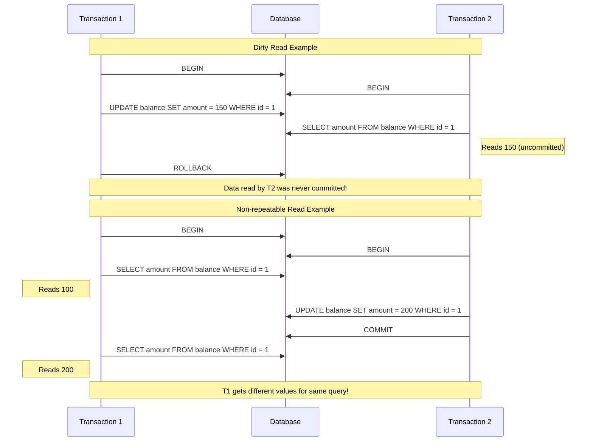

# Transaction Isolation Levels

## Introduction

When multiple users access a database simultaneously, their transactions can interact in ways that sometimes lead to inconsistencies. **Transaction isolation levels** are rules that define how and when changes made by one transaction become visible to other concurrent transactions. They represent a critical aspect of the "I" in the ACID properties (Atomicity, Consistency, Isolation, Durability) of database transactions.

In this guide, we'll explore the different isolation levels supported by most relational database systems, understand the concurrency issues they address, and learn how to choose the right isolation level for your application's needs.

## Understanding Concurrency Problems

Before diving into isolation levels, let's understand the problems that can occur when multiple transactions run concurrently:

### 1. Dirty Read

A dirty read occurs when a transaction reads data that has been modified by another transaction that has not yet committed.

### 2. Non-repeatable Read

A non-repeatable read happens when a transaction reads the same row twice and gets different values because another transaction modified the data between the reads.

### 3. Phantom Read

A phantom read occurs when a transaction re-executes a query that returns a set of rows satisfying a condition, and finds that the set of rows has changed due to another recently committed transaction.

### 4. Lost Update

A lost update happens when two transactions read and update the same data, and the second transaction overwrites the changes made by the first transaction without considering them.

Let's visualize these problems:



## Standard Isolation Levels

SQL standard defines four isolation levels, each providing different guarantees about transaction isolation:

### 1. READ UNCOMMITTED

The lowest isolation level. Transactions can see data that has been modified by other transactions but not yet committed.

- **Allows**: Dirty reads, non-repeatable reads, phantom reads
- **Use case**: When you need maximum performance and can tolerate inconsistent data

```sql
-- Example in MySQL
SET TRANSACTION ISOLATION LEVEL READ UNCOMMITTED;
START TRANSACTION;
SELECT * FROM accounts WHERE user_id = 1;
-- This might see uncommitted changes from other transactions
COMMIT;
```

### 2. READ COMMITTED

The default isolation level in many database systems. Transactions can only see data that has been committed by other transactions.

- **Prevents**: Dirty reads
- **Allows**: Non-repeatable reads, phantom reads
- **Use case**: General purpose applications where dirty reads are unacceptable

```sql
-- Example in PostgreSQL
BEGIN;
SET TRANSACTION ISOLATION LEVEL READ COMMITTED;
SELECT balance FROM accounts WHERE id = 123; -- Returns 1000
-- Meanwhile, another transaction updates and commits: UPDATE accounts SET balance = 800 WHERE id = 123;
SELECT balance FROM accounts WHERE id = 123; -- Now returns 800
COMMIT;
```

### 3. REPEATABLE READ

Ensures that if a transaction reads a row, it will see the same data for that row throughout the transaction, regardless of changes by other transactions.

- **Prevents**: Dirty reads, non-repeatable reads
- **Allows**: Phantom reads (in most implementations)
- **Use case**: When consistent report generation is required

```sql
-- Example in MySQL
START TRANSACTION;
SET TRANSACTION ISOLATION LEVEL REPEATABLE READ;
SELECT COUNT(*) FROM orders WHERE status = 'pending'; -- Returns 5
-- Meanwhile, another transaction inserts a new pending order and commits
SELECT COUNT(*) FROM orders WHERE status = 'pending'; -- Still returns 5 in MySQL (would be 6 with phantom reads)
COMMIT;
```

### 4. SERIALIZABLE

The highest isolation level. Transactions are completely isolated from each other, as if they were executed serially (one after another).

- **Prevents**: Dirty reads, non-repeatable reads, phantom reads
- **Use case**: Financial transactions, critical data where consistency is paramount

```sql
-- Example in PostgreSQL
BEGIN;
SET TRANSACTION ISOLATION LEVEL SERIALIZABLE;
SELECT balance FROM accounts WHERE user_id = 1; -- 1000
-- Attempt to update in a concurrent transaction might be blocked or fail
UPDATE accounts SET balance = balance - 100 WHERE user_id = 1;
COMMIT; -- Might fail with serialization error if conflict detected
```

## Isolation Levels Comparison Table

| Isolation Level | Dirty Read | Non-repeatable Read | Phantom Read | Performance Impact |
|-----------------|------------|---------------------|--------------|-------------------|
| READ UNCOMMITTED| Possible   | Possible            | Possible     | Lowest            |
| READ COMMITTED  | Prevented  | Possible            | Possible     | Low               |
| REPEATABLE READ | Prevented  | Prevented           | Possible*    | Medium            |
| SERIALIZABLE    | Prevented  | Prevented           | Prevented    | Highest           |

\* *Some database implementations like MySQL's InnoDB prevent phantom reads in REPEATABLE READ.*

## Implementation Differences

Different database systems implement isolation levels with some variations:

### MySQL (InnoDB)

InnoDB's REPEATABLE READ actually prevents phantom reads through multi-version concurrency control (MVCC).

```sql
-- MySQL example
SET SESSION TRANSACTION ISOLATION LEVEL REPEATABLE READ;
START TRANSACTION;
-- Operations here won't see phantom rows
COMMIT;
```

### PostgreSQL

PostgreSQL has a unique isolation level called "Read Committed" that behaves slightly differently than the SQL standard.

```sql
-- PostgreSQL example
BEGIN;
SET TRANSACTION ISOLATION LEVEL SERIALIZABLE;
-- PostgreSQL may throw a serialization error if conflicts occur
COMMIT;
```

### SQL Server

SQL Server has an additional isolation level called "SNAPSHOT" that uses row versioning.

```sql
-- SQL Server example
SET TRANSACTION ISOLATION LEVEL SNAPSHOT;
BEGIN TRANSACTION;
-- Operations use row versioning
COMMIT;
```

## Practical Example: Bank Transfer

Let's see how different isolation levels affect a common scenario: transferring money between accounts.

### Scenario Setup

```sql
CREATE TABLE accounts (
  id INT PRIMARY KEY,
  owner VARCHAR(100),
  balance DECIMAL(10, 2)
);

INSERT INTO accounts VALUES (1, 'Alice', 1000.00);
INSERT INTO accounts VALUES (2, 'Bob', 500.00);
```

### Example: Transfer with READ UNCOMMITTED (Problematic)

```sql
-- Transaction 1: Transfer $200 from Alice to Bob
SET TRANSACTION ISOLATION LEVEL READ UNCOMMITTED;
BEGIN;
UPDATE accounts SET balance = balance - 200 WHERE id = 1; -- Alice's account
-- At this point, Transaction 2 might see Alice's decreased balance before Bob's increased balance

UPDATE accounts SET balance = balance + 200 WHERE id = 2; -- Bob's account
COMMIT;

-- Transaction 2: Check total money in the system
SET TRANSACTION ISOLATION LEVEL READ UNCOMMITTED;
BEGIN;
SELECT SUM(balance) FROM accounts; -- Might see inconsistent total if executed between T1's updates
COMMIT;
```

### Example: Transfer with SERIALIZABLE (Safe)

```sql
-- Transaction 1: Transfer $200 from Alice to Bob
SET TRANSACTION ISOLATION LEVEL SERIALIZABLE;
BEGIN;
-- First check if Alice has enough money
SELECT balance FROM accounts WHERE id = 1;
-- Assuming balance >= 200, proceed with transfer
UPDATE accounts SET balance = balance - 200 WHERE id = 1;
UPDATE accounts SET balance = balance + 200 WHERE id = 2;
COMMIT;

-- Transaction 2: Another operation on these accounts will either wait or fail with serialization error
SET TRANSACTION ISOLATION LEVEL SERIALIZABLE;
BEGIN;
UPDATE accounts SET balance = balance - 100 WHERE id = 1; -- Blocked or fails if conflicting with T1
COMMIT;
```

## How to Choose the Right Isolation Level

When selecting an isolation level, consider:

1. **Data consistency requirements**: How important is it that data is always consistent?
2. **Concurrency needs**: How many simultaneous transactions need to access the same data?
3. **Performance considerations**: Higher isolation levels generally lead to more locks and lower throughput.

### Decision Guide

- Use **READ UNCOMMITTED** only when speed is critical and inconsistent reads are acceptable
- Use **READ COMMITTED** for general-purpose applications with moderate consistency needs
- Use **REPEATABLE READ** when reports or calculations must see consistent data
- Use **SERIALIZABLE** for financial transactions or other critical operations where data integrity is paramount

## Best Practices

1. **Don't use higher isolation than needed**: Each step up in isolation level typically adds performance overhead.

2. **Keep transactions short**: The longer a transaction runs, the more likely it will conflict with others.

3. **Be aware of deadlocks**: Higher isolation levels increase the risk of deadlocks.

4. **Consider application-level solutions**: Sometimes it's better to handle concurrency in your application code.

5. **Test under load**: Database behavior can be very different under high concurrency.

## Summary

Transaction isolation levels provide a crucial mechanism for balancing data consistency with performance in multi-user database systems. By understanding the different levels and their tradeoffs, you can make informed decisions about how to handle concurrent transactions in your applications.

- **READ UNCOMMITTED** offers maximum performance but minimal consistency guarantees
- **READ COMMITTED** prevents dirty reads but allows non-repeatable and phantom reads
- **REPEATABLE READ** ensures consistent views of existing rows but may allow phantom reads
- **SERIALIZABLE** provides the strongest consistency guarantees but with the highest performance cost

The right isolation level depends on your specific application requirements, data consistency needs, and performance constraints.

## Exercises

1. Set up a test database and experiment with different isolation levels. Try to create scenarios that demonstrate dirty reads, non-repeatable reads, and phantom reads.

2. Implement a simple banking application that transfers money between accounts. Test it with different isolation levels and observe the differences in behavior under concurrent operations.

3. Research how your specific database system implements transaction isolation and any special features or limitations it might have.

## Additional Resources

- Your database system's documentation on transaction isolation
- "Transaction Processing: Concepts and Techniques" by Jim Gray and Andreas Reuter
- SQL standard (ISO/IEC 9075) which defines the isolation levels