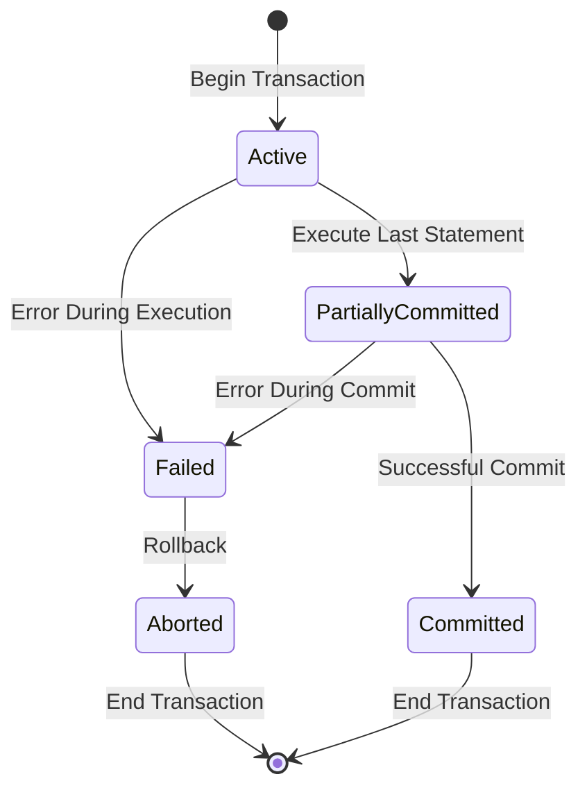

# Transaction States

## Introduction

In database systems, a transaction is a sequence of one or more operations that are executed as a single logical unit of work. Transactions are essential for maintaining data integrity, especially in systems where multiple users might be accessing or modifying data simultaneously.

Each transaction goes through various states during its lifecycle. Understanding these transaction states is crucial for developing robust applications that interact with databases. In this article, we'll explore the different states a transaction can be in, how transitions occur between these states, and how to handle them properly in your applications.

## Transaction State Lifecycle

A transaction isn't a static entity—it moves through several distinct states from creation to completion. Let's explore these states and understand how they relate to each other.

### The Five Basic Transaction States

1. **Active**: The initial state where the transaction is being executed.
2. **Partially Committed**: After the final operation has been executed but before the changes are permanently stored.
3. **Committed**: After all changes have been permanently stored in the database.
4. **Failed**: When normal execution can no longer proceed.
5. **Aborted**: After the transaction has been rolled back and the database has been restored to its state prior to the transaction.

Let's visualize these states and the possible transitions between them:



## Detailed Explanation of Each State

### 1. Active State

When a transaction begins, it enters the **Active** state. In this state, the transaction is executing its operations, which can include reading from the database, performing calculations, and writing to the database.

```java
// Starting a transaction - entering Active state
Connection conn = DriverManager.getConnection(url, username, password);
conn.setAutoCommit(false); // Disable auto-commit mode to manage transaction manually

// Now in Active state - performing operations
Statement stmt = conn.createStatement();
stmt.executeUpdate("UPDATE accounts SET balance = balance - 100 WHERE account_id = 123");
stmt.executeUpdate("UPDATE accounts SET balance = balance + 100 WHERE account_id = 456");
```

### 2. Partially Committed State

After the last operation of the transaction has been executed but before the changes are permanently stored in the database, the transaction enters the **Partially Committed** state. The database system is now checking if it can safely commit the transaction.

```java
// All operations completed, transaction is now Partially Committed
// Database is checking if all constraints are satisfied
// Transaction data is still in memory/temporary storage
```

### 3. Committed State

If all checks pass in the Partially Committed state, the transaction moves to the **Committed** state. In this state, all changes made by the transaction have been permanently stored in the database and cannot be undone through a rollback mechanism.

```java
// Permanently storing changes - moving to Committed state
conn.commit();
System.out.println("Transaction successfully committed!");
```

Once committed, the effects of the transaction become visible to other transactions.

### 4. Failed State

If any error occurs during the execution of the transaction or during the commit process, the transaction enters the **Failed** state. This could happen due to various reasons:

- Violation of database constraints
- Hardware failures
- Deadlocks
- System crashes
- Network issues

```java
try {
    // Attempt transaction operations
    stmt.executeUpdate("UPDATE accounts SET balance = balance - 100 WHERE account_id = 123");
    
    // This might cause a failure if account 999 doesn't exist
    stmt.executeUpdate("UPDATE accounts SET balance = balance + 100 WHERE account_id = 999");
    
    conn.commit();
} catch (SQLException e) {
    // Transaction has Failed
    System.err.println("Transaction failed: " + e.getMessage());
    // Need to handle the failure
}
```

### 5. Aborted State

From the Failed state, the transaction typically transitions to the **Aborted** state by performing a rollback. This undoes all the changes made by the transaction and restores the database to its state before the transaction began.

```java
try {
    // Transaction operations
    // ...
    conn.commit();
} catch (SQLException e) {
    // Transaction has Failed, moving to Aborted state
    try {
        conn.rollback(); // Undo all changes
        System.out.println("Transaction rolled back successfully");
    } catch (SQLException rollbackEx) {
        System.err.println("Rollback failed: " + rollbackEx.getMessage());
    }
}
```

After a transaction is aborted, the database system might choose to restart it automatically or leave that decision to the application.

## Real-World Example: Bank Transfer

Let's walk through a real-world example of a money transfer between two bank accounts and see how the transaction moves through different states.

```java
public void transferMoney(int fromAccount, int toAccount, double amount) {
    Connection conn = null;
    try {
        // Get connection
        conn = dataSource.getConnection();
        
        // Begin transaction - Active state
        conn.setAutoCommit(false);
        
        // Check if fromAccount has sufficient balance
        PreparedStatement checkBalanceStmt = conn.prepareStatement(
            "SELECT balance FROM accounts WHERE account_id = ?"
        );
        checkBalanceStmt.setInt(1, fromAccount);
        ResultSet rs = checkBalanceStmt.executeQuery();
        
        if (rs.next()) {
            double currentBalance = rs.getDouble("balance");
            if (currentBalance < amount) {
                throw new InsufficientFundsException("Insufficient funds in account " + fromAccount);
            }
        } else {
            throw new AccountNotFoundException("Account " + fromAccount + " not found");
        }
        
        // Withdraw from source account
        PreparedStatement withdrawStmt = conn.prepareStatement(
            "UPDATE accounts SET balance = balance - ? WHERE account_id = ?"
        );
        withdrawStmt.setDouble(1, amount);
        withdrawStmt.setInt(2, fromAccount);
        withdrawStmt.executeUpdate();
        
        // Deposit to destination account
        PreparedStatement depositStmt = conn.prepareStatement(
            "UPDATE accounts SET balance = balance + ? WHERE account_id = ?"
        );
        depositStmt.setDouble(1, amount);
        depositStmt.setInt(2, toAccount);
        depositStmt.executeUpdate();
        
        // All operations completed - Partially Committed state
        
        // Commit the transaction - move to Committed state
        conn.commit();
        System.out.println("Transfer of $" + amount + " from account " + fromAccount + 
                           " to account " + toAccount + " completed successfully.");
    } catch (Exception e) {
        // Transaction Failed
        System.err.println("Transfer failed: " + e.getMessage());
        
        try {
            if (conn != null) {
                // Rollback - move to Aborted state
                conn.rollback();
                System.out.println("Transaction rolled back due to error.");
            }
        } catch (SQLException rollbackEx) {
            System.err.println("Rollback failed: " + rollbackEx.getMessage());
        }
    } finally {
        try {
            if (conn != null) {
                conn.setAutoCommit(true); // Reset auto-commit mode
                conn.close();
            }
        } catch (SQLException closeEx) {
            System.err.println("Error closing connection: " + closeEx.getMessage());
        }
    }
}
```

In this example:
1. The transaction begins in the **Active** state when `setAutoCommit(false)` is called.
2. It performs checks and executes update statements.
3. After all operations are completed, it enters the **Partially Committed** state.
4. When `commit()` is called, it transitions to the **Committed** state if successful.
5. If any error occurs, it enters the **Failed** state.
6. The `rollback()` method moves it to the **Aborted** state, undoing all changes.

## Managing Transaction States

Now that we understand the various transaction states, let's look at some best practices for managing them effectively:

### 1. Use Try-Catch-Finally Blocks

Always wrap your transaction code in try-catch-finally blocks to ensure proper handling of each state:

```java
Connection conn = null;
try {
    conn = getConnection();
    conn.setAutoCommit(false); // Enter Active state
    
    // Perform transaction operations
    
    conn.commit(); // Move to Committed state
} catch (Exception e) {
    // Transaction Failed
    try {
        if (conn != null) {
            conn.rollback(); // Move to Aborted state
        }
    } catch (SQLException rollbackEx) {
        // Handle rollback failure
    }
} finally {
    try {
        if (conn != null) {
            conn.setAutoCommit(true);
            conn.close();
        }
    } catch (SQLException closeEx) {
        // Handle connection closing failure
    }
}
```

### 2. Set Appropriate Transaction Isolation Levels

Different isolation levels provide different guarantees about transaction behavior:

```java
// Setting transaction isolation level
conn.setTransactionIsolation(Connection.TRANSACTION_READ_COMMITTED);
```

Common isolation levels include:
- `TRANSACTION_READ_UNCOMMITTED`
- `TRANSACTION_READ_COMMITTED`
- `TRANSACTION_REPEATABLE_READ`
- `TRANSACTION_SERIALIZABLE`

### 3. Use Savepoints for Complex Transactions

For complex transactions, you might want to rollback to a specific point rather than the beginning:

```java
Connection conn = getConnection();
conn.setAutoCommit(false);

try {
    // First part of transaction
    PreparedStatement stmt1 = conn.prepareStatement("INSERT INTO table1 VALUES (?)");
    stmt1.setString(1, "value1");
    stmt1.executeUpdate();
    
    // Create a savepoint
    Savepoint savepoint1 = conn.setSavepoint("Savepoint1");
    
    try {
        // Second part of transaction
        PreparedStatement stmt2 = conn.prepareStatement("INSERT INTO table2 VALUES (?)");
        stmt2.setString(1, "value2");
        stmt2.executeUpdate();
    } catch (SQLException e) {
        // Rollback to savepoint if second operation fails
        conn.rollbackToSavepoint(savepoint1);
        System.out.println("Rolled back to savepoint1");
    }
    
    // Commit what succeeded
    conn.commit();
} catch (SQLException e) {
    // Rollback entire transaction on other errors
    conn.rollback();
} finally {
    conn.setAutoCommit(true);
    conn.close();
}
```

## Common Transaction State Handling Issues

### 1. Uncommitted Transactions

One common issue is forgetting to commit or rollback transactions, leaving them in an intermediate state:

```java
// Bad practice - no explicit commit or rollback
Connection conn = getConnection();
conn.setAutoCommit(false);
Statement stmt = conn.createStatement();
stmt.executeUpdate("UPDATE accounts SET balance = balance - 100 WHERE account_id = 123");
conn.close(); // Connection closed without commit or rollback!
```

Always ensure your transactions are properly committed or rolled back.

### 2. Nested Transactions

Some database systems support nested transactions, which can add complexity to state management:

```java
// Pseudo-code for nested transactions
beginTransaction(); // Parent transaction begins
    // Operations in parent transaction
    beginTransaction(); // Child transaction begins
        // Operations in child transaction
    commitTransaction(); // Child transaction commits
    // More operations in parent transaction
commitTransaction(); // Parent transaction commits
```

The behavior of nested transactions varies by database system, so consult your specific database documentation.

### 3. Long-Running Transactions

Transactions that remain in the Active state for too long can cause problems:

- They may hold locks on database resources, blocking other transactions
- They're more likely to encounter conflicts with other transactions
- They're at greater risk of being affected by system failures

```java
// Problematic long-running transaction
conn.setAutoCommit(false);

// Long-running process with user input
Statement stmt = conn.createStatement();
stmt.executeUpdate("UPDATE large_table SET status = 'processing'");

userInput = getUserInput(); // This could take a long time!

stmt.executeUpdate("UPDATE large_table SET status = 'completed'");
conn.commit();
```

Instead, consider breaking long operations into smaller, separate transactions when possible.

## Summary

Transaction states are a fundamental concept in database transaction management. Understanding how transactions move through these states—Active, Partially Committed, Committed, Failed, and Aborted—helps developers build robust applications that maintain data integrity.

Key takeaways:
- Transactions begin in the Active state and move through various states until they end in either a Committed or Aborted state.
- The Committed state represents successful completion, with all changes permanently stored.
- The Aborted state occurs after a rollback, with all changes undone.
- Proper error handling with try-catch-finally blocks is essential for managing transaction states.
- Different database systems may have slight variations in how they handle transaction states.

By mastering transaction states, you'll be better equipped to develop reliable database applications that can handle failures gracefully and maintain data consistency.

## Exercises

1. Write a simple program that demonstrates all five transaction states with appropriate console output at each state transition.

2. Modify the bank transfer example to include a timeout feature that automatically aborts a transaction if it remains in the Active state for too long.

3. Research how your specific database system (MySQL, PostgreSQL, Oracle, etc.) handles the Partially Committed state. Are there any system-specific behaviors you should be aware of?

4. Implement a transaction that uses savepoints to allow partial rollbacks, and test it with different failure scenarios.

5. Create a simulation of concurrent transactions and observe how different isolation levels affect the behavior of transaction states when conflicts occur.