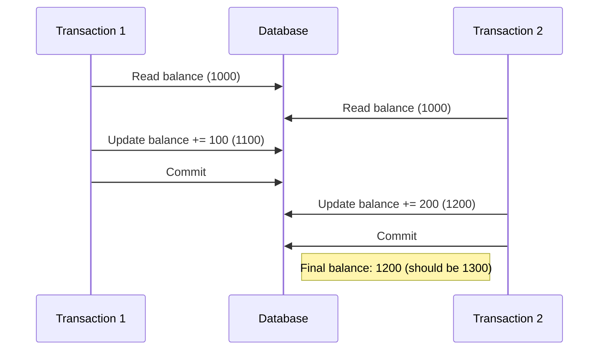
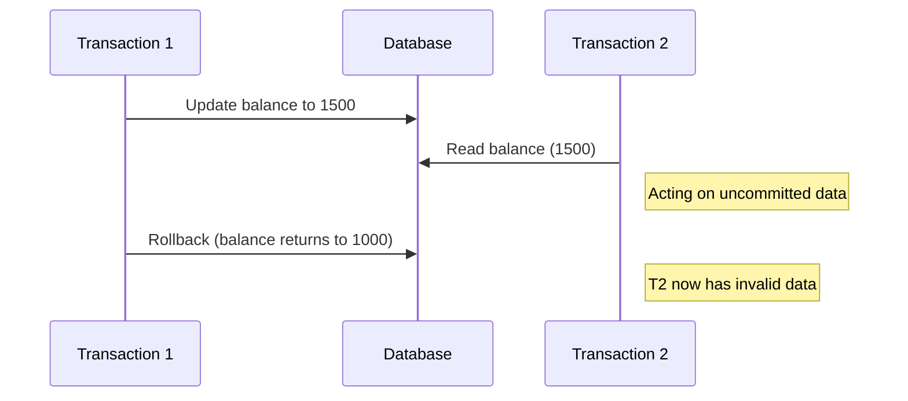
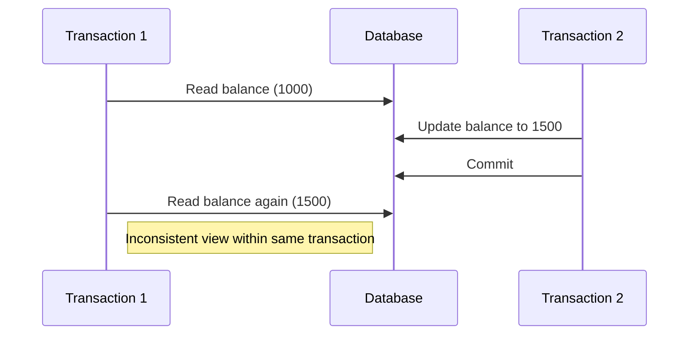
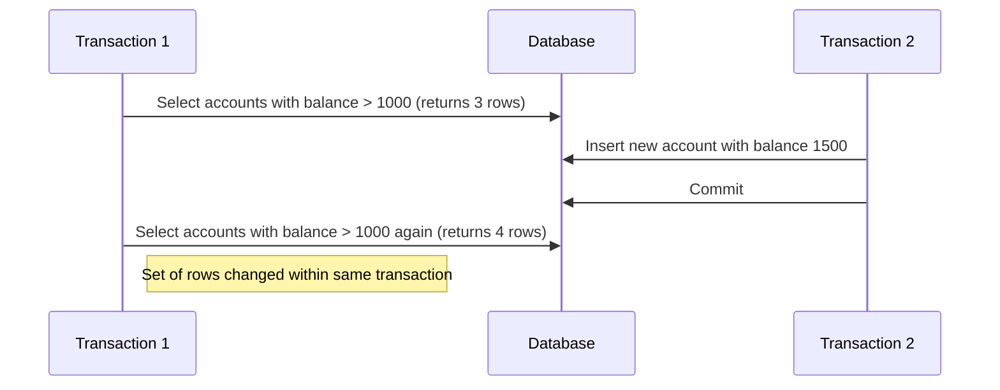
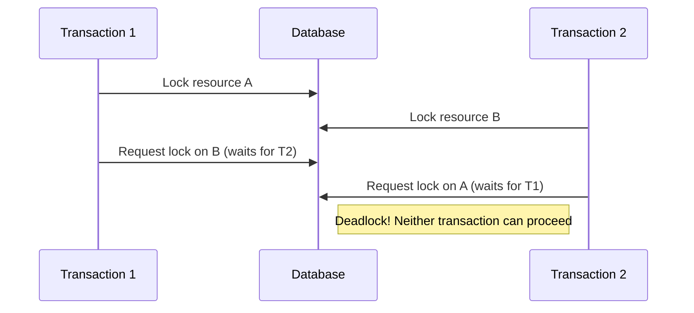

# Concurrent Transactions

## Introduction

In real-world applications, databases rarely process just one transaction at a time. Instead, multiple users and processes frequently access and modify data simultaneously. This is where **concurrent transactions** come into play.

Concurrent transactions refer to multiple transactions that execute at the same time within a database system. While concurrency improves system performance and resource utilization, it introduces challenges like data inconsistency, lost updates, and conflicts that can compromise database integrity.

In this tutorial, we'll explore how database systems manage concurrent transactions, common concurrency problems, and the techniques used to ensure data remains consistent even when multiple transactions are executing simultaneously.

## Understanding Concurrent Transactions

### What is a Transaction?

Before diving into concurrency, let's quickly review what a transaction is:

A transaction is a sequence of database operations that are executed as a single logical unit of work. It follows the ACID properties:

- **Atomicity**: All operations in a transaction complete successfully, or none do.
- **Consistency**: A transaction brings the database from one valid state to another.
- **Isolation**: Concurrent transactions don't interfere with each other.
- **Durability**: Once a transaction is committed, its effects persist even in case of system failures.

### Why Concurrent Transactions Matter

Imagine an e-commerce website where hundreds of customers are browsing products, adding items to carts, and making purchases simultaneously. If the system processed only one transaction at a time, it would be unbearably slow and inefficient.

Concurrent transaction processing allows:
- Multiple users to interact with the database simultaneously
- Efficient resource utilization
- Better response times
- Higher throughput

However, concurrency introduces challenges that need careful management.

## Common Concurrency Problems

When multiple transactions run concurrently, several problems can arise:

### 1. Lost Update Problem

This occurs when two transactions read and update the same data, and one transaction's update overwrites another transaction's update.



### 2. Dirty Read

This happens when a transaction reads data that has been modified by another transaction that has not yet committed.



### 3. Non-repeatable Read

This occurs when a transaction reads the same data multiple times, but gets different values because another transaction modified the data between reads.



### 4. Phantom Read

This happens when a transaction reads a set of rows that satisfy a condition, but a second read returns a different set of rows because another transaction has inserted or deleted rows.



## Managing Concurrent Transactions

Database systems employ several techniques to handle concurrent transactions while maintaining data integrity:

### 1. Locking

Locking is the most common technique where transactions lock resources they're using to prevent other transactions from accessing them.

#### Types of Locks:

- **Shared Lock (S-Lock)**: Used for reading. Multiple transactions can hold shared locks on the same resource simultaneously.
- **Exclusive Lock (X-Lock)**: Used for writing. Only one transaction can hold an exclusive lock on a resource at a time.

Here's a simple example of how locking works in practice:

```sql
-- Transaction 1
BEGIN TRANSACTION;
    -- This acquires an exclusive lock on the accounts row
    UPDATE accounts SET balance = balance + 100 WHERE account_id = 123;
COMMIT;

-- Transaction 2 (tries to run simultaneously)
BEGIN TRANSACTION;
    -- This will wait until Transaction 1 releases its lock
    UPDATE accounts SET balance = balance + 200 WHERE account_id = 123;
COMMIT;
```

#### Lock Granularity:

- **Row-level locks**: Lock individual rows (more concurrent but higher overhead)
- **Page-level locks**: Lock pages of data
- **Table-level locks**: Lock entire tables (less concurrent but lower overhead)

### 2. Isolation Levels

SQL standard defines four isolation levels that provide different tradeoffs between consistency and concurrency:

| Isolation Level | Dirty Read | Non-repeatable Read | Phantom Read |
|-----------------|-----------|-------------------|-------------|
| READ UNCOMMITTED | Possible | Possible | Possible |
| READ COMMITTED | Prevented | Possible | Possible |
| REPEATABLE READ | Prevented | Prevented | Possible |
| SERIALIZABLE | Prevented | Prevented | Prevented |

Here's how to set the isolation level in different database systems:

```sql
-- SQL Server
SET TRANSACTION ISOLATION LEVEL READ COMMITTED;

-- MySQL
SET SESSION TRANSACTION ISOLATION LEVEL SERIALIZABLE;

-- PostgreSQL
BEGIN TRANSACTION ISOLATION LEVEL REPEATABLE READ;
```

### 3. Optimistic Concurrency Control

Instead of locking, optimistic concurrency control allows transactions to proceed without locks but checks for conflicts at commit time:

1. When a transaction starts, it records the current state of the data it accesses
2. When it's ready to commit, it checks if the data has changed since it started
3. If the data hasn't changed, the transaction commits
4. If the data has changed, the transaction aborts and may retry

```java
boolean updateProduct(int productId, String newName, int version) {
    Connection conn = getConnection();
    try {
        // First check the version to ensure no one else has updated
        PreparedStatement checkStmt = conn.prepareStatement(
            "SELECT version FROM products WHERE id = ?"
        );
        checkStmt.setInt(1, productId);
        ResultSet rs = checkStmt.executeQuery();
        
        if (rs.next() && rs.getInt("version") == version) {
            // Version matches, proceed with update and increment version
            PreparedStatement updateStmt = conn.prepareStatement(
                "UPDATE products SET name = ?, version = version + 1 WHERE id = ? AND version = ?"
            );
            updateStmt.setString(1, newName);
            updateStmt.setInt(2, productId);
            updateStmt.setInt(3, version);
            
            int rowsAffected = updateStmt.executeUpdate();
            return rowsAffected > 0;
        }
        return false; // Version mismatch, update failed
    } finally {
        conn.close();
    }
}
```

### 4. Multiversion Concurrency Control (MVCC)

MVCC maintains multiple versions of data to allow readers to see the database as it was when their transaction started:

- When data is updated, the system creates a new version rather than overwriting
- Each transaction sees a snapshot of the database as it was at a specific point in time
- This allows read operations to proceed without blocking write operations

PostgreSQL, Oracle, and MySQL's InnoDB all use variations of MVCC.

## Practical Examples

Let's see how concurrent transactions work in real-world scenarios:

### Example 1: Bank Transfer

Imagine we need to transfer money between two bank accounts:

```java
public void transferMoney(Connection conn, int fromAccount, int toAccount, double amount) 
    throws SQLException {
    
    try {
        // Start transaction
        conn.setAutoCommit(false);
        
        // Deduct from source account
        PreparedStatement debitStmt = conn.prepareStatement(
            "UPDATE accounts SET balance = balance - ? WHERE account_id = ? AND balance >= ?"
        );
        debitStmt.setDouble(1, amount);
        debitStmt.setInt(2, fromAccount);
        debitStmt.setDouble(3, amount);
        int rowsAffected = debitStmt.executeUpdate();
        
        if (rowsAffected == 0) {
            // No rows affected means insufficient funds or account doesn't exist
            throw new SQLException("Insufficient funds or account not found");
        }
        
        // Add to destination account
        PreparedStatement creditStmt = conn.prepareStatement(
            "UPDATE accounts SET balance = balance + ? WHERE account_id = ?"
        );
        creditStmt.setDouble(1, amount);
        creditStmt.setInt(2, toAccount);
        creditStmt.executeUpdate();
        
        // Commit transaction
        conn.commit();
        System.out.println("Transfer successful");
        
    } catch (SQLException e) {
        // Something went wrong, rollback
        conn.rollback();
        System.out.println("Transfer failed: " + e.getMessage());
        throw e;
    } finally {
        conn.setAutoCommit(true);
    }
}
```

If two transfers involving the same account run concurrently, the database's locking mechanism ensures they don't interfere with each other.

### Example 2: Inventory Management

In an e-commerce application, multiple customers might try to purchase the same product simultaneously:

```java
public boolean purchaseProduct(Connection conn, int productId, int quantity, int customerId) 
    throws SQLException {
    
    try {
        // Start transaction with higher isolation level to prevent phantoms
        conn.setAutoCommit(false);
        conn.setTransactionIsolation(Connection.TRANSACTION_SERIALIZABLE);
        
        // Check if enough inventory is available
        PreparedStatement checkStmt = conn.prepareStatement(
            "SELECT quantity FROM inventory WHERE product_id = ? FOR UPDATE"
        );
        checkStmt.setInt(1, productId);
        ResultSet rs = checkStmt.executeQuery();
        
        if (!rs.next() || rs.getInt("quantity") < quantity) {
            conn.rollback();
            return false; // Not enough inventory
        }
        
        // Update inventory
        PreparedStatement updateStmt = conn.prepareStatement(
            "UPDATE inventory SET quantity = quantity - ? WHERE product_id = ?"
        );
        updateStmt.setInt(1, quantity);
        updateStmt.setInt(2, productId);
        updateStmt.executeUpdate();
        
        // Create order
        PreparedStatement orderStmt = conn.prepareStatement(
            "INSERT INTO orders (customer_id, product_id, quantity, order_date) VALUES (?, ?, ?, NOW())"
        );
        orderStmt.setInt(1, customerId);
        orderStmt.setInt(2, productId);
        orderStmt.setInt(3, quantity);
        orderStmt.executeUpdate();
        
        // Commit transaction
        conn.commit();
        return true;
        
    } catch (SQLException e) {
        conn.rollback();
        throw e;
    } finally {
        conn.setAutoCommit(true);
        conn.setTransactionIsolation(Connection.TRANSACTION_READ_COMMITTED); // Reset isolation level
    }
}
```

Note the `FOR UPDATE` clause which acquires an exclusive lock on the selected rows, preventing other transactions from modifying them until this transaction completes.

## Deadlocks and How to Handle Them

A deadlock occurs when two or more transactions are waiting for each other to release locks, causing all to be stuck indefinitely.



### Deadlock Prevention and Handling:

1. **Timeout**: Transactions automatically abort if they wait for a lock longer than a specified time.

2. **Deadlock detection**: The database system automatically detects cycles in the wait-for graph and aborts one of the transactions.

```sql
-- MySQL deadlock detection example
SHOW ENGINE INNODB STATUS;
```

3. **Transaction ordering**: Always acquire locks in the same order across all transactions.

```java
// Always update accounts in order of account ID
public void transfer(Connection conn, int account1Id, int account2Id, double amount) {
    // Determine which account has the lower ID
    int fromAccountId, toAccountId;
    if (account1Id < account2Id) {
        fromAccountId = account1Id;
        toAccountId = account2Id;
    } else {
        fromAccountId = account2Id;
        toAccountId = account1Id;
        amount = -amount; // Adjust amount direction
    }
    
    // Now update in consistent order
    updateAccount(conn, fromAccountId, -amount);
    updateAccount(conn, toAccountId, amount);
}
```

## Best Practices for Concurrent Transactions

1. **Keep transactions short**: The longer a transaction runs, the more likely it is to conflict with other transactions.

2. **Use appropriate isolation levels**: Choose the lowest isolation level that meets your needs.

3. **Avoid user input during transactions**: Don't wait for user input in the middle of a transaction.

4. **Handle deadlocks gracefully**: Be prepared to retry transactions that fail due to deadlocks.

5. **Use connection pooling**: Reusing database connections improves performance and reduces overhead.

```java
// Example of transaction retry logic
public void executeWithRetry(TransactionCallback action) {
    int maxRetries = 3;
    int retryCount = 0;
    
    while (retryCount < maxRetries) {
        try {
            action.execute();
            return; // Success, exit the method
        } catch (Exception e) {
            if (isDeadlockException(e) && retryCount < maxRetries - 1) {
                retryCount++;
                System.out.println("Deadlock detected, retrying transaction (" + retryCount + "/" + maxRetries + ")");
                // Wait a bit before retrying
                try { Thread.sleep(100 * retryCount); } catch (InterruptedException ie) {}
            } else {
                throw e; // Not a deadlock or exceeded max retries
            }
        }
    }
}
```

## Summary

Concurrent transactions are essential for modern database applications, allowing multiple users and processes to interact with the database simultaneously. However, they introduce challenges like data inconsistency and conflicts.

In this tutorial, we explored:

- The concept of concurrent transactions and why they're important
- Common concurrency problems (lost updates, dirty reads, etc.)
- Techniques for managing concurrency (locking, isolation levels, MVCC)
- Practical examples of handling concurrency in real-world scenarios
- How to deal with deadlocks
- Best practices for working with concurrent transactions

By applying these concepts and techniques, you can build applications that efficiently handle concurrent access while maintaining data integrity.

## Exercises

1. Write a transaction that updates a user's profile and logs the change in an audit table. Ensure it handles concurrency correctly.

2. Compare the performance of the same operation under different isolation levels. What differences do you observe?

3. Implement optimistic concurrency control for a product inventory system.

4. Create a situation that causes a deadlock, then modify your code to prevent it.

5. Research how your preferred database system implements MVCC and write a short summary.

## Additional Resources

- [Transaction Processing: Concepts and Techniques](https://www.worldcat.org/title/transaction-processing-concepts-and-techniques/oclc/31172932) by Jim Gray and Andreas Reuter
- Database system documentation:
  - [MySQL Concurrency Control](https://dev.mysql.com/doc/refman/8.0/en/innodb-locking-transaction-model.html)
  - [PostgreSQL Concurrency Control](https://www.postgresql.org/docs/current/mvcc.html)
  - [SQL Server Concurrency](https://docs.microsoft.com/en-us/sql/relational-databases/sql-server-transaction-locking-and-row-versioning-guide)
- [Principles of Transaction Processing](https://www.oreilly.com/library/view/principles-of-transaction/9781558606234/) by Philip A. Bernstein and Eric Newcomer