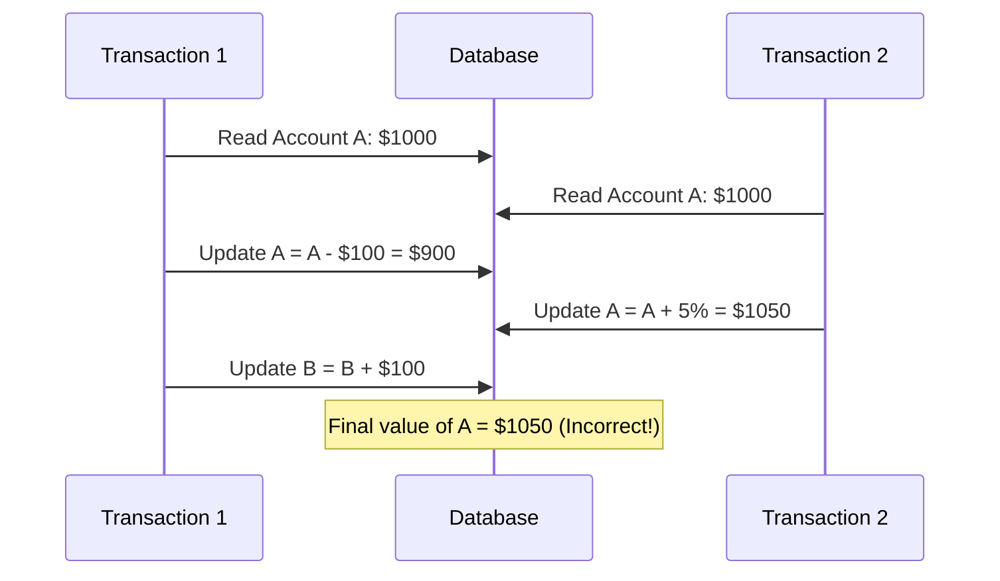
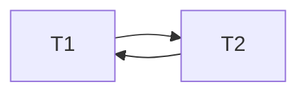
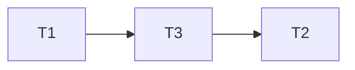

# Serializability in Transaction Management

## Introduction

In database systems, multiple users or applications may attempt to access and modify data simultaneously. This concurrent access can lead to inconsistencies if not properly managed. **Serializability** is a key concept that helps maintain data consistency when multiple transactions execute concurrently.

Serializability ensures that the outcome of executing multiple transactions concurrently is equivalent to executing them in some sequential order, even though their operations might interleave in the actual execution. This property is crucial for maintaining the ACID (Atomicity, Consistency, Isolation, Durability) properties of database transactions.

## Understanding Transactions

Before diving into serializability, let's understand what a transaction is:

A **transaction** is a sequence of database operations that are executed as a single logical unit of work. It must satisfy the ACID properties:

- **Atomicity**: All operations in a transaction succeed or all fail
- **Consistency**: A transaction brings the database from one valid state to another
- **Isolation**: Concurrent transactions don't interfere with each other
- **Durability**: Once a transaction is committed, its effects persist

## The Need for Serializability

Consider this scenario:

Two banking transactions are executing concurrently:
- Transaction T1: Transfer $100 from Account A to Account B
- Transaction T2: Apply 5% interest to Account A

If these transactions execute in an uncontrolled manner, we might encounter the following issues:



In this case, T2 doesn't see the effect of T1, resulting in an incorrect final balance. The correct outcome should be A = $945 (first subtract $100, then add 5% interest to $900).

Serializability prevents such inconsistencies by ensuring that concurrent executions are equivalent to some serial execution.

## Types of Serializability

### 1. Conflict Serializability

Conflict serializability is the most common type of serializability used in database systems. It's based on the concept of conflicting operations.

Two operations conflict if:
1. They belong to different transactions
2. They operate on the same data item
3. At least one of them is a write operation

A schedule is conflict serializable if it can be transformed into a serial schedule by swapping non-conflicting operations.

#### Example of Conflict Serializability:

Let's represent read operations as R(X) and write operations as W(X), where X is a data item.

```
Schedule S:
T1: R(A) W(A) R(B) W(B)
T2:         R(A) W(A)
```

In this interleaved execution:
1. T1 reads and updates A
2. T1 reads B
3. T2 reads and updates A
4. T1 updates B

To determine if this is conflict serializable, we can create a precedence graph:



Since the graph contains a cycle, the schedule is not conflict serializable.

### 2. View Serializability

View serializability is a more general form of serializability that considers the "view" of data that each transaction has.

Two schedules are view equivalent if:
1. For each data item, the same transaction performs the initial read in both schedules
2. The same transaction performs the final write in both schedules
3. If transaction T2 reads a value written by transaction T1 in one schedule, it also does so in the other

View serializability is harder to test but captures more valid schedules than conflict serializability.

## Implementing Serializability

Database systems use different concurrency control techniques to ensure serializability:

### 1. Two-Phase Locking (2PL)

2PL is a locking protocol that ensures conflict serializability:

- Growing phase: Transactions acquire locks but don't release any
- Shrinking phase: Transactions release locks but don't acquire any

```javascript
// Pseudocode for 2PL
function transfer(fromAccount, toAccount, amount) {
  // Growing phase
  acquireLock(fromAccount, "exclusive");
  acquireLock(toAccount, "exclusive");
  
  // Critical section
  fromAccount.balance -= amount;
  toAccount.balance += amount;
  
  // Shrinking phase
  releaseLock(toAccount);
  releaseLock(fromAccount);
}
```

### 2. Timestamp Ordering

Each transaction receives a unique timestamp when it starts. The system ensures that conflicting operations execute in timestamp order.

```java
// Pseudocode for timestamp ordering
public void read(Transaction tx, DataItem item) {
    // Check write timestamp
    if (tx.timestamp < item.writeTimestamp) {
        // Transaction is trying to read an "older" version
        abort(tx);
    } else {
        // Update read timestamp
        item.readTimestamp = Math.max(item.readTimestamp, tx.timestamp);
        // Perform read operation
        return item.value;
    }
}
```

### 3. Multi-Version Concurrency Control (MVCC)

MVCC maintains multiple versions of each data item, allowing read operations to proceed without blocking.

```sql
-- PostgreSQL example of MVCC
BEGIN TRANSACTION ISOLATION LEVEL SERIALIZABLE;
-- Operations here are guaranteed to be serializable
-- PostgreSQL uses MVCC under the hood
COMMIT;
```

## Testing for Serializability

### Precedence Graph Method

To test if a schedule is conflict serializable:

1. Create a directed graph where transactions are nodes
2. Add an edge from Ti to Tj if an operation in Ti conflicts with and precedes an operation in Tj
3. If the graph contains a cycle, the schedule is not conflict serializable

Let's work through an example:

Schedule S:
- T1: R(X) W(X)
- T2:         R(Y) W(Y)
- T3:     R(X)         R(Y)



Since this graph is acyclic, the schedule is conflict serializable, equivalent to the serial schedule T1 → T3 → T2.

## Real-World Applications

### 1. Banking Systems

Banks use serializability to ensure that account balances remain consistent despite thousands of concurrent transactions.

```java
@Transactional(isolation = Isolation.SERIALIZABLE)
public void transferFunds(long fromAccountId, long toAccountId, BigDecimal amount) {
    Account fromAccount = accountRepository.findById(fromAccountId);
    Account toAccount = accountRepository.findById(toAccountId);
    
    fromAccount.debit(amount);
    toAccount.credit(amount);
    
    accountRepository.save(fromAccount);
    accountRepository.save(toAccount);
}
```

### 2. E-commerce Systems

Online stores need serializability to manage inventory, ensuring that items aren't oversold when multiple customers check out simultaneously.

```python
def purchase_item(item_id, quantity, user_id):
    with transaction.atomic():  # Django's way of ensuring serializability
        # Select for update locks the row
        item = Item.objects.select_for_update().get(id=item_id)
        
        if item.inventory >= quantity:
            item.inventory -= quantity
            item.save()
            
            Order.objects.create(
                user_id=user_id,
                item_id=item_id,
                quantity=quantity
            )
            return True
        else:
            return False  # Not enough inventory
```

### 3. Airline Reservation Systems

Airlines use serializable transactions to prevent double-booking of seats.

```csharp
[Transaction(IsolationLevel.Serializable)]
public bool BookSeat(int flightId, int seatNumber, int passengerId)
{
    var seat = _context.Seats
        .Where(s => s.FlightId == flightId && s.SeatNumber == seatNumber)
        .FirstOrDefault();
        
    if (seat != null && !seat.IsBooked)
    {
        seat.IsBooked = true;
        seat.PassengerId = passengerId;
        _context.SaveChanges();
        return true;
    }
    
    return false;
}
```

## Performance Considerations

While serializability provides the strongest consistency guarantee, it can lead to performance issues in high-concurrency environments:

1. **Reduced concurrency**: Strict serializability can limit the number of transactions that can execute simultaneously
2. **Deadlocks**: Locking-based approaches can lead to deadlocks
3. **Increased abort rate**: Transactions may need to be aborted and restarted to maintain serializability

Many systems provide weaker isolation levels that offer better performance but fewer guarantees:

```sql
-- Different isolation levels in SQL
BEGIN TRANSACTION ISOLATION LEVEL READ UNCOMMITTED; -- Weakest
BEGIN TRANSACTION ISOLATION LEVEL READ COMMITTED;
BEGIN TRANSACTION ISOLATION LEVEL REPEATABLE READ;
BEGIN TRANSACTION ISOLATION LEVEL SERIALIZABLE; -- Strongest
```

## Summary

Serializability is a fundamental concept in transaction management that ensures data consistency in concurrent database systems. It guarantees that the outcome of concurrent transactions is equivalent to some serial execution, preventing anomalies and inconsistencies.

Key points to remember:
- Serializability is essential for maintaining the ACID properties of transactions
- Conflict serializability and view serializability are two common types
- Techniques like two-phase locking, timestamp ordering, and MVCC implement serializability
- While serializability provides strong consistency guarantees, it may impact performance

## Exercises

1. Draw a precedence graph for the following schedule and determine if it's conflict serializable:
   ```
   T1: R(X) W(X) R(Y) W(Y)
   T2: R(Z) W(Z) R(Y) W(Y)
   ```

2. Implement a simple banking system using transactions with appropriate isolation levels.

3. Compare the performance of different isolation levels by running a benchmark test with multiple concurrent transactions.

## Additional Resources

- Database Systems: The Complete Book (Garcia-Molina, Ullman, Widom)
- Principles of Transaction Processing (Bernstein, Newcomer)
- [PostgreSQL Documentation on Transaction Isolation](https://www.postgresql.org/docs/current/transaction-iso.html)
- [MySQL Documentation on InnoDB Transaction Model](https://dev.mysql.com/doc/refman/8.0/en/innodb-transaction-model.html)