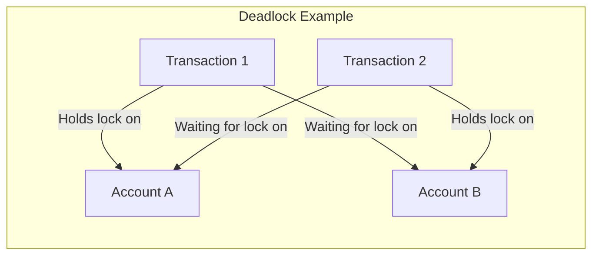

# Concurrency Control

## Introduction

Imagine you're at a coffee shop with many baristas and customers. Without coordination, baristas might try to use the same coffee machine simultaneously, or two baristas might grab the same cup for different orders. The coffee shop needs rules to keep operations running smoothly even when busy.

This scenario mirrors the challenge of **concurrency control** in database systems. When multiple transactions attempt to access and modify the same data simultaneously, we need mechanisms to ensure data consistency and integrity.

In this tutorial, we'll explore how database systems manage concurrent transactions, the problems that can arise without proper controls, and the techniques used to solve these issues.

## Why Concurrency Control Matters

Without proper concurrency control, several problems can arise:

1. **Lost Updates**: When two transactions read and update the same data, one transaction's changes might overwrite another's.
2. **Dirty Reads**: A transaction reads data that has been modified by another transaction that hasn't yet committed.
3. **Non-repeatable Reads**: A transaction reads the same data twice and gets different results.
4. **Phantom Reads**: A transaction re-executes a query and finds new rows that match the query criteria.

Let's look at a simple example of a lost update:

```java
// Transaction 1
int balance = getAccountBalance(accountId); // Returns 1000
balance = balance + 100;
updateAccountBalance(accountId, balance); // Sets balance to 1100

// Transaction 2 (running concurrently)
int balance = getAccountBalance(accountId); // Returns 1000
balance = balance - 50;
updateAccountBalance(accountId, balance); // Sets balance to 950
```

Without concurrency control, the final balance might be 950 instead of 1050, because Transaction 2 wasn't aware of Transaction 1's changes.

## ACID Properties and Concurrency

Concurrency control is closely tied to the ACID properties of database transactions:

- **Atomicity**: Transactions are all-or-nothing operations.
- **Consistency**: Transactions maintain database integrity.
- **Isolation**: Transactions operate as if they were executing alone.
- **Durability**: Once committed, transaction changes persist.

Concurrency control primarily enforces the **isolation** property, ensuring transactions don't interfere with each other.

## Concurrency Control Techniques

### 1. Locking-Based Concurrency Control

Locking is the most common approach to concurrency control. When a transaction needs to access data, it must first acquire a lock.

#### Types of Locks:

- **Shared (S) Lock**: Used for reading data. Multiple transactions can hold shared locks simultaneously.
- **Exclusive (X) Lock**: Used for modifying data. Only one transaction can hold an exclusive lock on an item.

#### Lock Compatibility Matrix:

```mermaid
graph TD
  subgraph "Lock Compatibility Matrix"
    A[""] --> B[" "]
    A --> C["Requested Lock"]
    D["Existing Lock"] --> E["Shared (S)"]
    D --> F["Exclusive (X)"]
    B --> G["Shared (S)"]
    B --> H["Exclusive (X)"]
    C --> G
    C --> H
    E --> I["Yes"]
    E --> J["No"]
    F --> K["No"]
    F --> L["No"]
  end
```

#### Two-Phase Locking (2PL)

The most widely used locking protocol is Two-Phase Locking (2PL), which divides a transaction's execution into two phases:

1. **Growing Phase**: Locks are acquired and no locks are released.
2. **Shrinking Phase**: Locks are released and no new locks are acquired.

```java
// Two-Phase Locking example
// Growing Phase
lockManager.acquireSharedLock(transaction, accountA);
int balanceA = getAccountBalance(accountA);
lockManager.acquireExclusiveLock(transaction, accountB);
int balanceB = getAccountBalance(accountB);

// Operation
balanceA -= 100;
balanceB += 100;
updateAccountBalance(accountA, balanceA);
updateAccountBalance(accountB, balanceB);

// Shrinking Phase
lockManager.releaseLock(transaction, accountB);
lockManager.releaseLock(transaction, accountA);
```

#### Deadlocks

Locking can lead to deadlocks, where two or more transactions are waiting for each other to release locks.



Deadlocks can be handled by:
- **Prevention**: By imposing an ordering on data items.
- **Detection**: Using a wait-for graph and breaking cycles.
- **Timeouts**: Aborting transactions that wait too long for a lock.

### 2. Timestamp-Based Concurrency Control

Instead of locks, timestamp-based methods assign a unique timestamp to each transaction. These timestamps establish a serialization order.

```java
// Timestamp-based concurrency control
Transaction t = new Transaction();
t.timestamp = getNextTimestamp(); // Monotonically increasing value

// For each read/write operation:
if (operation.conflicts(dataItem)) {
    // Compare timestamps to decide which transaction proceeds
    if (t.timestamp < dataItem.lastModifiedBy.timestamp) {
        // Current transaction is older
        proceed();
    } else {
        // Current transaction is newer
        abort();
        restart();
    }
}
```

### 3. Optimistic Concurrency Control (OCC)

Optimistic concurrency control assumes conflicts are rare and consists of three phases:

1. **Read Phase**: Transaction reads values and keeps track of read/write sets.
2. **Validation Phase**: Before committing, the system checks if the transaction conflicts with others.
3. **Write Phase**: If validation succeeds, changes are made permanent.

```java
// Optimistic Concurrency Control
// Read Phase
Transaction t = new Transaction();
int oldBalance = getAccountBalance(accountId);
int newBalance = oldBalance + 100;

// Validation Phase
if (hasBeenModifiedSinceRead(accountId)) {
    // Conflict detected
    abort();
    return;
}

// Write Phase
updateAccountBalance(accountId, newBalance);
commit();
```

### 4. Multiversion Concurrency Control (MVCC)

MVCC maintains multiple versions of data items, allowing read operations to proceed without blocking.

```java
// Multiversion Concurrency Control
// When writing data:
if (canWriteNewVersion(dataItem, transaction)) {
    Version newVersion = new Version(dataItem.value, transaction.id, transaction.timestamp);
    dataItem.addVersion(newVersion);
} else {
    transaction.abort();
}

// When reading data:
Version appropriate = dataItem.getVersionVisibleTo(transaction);
return appropriate.value;
```

PostgreSQL, Oracle, and many modern databases use MVCC for concurrency control.

## Isolation Levels

SQL defines four standard isolation levels, each offering different trade-offs between consistency and performance:

1. **READ UNCOMMITTED**: Allows dirty reads.
2. **READ COMMITTED**: Prevents dirty reads but allows non-repeatable reads.
3. **REPEATABLE READ**: Prevents dirty and non-repeatable reads but allows phantom reads.
4. **SERIALIZABLE**: Provides full isolation; transactions appear to execute serially.

```sql
-- Setting isolation level in SQL
SET TRANSACTION ISOLATION LEVEL READ COMMITTED;

-- Example transaction
BEGIN;
SELECT balance FROM accounts WHERE id = 123;
-- Do some processing
UPDATE accounts SET balance = balance + 100 WHERE id = 123;
COMMIT;
```

## Real-World Example: Banking System

Let's consider a banking application that transfers money between accounts:

```java
public void transferMoney(int fromAccount, int toAccount, double amount) {
    Connection conn = null;
    try {
        // Set isolation level
        conn = dataSource.getConnection();
        conn.setTransactionIsolation(Connection.TRANSACTION_SERIALIZABLE);
        conn.setAutoCommit(false);
        
        // Check if sufficient funds exist
        PreparedStatement checkStmt = conn.prepareStatement(
            "SELECT balance FROM accounts WHERE id = ?"
        );
        checkStmt.setInt(1, fromAccount);
        ResultSet rs = checkStmt.executeQuery();
        if (rs.next()) {
            double balance = rs.getDouble("balance");
            if (balance < amount) {
                throw new InsufficientFundsException("Not enough funds available");
            }
        }
        
        // Perform the transfer
        PreparedStatement debitStmt = conn.prepareStatement(
            "UPDATE accounts SET balance = balance - ? WHERE id = ?"
        );
        debitStmt.setDouble(1, amount);
        debitStmt.setInt(2, fromAccount);
        debitStmt.executeUpdate();
        
        PreparedStatement creditStmt = conn.prepareStatement(
            "UPDATE accounts SET balance = balance + ? WHERE id = ?"
        );
        creditStmt.setDouble(1, amount);
        creditStmt.setInt(2, toAccount);
        creditStmt.executeUpdate();
        
        // Commit the transaction
        conn.commit();
    } catch (Exception e) {
        // Rollback on error
        if (conn != null) {
            try {
                conn.rollback();
            } catch (SQLException ex) {
                // Log rollback error
            }
        }
        throw new TransactionFailedException("Transfer failed", e);
    } finally {
        // Close connection
        if (conn != null) {
            try {
                conn.close();
            } catch (SQLException e) {
                // Log close error
            }
        }
    }
}
```

In this example:
- We use serializable isolation to ensure consistency.
- We explicitly begin and commit (or rollback) the transaction.
- We check for sufficient funds before attempting the transfer.
- We handle errors and ensure the connection is properly closed.

## Performance Considerations

Concurrency control mechanisms involve trade-offs:

- **Locking**: Can lead to contention and deadlocks.
- **Timestamp-based**: May cause unnecessary aborts.
- **Optimistic**: Works well with read-heavy workloads but not with high contention.
- **MVCC**: Provides good read performance but requires storage overhead.

Choosing the right approach depends on your application's specific characteristics:

1. **Read-heavy vs. write-heavy workloads**
2. **Expected level of contention**
3. **Consistency requirements**
4. **Performance needs**

## Summary

Concurrency control is a critical aspect of transaction management that ensures data integrity when multiple transactions operate simultaneously. Key points to remember:

- Without concurrency control, database anomalies like lost updates and dirty reads can occur.
- Common concurrency control techniques include locking, timestamp-based methods, optimistic concurrency control, and multiversion concurrency control.
- Different isolation levels provide varying trade-offs between consistency and performance.
- The choice of concurrency control method should be based on the specific requirements of your application.

## Exercises

1. Describe a scenario where a dirty read could lead to a business logic error.
2. Implement a simple version of two-phase locking in your preferred programming language.
3. Compare the performance of different isolation levels using a database of your choice.
4. Design a system that handles concurrent updates to a shared counter using optimistic concurrency control.

## Additional Resources

- Database textbooks like "Database System Concepts" by Silberschatz, Korth, and Sudarshan
- Documentation for your database system (MySQL, PostgreSQL, Oracle, etc.)
- Research papers on advanced concurrency control techniques
- Online courses on database systems and transaction processing