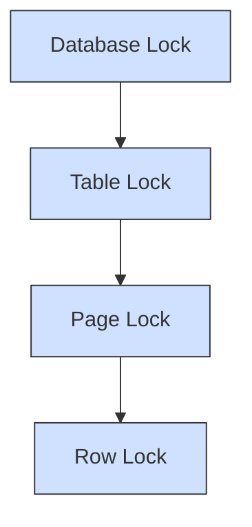
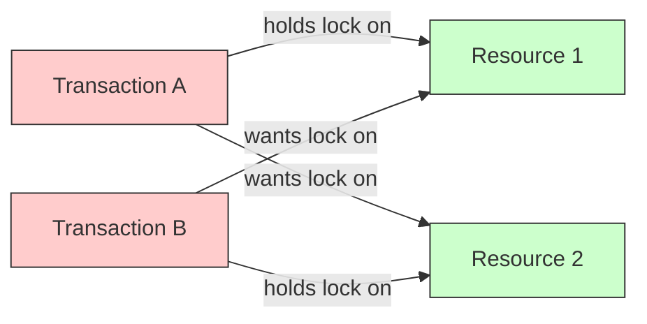

# Locking Mechanisms

## Introduction

When multiple users or processes access a database simultaneously, **locking mechanisms** play a crucial role in maintaining data integrity and consistency. These mechanisms prevent conflicting operations from interfering with each other, which could otherwise lead to data corruption or incorrect results.

In this tutorial, we'll explore how database systems use locks to manage concurrent transactions, the different types of locks available, potential problems like deadlocks, and strategies for implementing efficient locking in your applications.

## What Are Locking Mechanisms?

Locking is a concurrency control technique that temporarily prevents data from being accessed or modified by other transactions while one transaction is working with that data. Think of it like putting a "do not disturb" sign on a hotel room door - it prevents others from entering while you're inside.

### Why Do We Need Locks?

Imagine two bank transactions occurring simultaneously:
- Transaction A: Transfer $100 from Account 1 to Account 2
- Transaction B: Check the balance of Account 1

Without proper locking, Transaction B might read Account 1's balance in the middle of Transaction A's execution, potentially seeing an inconsistent state where the money has been deducted but not yet added to Account 2.

## Types of Locks

Database systems implement several types of locks to accommodate different scenarios:

### 1. Shared (Read) Lock

- Allows multiple transactions to read the same data simultaneously
- Prevents other transactions from writing to the data while read is in progress
- Multiple shared locks can exist on the same data

### 2. Exclusive (Write) Lock

- Gives a transaction exclusive access to modify data
- Prevents other transactions from both reading and writing
- Only one exclusive lock can exist on a piece of data at any time

Let's see how these locks work in a simple pseudocode example:

```sql
-- Transaction A
BEGIN TRANSACTION;
  SELECT * FROM accounts WHERE account_id = 101 FOR SHARE; -- Shared lock
  -- Read operations happen here
COMMIT;

-- Transaction B
BEGIN TRANSACTION;
  SELECT * FROM accounts WHERE account_id = 101 FOR UPDATE; -- Exclusive lock
  UPDATE accounts SET balance = balance - 100 WHERE account_id = 101;
  -- More operations
COMMIT;
```

### 3. Update Lock

An intermediate lock type that allows a transaction to read data with the intention of updating it later:

- Initially compatible with shared locks
- Can be upgraded to an exclusive lock when the transaction is ready to modify the data
- Prevents deadlocks in scenarios where multiple transactions might try to upgrade from shared to exclusive locks

### 4. Intent Locks

Intent locks signal the intention to acquire more specific locks (shared or exclusive) on lower-level database objects:

- Intent shared (IS): Signals intent to place shared locks on lower-level objects
- Intent exclusive (IX): Signals intent to place exclusive locks on lower-level objects
- Shared intent exclusive (SIX): Combination of shared lock and intent exclusive lock

## Lock Granularity

Locks can be applied at different levels of granularity:

1. **Row-level locks**: Lock individual rows in a table
2. **Page-level locks**: Lock a page of data (typically 4-8KB)
3. **Table-level locks**: Lock an entire table
4. **Database-level locks**: Lock the entire database



The trade-off is between concurrency and overhead:
- Fine-grained locks (row-level) allow more concurrent access but require more system resources to manage
- Coarse-grained locks (table-level) have less overhead but reduce concurrency

## Locking Strategies

### Two-Phase Locking (2PL)

Two-Phase Locking is a protocol that ensures serializability of transactions:

1. **Growing Phase**: Transaction acquires locks but cannot release any
2. **Shrinking Phase**: Transaction releases locks but cannot acquire any new ones

This approach guarantees that transactions can be serialized in the order of their lock point (when they stop acquiring locks).

```javascript
// Two-Phase Locking example in pseudocode
function transfer(fromAccount, toAccount, amount) {
  // Growing phase - acquire all needed locks
  lock(fromAccount, "exclusive");
  lock(toAccount, "exclusive");
  
  // Perform operations
  if (fromAccount.balance >= amount) {
    fromAccount.balance -= amount;
    toAccount.balance += amount;
    
    // Shrinking phase - release locks
    unlock(toAccount);
    unlock(fromAccount);
    return true;
  } else {
    // Shrinking phase - release locks
    unlock(toAccount);
    unlock(fromAccount);
    return false;
  }
}
```

### Strict Two-Phase Locking

A variation of 2PL where locks are held until the transaction commits or aborts, preventing cascading aborts.

### Deadlocks and Their Prevention

A deadlock occurs when two or more transactions are waiting for each other to release locks, creating a circular dependency.



Strategies to handle deadlocks include:

1. **Deadlock Prevention**: Assign priorities to transactions and follow protocols like "wait-die" or "wound-wait"
2. **Deadlock Detection**: Periodically check for cycles in the wait-for graph and abort one transaction to break the cycle
3. **Deadlock Avoidance**: Use timeout mechanisms to abort transactions that wait too long for a lock

Let's look at a deadlock detection algorithm in pseudocode:

```python
def detect_deadlocks(wait_for_graph):
    visited = set()
    rec_stack = set()
    
    def is_cyclic(node):
        visited.add(node)
        rec_stack.add(node)
        
        for neighbor in wait_for_graph[node]:
            if neighbor not in visited:
                if is_cyclic(neighbor):
                    return True
            elif neighbor in rec_stack:
                return True
        
        rec_stack.remove(node)
        return False
    
    for node in wait_for_graph:
        if node not in visited:
            if is_cyclic(node):
                return True
    
    return False
```

## Lock Management in Popular Database Systems

Different database systems implement locking mechanisms with their own variations:

### MySQL (InnoDB)

```sql
-- Row-level locking example in MySQL
SELECT * FROM accounts WHERE user_id = 123 FOR UPDATE;
```

This statement acquires an exclusive lock on all rows where `user_id = 123`.

### PostgreSQL

```sql
-- Different lock modes in PostgreSQL
BEGIN;
SELECT * FROM accounts WHERE id = 456 FOR SHARE;  -- Shared lock
-- or
SELECT * FROM accounts WHERE id = 456 FOR UPDATE; -- Exclusive lock
COMMIT;
```

### SQL Server

```sql
-- Specifying lock hints in SQL Server
SELECT * FROM accounts WITH (HOLDLOCK, ROWLOCK) WHERE id = 789;
```

## Implementing Lock-Based Concurrency in Your Code

When building applications that interact with databases, consider these best practices:

### 1. Keep Transactions Short

```javascript
// Good practice
async function updateUserProfile(userId, newData) {
  const transaction = await db.beginTransaction();
  try {
    await db.query('UPDATE users SET ? WHERE id = ?', [newData, userId], {transaction});
    await transaction.commit();
  } catch (error) {
    await transaction.rollback();
    throw error;
  }
}
```

### 2. Lock in a Consistent Order

To prevent deadlocks, always acquire locks in the same order across your application:

```javascript
// Always lock accounts in ascending order of account ID
async function transferMoney(fromAccountId, toAccountId, amount) {
  // Ensure consistent ordering
  const [firstId, secondId] = fromAccountId < toAccountId 
    ? [fromAccountId, toAccountId] 
    : [toAccountId, fromAccountId];
  
  const transaction = await db.beginTransaction();
  try {
    // Lock in consistent order
    const firstAccount = await db.query(
      'SELECT * FROM accounts WHERE id = ? FOR UPDATE', 
      [firstId], 
      {transaction}
    );
    
    const secondAccount = await db.query(
      'SELECT * FROM accounts WHERE id = ? FOR UPDATE', 
      [secondId], 
      {transaction}
    );
    
    // Determine which is from/to based on original parameters
    // Then perform the transfer logic
    
    await transaction.commit();
  } catch (error) {
    await transaction.rollback();
    throw error;
  }
}
```

### 3. Use Lock Timeouts

Set reasonable timeouts to prevent transactions from waiting indefinitely:

```javascript
// Using timeout in a database connection
const connection = await mysql.createConnection({
  host: 'localhost',
  user: 'user',
  password: 'password',
  database: 'mydb',
  lockTimeout: 5000 // 5 seconds timeout for locks
});
```

## Optimistic vs. Pessimistic Locking

### Pessimistic Locking

Locks data as soon as a transaction begins working with it, assuming conflicts are likely:

```sql
BEGIN TRANSACTION;
  SELECT * FROM products WHERE id = 101 FOR UPDATE; -- Locks immediately
  -- Do some work
  UPDATE products SET stock = stock - 1 WHERE id = 101;
COMMIT;
```

### Optimistic Locking

Assumes conflicts are rare and checks for conflicts only at commit time:

```javascript
async function updateProductStock(productId, quantity) {
  // Read the current state
  const product = await db.query(
    'SELECT id, stock, version FROM products WHERE id = ?', 
    [productId]
  );
  
  // Check if we have enough stock
  if (product.stock < quantity) {
    throw new Error('Not enough stock');
  }
  
  // Try to update with version check (optimistic lock)
  const result = await db.query(
    'UPDATE products SET stock = stock - ?, version = version + 1 WHERE id = ? AND version = ?',
    [quantity, productId, product.version]
  );
  
  if (result.affectedRows === 0) {
    // Someone else modified the record - conflict detected
    throw new Error('Concurrent modification detected');
  }
  
  return { success: true };
}
```

## Common Locking Problems and Solutions

### 1. Lost Updates

Problem: Two transactions read and update the same data concurrently, causing one update to be lost.

Solution: Use appropriate locks or version-based concurrency control:

```sql
-- Using SELECT FOR UPDATE to prevent lost updates
BEGIN TRANSACTION;
  SELECT balance FROM accounts WHERE id = 123 FOR UPDATE; -- Locks the row
  -- Now no other transaction can update this row until we commit
  UPDATE accounts SET balance = balance + 100 WHERE id = 123;
COMMIT;
```

### 2. Phantom Reads

Problem: A transaction re-executes a query and finds new rows that match the query's criteria, inserted by another transaction.

Solution: Use range locks or serializable isolation level:

```sql
-- Using SERIALIZABLE isolation level to prevent phantom reads
SET TRANSACTION ISOLATION LEVEL SERIALIZABLE;
BEGIN TRANSACTION;
  -- All reads within this transaction are protected from phantoms
  SELECT * FROM accounts WHERE balance > 1000;
  -- Do some work based on these results
COMMIT;
```

## Summary

In this tutorial, we've covered:

- The purpose and importance of locking mechanisms in database transactions
- Different types of locks (shared, exclusive, update, intent)
- Lock granularity levels and their trade-offs
- Locking strategies like Two-Phase Locking
- Deadlock issues and solutions
- Implementation in popular database systems
- Best practices for using locks in your applications
- Optimistic vs. pessimistic locking approaches
- Common locking problems and their solutions

Locking mechanisms are essential for maintaining data integrity in multi-user database systems. By understanding these concepts, you can build robust applications that handle concurrent access correctly.

## Exercises

1. Implement a simple bank transfer function that uses proper locking to prevent race conditions.
2. Create a deadlock scenario between two transactions and resolve it using a timeout mechanism.
3. Compare the performance of pessimistic and optimistic locking approaches for a scenario with low contention vs. high contention.
4. Implement version-based optimistic concurrency control for a product inventory system.
5. Design a locking strategy for a multi-user collaborative document editing system.

## Further Reading

- Dive deeper into transaction isolation levels
- Explore distributed locking for microservice architectures
- Learn about non-blocking concurrency control techniques
- Study database-specific locking implementations in more detail