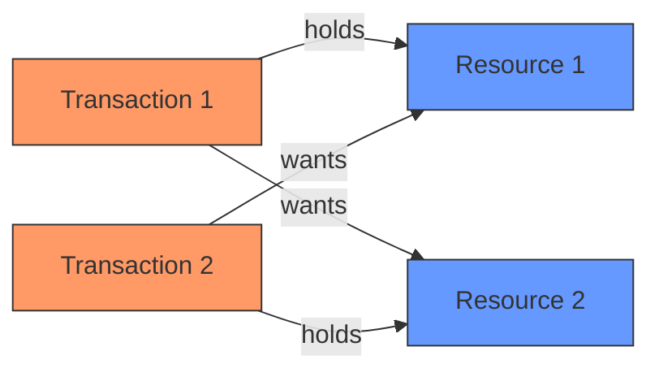
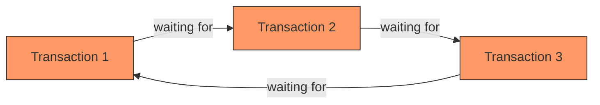
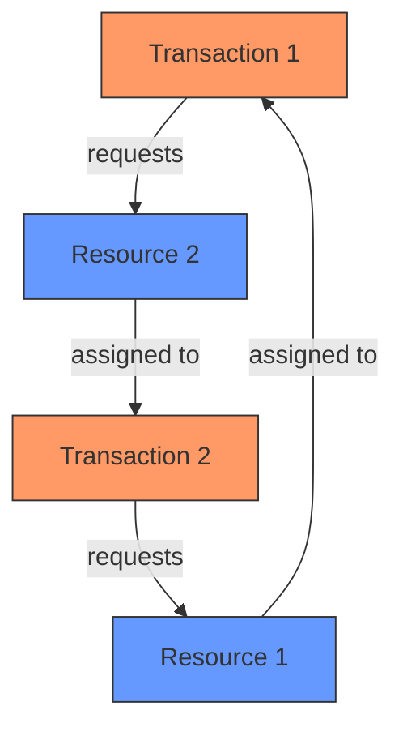

# Deadlock Detection

## Introduction

When multiple transactions run concurrently in a database system, they may compete for the same resources (like table rows or pages). This competition can sometimes lead to a situation called a **deadlock**—where two or more transactions are waiting for each other to release resources, resulting in all of them being unable to proceed.

Think of it like a traffic gridlock: Car A can't move until Car B moves, but Car B can't move until Car A moves. Both are stuck in a circular waiting pattern.

In this guide, we'll explore how database systems detect these deadlocks, the algorithms used, and how to handle them effectively in your applications.

## What Is a Deadlock?

A deadlock occurs when two or more transactions are unable to proceed because each holds resources that the others need. This creates a circular wait condition where no transaction can continue.

For a deadlock to occur, four conditions must be met simultaneously:

1. **Mutual Exclusion**: At least one resource must be held in a non-sharable mode
2. **Hold and Wait**: A transaction holds at least one resource while waiting for additional resources
3. **No Preemption**: Resources cannot be forcibly taken away from a transaction
4. **Circular Wait**: A circular chain of transactions exists, where each transaction holds resources that the next transaction needs

## Visualizing a Deadlock

Let's visualize a simple deadlock scenario:



In this example:
- Transaction 1 holds Resource 1 and wants Resource 2
- Transaction 2 holds Resource 2 and wants Resource 1
- Neither can proceed, resulting in a deadlock

## Deadlock Detection Algorithms

Database systems use various algorithms to detect deadlocks. Let's explore the most common ones:

### 1. Wait-For Graph Method

The Wait-For Graph (WFG) is a directed graph where:
- Nodes represent transactions
- An edge from Ti to Tj means Transaction Ti is waiting for a resource held by Transaction Tj

A deadlock exists if there is a cycle in this graph.



The algorithm works as follows:

1. Create nodes for each transaction
2. Add directed edges based on which transaction is waiting for resources held by another
3. Check for cycles in the graph (using DFS or BFS)
4. If a cycle exists, a deadlock is present

Here's a simple implementation of deadlock detection using the Wait-For Graph approach:

```java
class DeadlockDetector {
    private Map<String, List<String>> waitForGraph = new HashMap<>();
    
    // Add a "waits-for" relationship between transactions
    public void addWaitRelation(String waitingTxn, String holdingTxn) {
        waitForGraph.putIfAbsent(waitingTxn, new ArrayList<>());
        waitForGraph.get(waitingTxn).add(holdingTxn);
    }
    
    // Check if deadlock exists using DFS to find cycles
    public boolean hasDeadlock() {
        Set<String> visiting = new HashSet<>();
        Set<String> visited = new HashSet<>();
        
        for (String txn : waitForGraph.keySet()) {
            if (!visited.contains(txn)) {
                if (hasCycle(txn, visiting, visited)) {
                    return true;
                }
            }
        }
        return false;
    }
    
    private boolean hasCycle(String txn, Set<String> visiting, Set<String> visited) {
        visiting.add(txn);
        
        if (waitForGraph.containsKey(txn)) {
            for (String neighbor : waitForGraph.get(txn)) {
                if (visiting.contains(neighbor)) {
                    return true; // Cycle found
                }
                if (!visited.contains(neighbor)) {
                    if (hasCycle(neighbor, visiting, visited)) {
                        return true;
                    }
                }
            }
        }
        
        visiting.remove(txn);
        visited.add(txn);
        return false;
    }
}
```

**Sample Usage:**

```java
DeadlockDetector detector = new DeadlockDetector();

// Transaction 1 is waiting for a resource held by Transaction 2
detector.addWaitRelation("T1", "T2");

// Transaction 2 is waiting for a resource held by Transaction 3
detector.addWaitRelation("T2", "T3");

// Transaction 3 is waiting for a resource held by Transaction 1
detector.addWaitRelation("T3", "T1");

boolean deadlockExists = detector.hasDeadlock();
System.out.println("Deadlock detected: " + deadlockExists);

// Output: Deadlock detected: true
```

### 2. Resource Allocation Graph Method

The Resource Allocation Graph (RAG) is more detailed than the Wait-For Graph. It includes:
- Transaction nodes
- Resource nodes
- Assignment edges (resource to transaction)
- Request edges (transaction to resource)



A deadlock exists if there's a cycle in this graph. However, if resources have multiple instances, a cycle doesn't necessarily indicate a deadlock.

### 3. Timeout-Based Detection

A simpler approach used by some systems is to set transaction timeouts:

1. Set a maximum wait time for transactions
2. If a transaction waits longer than the threshold, it's assumed to be in a deadlock
3. The transaction is terminated (victim) and rolled back

While simple to implement, this method can produce false positives (treating long-running transactions as deadlocked).

## Deadlock Resolution Strategies

Once a deadlock is detected, the system must resolve it. Common methods include:

### 1. Victim Selection

Choose one or more transactions to abort (the "victims"), freeing their resources:

- **Minimum Cost**: Select the transaction that will be least expensive to roll back
- **Minimum Resources**: Choose the transaction holding the fewest resources
- **Age-Based**: Prefer newer transactions (less work lost when aborted)
- **Progress-Based**: Select transactions that have completed less work

### 2. Transaction Rollback

After selecting a victim, the system has two options:

- **Total Rollback**: Abort the entire transaction
- **Partial Rollback**: Roll back just enough to break the deadlock

Most systems implement total rollback because it's simpler to implement.

## Practical Example: Simulating and Detecting Deadlocks

Let's examine a practical scenario where deadlocks might occur in a banking application:

```java
// Two accounts: checking and savings
Account checking = new Account("Checking", 1000);
Account savings = new Account("Savings", 2000);

// Transaction 1: Transfer from checking to savings
Thread txn1 = new Thread(() -> {
    synchronized(checking) {
        System.out.println("Txn1: Locked checking account");
        
        try { Thread.sleep(100); } catch(Exception e) {} // Simulate processing
        
        synchronized(savings) {
            System.out.println("Txn1: Locked savings account");
            checking.withdraw(500);
            savings.deposit(500);
        }
    }
});

// Transaction 2: Transfer from savings to checking
Thread txn2 = new Thread(() -> {
    synchronized(savings) {
        System.out.println("Txn2: Locked savings account");
        
        try { Thread.sleep(100); } catch(Exception e) {} // Simulate processing
        
        synchronized(checking) {
            System.out.println("Txn2: Locked checking account");
            savings.withdraw(300);
            checking.deposit(300);
        }
    }
});

txn1.start();
txn2.start();
```

This code will likely result in a deadlock because:
- Transaction 1 locks checking, then tries to lock savings
- Transaction 2 locks savings, then tries to lock checking
- Both wait for the other to release their second resource

### Deadlock Prevention

We can prevent this deadlock by ensuring resources are always acquired in the same order:

```java
// Fix: Ensure consistent ordering of lock acquisition
Thread txn1Fixed = new Thread(() -> {
    // Always acquire locks in the same order (e.g., alphabetical)
    synchronized(checking) {  // "C" comes before "S"
        System.out.println("Txn1: Locked checking account");
        
        synchronized(savings) {
            System.out.println("Txn1: Locked savings account");
            checking.withdraw(500);
            savings.deposit(500);
        }
    }
});

Thread txn2Fixed = new Thread(() -> {
    // Always acquire locks in the same order (checking first, then savings)
    synchronized(checking) {
        System.out.println("Txn2: Locked checking account");
        
        synchronized(savings) {
            System.out.println("Txn2: Locked savings account");
            savings.withdraw(300);
            checking.deposit(300);
        }
    }
});
```

## Real-World Applications

Deadlock detection is crucial in several real-world scenarios:

### 1. Database Management Systems

All major database systems implement deadlock detection:

- **PostgreSQL**: Uses timeout-based detection with configurable deadlock timeouts
- **MySQL/InnoDB**: Builds a wait-for graph and checks for cycles periodically
- **Oracle**: Uses both timeout and wait-for graph approaches
- **SQL Server**: Automatically detects deadlocks using a wait-for graph algorithm

### 2. Operating Systems

Operating systems need to detect deadlocks for processes competing for system resources:
- Memory allocation
- File locks
- I/O devices
- Network connections

### 3. Distributed Systems

In distributed systems, deadlock detection becomes more complex:
- No single entity has complete knowledge of resource allocations
- Requires coordination between nodes
- Often uses timeout-based approaches due to complexity

## Best Practices to Avoid Deadlocks

While database systems can detect and resolve deadlocks, it's better to avoid them:

1. **Access resources in a consistent order** across all transactions
2. **Keep transactions short** to reduce the probability of conflicts
3. **Use appropriate isolation levels** - don't lock more than necessary
4. **Implement timeouts** in application code to avoid indefinite waiting
5. **Use SELECT FOR UPDATE with caution** as it acquires exclusive locks
6. **Monitor and analyze** deadlocks that occur in production

## Summary

Deadlocks represent a significant challenge in concurrent transaction processing. Understanding how they occur and how to detect them is essential for developing robust database applications.

Key takeaways from this guide:

- Deadlocks occur when transactions are in a circular wait condition
- Detection methods include wait-for graphs, resource allocation graphs, and timeouts
- Resolution typically involves selecting victim transactions to abort
- Prevention strategies like consistent resource ordering are preferable to detection

## Exercises

1. Implement a simple deadlock detector using the Wait-For Graph algorithm
2. Modify the banking transfer example to use a timeout mechanism instead of lock ordering
3. Write a program that deliberately creates a deadlock, then detects and resolves it
4. Research how your preferred database system handles deadlock detection and compare it with others
5. Design a deadlock prevention strategy for a real-world application of your choice

## Additional Resources

- [Database System Concepts](https://db-book.com/) by Silberschatz, Korth, and Sudarshan
- Your database's documentation on transaction management (MySQL, PostgreSQL, etc.)
- [Operating System Concepts](https://www.os-book.com/) by Silberschatz, Galvin, and Gagne
- Academic papers on distributed deadlock detection