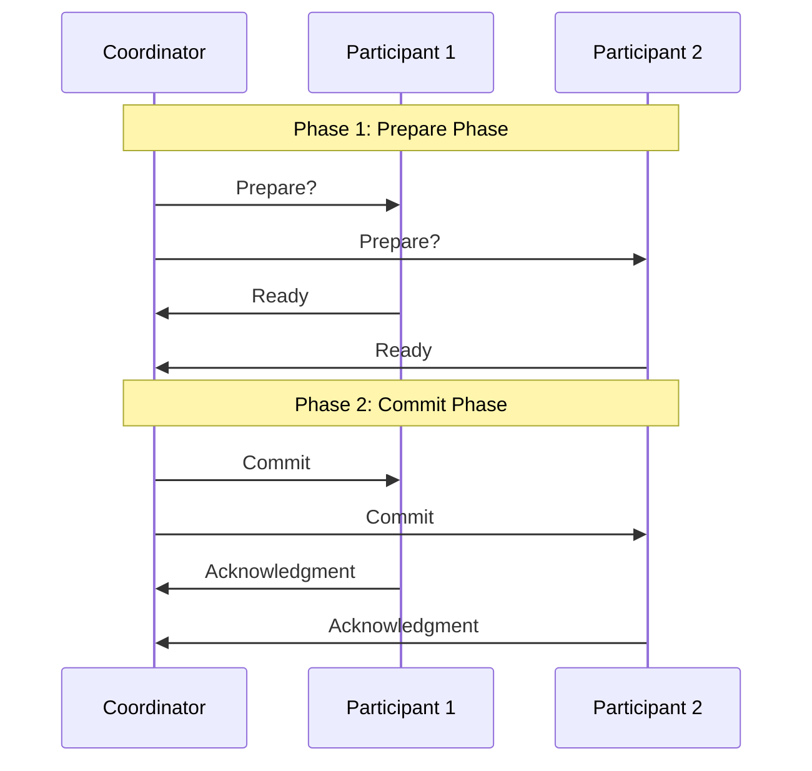

# Two-Phase Commit

## Introduction

Imagine you're transferring money between two bank accounts that are managed by different servers. What happens if one server successfully processes its part of the transaction, but the other crashes? You could end up with money disappearing from one account without appearing in the other!

The **Two-Phase Commit (2PC)** protocol solves this problem. It's a distributed algorithm that ensures all participants in a transaction either commit their changes together or roll back together, maintaining data consistency across multiple systems.

## What is Two-Phase Commit?

Two-Phase Commit is a coordination protocol used in distributed database systems to ensure that all participants in a transaction either successfully complete the transaction or make no changes at all. As the name suggests, it consists of two distinct phases:

1. **Prepare Phase**: The coordinator asks all participants if they're ready to commit
2. **Commit Phase**: If all agree, the coordinator tells everyone to commit

This approach guarantees **atomicity** (all-or-nothing behavior) across multiple systems, which is essential for maintaining data integrity in distributed environments.

## How Two-Phase Commit Works

Let's break down the process step by step:

### Phase 1: Prepare Phase

1. The coordinator sends a "prepare" message to all participants
2. Each participant:
   - Executes the transaction up to the point where it's ready to commit
   - Writes all transaction data to its logs (for recovery if needed)
   - Sends a "ready" or "abort" response to the coordinator
3. The coordinator collects all responses

### Phase 2: Commit Phase

If all participants responded with "ready":
1. The coordinator writes a "commit" record to its log
2. The coordinator sends a "commit" message to all participants
3. Each participant completes the transaction and releases any locks
4. Each participant sends an acknowledgment to the coordinator
5. When all acknowledgments are received, the transaction is complete

If any participant responded with "abort":
1. The coordinator writes an "abort" record to its log
2. The coordinator sends an "abort" message to all participants
3. Each participant rolls back the transaction
4. Each participant sends an acknowledgment to the coordinator

## Visual Representation

Let's visualize the Two-Phase Commit protocol:



## Code Example: Implementing Two-Phase Commit

Here's a simplified implementation of the Two-Phase Commit protocol in Java:

```java
// Coordinator class
public class Coordinator {
    private List<Participant> participants;
    private TransactionLog log;
    
    public boolean executeTransaction(Transaction txn) {
        // Phase 1: Prepare Phase
        log.write("BEGIN_PREPARE: " + txn.getId());
        boolean allReady = true;
        
        for (Participant p : participants) {
            boolean ready = p.prepare(txn);
            if (!ready) {
                allReady = false;
                break;
            }
        }
        
        // Phase 2: Commit or Abort
        if (allReady) {
            log.write("BEGIN_COMMIT: " + txn.getId());
            for (Participant p : participants) {
                p.commit(txn);
            }
            log.write("END_COMMIT: " + txn.getId());
            return true;
        } else {
            log.write("BEGIN_ABORT: " + txn.getId());
            for (Participant p : participants) {
                p.abort(txn);
            }
            log.write("END_ABORT: " + txn.getId());
            return false;
        }
    }
}

// Participant class
public class Participant {
    private Database db;
    private TransactionLog log;
    
    public boolean prepare(Transaction txn) {
        try {
            // Execute the transaction operations
            db.executeOperations(txn);
            
            // Write to the log
            log.write("PREPARED: " + txn.getId());
            
            return true;
        } catch (Exception e) {
            log.write("PREPARE_FAILED: " + txn.getId());
            return false;
        }
    }
    
    public void commit(Transaction txn) {
        db.commit(txn);
        log.write("COMMITTED: " + txn.getId());
    }
    
    public void abort(Transaction txn) {
        db.rollback(txn);
        log.write("ABORTED: " + txn.getId());
    }
}
```

Let's see how this would work with a practical example:

```java
// Example usage
public class TwoPhaseCommitExample {
    public static void main(String[] args) {
        // Set up coordinator and participants
        Coordinator coordinator = new Coordinator();
        Participant bank1 = new Participant(new Database("Bank1"));
        Participant bank2 = new Participant(new Database("Bank2"));
        
        coordinator.addParticipant(bank1);
        coordinator.addParticipant(bank2);
        
        // Create a money transfer transaction
        Transaction transfer = new Transaction("T123");
        transfer.addOperation(new Operation("debit", "Account1", 1000));
        transfer.addOperation(new Operation("credit", "Account2", 1000));
        
        // Execute the transaction with 2PC
        boolean success = coordinator.executeTransaction(transfer);
        
        if (success) {
            System.out.println("Transaction T123 completed successfully!");
        } else {
            System.out.println("Transaction T123 aborted!");
        }
    }
}
```

## Real-World Application: E-Commerce Order Processing

Let's consider an e-commerce application where placing an order involves multiple services:

1. **Inventory Service**: Reduces product stock
2. **Payment Service**: Charges the customer
3. **Shipping Service**: Creates a shipping order

If any of these steps fail, the entire order should be rolled back. Here's how Two-Phase Commit helps:

```mermaid
flowchart TD
    A[Order Service
(Coordinator)] -->|"Phase 1: Prepare"| B[Inventory Service]
    A -->|"Phase 1: Prepare"| C[Payment Service]
    A -->|"Phase 1: Prepare"| D[Shipping Service]
    
    B -->|"Ready/Abort"| A
    C -->|"Ready/Abort"| A
    D -->|"Ready/Abort"| A
    
    A -->|"Phase 2: Commit/Abort"| B
    A -->|"Phase 2: Commit/Abort"| C
    A -->|"Phase 2: Commit/Abort"| D
```

In this scenario:

1. The Order Service acts as the coordinator
2. Each participant service prepares by reserving resources (inventory, payment hold, shipping slot)
3. Only if all services are ready does the coordinator tell them to commit
4. If any service reports a problem, all operations are aborted

## Advantages and Limitations

### Advantages

- **Atomicity**: Guarantees all-or-nothing transactions across distributed systems
- **Consistency**: Maintains data integrity across multiple databases
- **Durability**: Uses logging to ensure transactions survive system failures

### Limitations

- **Blocking**: Participants are blocked while waiting for coordinator decisions
- **Performance**: The two rounds of communication add latency
- **Single Point of Failure**: If the coordinator crashes after prepare but before commit, participants remain blocked

## Handling Failures

Two-Phase Commit includes protocols for handling various failure scenarios:

1. **Participant Timeout**: If a participant doesn't respond, the coordinator aborts the transaction
2. **Coordinator Failure**: Participants can query other participants to determine transaction status
3. **Recovery**: Participants and coordinator use their logs to recover state after a crash

## Summary

The Two-Phase Commit protocol provides a fundamental mechanism for ensuring transaction atomicity across distributed systems. By coordinating the prepare and commit phases, it ensures that either all participants successfully complete their part of a transaction or none of them make any changes.

While 2PC has limitations in terms of performance and potential blocking issues, it remains an important tool in distributed transaction management, especially in systems where data consistency is critical.

## Exercises

1. Implement a simple Two-Phase Commit protocol using sockets in your preferred programming language
2. Modify the provided Java example to include timeout handling
3. Design a Three-Phase Commit protocol that addresses the blocking problem in 2PC
4. Compare Two-Phase Commit with other distributed transaction protocols like Paxos or RAFT

## Further Reading

- Distributed transaction protocols beyond 2PC (3PC, Saga pattern)
- CAP theorem and its implications for distributed transactions
- Alternative approaches: eventual consistency and compensating transactions