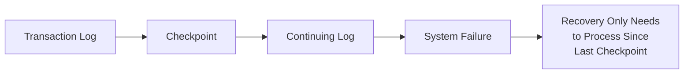
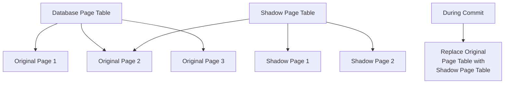

# Recovery Techniques

## Introduction

Database systems must be able to recover from failures without losing data or compromising consistency. Recovery techniques are critical procedures that help database management systems (DBMS) restore the database to a consistent state after a failure occurs. These techniques are a fundamental aspect of the **Durability** property in ACID transactions.

In this lesson, we'll explore how databases maintain reliability through various recovery mechanisms, including logging, checkpointing, and recovery algorithms.

## Why Recovery Techniques Matter

Imagine you're transferring money between accounts when suddenly there's a power outage. What happens to your transaction? Without proper recovery techniques:

- The money might disappear from one account without appearing in the other
- The database could be left in an inconsistent state
- Critical business operations could fail

Recovery techniques ensure that even if a failure occurs during transaction processing, the database can be restored to a consistent state when the system restarts.

## Types of Failures

Before diving into recovery techniques, let's understand what types of failures we might encounter:

1. **Transaction failures**
   - Logical errors (e.g., dividing by zero)
   - System errors (e.g., deadlocks)
   - User-initiated aborts

2. **System failures**
   - Power outages
   - Hardware crashes
   - Operating system failures

3. **Media failures**
   - Disk crashes
   - Storage corruption

Each type of failure requires different recovery strategies.

## Core Recovery Techniques

### Write-Ahead Logging (WAL)

WAL is the most commonly used recovery mechanism in database systems. The fundamental principle is simple: **before any changes are made to the database, a log record of those changes must be written to stable storage**.

```
Transaction T1 starts
T1 updates Account A: $1000 → $800
LOG: <T1, A, $1000, $800>
T1 updates Account B: $500 → $700
LOG: <T1, B, $500, $700>
Transaction T1 commits
LOG: <T1, COMMIT>
```

#### How WAL Works:

1. Before a transaction modifies any data, it writes a log record
2. Each log record contains:
   - Transaction ID
   - Data item ID
   - Old value (for undo operations)
   - New value (for redo operations)
3. The log must be written to stable storage before the actual data changes
4. When the transaction commits, a commit record is written to the log

Let's implement a simple WAL mechanism in Python:

```python
class LogRecord:
    def __init__(self, transaction_id, item_id, old_value, new_value):
        self.transaction_id = transaction_id
        self.item_id = item_id
        self.old_value = old_value
        self.new_value = new_value
        self.type = "UPDATE"  # Can be UPDATE, COMMIT, ABORT
    
    def __str__(self):
        return f"<{self.transaction_id}, {self.item_id}, {self.old_value}, {self.new_value}>"


class WAL:
    def __init__(self):
        self.log = []
        self.database = {}  # Simple in-memory database
    
    def write_log(self, record):
        # In a real system, this would write to stable storage
        self.log.append(record)
        print(f"Log written: {record}")
    
    def update_item(self, transaction_id, item_id, new_value):
        # Get current value
        old_value = self.database.get(item_id, None)
        
        # Create and write log record FIRST
        log_record = LogRecord(transaction_id, item_id, old_value, new_value)
        self.write_log(log_record)
        
        # THEN modify the database
        self.database[item_id] = new_value
        print(f"Database updated: {item_id} = {new_value}")
    
    def commit_transaction(self, transaction_id):
        # Write commit record
        commit_record = LogRecord(transaction_id, None, None, None)
        commit_record.type = "COMMIT"
        self.write_log(commit_record)
        print(f"Transaction {transaction_id} committed")
    
    def abort_transaction(self, transaction_id):
        # Write abort record
        abort_record = LogRecord(transaction_id, None, None, None)
        abort_record.type = "ABORT"
        self.write_log(abort_record)
        
        # Undo all changes from this transaction (in reverse order)
        for record in reversed(self.log):
            if record.transaction_id == transaction_id and record.type == "UPDATE":
                # Restore old value
                self.database[record.item_id] = record.old_value
                print(f"Rolled back: {record.item_id} to {record.old_value}")
        
        print(f"Transaction {transaction_id} aborted")
```

Usage example:

```python
# Example usage
wal = WAL()

# Start a transaction
print("Starting transaction T1")
wal.update_item("T1", "A", 800)  # A had value None, now 800
wal.update_item("T1", "B", 700)  # B had value None, now 700
wal.commit_transaction("T1")

# Another transaction that will abort
print("
Starting transaction T2")
wal.update_item("T2", "A", 750)  # A had value 800, now 750
wal.update_item("T2", "C", 300)  # C had value None, now 300
wal.abort_transaction("T2")

print("
Final database state:", wal.database)
```

Output:

```
Starting transaction T1
Log written: <T1, A, None, 800>
Database updated: A = 800
Log written: <T1, B, None, 700>
Database updated: B = 700
Log written: <T1, None, None, None>
Transaction T1 committed

Starting transaction T2
Log written: <T2, A, 800, 750>
Database updated: A = 750
Log written: <T2, C, None, 300>
Database updated: C = 300
Log written: <T2, None, None, None>
Rolled back: C to None
Rolled back: A to 800
Transaction T2 aborted

Final database state: {'A': 800, 'B': 700}
```

### Checkpointing

Writing and processing every log entry during recovery can be time-consuming. **Checkpointing** is a technique that reduces recovery time by periodically saving the database state.



#### How Checkpointing Works:

1. The DBMS temporarily suspends new transactions
2. All dirty buffers (modified pages in memory) are written to disk
3. A checkpoint record is written to the log
4. Normal operation resumes

During recovery, the system only needs to examine transactions that started after the most recent checkpoint.

### Recovery Protocols

Two main approaches to recovery are used:

#### 1. UNDO/REDO Recovery

This approach can both undo incomplete transactions and redo committed ones:

```python
def recover(log, checkpoint_position):
    # Step 1: Identify transactions to be redone and undone
    undo_list = set()  # Transactions that need to be undone
    redo_list = set()  # Transactions that need to be redone
    
    # Start from checkpoint position
    for entry in log[checkpoint_position:]:
        if entry.type == "BEGIN":
            undo_list.add(entry.transaction_id)
        elif entry.type == "COMMIT":
            undo_list.remove(entry.transaction_id)
            redo_list.add(entry.transaction_id)
    
    # Step 2: Undo transactions that didn't commit
    for entry in reversed(log):
        if entry.transaction_id in undo_list and entry.type == "UPDATE":
            database[entry.item_id] = entry.old_value
    
    # Step 3: Redo committed transactions
    for entry in log[checkpoint_position:]:
        if entry.transaction_id in redo_list and entry.type == "UPDATE":
            database[entry.item_id] = entry.new_value
```

#### 2. ARIES Recovery Algorithm

ARIES (Algorithm for Recovery and Isolation Exploiting Semantics) is a sophisticated recovery algorithm used in many commercial DBMS. It follows three main principles:

1. **Write-Ahead Logging**: Log records are written before changes are made
2. **Repeating History During Redo**: All actions of committed and uncommitted transactions are redone
3. **Logging Changes During Undo**: Changes made while undoing operations are logged

The ARIES recovery process has three phases:

1. **Analysis**: Scan the log to determine which transactions to undo/redo
2. **Redo**: Repeat history by redoing all operations from the last checkpoint
3. **Undo**: Roll back all uncommitted transactions

## Shadow Paging

An alternative to logging is shadow paging, where instead of modifying pages directly, the system creates copies (shadows) of pages:



#### How Shadow Paging Works:

1. When a transaction starts, a shadow page table is created (copy of the current page table)
2. Modifications are made to shadow pages, not original pages
3. If the transaction commits, the shadow page table becomes the new database page table
4. If the transaction aborts, the shadow pages are discarded

## Practical Example: Database Recovery in Action

Let's see a complete example of a banking transaction with recovery:

```python
def transfer_money(from_account, to_account, amount):
    try:
        # Start transaction
        transaction_id = generate_transaction_id()
        logger.log_begin(transaction_id)
        
        # Read current balances
        from_balance = read_account_balance(from_account)
        to_balance = read_account_balance(to_account)
        
        # Check if enough funds
        if from_balance < amount:
            logger.log_abort(transaction_id)
            return "Insufficient funds"
        
        # Update accounts
        new_from_balance = from_balance - amount
        logger.log_update(transaction_id, from_account, from_balance, new_from_balance)
        update_account(from_account, new_from_balance)
        
        new_to_balance = to_balance + amount
        logger.log_update(transaction_id, to_account, to_balance, new_to_balance)
        update_account(to_account, new_to_balance)
        
        # Commit transaction
        logger.log_commit(transaction_id)
        return "Transfer completed"
        
    except Exception as e:
        # Something went wrong, abort
        logger.log_abort(transaction_id)
        return f"Error: {str(e)}"
```

If a system crash occurs after the first update but before the second, during recovery:
1. The system would scan the log
2. It would find that this transaction didn't commit
3. It would roll back the first update using the old value stored in the log

## Recovery in Different Database Systems

Different database systems implement recovery techniques in various ways:

- **PostgreSQL**: Uses WAL and continuous archiving
- **MySQL (InnoDB)**: Uses a circular redo log and separate undo logs
- **Oracle**: Uses redo logs and undo segments
- **SQLite**: Uses a rollback journal or WAL

## Performance Considerations

Recovery mechanisms impact database performance:

- Logging adds overhead to every transaction
- Checkpointing temporarily pauses transaction processing
- Recovery time depends on log size and checkpoint frequency

To optimize:
- Adjust checkpoint frequency
- Use group commit (batch multiple transactions)
- Consider hardware solutions like battery-backed RAM

## Summary

Recovery techniques ensure databases can maintain consistency and durability even in the face of failures:

- **Write-Ahead Logging** provides a record of all changes for undo and redo operations
- **Checkpointing** reduces recovery time by establishing consistent database states
- **Recovery algorithms** like ARIES provide sophisticated protocols for restoring consistency
- **Shadow paging** offers an alternative approach using page copying instead of logging

These techniques form the backbone of transaction durability and are critical for reliable database systems.

## Exercises

1. Implement a simple logging system that can recover a database after a simulated crash.
2. Compare the performance impact of different checkpoint frequencies.
3. Design a recovery protocol that can handle media failures (not just transaction and system failures).
4. Modify the WAL example to include checkpointing functionality.

## Additional Resources

- Database System Concepts (Silberschatz, Korth, Sudarshan)
- Transaction Processing: Concepts and Techniques (Gray, Reuter)
- The ARIES Paper: "ARIES: A Transaction Recovery Method Supporting Fine-Granularity Locking and Partial Rollbacks Using Write-Ahead Logging" by C. Mohan