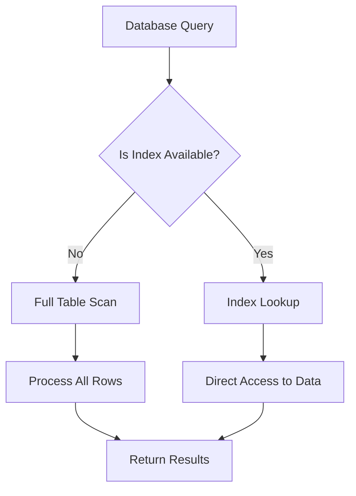
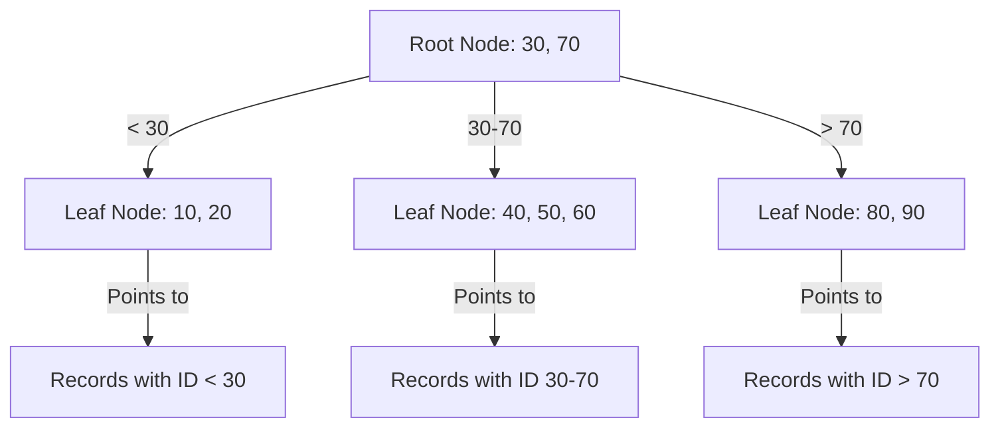

# Index Concepts

## Introduction

Database indexes are one of the most powerful and misunderstood performance optimization tools in programming. Think of them as the "table of contents" for your database - they help your database quickly find the information you're looking for without having to scan through every record.

In this tutorial, we'll explore the fundamental concepts of database indexing, how they work behind the scenes, and when to use them to dramatically improve your application's performance.

## What is a Database Index?

An index is a data structure that improves the speed of data retrieval operations on a database table. It works similarly to an index in a book - instead of reading through the entire book to find information on a specific topic, you can consult the index and jump directly to the right page.

Without indexes, a database must perform a full table scan, reading every row in a table to find the relevant data. With a properly designed index, the database can quickly locate the records it needs.



## How Indexes Work

To understand indexes better, let's examine the underlying concepts:

### B-Tree Indexes

The most common type of index is the B-Tree (Balanced Tree) index. B-Trees organize data in a tree-like structure that allows for efficient searches, insertions, and deletions.



### Clustered vs. Non-Clustered Indexes

There are two primary types of indexes:

1. **Clustered Indexes**:
   - Determine the physical order of data in a table
   - Each table can have only one clustered index
   - Usually created on primary key columns
   - Faster for range queries

2. **Non-Clustered Indexes**:
   - Create a separate structure containing pointers to the actual data
   - A table can have multiple non-clustered indexes
   - Slightly slower than clustered indexes but more flexible

## Index Example in SQL

Let's see how to create indexes in SQL with a practical example:

### Creating a Table Without an Index

```sql
CREATE TABLE users (
    id INT,
    username VARCHAR(50),
    email VARCHAR(100),
    created_at TIMESTAMP
);

-- Insert some sample data
INSERT INTO users VALUES (1, 'john_doe', 'john@example.com', '2023-01-15 10:30:00');
INSERT INTO users VALUES (2, 'jane_smith', 'jane@example.com', '2023-01-20 14:45:00');
-- ... more records
```

### Query Performance Without an Index

If we run a query to find a user by email:

```sql
SELECT * FROM users WHERE email = 'john@example.com';
```

The database will perform a full table scan, reading every row to find matches. This is inefficient, especially as your table grows.

### Adding an Index and Measuring Performance

Now, let's add an index to the email column:

```sql
CREATE INDEX idx_users_email ON users(email);
```

After creating this index, the same query becomes much faster because the database can quickly locate the record using the index.

Let's compare the execution plans:

#### Before Indexing
```
EXPLAIN SELECT * FROM users WHERE email = 'john@example.com';

"Seq Scan on users  (cost=0.00..170.00 rows=1 width=62)"
"  Filter: (email = 'john@example.com'::text)"
```

#### After Indexing
```
EXPLAIN SELECT * FROM users WHERE email = 'john@example.com';

"Index Scan using idx_users_email on users  (cost=0.42..8.44 rows=1 width=62)"
"  Index Cond: (email = 'john@example.com'::text)"
```

The execution plan has changed from a sequential scan to an index scan, significantly reducing the cost.

## When to Use Indexes

Indexes are powerful but should be used thoughtfully. Here are guidelines for when to create indexes:

1. **Columns used in WHERE clauses**: Index columns that are frequently used in filter conditions.
2. **Join columns**: Index columns used to join tables together.
3. **ORDER BY and GROUP BY columns**: Index columns used for sorting and grouping.
4. **Unique constraints**: Primary keys and columns with unique constraints should be indexed.

## When NOT to Use Indexes

Indexes aren't always beneficial:

1. **Small tables**: For tables with few records, indexes might add overhead.
2. **Columns with low cardinality**: Columns with many duplicate values (like gender, status) may not benefit from simple indexes.
3. **Tables with frequent large-scale updates/inserts**: Indexes slow down write operations as they need to be updated.

## Composite Indexes

Sometimes, you need to index multiple columns together. This is called a composite index:

```sql
CREATE INDEX idx_users_lastname_firstname ON users(last_name, first_name);
```

This index will be useful for queries that filter on `last_name` or both `last_name` AND `first_name`, but not for queries that only filter on `first_name`.

The order of columns in a composite index matters! Put the most selective columns first and consider the most common query patterns.

## Index Maintenance

Indexes need maintenance to stay effective:

1. **Rebuild or reorganize**: Indexes can become fragmented over time
2. **Update statistics**: The database query optimizer needs up-to-date statistics
3. **Monitor usage**: Drop unused indexes to improve write performance

## Real-World Application: E-commerce Product Search

Let's consider an e-commerce database with a `products` table containing millions of products. Users frequently search by category and price range.

```sql
CREATE TABLE products (
    id INT PRIMARY KEY,
    name VARCHAR(100),
    category_id INT,
    price DECIMAL(10, 2),
    description TEXT,
    created_at TIMESTAMP
);

-- Create a composite index for the common query pattern
CREATE INDEX idx_products_category_price ON products(category_id, price);
```

Now, queries like this will run efficiently:

```sql
SELECT * FROM products 
WHERE category_id = 5 
AND price BETWEEN 10.00 AND 50.00
ORDER BY price;
```

Without the index, this query would require scanning millions of products. With our index, the database can quickly find products in category 5 within the price range.

## Measuring Index Performance

You can measure the impact of your indexes using database tools:

1. **Execution plans**: Most database systems provide tools to view query execution plans
2. **Query timing**: Measure query execution time before and after indexing
3. **Index usage statistics**: Monitor which indexes are being used and how frequently

## Common Indexing Mistakes

Avoid these common mistakes:

1. **Over-indexing**: Adding too many indexes increases storage requirements and slows down write operations
2. **Indexing large columns**: Avoid indexing BLOB/TEXT columns
3. **Not considering workload**: Build indexes based on your most common and performance-critical queries
4. **Forgetting about composite indexes**: Sometimes one composite index works better than multiple single-column indexes

## Summary

Database indexes are powerful tools for improving query performance. When used correctly, they can transform slow queries into lightning-fast operations. Remember these key points:

- Indexes improve read performance but can slow down write operations
- Index columns used in WHERE, JOIN, ORDER BY, and GROUP BY
- Consider the selectivity and cardinality of columns when indexing
- Composite indexes should match your query patterns
- Maintain your indexes regularly

By applying these index concepts, you'll be well on your way to building faster, more efficient database applications.

## Exercises

1. Create a `books` table with columns for `id`, `title`, `author_id`, `genre_id`, and `publication_date`. Design appropriate indexes for this table.

2. Write a query that would benefit from a composite index, and explain why.

3. Using a database of your choice, create a table with at least 10,000 rows. Compare the performance of a query with and without an appropriate index.

## Additional Resources

- Your database's documentation on indexing (MySQL, PostgreSQL, SQL Server, etc.)
- Database performance tuning books and articles
- Query execution plan analysis guides for your specific database

Remember, the key to effective indexing is understanding your data, your queries, and how users interact with your application. Start with the most critical performance issues and address them systematically with well-designed indexes.