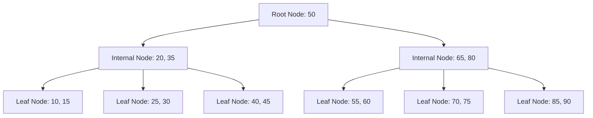

# Types of Indexes

## Introduction

Indexes are special data structures that databases use to speed up data retrieval operations. Think of them like the index at the back of a book - instead of reading the entire book to find information about a specific topic, you can check the index to quickly locate the pages you need. In database terms, indexes help the database engine find data without scanning the entire table.

Without indexes, a database must perform a full table scan for every query, examining each row to determine if it matches the query criteria. With properly implemented indexes, the database can quickly locate the relevant rows, dramatically improving query performance.

In this guide, we'll explore the various types of indexes available in most database systems, when to use them, and how they can enhance your application's performance.

## Common Types of Indexes

### 1. Single-Column Indexes

The most basic type of index is created on a single column of a table. This is useful when you frequently search, sort, or filter data based on that specific column.

```sql
-- Creating a single-column index
CREATE INDEX idx_last_name ON customers(last_name);
```

When to use:
- Columns frequently used in WHERE clauses
- Columns used in JOIN operations
- Columns used in ORDER BY or GROUP BY clauses

### 2. Composite (Multi-Column) Indexes

Composite indexes are created on multiple columns of a table. They're particularly useful for queries that filter on multiple columns simultaneously.

```sql
-- Creating a composite index
CREATE INDEX idx_last_first_name ON customers(last_name, first_name);
```

When using composite indexes, the order of columns matters! In the example above:
- The index is most effective for queries filtering on `last_name` alone
- It's also effective for queries filtering on both `last_name` AND `first_name`
- It's NOT effective for queries filtering only on `first_name`

This is because the index is sorted first by `last_name`, then by `first_name` within each `last_name` value.

### 3. Unique Indexes

A unique index ensures that the indexed columns do not contain duplicate values. This serves both as a search optimization and as a data integrity constraint.

```sql
-- Creating a unique index
CREATE UNIQUE INDEX idx_email ON users(email);
```

When to use:
- Enforcing uniqueness on columns that aren't primary keys
- Improving query performance on columns with high selectivity

### 4. Clustered Indexes

A clustered index determines the physical order of data in a table. Each table can have only one clustered index because the data rows themselves can be sorted in only one way.

```sql
-- In SQL Server, PRIMARY KEY constraints create clustered indexes by default
CREATE TABLE products (
  product_id INT PRIMARY KEY,  -- This creates a clustered index
  product_name VARCHAR(100),
  price DECIMAL(10,2)
);
```

Characteristics:
- Faster for range queries since records are physically adjacent
- Slower for inserts since maintaining physical order might require data movement
- Usually created on primary key columns

### 5. Non-Clustered Indexes

Non-clustered indexes have a structure separate from the data rows. They contain the indexed columns and a pointer to the table rows with the matching values.

```sql
-- Creating a non-clustered index
CREATE INDEX idx_product_name ON products(product_name);
```

Characteristics:
- Can have multiple non-clustered indexes per table
- Good for columns frequently used in search conditions
- Slightly slower than clustered indexes for retrieval but faster for inserts and updates

### 6. Bitmap Indexes

Bitmap indexes are specialized indexes for columns with a low number of distinct values (low cardinality). Each bit in the bitmap corresponds to a possible record.

```sql
-- Oracle syntax for bitmap index
CREATE BITMAP INDEX idx_status ON orders(status);
```

When to use:
- Columns with few unique values (like status, gender, boolean flags)
- Data warehousing applications with many concurrent queries but infrequent updates
- Not recommended for OLTP systems with frequent updates

### 7. Full-Text Indexes

Full-text indexes are designed to support efficient full-text searches on text data, such as documents or long text fields.

```sql
-- SQL Server example
CREATE FULLTEXT INDEX ON articles(content) 
  KEY INDEX PK_articles;
```

When to use:
- Text searching capabilities including relevance ranking
- Support for linguistic searches (word stemming, thesaurus, etc.)
- Natural language queries across large text fields

### 8. Spatial Indexes

Spatial indexes optimize queries on geometric data types, such as points, lines, and polygons.

```sql
-- PostgreSQL example with PostGIS extension
CREATE INDEX idx_location ON stores USING GIST(location);
```

When to use:
- Geographic information systems (GIS)
- Location-based queries (finding nearest points of interest)
- Geometric calculations and operations

### 9. Partial/Filtered Indexes

Partial indexes include only a subset of the table's rows based on a condition.

```sql
-- PostgreSQL example
CREATE INDEX idx_active_users ON users(username) WHERE active = TRUE;
```

When to use:
- When a large percentage of queries target a specific subset of data
- To reduce the size and maintenance overhead of the index
- When most queries include the filtering condition

## How Indexes Work: B-Tree Structure

Most database indexes use a data structure called a B-Tree (Balanced Tree). Understanding how B-Trees work helps in choosing the right indexes.



B-Trees have several important characteristics:
- They maintain balance to ensure consistent performance
- Leaf nodes are all at the same depth
- They support efficient insertions and deletions without requiring complete rebuilding
- They excel at range queries (finding all values between X and Y)

## Real-World Example: E-commerce Database

Let's consider an e-commerce application with the following tables:

```sql
CREATE TABLE products (
  product_id INT PRIMARY KEY,
  name VARCHAR(100),
  category_id INT,
  price DECIMAL(10,2),
  description TEXT,
  created_at TIMESTAMP
);

CREATE TABLE orders (
  order_id INT PRIMARY KEY,
  user_id INT,
  status VARCHAR(20),
  total_amount DECIMAL(10,2),
  shipping_address TEXT,
  order_date TIMESTAMP
);

CREATE TABLE order_items (
  item_id INT PRIMARY KEY,
  order_id INT,
  product_id INT,
  quantity INT,
  unit_price DECIMAL(10,2)
);
```

A typical indexing strategy might include:

1. **Primary Key Indexes** (automatically created):
   - `products(product_id)`
   - `orders(order_id)`
   - `order_items(item_id)`

2. **Foreign Key Indexes** (for JOIN operations):
   - `order_items(order_id)`
   - `order_items(product_id)`
   - `products(category_id)`

3. **Filtering Indexes** (for common WHERE clauses):
   - `orders(status)` - For filtering orders by status
   - `products(category_id)` - For filtering products by category

4. **Sorting Indexes** (for common ORDER BY clauses):
   - `orders(order_date)` - For sorting orders by date
   - `products(price)` - For sorting products by price

5. **Full-Text Indexes** (for text searches):
   - `products(description)` - For searching product descriptions

Example query that benefits from these indexes:

```sql
-- Find all pending orders placed in the last week
SELECT o.order_id, o.order_date, o.total_amount, u.username
FROM orders o
JOIN users u ON o.user_id = u.user_id
WHERE o.status = 'pending'
AND o.order_date > (CURRENT_DATE - INTERVAL '7 days')
ORDER BY o.order_date DESC;
```

Indexes used:
- `orders(status)` - For filtering on status
- `orders(order_date)` - For date filtering and sorting
- Foreign key index on `users(user_id)` - For the join operation

## Index Considerations and Trade-offs

### Benefits of Indexes
- Dramatically faster data retrieval for queries using indexed columns
- Improved performance for sorting and grouping operations
- Support for data integrity constraints (unique indexes)

### Costs of Indexes
- Increased storage space requirements
- Slower write operations (INSERT, UPDATE, DELETE)
- Maintenance overhead for the database engine

### When to Use Indexes
- Tables with large amounts of data
- Columns frequently used in search conditions
- Columns used in JOIN, ORDER BY, or GROUP BY operations
- Columns with high cardinality (many unique values)

### When to Avoid Indexes
- Small tables where full scans are efficient
- Columns rarely used in search conditions
- Columns with low cardinality, unless using specialized indexes like bitmap indexes
- Tables with very frequent write operations and infrequent reads

## Monitoring Index Performance

Most database systems provide tools to evaluate index usage and effectiveness:

```sql
-- PostgreSQL example: Finding unused indexes
SELECT 
  schemaname || '.' || relname AS table,
  indexrelname AS index,
  pg_size_pretty(pg_relation_size(i.indexrelid)) AS index_size,
  idx_scan AS index_scans
FROM pg_stat_user_indexes ui
JOIN pg_index i ON ui.indexrelid = i.indexrelid
WHERE idx_scan = 0 
ORDER BY pg_relation_size(i.indexrelid) DESC;
```

```sql
-- SQL Server example: Index usage statistics
SELECT 
  DB_NAME(database_id) AS DatabaseName,
  OBJECT_NAME(s.object_id) AS TableName,
  i.name AS IndexName,
  user_seeks + user_scans + user_lookups AS TotalReads,
  user_updates AS TotalWrites
FROM sys.dm_db_index_usage_stats AS s
INNER JOIN sys.indexes AS i ON s.object_id = i.object_id
  AND s.index_id = i.index_id
WHERE OBJECTPROPERTY(s.object_id,'IsUserTable') = 1;
```

## Best Practices

1. **Don't over-index**
   Index only what you need. Every index adds overhead, especially for write operations.

2. **Regularly review index usage**
   Remove unused indexes that are just adding overhead without providing benefits.

3. **Consider the workload**
   OLTP systems (frequent small transactions) need different indexing strategies than OLAP/data warehousing systems.

4. **Test with realistic data volumes**
   Indexing behavior can change dramatically as data volume grows.

5. **Composite index order matters**
   Put the most selective column first and consider the most common query patterns.

6. **Prefer covering indexes for critical queries**
   A covering index includes all columns needed by a query, allowing the database to satisfy the query using only the index.

7. **Consider partial indexes for skewed data**
   If 90% of queries target 10% of data, a partial index might be more efficient.

## Summary

Indexes are powerful tools for improving database performance when used appropriately. The key types of indexes include:

- Single-column indexes for simple filtering
- Composite indexes for multi-column conditions
- Unique indexes for enforcing data integrity
- Clustered indexes for determining physical data organization
- Specialized indexes (full-text, spatial, bitmap) for specific data types and query patterns

Remember that while indexes speed up read operations, they slow down writes and require additional storage. The art of database optimization involves finding the right balance for your specific application's needs.

## Exercises

1. Create an appropriate indexing strategy for a blog application with tables for users, posts, comments, and categories.

2. Analyze an existing query that's performing poorly and determine which indexes might improve its performance.

3. Compare the performance of a complex query with and without appropriate indexes using EXPLAIN or equivalent in your database system.

4. Implement a partial index for a common filtering pattern in your application and measure the performance improvement.

## Additional Resources

- Your database system's documentation on indexing
- Database query optimization books and courses
- Performance tuning guides specific to your database engine
- Execution plan analysis tools provided by your database