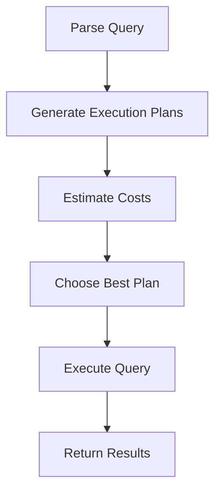

# Query Profiling

## Introduction

Query profiling is the process of analyzing database queries to identify performance bottlenecks and optimization opportunities. It's a critical skill for developers working with databases, as inefficient queries can significantly impact application performance. By understanding how to profile queries, you'll be able to diagnose issues and implement improvements that can make your applications run faster and more efficiently.

In this guide, we'll explore the fundamentals of query profiling, learn how to use profiling tools, analyze query execution plans, and implement optimizations based on profiling results.

## Why Query Profiling Matters

Before diving into the technical aspects, let's understand why query profiling is essential:

- **Performance**: Slow queries can make your entire application feel sluggish
- **Scalability**: Inefficient queries become increasingly problematic as your dataset grows
- **Resource Optimization**: Efficient queries reduce server load and costs
- **User Experience**: Faster response times lead to better user experiences

## Basic Query Profiling Techniques

### Using Built-in Database Tools

Most database systems provide built-in tools for query profiling. Here are examples for popular databases:

#### MySQL EXPLAIN

MySQL provides the `EXPLAIN` statement to analyze how a query is executed:

```sql
EXPLAIN SELECT * FROM users WHERE email = 'user@example.com';
```

Sample output:

```
+----+-------------+-------+------------+------+---------------+------+---------+------+------+----------+-------------+
| id | select_type | table | partitions | type | possible_keys | key  | key_len | ref  | rows | filtered | Extra       |
+----+-------------+-------+------------+------+---------------+------+---------+------+------+----------+-------------+
|  1 | SIMPLE      | users | NULL       | ALL  | NULL          | NULL | NULL    | NULL | 1000 |    10.00 | Using where |
+----+-------------+-------+------------+------+---------------+------+---------+------+------+----------+-------------+
```

This output tells us that MySQL is performing a full table scan (`type: ALL`) on the `users` table, which can be inefficient for large tables. This suggests we might need an index on the email column.

#### PostgreSQL EXPLAIN ANALYZE

PostgreSQL provides more detailed information with `EXPLAIN ANALYZE`:

```sql
EXPLAIN ANALYZE SELECT * FROM products WHERE category = 'electronics' AND price < 500;
```

Sample output:

```
                                                   QUERY PLAN                                                   
----------------------------------------------------------------------------------------------------------------
 Seq Scan on products  (cost=0.00..17.50 rows=33 width=50) (actual time=0.019..0.021 rows=12 loops=1)
   Filter: (((category)::text = 'electronics'::text) AND (price < 500))
   Rows Removed by Filter: 88
 Planning Time: 0.080 ms
 Execution Time: 0.042 ms
```

This output shows both the estimated and actual execution statistics, which helps identify discrepancies between what the database expected and what actually happened.

### Timing Queries

The simplest form of profiling is measuring how long queries take to execute:

```sql
-- MySQL
SELECT SQL_NO_CACHE * FROM large_table WHERE complex_condition;

-- PostgreSQL
\timing on
SELECT * FROM large_table WHERE complex_condition;
```

## Understanding Query Execution Plans

An execution plan (or query plan) shows how the database engine processes your query. Understanding these plans is crucial for effective query optimization.

Let's break down the components:

### Key Components of Execution Plans

1. **Scan Operations**:
   - **Table Scan (Full Scan)**: Reads every row in a table
   - **Index Scan**: Uses an index to find relevant rows
   - **Index-Only Scan**: Retrieves data directly from an index without accessing the table

2. **Join Operations**:
   - **Nested Loop Join**: For each row in one table, scans the other table
   - **Hash Join**: Builds a hash table from one table, then probes it with rows from the other
   - **Merge Join**: Merges two sorted inputs

3. **Filter Operations**:
   - **Filter**: Removes rows that don't match conditions
   - **Index Filter**: Uses an index to filter rows

Let's visualize a typical query execution process:



## Common Query Performance Issues

Let's examine some common issues that query profiling can help identify:

### 1. Missing Indexes

One of the most common issues is missing indexes. Consider this query:

```sql
SELECT * FROM orders WHERE customer_id = 123;
```

If there's no index on `customer_id`, the database will perform a full table scan.

**Profiling Output Without Index:**
```
Seq Scan on orders  (cost=0.00..2345.00 rows=43 width=98)
  Filter: (customer_id = 123)
```

**After Adding Index:**
```sql
CREATE INDEX idx_orders_customer_id ON orders(customer_id);
```

**New Profiling Output:**
```
Index Scan using idx_orders_customer_id on orders  (cost=0.42..8.44 rows=43 width=98)
  Index Cond: (customer_id = 123)
```

The performance difference can be dramatic, especially as your table grows.

### 2. Inefficient JOINs

Joining tables inefficiently can lead to major performance problems:

```sql
SELECT o.order_id, c.name 
FROM orders o
JOIN customers c ON o.customer_id = c.id
WHERE o.status = 'shipped';
```

If the join order is suboptimal or proper indexes are missing, this can be very slow.

### 3. SELECT * Anti-Pattern

Retrieving all columns when you only need a few:

```sql
-- Inefficient
SELECT * FROM products WHERE category = 'electronics';

-- Better
SELECT id, name, price FROM products WHERE category = 'electronics';
```

### 4. Complex WHERE Clauses

Some WHERE clauses prevent index usage:

```sql
-- May not use index effectively
SELECT * FROM users WHERE LOWER(email) = 'user@example.com';

-- Better - can use index
SELECT * FROM users WHERE email = 'user@example.com';
```

## Practical Query Profiling Example

Let's walk through a complete query profiling example:

### Initial Query

Suppose we have an e-commerce database and want to find all orders placed by customers in California with a total amount over $100:

```sql
SELECT o.order_id, o.order_date, o.total_amount, c.name, c.email
FROM orders o
JOIN customers c ON o.customer_id = c.id
WHERE c.state = 'CA' AND o.total_amount > 100
ORDER BY o.order_date DESC;
```

### Step 1: Profile the Query

```sql
EXPLAIN ANALYZE
SELECT o.order_id, o.order_date, o.total_amount, c.name, c.email
FROM orders o
JOIN customers c ON o.customer_id = c.id
WHERE c.state = 'CA' AND o.total_amount > 100
ORDER BY o.order_date DESC;
```

### Step 2: Analyze Results

Sample output:

```
Sort  (cost=289.74..292.05 rows=921 width=72) (actual time=15.324..15.398 rows=842 loops=1)
  Sort Key: o.order_date DESC
  Sort Method: quicksort  Memory: 98kB
  ->  Hash Join  (cost=33.82..254.28 rows=921 width=72) (actual time=0.898..14.304 rows=842 loops=1)
        Hash Cond: (o.customer_id = c.id)
        ->  Seq Scan on orders o  (cost=0.00..196.00 rows=5000 width=20) (actual time=0.008..5.861 rows=5000 loops=1)
              Filter: (total_amount > 100.00)
        ->  Hash  (cost=21.50..21.50 rows=986 width=68) (actual time=0.858..0.858 rows=986 loops=1)
              Buckets: 1024  Batches: 1  Memory Usage: 92kB
              ->  Seq Scan on customers c  (cost=0.00..21.50 rows=986 width=68) (actual time=0.013..0.612 rows=986 loops=1)
                    Filter: ((state)::text = 'CA'::text)
Execution Time: 15.496 ms
```

Issues identified:
1. Sequential scan on `orders` table
2. Sequential scan on `customers` table
3. Sorting operation in memory

### Step 3: Apply Optimizations

```sql
-- Add index for customer lookup by state
CREATE INDEX idx_customers_state ON customers(state);

-- Add index for orders by amount and date (for filter and sort)
CREATE INDEX idx_orders_amount_date ON orders(total_amount, order_date DESC);

-- Add index for the join condition
CREATE INDEX idx_orders_customer_id ON orders(customer_id);
```

### Step 4: Re-Profile

After applying the indexes:

```
Sort  (cost=122.97..125.28 rows=921 width=72) (actual time=3.324..3.398 rows=842 loops=1)
  Sort Key: o.order_date DESC
  Sort Method: quicksort  Memory: 98kB
  ->  Hash Join  (cost=21.77..87.51 rows=921 width=72) (actual time=0.344..2.304 rows=842 loops=1)
        Hash Cond: (o.customer_id = c.id)
        ->  Index Scan using idx_orders_amount_date on orders o  (cost=0.42..41.77 rows=4200 width=20) (actual time=0.028..0.861 rows=3600 loops=1)
              Index Cond: (total_amount > 100.00)
        ->  Hash  (cost=13.80..13.80 rows=986 width=68) (actual time=0.258..0.258 rows=986 loops=1)
              Buckets: 1024  Batches: 1  Memory Usage: 92kB
              ->  Index Scan using idx_customers_state on customers c  (cost=0.29..13.80 rows=986 width=68) (actual time=0.013..0.158 rows=986 loops=1)
                    Index Cond: ((state)::text = 'CA'::text)
Execution Time: 3.573 ms
```

The execution time dropped from 15.5ms to 3.6ms—more than 4 times faster!

## Advanced Query Profiling Techniques

### Tracking Slow Queries

Most databases allow you to log slow queries automatically:

```sql
-- MySQL
SET GLOBAL slow_query_log = 'ON';
SET GLOBAL long_query_time = 1; -- Log queries taking more than 1 second
```

### Using External Profiling Tools

For more advanced profiling:

1. **Database-specific tools**:
   - MySQL Workbench
   - PostgreSQL pgAdmin
   - MongoDB Compass

2. **Application Performance Monitoring (APM) tools**:
   - New Relic
   - Datadog
   - AppDynamics

These tools provide visualizations and insights beyond what's available in raw query plans.

## Query Optimization Strategies

Based on profiling results, here are key optimization strategies:

### 1. Indexing Strategies

Create indexes based on:
- Columns frequently used in WHERE clauses
- Columns used in JOIN conditions
- Columns used in ORDER BY or GROUP BY

```sql
-- Composite index for queries with multiple conditions
CREATE INDEX idx_products_category_price ON products(category, price);
```

### 2. Query Rewriting

Sometimes, rewriting a query can dramatically improve performance:

```sql
-- Instead of:
SELECT * FROM orders WHERE YEAR(order_date) = 2023;

-- Use:
SELECT * FROM orders WHERE order_date BETWEEN '2023-01-01' AND '2023-12-31';
```

The second version can use an index on `order_date`.

### 3. Denormalization

In some cases, adding redundant data can improve performance:

```sql
-- Adding category_name to products table to avoid joins
ALTER TABLE products ADD COLUMN category_name VARCHAR(50);
```

### 4. Materialized Views

For complex queries that run frequently:

```sql
-- PostgreSQL example
CREATE MATERIALIZED VIEW monthly_sales AS
SELECT 
    DATE_TRUNC('month', order_date) AS month,
    SUM(total_amount) AS total_sales
FROM orders
GROUP BY DATE_TRUNC('month', order_date);
```

## Best Practices for Query Profiling

1. **Profile regularly**: Make query profiling part of your development workflow
2. **Profile with realistic data**: Small test datasets can hide performance issues
3. **Measure before and after**: Always verify that your optimizations actually help
4. **Consider trade-offs**: Some optimizations may increase write overhead
5. **Document findings**: Keep track of what you learn and share with your team

## Summary

Query profiling is an essential skill for database development. By analyzing how your queries execute, you can identify bottlenecks and implement targeted optimizations. Remember these key points:

- Use built-in tools like EXPLAIN to understand query execution
- Look for common issues like missing indexes and inefficient joins
- Apply appropriate optimizations based on profiling results
- Verify improvements with before-and-after measurements
- Make query profiling a regular part of your development process

With consistent query profiling, you'll build more performant applications that can scale effectively as your data grows.

## Additional Resources

- **Books**:
  - "SQL Performance Explained" by Markus Winand
  - "High Performance MySQL" by Baron Schwartz

- **Online Resources**:
  - [Use the Index, Luke!](https://use-the-index-luke.com/)
  - [PostgreSQL Explain Visualizer](http://explain.dalibo.com/)
  - [MySQL Performance Blog](https://www.percona.com/blog/)

## Exercises

1. Choose a database you're familiar with and practice using its EXPLAIN feature on different types of queries.
2. Take a slow query from your project and profile it. Identify at least three potential optimizations.
3. Experiment with different indexing strategies on a test database and measure their impact.
4. Create a complex query with multiple joins and GROUP BY clauses, then optimize it based on profiling results.