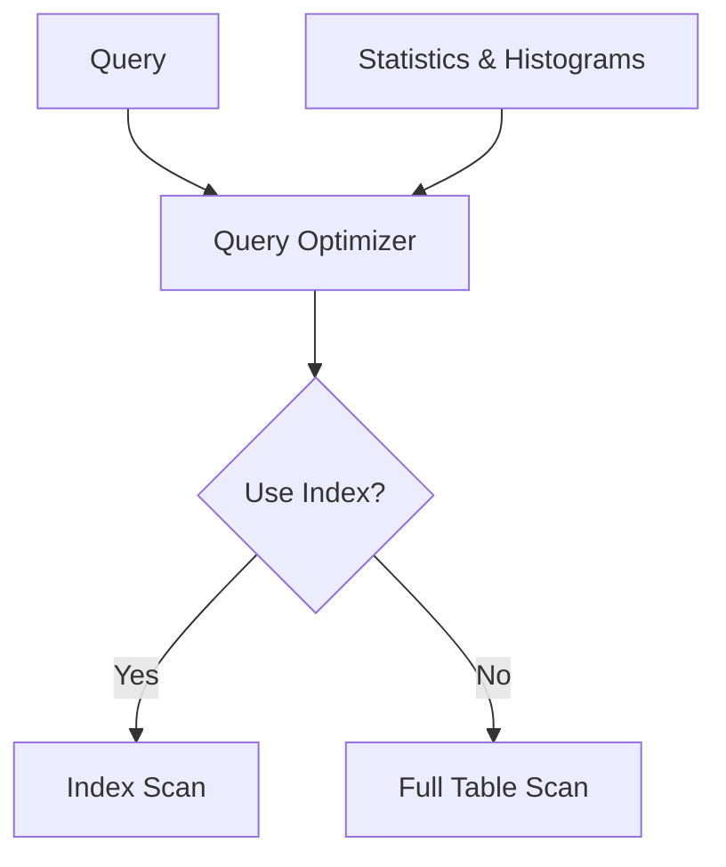

# Statistics and Histograms

## Introduction

When working with databases, especially as they grow in size, performance becomes a critical concern. Database management systems (DBMS) rely on statistics and histograms to make intelligent decisions about how to execute queries efficiently. This article explores how statistics and histograms work behind the scenes to help optimize query performance, particularly in the context of indexing.

## What Are Database Statistics?

Database statistics are metadata that describe the characteristics of data stored in database tables and indexes. These statistics help the query optimizer make informed decisions about the most efficient way to execute a query.

### Key Types of Statistics

- **Table statistics**: Information about tables, such as the total number of rows and pages
- **Column statistics**: Information about columns, such as the number of distinct values and data distribution
- **Index statistics**: Information about indexes, such as the depth of the index tree and the number of leaf pages

## Understanding Histograms

Histograms are a specialized form of statistics that represent the distribution of data values within columns. They divide data into "buckets" or "bins" and track how many values fall into each range.

### Why Histograms Matter

Consider a table with millions of customer records and a query filtering by state/province. If the data is evenly distributed across all states, each state might represent about 2% of the data. However, if 80% of your customers are from California, the query optimizer needs to know this to choose the right execution plan.



## How Statistics Drive Performance

Let's look at a practical example of how statistics influence query execution plans.

### Example: Understanding Query Decisions

Suppose we have a `customers` table with 1 million rows and an index on the `state` column. When a query requests customers from a particular state, the database uses statistics to decide whether to use the index:

```sql
-- The query
SELECT * FROM customers WHERE state = 'CA';
```

The database might reason as follows:

1. Statistics show there are 1,000,000 total rows
2. The histogram on the `state` column shows 'CA' represents approximately 400,000 rows (40%)
3. Reading 40% of a table through an index might be slower than a full table scan
4. Decision: Perform a full table scan instead of using the index

This might seem counterintuitive, but reading 40% of rows through random access (index lookup) can be more expensive than sequential reading of the entire table.

## Creating and Updating Statistics

Most database systems create and update statistics automatically, but understanding how to manage them manually is important.

### Example in PostgreSQL

```sql
-- Create statistics on a specific column
ANALYZE customers (state);

-- View statistics information
SELECT * FROM pg_stats WHERE tablename = 'customers' AND attname = 'state';
```

### Example in SQL Server

```sql
-- Create statistics on a specific column
CREATE STATISTICS state_stats ON customers (state);

-- Update statistics
UPDATE STATISTICS customers state_stats;

-- View histogram information
DBCC SHOW_STATISTICS ('customers', state_stats);
```

## Histogram Types

Different database systems implement various types of histograms:

### Equi-Width Histograms

Divides the data range into equal-width buckets. For example, ages 0-9, 10-19, 20-29, etc.

### Equi-Height Histograms

Creates buckets with approximately the same number of values, regardless of the range width.

### Top-N Histograms

Tracks exact frequencies for the most common values, and groups less common values.

## Practical Example: Query Performance Tuning

Let's look at a complete example where statistics make a difference:

```sql
-- Create a table with sample data
CREATE TABLE orders (
  order_id INT PRIMARY KEY,
  customer_id INT,
  order_date DATE,
  status VARCHAR(20),
  total_amount DECIMAL(10,2)
);

-- Create an index
CREATE INDEX idx_orders_status ON orders(status);

-- After loading millions of rows
-- Check execution plan before updating statistics
EXPLAIN SELECT * FROM orders WHERE status = 'shipped';

-- Update statistics
ANALYZE orders;

-- Check execution plan after updating statistics
EXPLAIN SELECT * FROM orders WHERE status = 'shipped';
```

The execution plans before and after updating statistics might differ significantly. If the `status` column has skewed data (e.g., 80% of orders are 'shipped'), the optimizer might choose different plans based on this information.

## When Statistics Become Outdated

Outdated statistics can lead to suboptimal query plans:

1. **Data changes significantly**: When the data distribution changes, but statistics haven't been updated
2. **Bulk operations**: After large data loads or deletions
3. **Schema changes**: After adding or modifying indexes

Most modern databases automatically update statistics, but understanding when manual updates are needed can help troubleshoot performance issues.

## Visualizing a Histogram

To understand how histograms represent data distribution, consider this visualization of customer ages:

```mermaid
bar
    title Distribution of Customer Ages
    axis left 0->10000 "Count of Customers"
    axis bottom 0->90 "Age"
    10-19 2000
    20-29 8000
    30-39 7500
    40-49 5000
    50-59 3000
    60-69 1500
    70-79 500
    80-89 100
```

This histogram shows that our database has more customers in their 20s and 30s than in other age groups. The query optimizer can use this information to estimate how many rows will match a query like `WHERE age BETWEEN 20 AND 29`.

## Real-World Implications

Understanding statistics and histograms helps you:

1. **Troubleshoot performance**: When a query suddenly becomes slow, outdated statistics could be the culprit
2. **Design better schemas**: Knowing how the optimizer uses statistics influences indexing decisions
3. **Optimize queries**: Writing queries that can take advantage of accurate statistics

## Common Problems and Solutions

### Problem: Statistics are outdated

**Solution**: Manually trigger statistics updates after major data changes:

```sql
-- PostgreSQL
ANALYZE table_name;

-- SQL Server
UPDATE STATISTICS table_name;

-- MySQL
ANALYZE TABLE table_name;
```

### Problem: Query optimizer makes wrong estimates

**Solution**: Create more detailed statistics or force a specific plan when necessary:

```sql
-- PostgreSQL: Create extended statistics
CREATE STATISTICS ext_stats ON customer_id, order_date FROM orders;

-- SQL Server: Create multi-column statistics
CREATE STATISTICS mult_stats ON orders (customer_id, order_date);
```

## Summary

Statistics and histograms are essential tools that database systems use to optimize query performance. They provide information about data distribution that helps the query optimizer choose the most efficient execution plans. Key takeaways include:

- Statistics provide metadata about tables, columns, and indexes
- Histograms represent the distribution of data values within columns
- The query optimizer uses statistics to estimate the cost of different execution plans
- Regular statistics updates are crucial for maintaining performance
- Understanding statistics can help you design better databases and troubleshoot performance issues

## Additional Resources and Exercises

### Exercises

1. Create a table with skewed data (e.g., 90% of values in one category) and observe how statistics influence the execution plan.
2. Experiment with forcing different execution plans and compare performance.
3. Write a query that benefits from multi-column statistics and observe the difference in performance.

### Advanced Topics to Explore

- Correlation statistics between multiple columns
- Filtered statistics for specific subsets of data
- Adaptive query processing techniques that adjust plans during execution