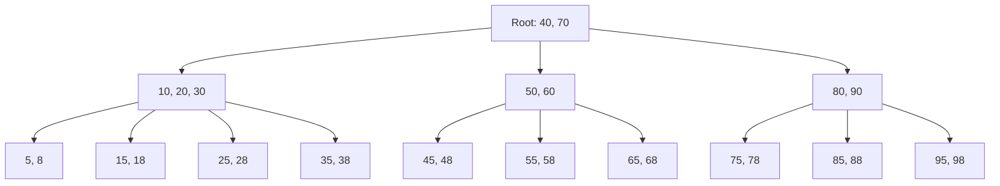

# B-tree Indexes

## Introduction

Database performance is critical for modern applications. As your data grows, operations like searching, inserting, and updating can become increasingly slow without proper optimization techniques. One of the most powerful and widely used techniques for improving database performance is indexing, and among various indexing methods, **B-tree indexes** stand out as the fundamental structure used by most modern database systems.

B-tree indexes (or B-tree data structures) were invented by Rudolf Bayer and Edward M. McCreight in 1972. The "B" might stand for "balanced," "broad," or "Bayer" (after one of its inventors), but regardless of its name, this structure has revolutionized database performance by dramatically speeding up data access operations.

In this guide, we'll explore what B-tree indexes are, how they work under the hood, when to use them, and their real-world applications. Whether you're optimizing your first database or simply curious about how databases maintain performance at scale, understanding B-tree indexes is essential knowledge.

## What is a B-tree?

A B-tree is a self-balancing tree data structure that maintains sorted data and allows for efficient searching, insertion, and deletion operations. Unlike binary trees where each node has at most two children, a B-tree node can have many children, making it much broader and shorter.

Key characteristics of B-trees:

- They maintain data in a sorted order
- They are balanced, meaning all leaf nodes are at the same depth
- They minimize disk I/O operations by storing multiple keys per node
- They grow from the root (not just the leaves) when necessary
- They guarantee logarithmic time complexity for search, insert, and delete operations

Let's visualize a simple B-tree structure:



## How B-tree Indexes Work

### B-tree Structure and Properties

A B-tree of order `m` (also called an m-way B-tree) has the following properties:

1. Every node has at most `m` children
2. Every non-leaf node (except the root) has at least `⌈m/2⌉` children
3. The root has at least 2 children (unless it's a leaf)
4. All leaf nodes appear at the same level
5. A non-leaf node with `k` children contains `k-1` keys

### Searching in a B-tree

Searching in a B-tree is similar to binary search but applied across multiple keys at each node:

```javascript
function search(node, key) {
  let i = 0;
  
  // Find the first key greater than or equal to target
  while (i < node.keys.length && key > node.keys[i]) {
    i++;
  }
  
  // If we found the key, return it
  if (i < node.keys.length && key === node.keys[i]) {
    return { node, index: i };
  }
  
  // If this is a leaf node and we didn't find the key, it doesn't exist
  if (node.isLeaf) {
    return null;
  }
  
  // Otherwise, continue searching in the appropriate child node
  return search(node.children[i], key);
}
```

Let's trace through an example of searching for the key `55` in our B-tree:

1. Start at the root node `[40, 70]`
2. `55` is greater than `40` but less than `70`, so we follow the middle child pointer to node `[50, 60]`
3. `55` is greater than `50` but less than `60`, so we follow the middle child pointer to leaf node `[55, 58]`
4. We find `55` in this node, so the search is successful

### Insertion in a B-tree

Insertion is more complex than searching since we need to maintain the B-tree properties:

1. Search for the key first (to find the leaf node where it should be inserted)
2. If the leaf node isn't full, simply insert the key in the correct position
3. If the leaf node is full, split it into two nodes and push the middle key up to its parent
4. If splitting causes the parent to overflow, repeat the splitting process up the tree
5. If the root splits, create a new root with the middle key and pointers to the two split halves

This splitting mechanism ensures the tree remains balanced and never grows too tall.

## Advantages of B-tree Indexes

1. **Efficient for Range Queries**: Unlike hash indexes, B-trees maintain sorted order, making them ideal for range queries like "find all records between X and Y."

2. **Balanced Structure**: The self-balancing nature ensures consistent performance regardless of the data distribution.

3. **Disk-Friendly**: B-trees are designed to minimize disk I/O by storing multiple keys per block.

4. **Versatile**: They support equality searches, range queries, and sorted data access.

5. **Scalability**: They perform well even with large datasets, maintaining logarithmic time complexity.

## When to Use B-tree Indexes

B-tree indexes are excellent for:

- Columns frequently used in WHERE clauses
- Columns used in JOIN conditions
- Columns used in ORDER BY or GROUP BY clauses
- High-cardinality columns (columns with many unique values)

However, they're less effective for:

- Columns that are rarely queried
- Tables that are very small
- Columns with low cardinality (few unique values)
- Columns that change frequently (due to the overhead of keeping the index updated)

## Real-world Database Implementation

Most relational database systems use variations of B-tree indexes:

- **MySQL**: Uses B+ trees (a variation of B-trees) for its InnoDB storage engine
- **PostgreSQL**: Implements B-tree indexes as its default index type
- **Oracle**: Uses B-tree indexes for most indexing needs
- **SQL Server**: Implements B-tree structures for its clustered and non-clustered indexes

Let's look at how you would create and use B-tree indexes in a real database:

```sql
-- Creating a B-tree index in PostgreSQL
CREATE INDEX idx_customers_last_name ON customers (last_name);

-- Creating a composite B-tree index (on multiple columns)
CREATE INDEX idx_orders_customer_date ON orders (customer_id, order_date);

-- Using the index in a query
SELECT * FROM customers 
WHERE last_name BETWEEN 'Smith' AND 'Taylor'
ORDER BY last_name;
```

The query above would efficiently use the B-tree index to find all customers with last names between Smith and Taylor, without needing to scan the entire table.

## B-tree Variations

Several variations of B-trees are used in modern systems:

1. **B+ Tree**: The most common variation used in databases and file systems. Unlike B-trees, B+ trees store all data in leaf nodes, with inner nodes only containing keys for navigation. This design allows for more efficient sequential access.

2. **B* Tree**: A variation that tries to keep nodes more filled by redistributing keys before splitting. Nodes split only when two sibling nodes are full.

3. **2-3 Tree**: A special case of B-tree where each internal node has either 2 or 3 children.

4. **2-3-4 Tree**: Another special case of B-tree where each internal node has between 2 and 4 children.

## Implementing a Simple B-tree

Here's a simplified implementation of a B-tree node in JavaScript to help illustrate the concept:

```javascript
class BTreeNode {
  constructor(isLeaf = false, order = 3) {
    this.isLeaf = isLeaf;
    this.keys = [];
    this.children = [];
    this.order = order; // Maximum number of children
  }
  
  // Check if node is full
  isFull() {
    return this.keys.length === this.order - 1;
  }
  
  // Insert a key into this node
  insertKey(key) {
    // Find position to insert key to maintain sorted order
    let i = this.keys.length - 1;
    
    while (i >= 0 && this.keys[i] > key) {
      i--;
    }
    
    // Insert at position i+1
    this.keys.splice(i + 1, 0, key);
  }
}

// Example usage
const node = new BTreeNode(true, 3); // Leaf node with order 3
node.insertKey(5);
node.insertKey(10);
console.log(node.keys); // Output: [5, 10]
node.insertKey(7);  
console.log(node.keys); // Output: [5, 7, 10]
console.log(node.isFull()); // Output: true
```

This is a simplified implementation for educational purposes. A complete B-tree implementation would also include methods for splitting nodes, merging nodes, and rebalancing the tree.

## Database Indexing Best Practices

When using B-tree indexes in your databases, consider these best practices:

1. **Index Selectively**: Don't over-index. Each index adds overhead to write operations.

2. **Consider Column Order**: For multi-column indexes, put the most selective column first.

3. **Monitor Index Usage**: Use database tools to track which indexes are being used and which aren't.

4. **Update Statistics**: Keep database statistics up to date so the query optimizer can effectively use your indexes.

5. **Consider Index-Only Scans**: Design indexes to include all columns needed by common queries to enable index-only scans.

6. **Understand Cardinality**: Indexing low-cardinality columns (like boolean fields) may not be helpful.

## Practical Example: Optimizing a Web Application

Let's consider a practical example of a web application with a users table and a posts table:

```sql
CREATE TABLE users (
  user_id SERIAL PRIMARY KEY,
  username VARCHAR(50) UNIQUE,
  email VARCHAR(100) UNIQUE,
  created_at TIMESTAMP
);

CREATE TABLE posts (
  post_id SERIAL PRIMARY KEY,
  user_id INTEGER REFERENCES users(user_id),
  title VARCHAR(200),
  content TEXT,
  published_at TIMESTAMP,
  status VARCHAR(20)
);
```

Initially, you might notice slow performance for these common operations:

1. Finding posts by a specific user
2. Finding recent posts
3. Finding posts with a specific status

To optimize these operations, you could add B-tree indexes:

```sql
-- For finding posts by user quickly
CREATE INDEX idx_posts_user_id ON posts(user_id);

-- For finding recent posts quickly
CREATE INDEX idx_posts_published_at ON posts(published_at DESC);

-- For finding posts by status quickly
CREATE INDEX idx_posts_status ON posts(status);

-- For queries that filter by both user and publication date
CREATE INDEX idx_posts_user_published ON posts(user_id, published_at DESC);
```

After adding these indexes, queries like the following would see significant performance improvements:

```sql
-- Find recent posts by a specific user
SELECT * FROM posts
WHERE user_id = 123
ORDER BY published_at DESC
LIMIT 10;

-- Find all published posts
SELECT * FROM posts
WHERE status = 'published'
ORDER BY published_at DESC;
```

## Summary

B-tree indexes are fundamental data structures that power most modern database systems. They provide efficient data access for a wide range of operations while maintaining good performance even as data grows. Key takeaways include:

- B-trees maintain keys in sorted order, making them ideal for range queries
- They're self-balancing, ensuring consistent performance
- They minimize disk I/O by storing multiple keys per node
- Most relational databases use B-tree variants as their primary indexing structure
- Proper indexing can dramatically improve query performance

Understanding B-tree indexes gives you the knowledge to optimize database performance and make informed decisions about when and how to use indexes in your applications.

## Exercises

1. Create a small database with a table containing at least 1000 records and experiment with adding B-tree indexes to see the performance difference.

2. Implement a simple B-tree data structure in your preferred programming language.

3. For an existing database application, analyze query performance and identify which columns would benefit from B-tree indexes.

4. Compare the performance of B-tree indexes with hash indexes for different types of queries.

5. Research how your favorite database system implements B-tree indexes and any specific optimizations it uses.

## Further Reading

- Database Internals: A Deep Dive into How Distributed Data Systems Work
- The Art of SQL: Database Performance and Tuning
- [Database System Concepts](https://www.db-book.com/)
- [PostgreSQL Documentation: Indexes](https://www.postgresql.org/docs/current/indexes.html)
- [MySQL Documentation: Optimization and Indexes](https://dev.mysql.com/doc/refman/8.0/en/optimization-indexes.html)