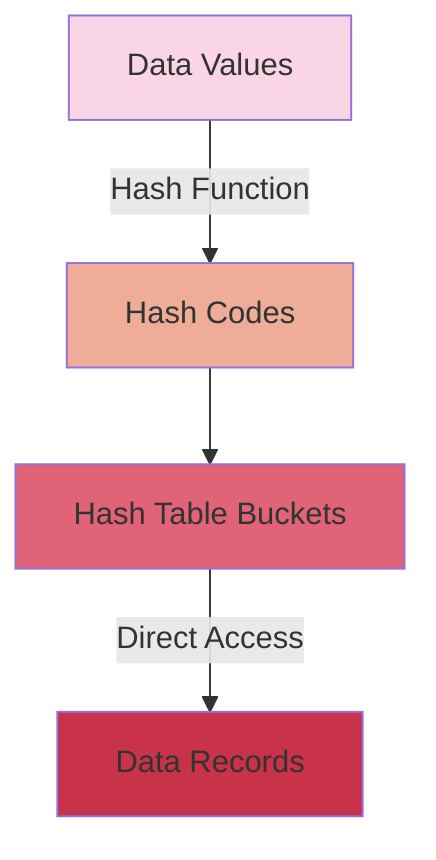
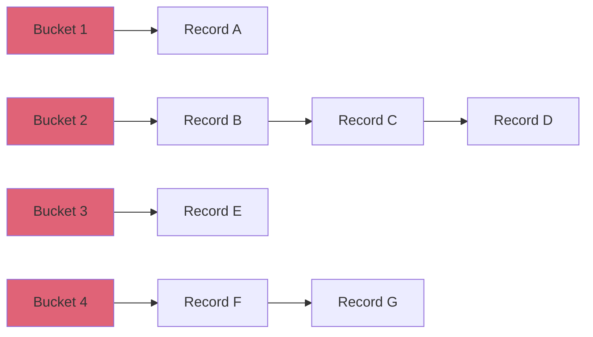

# Hash Indexes

## Introduction

When working with databases and large datasets, the speed at which you can retrieve information becomes crucial. Imagine having to search through a phonebook with millions of entries to find a single person - it would take a very long time! This is where indexes come in, and hash indexes are one of the most efficient types for certain operations.

A hash index is a data structure that uses a hash function to map keys to specific locations in a data structure, allowing for extremely fast lookups when you know exactly what you're searching for.

## How Hash Indexes Work

Hash indexes work based on the principle of a hash table, one of the most powerful data structures in computer science. Here's how they function:

1. When you create a hash index on a column, the database engine applies a hash function to each value in that column
2. The hash function converts the value into a hash code (a numeric value)
3. This hash code determines where the record's location is stored in the hash table
4. When you query for a specific value, the database applies the same hash function to your search value
5. It then goes directly to the corresponding bucket in the hash table
6. From there, it can immediately access the record(s) with that value

Let's visualize this with a diagram:



## Hash Function Properties

The effectiveness of a hash index depends on its hash function, which should have these key properties:

1. **Deterministic** - The same input always produces the same output
2. **Fast computation** - The function calculates quickly
3. **Uniform distribution** - Values spread evenly across the hash table to minimize collisions
4. **Collision handling** - When two different values hash to the same code, the system needs a way to resolve it

## Code Example: Simple Hash Index Implementation

Here's a simplified example of how you might implement a basic hash index in JavaScript:

```javascript
class HashIndex {
  constructor(size = 100) {
    this.buckets = new Array(size).fill(null).map(() => []);
    this.size = size;
  }

  // Simple hash function
  hash(key) {
    let hashCode = 0;
    for (let i = 0; i < key.length; i++) {
      hashCode += key.charCodeAt(i);
    }
    return hashCode % this.size;
  }

  // Add a key-recordId pair to the index
  add(key, recordId) {
    const bucketIndex = this.hash(key);
    const bucket = this.buckets[bucketIndex];
    
    // Check if key already exists
    for (let i = 0; i < bucket.length; i++) {
      if (bucket[i].key === key) {
        bucket[i].recordIds.push(recordId);
        return;
      }
    }
    
    // Add new entry
    bucket.push({ key, recordIds: [recordId] });
  }

  // Find recordIds for a given key
  find(key) {
    const bucketIndex = this.hash(key);
    const bucket = this.buckets[bucketIndex];
    
    for (let i = 0; i < bucket.length; i++) {
      if (bucket[i].key === key) {
        return bucket[i].recordIds;
      }
    }
    
    return [];
  }
}

// Usage example
const userIndex = new HashIndex();

// Add some user records
userIndex.add("john@example.com", 1001);
userIndex.add("sarah@example.com", 1002);
userIndex.add("john@example.com", 1003); // Another record with the same email

// Look up a user by email
console.log(userIndex.find("john@example.com")); // Output: [1001, 1003]
console.log(userIndex.find("unknown@example.com")); // Output: []
```

## When to Use Hash Indexes

Hash indexes excel in specific scenarios:

1. **Equality searches** - When you frequently search for exact matches (WHERE column = value)
2. **Primary key lookups** - For retrieving a specific row by its unique identifier
3. **Foreign key joins** - When joining tables based on exact key matches
4. **In-memory databases** - Hash indexes are especially effective for in-memory data

## When NOT to Use Hash Indexes

Hash indexes aren't suitable for all situations:

1. **Range queries** - Hash indexes can't efficiently handle queries like "WHERE age BETWEEN 20 AND 30"
2. **Sorting** - They don't maintain data in sorted order
3. **Partial matches** - Searches like "WHERE name LIKE 'Jo%'" won't benefit from hash indexes
4. **Multi-column queries** - They're less effective for complex queries across multiple columns

## Hash Indexes in Popular Databases

Different database systems implement hash indexes in various ways:

### MySQL/MariaDB

MySQL's Memory storage engine supports hash indexes:

```sql
CREATE TABLE users (
  id INT PRIMARY KEY,
  email VARCHAR(100),
  username VARCHAR(50),
  INDEX USING HASH (email)
) ENGINE=MEMORY;
```

### PostgreSQL

PostgreSQL supports hash indexes:

```sql
CREATE TABLE users (
  id SERIAL PRIMARY KEY,
  email VARCHAR(100),
  username VARCHAR(50)
);

CREATE INDEX idx_users_email ON users USING HASH (email);
```

### Redis

Redis is a key-value store that essentially functions as a giant hash index:

```
> HSET user:1001 email "john@example.com" username "john123"
> HSET user:1002 email "sarah@example.com" username "sarah456"
> HGET user:1001 email
"john@example.com"
```

## Real-World Applications

### User Authentication Systems

When users log in to a website, the system needs to quickly verify credentials. A hash index on the username or email field provides near-instant lookups:

```javascript
// Pseudocode for a login system
function login(email, password) {
  // Use hash index to quickly find the user
  const user = users.findByEmail(email); // O(1) operation with hash index
  
  if (!user) {
    return "User not found";
  }
  
  if (verifyPassword(password, user.passwordHash)) {
    return "Login successful";
  } else {
    return "Incorrect password";
  }
}
```

### Caching Systems

Modern web applications use caching to improve performance. Hash indexes are perfect for cache lookups:

```javascript
class SimpleCache {
  constructor() {
    this.hashIndex = new HashIndex(1000);
    this.data = [];
  }
  
  put(key, value) {
    const id = this.data.length;
    this.data.push(value);
    this.hashIndex.add(key, id);
  }
  
  get(key) {
    const ids = this.hashIndex.find(key);
    if (ids.length > 0) {
      return this.data[ids[0]]; // Return first match
    }
    return null;
  }
}

// Usage
const pageCache = new SimpleCache();
pageCache.put("/home", "<html>Home page content</html>");
pageCache.put("/about", "<html>About page content</html>");

// Fast lookup when user visits a page
console.log(pageCache.get("/home"));
```

### Session Storage

Web servers often need to track millions of active user sessions simultaneously:

```javascript
class SessionManager {
  constructor() {
    this.sessions = new HashIndex();
  }
  
  createSession(userId) {
    const sessionId = generateRandomId();
    const session = { 
      userId, 
      created: Date.now(), 
      data: {} 
    };
    
    this.sessions.add(sessionId, session);
    return sessionId;
  }
  
  getSession(sessionId) {
    const sessions = this.sessions.find(sessionId);
    return sessions[0] || null;
  }
}
```

## Performance Considerations

When working with hash indexes, keep these performance factors in mind:

1. **Load factor** - The ratio of stored entries to the hash table size affects performance
2. **Collision resolution** - More collisions lead to slower lookups
3. **Memory usage** - Hash indexes typically require more memory than B-tree indexes
4. **Hash function quality** - A poor hash function can lead to many collisions

## Hash Index Implementation Techniques

### Separate Chaining

This technique handles collisions by maintaining a linked list of entries that hash to the same bucket:



### Open Addressing

With open addressing, when a collision occurs, the algorithm looks for the next available slot in the hash table:

```javascript
class OpenAddressingHashIndex {
  constructor(size = 100) {
    this.entries = new Array(size).fill(null);
    this.size = size;
  }
  
  hash(key) {
    // Simple hash function
    let hashCode = 0;
    for (let i = 0; i < key.length; i++) {
      hashCode += key.charCodeAt(i);
    }
    return hashCode % this.size;
  }
  
  add(key, recordId) {
    let index = this.hash(key);
    
    // Find an empty slot or matching key
    while (this.entries[index] !== null && this.entries[index].key !== key) {
      index = (index + 1) % this.size; // Linear probing
    }
    
    // Add or update entry
    if (this.entries[index] === null) {
      this.entries[index] = { key, recordIds: [recordId] };
    } else {
      this.entries[index].recordIds.push(recordId);
    }
  }
  
  find(key) {
    let index = this.hash(key);
    
    while (this.entries[index] !== null) {
      if (this.entries[index].key === key) {
        return this.entries[index].recordIds;
      }
      index = (index + 1) % this.size;
    }
    
    return [];
  }
}
```

## Summary

Hash indexes are powerful database structures that provide lightning-fast lookups for equality-based searches. They work by using a hash function to map keys directly to storage locations, enabling O(1) (constant time) retrieval in the best case.

Key points to remember:

- Hash indexes excel at exact-match queries but aren't suitable for ranges or sorting
- They're commonly used in scenarios requiring fast lookups like caching, authentication, and session management
- Different databases implement hash indexes with varying features and syntax
- Performance depends on factors like the hash function quality, collision handling, and load factor

By understanding when and how to use hash indexes, you can significantly improve the performance of your database applications for specific types of operations.

## Exercises

1. Implement a hash index in your preferred programming language that handles collisions using separate chaining.
2. Compare the performance of a hash index versus a linear search for finding items in a large dataset.
3. Create a simple key-value database that uses a hash index for fast lookups.
4. Experiment with different hash functions and measure their collision rates on a sample dataset.
5. Implement a cache for a web application using hash indexes to store and retrieve cached content.

## Additional Resources

- **Data Structures and Algorithms** books that cover hash tables in depth
- Official documentation for your database system's hash index implementation
- Online computer science courses that explain indexing strategies
- Open-source database repositories to see real-world implementations