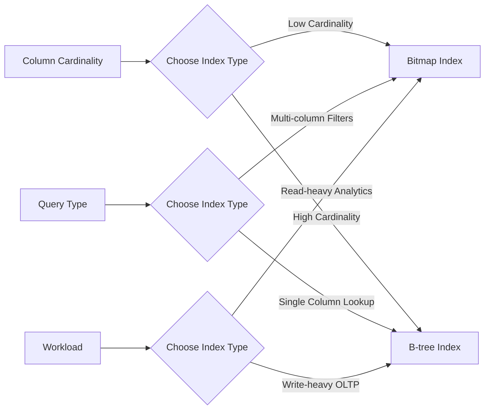

# Bitmap Indexes

## Introduction

Bitmap indexes are specialized database indexing structures that excel at speeding up queries involving multiple conditions, especially when working with low-cardinality columns (columns with few distinct values). Unlike traditional B-tree indexes that work well for high-cardinality data like unique IDs, bitmap indexes shine when handling columns with values like status types, categories, or boolean flags.

In this guide, we'll explore what bitmap indexes are, how they work, when to use them, and see practical examples of their implementation.

## What Are Bitmap Indexes?

A bitmap index uses a series of bit arrays (bitmaps) to represent the presence or absence of a specific value for each row in a database table. For each distinct value in an indexed column, the bitmap index creates a separate bit array where:

- A bit is set to `1` if the corresponding row contains that value
- A bit is set to `0` if the row doesn't contain that value

### Simple Example

Imagine we have a small table of products:

| ProductID | Category |
|-----------|----------|
| 1         | Electronics |
| 2         | Clothing |
| 3         | Electronics |
| 4         | Food |
| 5         | Clothing |

A bitmap index on the `Category` column would create three separate bitmaps:

**Electronics bitmap**: `1 0 1 0 0`  
**Clothing bitmap**: `0 1 0 0 1`  
**Food bitmap**: `0 0 0 1 0`  

Each position in these bitmaps corresponds to a row in our table (ProductID 1-5).

## How Bitmap Indexes Work

### Bitmap Operations

The power of bitmap indexes comes from how efficiently they can perform bitwise logical operations (AND, OR, NOT) to resolve complex queries. Modern CPUs can process these operations extremely quickly, often handling 64 bits at once.

For example, to find all products that are either Electronics OR Food:

```
Electronics bitmap: 1 0 1 0 0
Food bitmap:        0 0 0 1 0
OR result:          1 0 1 1 0
```

The result bitmap tells us that products 1, 3, and 4 match our criteria.

### Compression

Since most bitmaps contain many consecutive 0s or 1s, they can be efficiently compressed using techniques like:

- Run-length encoding (storing counts of consecutive 0s and 1s)
- Word-aligned hybrid compression
- Byte-aligned bitmap compression

This compression makes bitmap indexes very space-efficient despite initially appearing to require a lot of storage.

## When to Use Bitmap Indexes

Bitmap indexes are ideal in the following scenarios:

### ✅ Good Use Cases

- **Low-cardinality columns**: Columns with few distinct values (typically < 100)
- **Data warehousing**: Read-heavy analytical workloads
- **Complex multi-condition queries**: When you frequently combine multiple filters
- **Star schemas**: For dimension tables in data warehouses

### ❌ Poor Use Cases

- **High-cardinality columns**: Columns with many unique values (e.g., primary keys)
- **OLTP systems**: Write-heavy transactional workloads (bitmap indexes can be expensive to update)
- **Frequently updated tables**: Since updating a single row might require updating multiple bitmaps

## Implementing Bitmap Indexes

Different database systems implement bitmap indexes in varying ways. Let's look at examples in Oracle and PostgreSQL.

### Oracle Example

Oracle Database has native support for bitmap indexes:

```sql
-- Create a table
CREATE TABLE products (
  product_id NUMBER PRIMARY KEY,
  product_name VARCHAR2(100),
  category VARCHAR2(50),
  in_stock CHAR(1)
);

-- Create a bitmap index on the category column
CREATE BITMAP INDEX idx_category ON products(category);

-- Create a bitmap index on the in_stock column
CREATE BITMAP INDEX idx_stock ON products(in_stock);

-- Query using bitmap indexes
SELECT product_name 
FROM products 
WHERE category = 'Electronics' 
AND in_stock = 'Y';
```

Oracle's optimizer automatically uses bitmap indexes when appropriate and can perform bitmap operations between different indexes.

### PostgreSQL Example

PostgreSQL doesn't natively support bitmap indexes, but it can create bitmap scans on the fly from regular B-tree indexes:

```sql
-- Create a table
CREATE TABLE products (
  product_id SERIAL PRIMARY KEY,
  product_name TEXT,
  category TEXT,
  in_stock BOOLEAN
);

-- Create B-tree indexes that can be used for bitmap scans
CREATE INDEX idx_category ON products(category);
CREATE INDEX idx_stock ON products(in_stock);

-- Set a parameter to encourage bitmap scans
SET enable_bitmapscan = on;

-- Query that might use bitmap scan
SELECT product_name 
FROM products 
WHERE category = 'Electronics' 
AND in_stock = TRUE;
```

To verify PostgreSQL is using bitmap scans, you can use `EXPLAIN`:

```sql
EXPLAIN ANALYZE
SELECT product_name 
FROM products 
WHERE category = 'Electronics' 
AND in_stock = TRUE;
```

This might show output containing "Bitmap Heap Scan" and "Bitmap Index Scan" if the optimizer chose a bitmap-based execution plan.

## Performance Characteristics

### Visualizing Bitmap Index Performance

Below is a diagram showing when bitmap indexes outperform B-tree indexes:



### Space-Time Tradeoffs

Bitmap indexes make interesting space-time tradeoffs:

- **Space efficiency**: Compressed bitmaps are very compact for low-cardinality data
- **Query speed**: Bit operations are extremely fast, especially for complex conditions
- **Update cost**: Modifications can be expensive, requiring bitmap rebuilding

## Real-World Application

Let's examine a real-world example where bitmap indexes significantly improve performance.

### E-commerce Filtering System

Imagine an e-commerce platform with millions of products. Users can filter products by:
- Category (10 different categories)
- Price range (5 price brackets)
- Rating (5 star ratings)
- Availability (in stock or not)
- Special offers (on sale or not)

When a user applies multiple filters (e.g., "show me all Electronics that are in stock, have a 4+ rating, and are on sale"), bitmap indexes excel because:

1. Each filter condition can use a separate bitmap index
2. The database can quickly combine these bitmaps using bitwise operations
3. The final bitmap immediately identifies which product IDs match all criteria

**Sample implementation:**

```sql
-- Creating bitmap indexes on all filter columns
CREATE BITMAP INDEX idx_category ON products(category);
CREATE BITMAP INDEX idx_price_bracket ON products(price_bracket);
CREATE BITMAP INDEX idx_rating ON products(rating);
CREATE BITMAP INDEX idx_in_stock ON products(in_stock);
CREATE BITMAP INDEX idx_on_sale ON products(on_sale);

-- A complex filter query that benefits from bitmap indexes
SELECT product_id, product_name, price
FROM products
WHERE category = 'Electronics'
AND price_bracket = 3
AND rating >= 4
AND in_stock = 'Y'
AND on_sale = 'Y';
```

Without bitmap indexes, this query might require scanning the entire table or complex index intersections. With bitmap indexes, it becomes a series of fast bitmap operations that quickly identify matching rows.

## Bitmap Join Indexes

A special type of bitmap index called a "bitmap join index" can pre-join tables and index the results. This is particularly useful in star schemas where fact tables are joined with dimension tables.

```sql
-- Example of a bitmap join index in Oracle
CREATE BITMAP INDEX products_category_join_idx 
ON sales(p.category) 
FROM sales s, products p 
WHERE s.product_id = p.product_id;
```

This creates a bitmap index on the sales table based on the category in the products table, accelerating queries that join these tables and filter by category.

## Common Pitfalls and Optimization Tips

### Pitfalls to Avoid

1. **Indexing high-cardinality columns**: This creates too many bitmaps, wasting space
2. **Overindexing**: Creating bitmap indexes on too many columns can slow down writes
3. **Using in OLTP systems**: Frequent updates will degrade performance

### Optimization Tips

1. **Combine with other index types**: Use B-tree indexes for high-cardinality columns
2. **Consider materialized views**: For very common query patterns
3. **Monitor index usage**: Drop unused bitmap indexes that slow down updates
4. **Use for read-only or append-only tables**: Ideal for data warehouses

## Summary

Bitmap indexes are powerful database structures that excel at handling complex queries on low-cardinality columns. They work by creating compressed bit arrays that can be rapidly combined using bitwise operations.

Key takeaways:
- Best for columns with few distinct values
- Excel at complex multi-condition queries
- Ideal for read-heavy analytical workloads
- Less suitable for frequently updated data or high-cardinality columns

By understanding when and how to use bitmap indexes, you can significantly improve query performance in your database applications, especially in data warehousing and analytical scenarios.

## Additional Resources

- [Oracle Documentation on Bitmap Indexes](https://docs.oracle.com/en/database/oracle/oracle-database/19/admin/managing-indexes.html)
- [PostgreSQL Index Types](https://www.postgresql.org/docs/current/indexes-types.html)
- [Database Indexing Strategies](https://use-the-index-luke.com/)

## Exercises

1. Create a small database table with at least one low-cardinality column and experiment with creating a bitmap index on it.
2. Compare the performance of queries with and without bitmap indexes using EXPLAIN.
3. Design a database schema for an application where bitmap indexes would provide significant performance benefits.
4. Implement a bitmap index in your database of choice and measure the performance improvement for multi-condition queries.