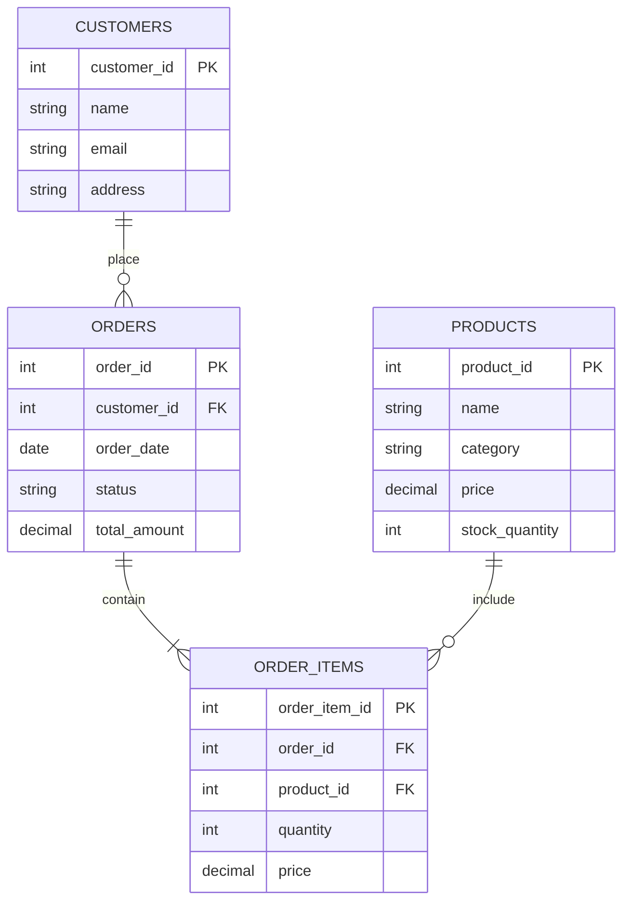

# Index Selection

## Introduction

Database indexes are powerful tools that can dramatically improve the performance of your applications by accelerating data retrieval operations. However, creating indexes isn't simply a matter of "the more, the better." Choosing the right indexes for your database requires careful analysis and understanding of your application's query patterns, data distribution, and performance requirements.

In this guide, we'll explore how to select the most effective indexes for your database, the considerations that should influence your decisions, and practical techniques to implement an optimal indexing strategy.

## Understanding the Importance of Index Selection

Imagine you're looking for a specific topic in a textbook. Without an index, you'd need to scan every page until you found the information you needed. With a well-organized index, you can quickly locate the exact pages relevant to your search.

Database indexes work similarly, but selecting the wrong ones can lead to:

- Wasted storage space
- Slower write operations
- Minimal performance improvements
- Additional maintenance overhead

Let's explore how to choose indexes that provide maximum benefit with minimum drawbacks.

## Key Considerations for Index Selection

### 1. Query Patterns

The most important factor in index selection is understanding how your database is being queried.

```sql
-- Frequent query pattern
SELECT customer_name, order_date, total_amount 
FROM orders 
WHERE customer_id = 1042 
ORDER BY order_date DESC;
```

For this query pattern, an index on `customer_id` would be beneficial. If sorting by `order_date` is also frequent, a composite index on `(customer_id, order_date)` might be even better.

### 2. Cardinality

Cardinality refers to the number of unique values in a column. Columns with high cardinality (many unique values) are generally better candidates for indexing than those with low cardinality.

For example:

- **High cardinality**: `user_id`, `email_address`, `transaction_id`
- **Medium cardinality**: `zip_code`, `product_category`
- **Low cardinality**: `gender`, `status` (active/inactive), `is_verified` (true/false)

Indexing on a column like `gender` might not improve performance significantly since the index would only divide the data into two large groups.

### 3. Selectivity

Selectivity is the ratio of unique values to the total number of rows. Higher selectivity (closer to 1) makes for better index candidates.

Consider a table with 1 million rows:
- A column with 900,000 unique values has 0.9 selectivity (excellent for indexing)
- A column with 5 unique values has 0.000005 selectivity (poor for indexing)

### 4. Data Distribution

Even with high cardinality, if the data distribution is highly skewed, an index might not be equally effective for all queries.

For example, in an e-commerce database where 90% of orders come from 5% of customers, an index on `customer_id` might be less effective for queries targeting those high-volume customers.

## Types of Indexes to Consider

### Single-Column Indexes

The simplest form of index applies to just one column:

```sql
CREATE INDEX idx_customers_email ON customers(email);
```

These work well for queries that filter, join, or sort by that specific column.

### Composite (Multi-Column) Indexes

These indexes include two or more columns:

```sql
CREATE INDEX idx_orders_customer_date ON orders(customer_id, order_date);
```

Key points about composite indexes:

- The order of columns matters significantly
- They support queries that filter by:
  - The first column alone
  - The first and second columns
  - The first, second, and third columns, etc.
- They generally don't help queries that only filter by secondary columns in the index

### Covering Indexes

A covering index includes all columns referenced in a query, allowing the database to retrieve data directly from the index without accessing the table.

```sql
-- Query
SELECT product_id, price FROM products WHERE category_id = 5;

-- Covering index
CREATE INDEX idx_products_category_covering ON products(category_id, product_id, price);
```

### Functional Indexes

These index the result of a function or expression rather than the column value itself:

```sql
-- Index on lowercase version of email
CREATE INDEX idx_users_email_lower ON users(LOWER(email));

-- Now this query can use the index
SELECT * FROM users WHERE LOWER(email) = 'example@domain.com';
```

## Practical Index Selection Process

Let's walk through a systematic approach to selecting indexes:

### Step 1: Identify Your Most Important Queries

Begin by listing the queries that:
- Run most frequently
- Take the longest time to execute
- Are mission-critical to your application

### Step 2: Analyze Query Execution Plans

Most database systems provide tools to view execution plans, which show how the database accesses data:

```sql
-- PostgreSQL
EXPLAIN ANALYZE SELECT * FROM orders WHERE customer_id = 1042;

-- MySQL
EXPLAIN SELECT * FROM orders WHERE customer_id = 1042;

-- SQL Server
SET STATISTICS IO, TIME ON;
SELECT * FROM orders WHERE customer_id = 1042;
```

Look for operations like "Table Scan" or "Full Table Scan," which indicate the database is reading all rows.

### Step 3: Apply the Column Selection Criteria

For each potential index column, evaluate:
- Cardinality
- Selectivity
- Data distribution
- Query frequency
- Write impact

### Step 4: Create a Few Key Indexes and Test

Start with the most promising indexes:

```sql
-- Create an index
CREATE INDEX idx_orders_customer ON orders(customer_id);

-- Test its impact
EXPLAIN ANALYZE SELECT * FROM orders WHERE customer_id = 1042;
```

### Step 5: Measure and Iterate

Monitor performance metrics before and after adding each index:
- Query execution time
- I/O operations
- Memory usage
- CPU utilization

Add, modify, or remove indexes based on your findings.

## Common Indexing Anti-Patterns

### 1. Over-Indexing

Creating too many indexes causes:
- Slower write operations
- Increased storage requirements
- More complex maintenance

### 2. Indexing Low-Cardinality Columns Alone

For columns with few unique values, consider:
- Using them as secondary columns in composite indexes
- Using filtered indexes (where supported)
- Avoiding indexing them entirely

### 3. Duplicate or Redundant Indexes

Avoid creating indexes that cover the same query patterns:

```sql
-- Redundant indexes
CREATE INDEX idx_customers_name ON customers(name);
CREATE INDEX idx_customers_name_email ON customers(name, email);
```

The first index becomes redundant since the composite index can handle queries filtering by `name` alone.

### 4. Ignoring Write Impact

Every index speeds up reads but slows down writes. For write-heavy tables, be especially selective with indexes.

## Real-World Example: E-commerce Database

Let's apply these principles to a simplified e-commerce database:



### Common Queries and Suggested Indexes

**Query 1:** Find orders for a specific customer
```sql
SELECT * FROM orders WHERE customer_id = 123 ORDER BY order_date DESC;
```
**Index:** `CREATE INDEX idx_orders_customer_date ON orders(customer_id, order_date);`

**Query 2:** Check if an email is already registered
```sql
SELECT customer_id FROM customers WHERE email = 'user@example.com';
```
**Index:** `CREATE UNIQUE INDEX idx_customers_email ON customers(email);`

**Query 3:** Find items in a specific order
```sql
SELECT oi.*, p.name FROM order_items oi 
JOIN products p ON oi.product_id = p.product_id
WHERE oi.order_id = 1042;
```
**Indexes:**
```sql
CREATE INDEX idx_order_items_order ON order_items(order_id);
CREATE INDEX idx_order_items_product ON order_items(product_id);
```

**Query 4:** Find popular products
```sql
SELECT p.product_id, p.name, SUM(oi.quantity) as total_sold
FROM products p
JOIN order_items oi ON p.product_id = oi.product_id
GROUP BY p.product_id, p.name
ORDER BY total_sold DESC
LIMIT 10;
```
**Index:** `CREATE INDEX idx_order_items_product_qty ON order_items(product_id, quantity);`

## Tools for Index Analysis

Most database systems offer tools to help identify missing indexes:

### PostgreSQL
```sql
SELECT * FROM pg_stat_user_indexes;
```

### MySQL
```sql
SHOW INDEX FROM your_table;
```

### SQL Server
```sql
SELECT * FROM sys.dm_db_missing_index_details;
```

## When to Reconsider Your Indexes

Review your indexing strategy when:
- Query patterns change significantly
- Data volume grows substantially
- Table schema changes
- Database performance degrades
- After major application updates

## Summary

Effective index selection is a critical skill for optimizing database performance. By understanding your query patterns, analyzing column characteristics, and following a systematic approach to index creation, you can significantly improve your application's speed while minimizing overhead.

Remember these key principles:
- Index based on actual query patterns
- Consider column cardinality and selectivity
- Be mindful of write operations
- Test and measure the impact of each index
- Regularly review and refine your indexing strategy

## Additional Resources and Exercises

### Resources
- Your database's documentation on indexing
- Execution plan analysis guides for your specific database
- Database-specific performance tuning guides

### Exercises

1. **Analyze Your Queries**: Take 5 of your most frequent queries and analyze their execution plans before and after creating appropriate indexes.

2. **Identify Redundant Indexes**: Check your database for duplicate or overlapping indexes that could be consolidated.

3. **Test Composite Indexes**: Create a composite index and test how it performs for queries that:
   - Filter by only the first column
   - Filter by both columns
   - Filter by only the second column

4. **Practice Index Selection**: For these scenarios, decide what indexes you would create:
   - A table of users where authentication happens by email/password
   - A table of transactions queried by date ranges
   - A product catalog searched by category and price range
   - A log table with timestamps that's frequently queried for recent events

By mastering index selection, you'll be able to make informed decisions that balance query performance with maintenance overhead, resulting in faster, more efficient applications.