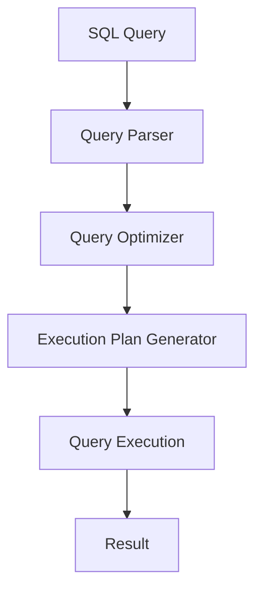

# Query Optimization

## Introduction

Query optimization is the process of improving the efficiency and speed of database queries. In web and application development, database operations often become bottlenecks that slow down the entire system. A well-optimized query can execute in milliseconds, while a poorly written one might take several seconds or even minutes.

In this guide, we'll explore the fundamentals of query optimization, learn common techniques to improve query performance, and walk through practical examples that demonstrate these concepts in action.

## Why Query Optimization Matters

Before diving into optimization techniques, let's understand why query optimization is crucial:

- **Better User Experience**: Faster queries mean faster application response times
- **Server Resource Efficiency**: Optimized queries consume less CPU, memory, and I/O resources
- **Scalability**: Well-optimized queries help your application handle more concurrent users
- **Cost Savings**: In cloud environments, better performance often translates to lower costs

Let's see a simple example of how query optimization can make a difference:

```sql
-- Unoptimized query (might take seconds)
SELECT * FROM users 
WHERE last_login_date > '2023-01-01';

-- Optimized query (milliseconds)
SELECT user_id, username, email 
FROM users 
WHERE last_login_date > '2023-01-01'
AND last_login_date < '2023-02-01';
```

## Understanding Database Query Execution

To optimize queries effectively, you need to understand how databases execute queries. Here's a simplified view of what happens when you run a query:



The database's query optimizer analyzes your query and determines the most efficient execution plan. However, it can only work with what you give it. Writing better queries helps the optimizer do its job more effectively.

## Common Query Optimization Techniques

### 1. Use Specific Column Selection

Instead of selecting all columns with `SELECT *`, specify only the columns you need.

```sql
-- Before optimization
SELECT * FROM products WHERE category = 'electronics';

-- After optimization
SELECT product_id, name, price FROM products WHERE category = 'electronics';
```

**Why it helps**: Reduces the amount of data transferred and processed.

### 2. Create and Use Indexes

Indexes are special data structures that improve the speed of data retrieval operations.

```sql
-- Creating an index
CREATE INDEX idx_category ON products(category);

-- Query that will use this index
SELECT product_id, name FROM products WHERE category = 'electronics';
```

**How to check if your index is being used:**

```sql
-- In MySQL/MariaDB
EXPLAIN SELECT product_id, name FROM products WHERE category = 'electronics';

-- In PostgreSQL
EXPLAIN ANALYZE SELECT product_id, name FROM products WHERE category = 'electronics';
```

The output will show whether an index scan is being used instead of a full table scan.

### 3. Limit Result Sets

If you only need a certain number of results, use `LIMIT` to restrict the result set.

```sql
-- Before
SELECT product_id, name FROM products ORDER BY price DESC;

-- After
SELECT product_id, name FROM products ORDER BY price DESC LIMIT 10;
```

**Why it helps**: Reduces processing time and memory usage, especially for large tables.

### 4. Optimize JOIN Operations

Join operations can be expensive. Make sure you're joining tables efficiently:

```sql
-- Inefficient join (Cartesian product first, then filter)
SELECT o.order_id, c.customer_name 
FROM orders o, customers c
WHERE o.customer_id = c.customer_id;

-- Efficient join (explicit JOIN with condition)
SELECT o.order_id, c.customer_name 
FROM orders o
INNER JOIN customers c ON o.customer_id = c.customer_id;
```

**Best practices for JOINs:**
- Join on indexed columns
- Use the appropriate join type (INNER, LEFT, RIGHT)
- Join the smallest possible tables first

### 5. Use WHERE Clauses Effectively

The `WHERE` clause helps filter data before processing. Here are some tips:

```sql
-- Inefficient: Function on column prevents index usage
SELECT * FROM users WHERE YEAR(registration_date) = 2023;

-- Better: Let the column remain unmodified
SELECT * FROM users WHERE registration_date >= '2023-01-01' AND registration_date < '2024-01-01';
```

**Key principles:**
- Avoid functions on indexed columns in WHERE clauses
- Use exact matches when possible
- Put the most selective conditions first

### 6. Avoid Subqueries When Possible

Subqueries can often be rewritten as JOINs for better performance:

```sql
-- Subquery (can be slower)
SELECT product_name 
FROM products 
WHERE category_id IN (SELECT category_id FROM categories WHERE category_name = 'Electronics');

-- JOIN (often faster)
SELECT p.product_name 
FROM products p
JOIN categories c ON p.category_id = c.category_id
WHERE c.category_name = 'Electronics';
```

## Real-World Example: E-commerce Product Search

Let's optimize a typical e-commerce product search query step by step:

**Initial query (slow):**

```sql
SELECT * 
FROM products 
WHERE product_name LIKE '%laptop%' 
OR description LIKE '%laptop%'
ORDER BY price;
```

**Issues with this query:**
1. `SELECT *` retrieves all columns
2. `LIKE '%laptop%'` prevents index usage
3. Multiple `OR` conditions with wildcards are expensive

**Optimized query:**

```sql
-- First, create a full-text search index
CREATE FULLTEXT INDEX idx_product_search ON products(product_name, description);

-- Then use proper full-text search
SELECT product_id, product_name, price, stock_quantity
FROM products
WHERE MATCH(product_name, description) AGAINST('laptop' IN BOOLEAN MODE)
ORDER BY price
LIMIT 50;
```

**Performance difference:**
- Original query: might take seconds for a table with thousands of products
- Optimized query: typically executes in milliseconds

## Measuring Query Performance

You can measure query performance using database-specific tools:

```sql
-- MySQL/MariaDB
SET profiling = 1;
-- Run your query
SELECT product_id, product_name FROM products WHERE category = 'electronics';
-- Check performance
SHOW PROFILES;

-- PostgreSQL
EXPLAIN ANALYZE SELECT product_id, product_name FROM products WHERE category = 'electronics';
```

## Common Pitfalls to Avoid

1. **N+1 Query Problem**: Making a database query for each item in a result set
2. **Over-indexing**: Too many indexes can slow down write operations
3. **String operations in WHERE clauses**: Avoid functions like UPPER(), LOWER() on indexed columns
4. **SELECT * in production code**: Always specify only the columns you need
5. **Not using prepared statements**: Prepared statements can be cached and reused

## Advanced Optimization Techniques

As you progress, consider these advanced techniques:

### 1. Query Caching

Store frequently accessed query results in memory:

```javascript
// Example using Node.js with Redis for caching
async function getProductsByCategory(category) {
  const cacheKey = `products:${category}`;
  
  // Check cache first
  const cachedResult = await redisClient.get(cacheKey);
  if (cachedResult) {
    return JSON.parse(cachedResult);
  }
  
  // If not in cache, query database
  const products = await db.query(
    "SELECT product_id, name, price FROM products WHERE category = ?", 
    [category]
  );
  
  // Store in cache for 10 minutes
  await redisClient.set(cacheKey, JSON.stringify(products), 'EX', 600);
  
  return products;
}
```

### 2. Database Denormalization

Sometimes, denormalizing your database (adding redundant data) can improve read performance:

```sql
-- Original normalized tables
SELECT p.product_name, c.category_name
FROM products p
JOIN categories c ON p.category_id = c.category_id;

-- After denormalization (adding category_name to products table)
SELECT product_name, category_name FROM products;
```

### 3. Using Database-Specific Features

Different databases offer unique optimization features:

- **PostgreSQL**: Partial indexes, expression indexes
- **MySQL**: Generated columns with indexes
- **MongoDB**: Compound indexes, covered queries

## Summary

Query optimization is both an art and a science. The key principles to remember are:

1. Select only the data you need
2. Create appropriate indexes
3. Use efficient filtering in WHERE clauses
4. Be mindful of JOIN operations
5. Measure performance and iterate

By applying these techniques, you can dramatically improve your application's performance and scalability.

## Exercises

1. Take a slow query from your project and optimize it using the techniques described in this guide.
2. Create appropriate indexes for a table with at least 1000 records and measure the performance difference.
3. Rewrite a query using `SELECT *` to only select the necessary columns and observe the performance impact.
4. Find a query using subqueries in your codebase and try rewriting it using JOINs.

## Further Resources

- Your database's documentation (MySQL, PostgreSQL, etc.)
- Database-specific query optimization guides
- Books on SQL performance tuning
- Online courses focusing on database performance

Remember that query optimization is an ongoing process. As your data grows, you'll need to revisit and refine your optimization strategies.