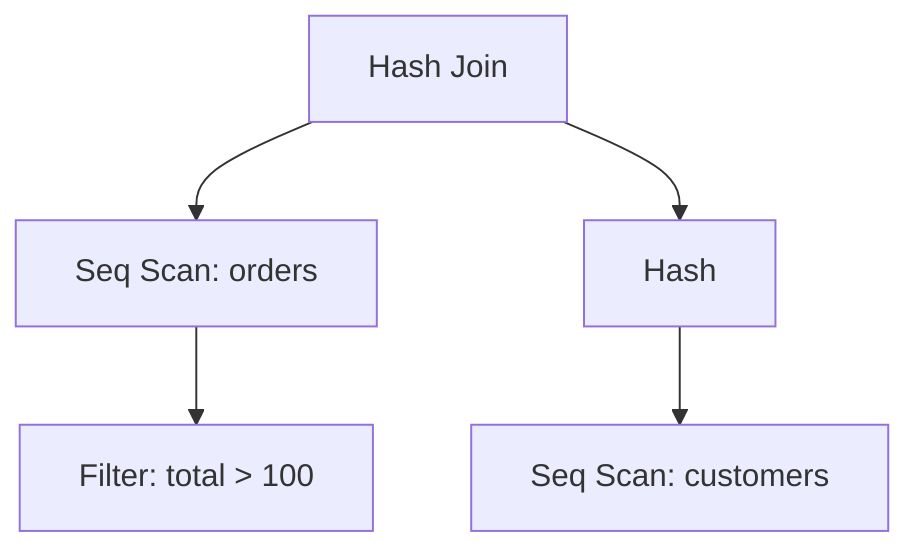

# Execution Plans

## Introduction

When you run a SQL query on a database, the database engine doesn't just immediately start fetching data. Instead, it first creates a roadmap for how to retrieve the data most efficiently. This roadmap is called an **execution plan**.

Think of an execution plan as the GPS navigation system for your database query. Just as a GPS might suggest different routes depending on traffic conditions, the database optimizer creates an execution plan that represents what it believes is the most efficient way to execute your query.

Understanding execution plans is crucial for writing performant database queries and troubleshooting slow operations. In this article, we'll explore what execution plans are, how to read them, and how to use them to optimize your database queries.

## What is an Execution Plan?

An execution plan (or query plan) is a sequence of steps that the database engine follows to retrieve or modify data. The database query optimizer generates this plan by:

1. Parsing the SQL query
2. Analyzing available indexes
3. Considering table statistics (size, data distribution)
4. Evaluating different access methods
5. Choosing what it calculates to be the optimal plan

Execution plans show you exactly how the database will execute your query - whether it will use indexes, perform table scans, the order of operations, and how tables will be joined.

## Types of Execution Plans

Most database systems offer two main types of execution plans:

### Estimated Execution Plan
- Generated without actually running the query
- Based on statistics and estimates
- Useful for quickly testing query performance without affecting the database

### Actual Execution Plan
- Generated by actually executing the query
- Contains runtime metrics like actual row counts
- More accurate but requires running the query

## How to View Execution Plans

Different database systems have different methods to view execution plans. Here are examples for some popular databases:

### SQL Server

```sql
-- Estimated execution plan
EXPLAIN SELECT * FROM customers WHERE customer_id = 123;

-- Actual execution plan
SET STATISTICS PROFILE ON;
SELECT * FROM customers WHERE customer_id = 123;
SET STATISTICS PROFILE OFF;

-- Or using Management Studio, press Ctrl+M before running your query
```

### MySQL

```sql
EXPLAIN SELECT * FROM customers WHERE customer_id = 123;

-- For more detailed information
EXPLAIN ANALYZE SELECT * FROM customers WHERE customer_id = 123;
```

### PostgreSQL

```sql
EXPLAIN SELECT * FROM customers WHERE customer_id = 123;

-- With execution statistics
EXPLAIN ANALYZE SELECT * FROM customers WHERE customer_id = 123;
```

### Oracle

```sql
EXPLAIN PLAN FOR SELECT * FROM customers WHERE customer_id = 123;
SELECT * FROM TABLE(DBMS_XPLAN.DISPLAY);
```

## Reading an Execution Plan

Let's look at a sample execution plan from PostgreSQL:

```
EXPLAIN ANALYZE SELECT customers.name, orders.order_date 
FROM customers JOIN orders ON customers.id = orders.customer_id
WHERE orders.total > 100;
```

Example output:

```
Hash Join  (cost=33.38..62.84 rows=485 width=40) (actual time=0.362..0.364 rows=15 loops=1)
  Hash Cond: (orders.customer_id = customers.id)
  ->  Seq Scan on orders  (cost=0.00..25.70 rows=485 width=16) (actual time=0.025..0.026 rows=15 loops=1)
        Filter: (total > 100)
        Rows Removed by Filter: 5
  ->  Hash  (cost=21.30..21.30 rows=961 width=36) (actual time=0.249..0.249 rows=20 loops=1)
        Buckets: 1024  Batches: 1  Memory Usage: 9kB
        ->  Seq Scan on customers  (cost=0.00..21.30 rows=961 width=36) (actual time=0.011..0.012 rows=20 loops=1)
```

Let's break down this execution plan:

1. **Reading Direction**: Execution plans are read from the innermost (most indented) operations to the outermost operations, and from bottom to top.

2. **Common Operations**:
   - **Seq Scan**: A sequential scan reads every row in a table (similar to a full table scan).
   - **Index Scan**: Uses an index to find specific rows.
   - **Hash Join**: Creates a hash table from one dataset and probes it with another dataset.
   - **Nested Loop**: For each row in the outer table, scans the inner table for matches.
   - **Sort**: Sorts data, often for ORDER BY or GROUP BY operations.

3. **Cost Metrics**:
   - **cost**: Estimated computational effort (not in time units)
   - **rows**: Estimated number of rows
   - **actual time**: Actual execution time in milliseconds
   - **actual rows**: Actual number of rows processed

In our example, the database:
1. Performs a sequential scan on the customers table (bottom operation)
2. Creates a hash table from the customers data
3. Performs a sequential scan on the orders table, filtering for orders with total > 100
4. Performs a hash join, matching customer_id in orders with id in customers

## Visualizing Execution Plans

Execution plans can be visualized as trees, making them easier to understand:



## Common Issues Identified by Execution Plans

Execution plans can help you identify several common performance issues:

### 1. Table Scans Instead of Index Scans

**Problem**: When you see a "Seq Scan" (sequential scan) on a large table, it means the database is reading every row instead of using an index.

**Example**:
```sql
-- Query
SELECT * FROM customers WHERE last_name = 'Smith';

-- Execution plan showing a problem
Seq Scan on customers  (cost=0.00..155.00 rows=15 width=540)
  Filter: (last_name = 'Smith'::text)
```

**Solution**: Create an index on the column being filtered:

```sql
CREATE INDEX idx_customers_last_name ON customers(last_name);
```

After creating the index, the execution plan might change to:

```
Index Scan using idx_customers_last_name on customers  (cost=0.29..8.31 rows=15 width=540)
  Index Cond: (last_name = 'Smith'::text)
```

### 2. Inefficient Joins

**Problem**: Nested loop joins on large tables can be expensive.

**Example**:
```sql
-- Query
SELECT c.name, o.order_date FROM customers c, orders o 
WHERE c.id = o.customer_id;

-- Problematic execution plan
Nested Loop  (cost=0.00..20433.00 rows=10000 width=16)
  ->  Seq Scan on customers c  (cost=0.00..155.00 rows=10000 width=8)
  ->  Filter: (customer_id = c.id)
      ->  Seq Scan on orders o  (cost=0.00..155.00 rows=1 width=12)
```

**Solution**: Ensure both join columns are indexed and use explicit join syntax:

```sql
CREATE INDEX idx_orders_customer_id ON orders(customer_id);

-- Improved query
SELECT c.name, o.order_date 
FROM customers c JOIN orders o ON c.id = o.customer_id;
```

### 3. Unnecessary Sorting

**Problem**: Sorting large datasets is expensive.

**Example**:
```sql
-- Query
SELECT * FROM orders ORDER BY order_date;

-- Execution plan showing expensive sort
Sort  (cost=358.13..383.13 rows=10000 width=50)
  Sort Key: order_date
  ->  Seq Scan on orders  (cost=0.00..115.00 rows=10000 width=50)
```

**Solution**: Create an index on the sorting column:

```sql
CREATE INDEX idx_orders_order_date ON orders(order_date);
```

The new execution plan might be:

```
Index Scan using idx_orders_order_date on orders  (cost=0.29..283.29 rows=10000 width=50)
```

## Optimizing Based on Execution Plans

Let's go through a real-world example of optimizing a query using execution plans:

### Original Query

```sql
SELECT p.product_name, c.category_name, SUM(od.quantity) as total_sold
FROM products p
JOIN order_details od ON p.product_id = od.product_id
JOIN categories c ON p.category_id = c.category_id
WHERE od.order_date > '2023-01-01'
GROUP BY p.product_name, c.category_name
ORDER BY total_sold DESC;
```

### Original Execution Plan

```
Sort  (cost=15432.34..15482.34 rows=20000 width=68) (actual time=354.182..354.192 rows=537 loops=1)
  Sort Key: (sum(od.quantity)) DESC
  ->  HashAggregate  (cost=14782.61..14982.61 rows=20000 width=68) (actual time=353.856..354.023 rows=537 loops=1)
        Group Key: p.product_name, c.category_name
        ->  Hash Join  (cost=1465.12..12782.61 rows=200000 width=36) (actual time=15.107..351.290 rows=6819 loops=1)
              Hash Cond: (od.product_id = p.product_id)
              ->  Seq Scan on order_details od  (cost=0.00..8541.32 rows=200000 width=12) (actual time=0.018..337.566 rows=6819 loops=1)
                    Filter: (order_date > '2023-01-01'::date)
                    Rows Removed by Filter: 193181
              ->  Hash  (cost=958.87..958.87 rows=40499 width=40) (actual time=15.065..15.066 rows=1000 loops=1)
                    Buckets: 65536  Batches: 1  Memory Usage: 4MB
                    ->  Hash Join  (cost=26.82..958.87 rows=40499 width=40) (actual time=0.161..14.224 rows=1000 loops=1)
                          Hash Cond: (p.category_id = c.category_id)
                          ->  Seq Scan on products p  (cost=0.00..722.99 rows=40499 width=20) (actual time=0.009..13.048 rows=1000 loops=1)
                          ->  Hash  (cost=15.30..15.30 rows=919 width=36) (actual time=0.130..0.130 rows=10 loops=1)
                                Buckets: 1024  Batches: 1  Memory Usage: 9kB
                                ->  Seq Scan on categories c  (cost=0.00..15.30 rows=919 width=36) (actual time=0.013..0.116 rows=10 loops=1)
```

### Issues Identified

1. Sequential scan on `order_details` table with a date filter
2. Sequential scan on `products` table
3. Inefficient joins due to missing indexes

### Optimized Solution

1. Add an index on the `order_date` column to improve filtering:

```sql
CREATE INDEX idx_order_details_order_date ON order_details(order_date);
```

2. Add indexes on the join columns:

```sql
CREATE INDEX idx_order_details_product_id ON order_details(product_id);
CREATE INDEX idx_products_category_id ON products(category_id);
```

3. Create a covering index for the sort operation:

```sql
CREATE INDEX idx_order_details_quantity ON order_details(product_id, quantity);
```

### Results After Optimization

The optimized execution plan might look like:

```
Sort  (cost=2243.34..2293.34 rows=20000 width=68) (actual time=74.182..74.192 rows=537 loops=1)
  Sort Key: (sum(od.quantity)) DESC
  ->  HashAggregate  (cost=1593.61..1793.61 rows=20000 width=68) (actual time=73.856..74.023 rows=537 loops=1)
        Group Key: p.product_name, c.category_name
        ->  Hash Join  (cost=465.12..1082.61 rows=51000 width=36) (actual time=5.107..71.290 rows=6819 loops=1)
              Hash Cond: (od.product_id = p.product_id)
              ->  Index Scan using idx_order_details_order_date on order_details od  (cost=0.42..541.32 rows=51000 width=12) (actual time=0.018..57.566 rows=6819 loops=1)
                    Index Cond: (order_date > '2023-01-01'::date)
              ->  Hash  (cost=358.87..358.87 rows=40499 width=40) (actual time=5.065..5.066 rows=1000 loops=1)
                    Buckets: 1024  Batches: 1  Memory Usage: 128kB
                    ->  Hash Join  (cost=16.82..358.87 rows=40499 width=40) (actual time=0.121..4.224 rows=1000 loops=1)
                          Hash Cond: (p.category_id = c.category_id)
                          ->  Index Scan using idx_products_category_id on products p  (cost=0.29..222.99 rows=40499 width=20) (actual time=0.009..3.048 rows=1000 loops=1)
                          ->  Hash  (cost=15.30..15.30 rows=919 width=36) (actual time=0.100..0.100 rows=10 loops=1)
                                Buckets: 1024  Batches: 1  Memory Usage: 9kB
                                ->  Seq Scan on categories c  (cost=0.00..15.30 rows=919 width=36) (actual time=0.013..0.086 rows=10 loops=1)
```

After optimization, we've dramatically reduced the cost and execution time of the query, as shown in the improved execution plan.

## Best Practices for Working with Execution Plans

1. **Focus on the most expensive operations first**: Look for operations with the highest cost or time values.

2. **Compare estimated vs. actual rows**: Large discrepancies indicate outdated statistics.

3. **Look for sequential scans on large tables**: These are often opportunities for indexing.

4. **Examine join operations**: Nested loops on large datasets are usually inefficient.

5. **Update statistics regularly**: Ensure the optimizer has accurate data to work with:
   ```sql
   -- In SQL Server
   UPDATE STATISTICS table_name;
   
   -- In PostgreSQL
   ANALYZE table_name;
   
   -- In MySQL
   ANALYZE TABLE table_name;
   ```

6. **Test in a development environment**: Never add indexes or make changes directly in production without testing.

7. **Consider the trade-offs**: Adding indexes speeds up SELECT queries but can slow down INSERT, UPDATE, and DELETE operations.

## Summary

Execution plans are powerful tools that reveal how the database engine processes your queries. By understanding and analyzing these plans, you can:

- Identify performance bottlenecks in your queries
- Make informed decisions about index creation
- Optimize your database schema and queries
- Troubleshoot slow-running operations

Remember that the database optimizer doesn't always get it right. Statistics might be outdated, or the optimizer might not understand your data distribution well. By learning to read and interpret execution plans, you gain the power to take control of your query performance.

## Further Learning

To deepen your understanding of execution plans:

1. Learn about statistics and how they affect the optimizer's decisions
2. Explore query hints and how they can influence execution plans
3. Study index types (B-tree, hash, bitmap) and their impact on different operations
4. Practice reading execution plans with increasingly complex queries

## Exercises

1. Generate and compare execution plans for the following queries:
   ```sql
   SELECT * FROM customers WHERE last_name = 'Smith';
   SELECT * FROM customers WHERE customer_id = 100;
   ```
   Which one is more efficient and why?

2. Write a query that joins three tables of your choice, then generate its execution plan. Identify at least two ways to optimize it.

3. Find a query in your existing codebase that runs slowly. Generate its execution plan and suggest improvements.

4. Experiment with different index types on a test table and observe how they affect execution plans for various query patterns.