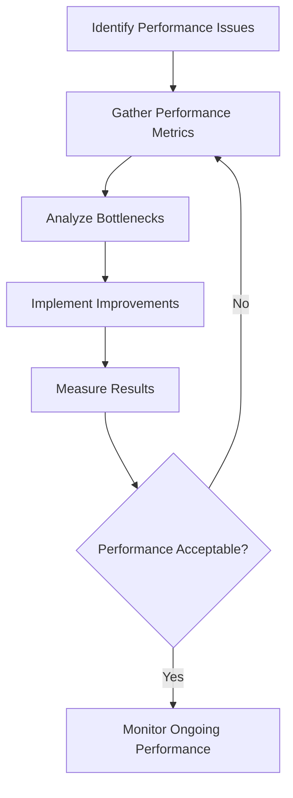

# Performance Tuning

## Introduction

Performance tuning is the process of optimizing a database system to improve its efficiency, responsiveness, and overall performance. As applications grow and data volumes increase, databases often become performance bottlenecks. Understanding how to identify and resolve these bottlenecks is a crucial skill for developers working with databases.

In this guide, we'll explore various techniques for performance tuning, focusing on practical approaches that beginners can implement to significantly improve database performance.

## Why Performance Tuning Matters

Even the most well-designed database can experience performance issues as data grows or usage patterns change. Poor database performance can lead to:

- Slow application response times
- Poor user experience
- Increased server resource consumption
- Scalability challenges
- Higher operational costs

By implementing proper performance tuning techniques, you can ensure your applications remain responsive and efficient even as they scale.

## Performance Tuning Workflow

Effective performance tuning follows a methodical approach:



## Common Performance Bottlenecks

Before diving into specific tuning techniques, let's identify the most common areas where databases experience performance issues:

1. **Inefficient queries**: Poorly written SQL can cause excessive resource usage
2. **Missing or inadequate indexes**: Without proper indexes, databases must scan entire tables
3. **Insufficient hardware resources**: CPU, memory, or disk I/O limitations
4. **Poor database design**: Normalization issues or improper data types
5. **Configuration issues**: Default database settings that aren't optimized for your workload

## Query Optimization Techniques

### 1. Use EXPLAIN to Analyze Query Plans

Most database systems provide tools to analyze how queries are executed. The `EXPLAIN` command is a powerful tool for understanding query execution plans.

```sql
EXPLAIN SELECT * FROM customers WHERE last_name = 'Smith';
```

The output might look something like:

```
+----+-------------+-----------+------------+------+---------------+------+---------+------+------+----------+-------------+
| id | select_type | table     | partitions | type | possible_keys | key  | key_len | ref  | rows | filtered | Extra       |
+----+-------------+-----------+------------+------+---------------+------+---------+------+------+----------+-------------+
|  1 | SIMPLE      | customers | NULL       | ALL  | NULL          | NULL | NULL    | NULL | 1000 |    10.00 | Using where |
+----+-------------+-----------+------------+------+---------------+------+---------+------+------+----------+-------------+
```

This output indicates a full table scan (`type: ALL`), which is inefficient. After adding an index on `last_name`, the plan would change to use that index.

### 2. Avoid SELECT * When Possible

Only retrieve the columns you actually need:

```sql
-- Inefficient
SELECT * FROM orders WHERE customer_id = 123;

-- More efficient
SELECT order_id, order_date, total FROM orders WHERE customer_id = 123;
```

### 3. Limit Result Sets

When working with large tables, use `LIMIT` to restrict the number of rows returned:

```sql
-- Return only the first 100 results
SELECT customer_id, name, email FROM customers ORDER BY name LIMIT 100;
```

### 4. Use JOINs Properly

Ensure you're using the appropriate type of JOIN, and join on indexed columns whenever possible:

```sql
-- Efficient join on indexed columns
SELECT o.order_id, c.name 
FROM orders o
INNER JOIN customers c ON o.customer_id = c.customer_id
WHERE o.order_date > '2023-01-01';
```

## Index Optimization

### 1. Create Indexes on Frequently Queried Columns

Indexes dramatically improve query performance on columns used in `WHERE`, `JOIN`, `ORDER BY`, and `GROUP BY` clauses:

```sql
-- Create an index on the last_name column
CREATE INDEX idx_customers_last_name ON customers(last_name);
```

### 2. Use Composite Indexes for Multiple Column Queries

When queries frequently filter or sort by multiple columns, consider creating composite indexes:

```sql
-- Create a composite index for queries that filter on both city and state
CREATE INDEX idx_customers_city_state ON customers(city, state);
```

### 3. Avoid Over-Indexing

While indexes improve query performance, they come with costs:

- Each index increases database size
- Indexes slow down write operations (INSERT, UPDATE, DELETE)
- Too many indexes can confuse the query optimizer

As a general rule, only create indexes that support your common query patterns.

### 4. Monitor Index Usage

Periodically review which indexes are being used and which aren't:

```sql
-- MySQL/MariaDB example to check index usage
SELECT 
    table_name, 
    index_name, 
    rows_read 
FROM 
    performance_schema.table_io_waits_summary_by_index_usage
WHERE 
    index_name IS NOT NULL
ORDER BY 
    rows_read DESC;
```

## Database Configuration Tuning

Most database systems have numerous configuration parameters that can be tuned to match your workload. Here are some common areas to consider:

### 1. Memory Allocation

Allocate sufficient memory for critical database operations:

```sql
-- MySQL example to set buffer pool size (adjust values based on your server)
SET GLOBAL innodb_buffer_pool_size = 1073741824; -- 1GB
```

### 2. Connection Pooling

Implement connection pooling to reduce the overhead of creating new database connections:

```javascript
// Node.js example with connection pooling
const mysql = require('mysql');
const pool = mysql.createPool({
  connectionLimit: 10,
  host: 'localhost',
  user: 'username',
  password: 'password',
  database: 'mydatabase'
});

// Use the pool for queries
pool.query('SELECT * FROM users WHERE id = ?', [userId], (error, results) => {
  if (error) throw error;
  console.log(results);
});
```

### 3. Query Caching

Many databases support query caching, which can significantly improve performance for read-heavy workloads:

```sql
-- Enable query cache in MySQL (Note: removed in MySQL 8.0+)
SET GLOBAL query_cache_size = 67108864; -- 64MB
SET GLOBAL query_cache_type = 1;
```

## Practical Example: Optimizing a Slow Query

Let's walk through a complete example of identifying and fixing a slow query.

### The Problem

Imagine you have an e-commerce application where users are experiencing slow page loads when viewing their order history. The problematic query is:

```sql
SELECT 
    o.order_id, 
    o.order_date, 
    o.total_amount,
    p.product_name, 
    oi.quantity, 
    oi.price
FROM 
    orders o
    JOIN order_items oi ON o.order_id = oi.order_id
    JOIN products p ON oi.product_id = p.product_id
WHERE 
    o.customer_id = 12345
ORDER BY 
    o.order_date DESC;
```

### Step 1: Analyze the Query

First, use `EXPLAIN` to understand how the database is executing this query:

```sql
EXPLAIN SELECT 
    o.order_id, 
    o.order_date, 
    o.total_amount,
    p.product_name, 
    oi.quantity, 
    oi.price
FROM 
    orders o
    JOIN order_items oi ON o.order_id = oi.order_id
    JOIN products p ON oi.product_id = p.product_id
WHERE 
    o.customer_id = 12345
ORDER BY 
    o.order_date DESC;
```

The output reveals several issues:
- No index on `customer_id` in the `orders` table
- Table scan required for ordering by `order_date`
- Missing indexes on join columns

### Step 2: Create Appropriate Indexes

```sql
-- Index for filtering by customer_id and sorting by order_date
CREATE INDEX idx_orders_customer_date ON orders(customer_id, order_date);

-- Indexes for join columns if not already present
CREATE INDEX idx_order_items_order_id ON order_items(order_id);
CREATE INDEX idx_order_items_product_id ON order_items(product_id);
```

### Step 3: Rewrite the Query (If Necessary)

The original query structure looks good, but we could add a `LIMIT` if we only need to show the most recent orders:

```sql
SELECT 
    o.order_id, 
    o.order_date, 
    o.total_amount,
    p.product_name, 
    oi.quantity, 
    oi.price
FROM 
    orders o
    JOIN order_items oi ON o.order_id = oi.order_id
    JOIN products p ON oi.product_id = p.product_id
WHERE 
    o.customer_id = 12345
ORDER BY 
    o.order_date DESC
LIMIT 50;
```

### Step 4: Measure Improvement

After implementing these changes, measure the query execution time:

```sql
-- Before optimization
SET profiling = 1;
-- Run the query
SHOW PROFILE;

-- After optimization
SET profiling = 1;
-- Run the optimized query
SHOW PROFILE;
```

You might see a significant improvement, for example:
- Before: 2.3 seconds
- After: 0.08 seconds

## Performance Monitoring

Establishing ongoing performance monitoring is crucial for maintaining optimal database performance:

### 1. Key Metrics to Monitor

- **Query execution time**: Track your slowest queries
- **Index usage**: Monitor which indexes are being used and which aren't
- **Cache hit rates**: Ensure your caches are being utilized effectively
- **Disk I/O**: Watch for I/O bottlenecks
- **Connection counts**: Monitor for connection issues or leaks

### 2. Slow Query Logging

Enable slow query logging to identify problematic queries:

```sql
-- MySQL example
SET GLOBAL slow_query_log = 'ON';
SET GLOBAL long_query_time = 1; -- Log queries taking more than 1 second
```

### 3. Automated Monitoring Tools

Consider using specialized database monitoring tools like:
- MySQL Workbench
- PostgreSQL pgAdmin
- SQL Server Management Studio
- Database-specific monitoring services

## Best Practices Summary

1. **Analyze before optimizing**: Use tools like `EXPLAIN` to understand query execution
2. **Index strategically**: Create indexes based on actual query patterns
3. **Review queries regularly**: Look for slow or inefficient queries
4. **Tune server configuration**: Adjust database settings to match your workload
5. **Monitor continuously**: Establish ongoing performance monitoring
6. **Test changes in development**: Always test optimizations before applying to production
7. **Document your changes**: Keep track of performance optimizations for future reference

## Conclusion

Performance tuning is both an art and a science. It requires understanding database internals, SQL optimization techniques, and application requirements. By following the methodical approach outlined in this guide, you can identify and resolve common performance bottlenecks, resulting in faster, more efficient applications.

Remember that performance tuning is an iterative process. As your data grows and application usage patterns evolve, you'll need to revisit your performance optimization strategies to ensure continued efficient operation.

## Exercises

1. Take a slow query from your own project and analyze it using `EXPLAIN`. Identify potential improvements.
2. Create appropriate indexes for a table with at least 1,000 records, then measure the performance impact on a typical query.
3. Use a database monitoring tool to identify the top 5 slowest queries in your application.
4. Experiment with different values for key database configuration parameters and measure their impact on a benchmark query.
5. Implement connection pooling in your application code and compare performance to direct connections.

## Additional Resources

- Database-specific documentation:
  - [MySQL Performance Tuning](https://dev.mysql.com/doc/refman/8.0/en/optimization.html)
  - [PostgreSQL Performance Optimization](https://www.postgresql.org/docs/current/performance-tips.html)
  - [SQL Server Performance Tuning](https://docs.microsoft.com/en-us/sql/relational-databases/performance/performance-center-for-sql-server-database-engine-and-azure-sql-database)
- Books:
  - "High Performance MySQL" by Baron Schwartz
  - "SQL Performance Explained" by Markus Winand
- Online courses focusing on database performance optimization