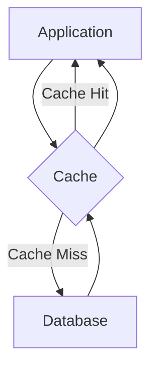

# Database Caching

## Introduction

Database caching is a performance optimization technique that stores frequently accessed data in a high-speed storage layer, reducing the need to query the primary database repeatedly. By keeping commonly requested data in memory or a dedicated caching system, applications can significantly reduce database load and improve response times.

Think of database caching like a chef's mise en place (prepared ingredients) in a kitchen. Instead of gathering the same ingredients from storage for each dish, the chef keeps frequently used items within easy reach. Similarly, database caching keeps frequently accessed data readily available, making operations faster and more efficient.

## Why Database Caching Matters

Before diving into implementation details, let's understand why caching is crucial:

- **Reduced Database Load**: Fewer queries reach your database server
- **Improved Response Times**: Cached data retrieval is typically 10-1000x faster
- **Higher Throughput**: Your application can handle more concurrent users
- **Cost Efficiency**: You can serve more traffic with the same database resources
- **Better User Experience**: Faster page loads and application responsiveness

## Basic Caching Concepts

### The Caching Layer

In a typical application architecture, the caching layer sits between your application and the database:



### Key Caching Terms

- **Cache Hit**: The requested data is found in the cache
- **Cache Miss**: The data isn't in the cache and must be fetched from the database
- **Cache Invalidation**: Removing or updating cached data when the source data changes
- **Time-to-Live (TTL)**: How long data remains valid in the cache
- **Cache Eviction**: Removing items from the cache when it reaches capacity

## Types of Database Caching

### 1. In-Memory Caching

The simplest form of caching keeps frequently accessed data in your application's memory.

**Example using Node.js:**

```javascript
// Simple in-memory cache implementation
const memoryCache = {
  data: {},
  
  // Get data from cache
  get(key) {
    const item = this.data[key];
    
    // Return null if item doesn't exist or has expired
    if (!item || (item.expiry && item.expiry < Date.now())) {
      return null;
    }
    
    return item.value;
  },
  
  // Set data in cache with optional TTL in seconds
  set(key, value, ttlSeconds = null) {
    this.data[key] = {
      value,
      expiry: ttlSeconds ? Date.now() + (ttlSeconds * 1000) : null
    };
  }
};

// Example usage
async function getUserById(userId) {
  // Check if user is in cache
  const cachedUser = memoryCache.get(`user:${userId}`);
  if (cachedUser) {
    console.log("Cache hit! Returning user from cache");
    return cachedUser;
  }
  
  // If not in cache, fetch from database
  console.log("Cache miss! Fetching user from database");
  const user = await database.query("SELECT * FROM users WHERE id = ?", [userId]);
  
  // Store in cache for 5 minutes (300 seconds)
  memoryCache.set(`user:${userId}`, user, 300);
  
  return user;
}
```

**Output:**
```
// First request
Cache miss! Fetching user from database
// Returns database result after ~100ms

// Second request
Cache hit! Returning user from cache
// Returns same result after ~0.1ms
```

### 2. Distributed Caching

For applications running on multiple servers, a distributed cache like Redis or Memcached ensures all instances access the same cached data.

**Example using Redis with Node.js:**

```javascript
const redis = require('redis');
const { promisify } = require('util');

// Create Redis client
const client = redis.createClient({
  host: 'redis-server',
  port: 6379
});

// Promisify Redis commands
const getAsync = promisify(client.get).bind(client);
const setexAsync = promisify(client.setex).bind(client);

async function getProductDetails(productId) {
  const cacheKey = `product:${productId}`;
  
  try {
    // Try to get product from cache
    const cachedProduct = await getAsync(cacheKey);
    
    if (cachedProduct) {
      console.log("Product found in cache");
      return JSON.parse(cachedProduct);
    }
    
    // If not in cache, fetch from database
    console.log("Fetching product from database");
    const product = await database.query(
      "SELECT * FROM products WHERE id = ?", 
      [productId]
    );
    
    // Store in cache for 1 hour (3600 seconds)
    await setexAsync(
      cacheKey,
      3600,
      JSON.stringify(product)
    );
    
    return product;
  } catch (error) {
    console.error("Cache error:", error);
    // Fallback to database on cache error
    return database.query(
      "SELECT * FROM products WHERE id = ?", 
      [productId]
    );
  }
}
```

### 3. Database Query Caching

Many database systems offer built-in query caching. For example, MySQL's query cache:

```sql
-- Check if query cache is enabled
SHOW VARIABLES LIKE 'query_cache_type';

-- Enable query cache
SET GLOBAL query_cache_type = 1;
SET GLOBAL query_cache_size = 67108864; -- 64MB

-- Now queries are automatically cached
SELECT * FROM products WHERE category_id = 123;
-- First execution: slow (e.g., 500ms)
-- Second execution: fast (e.g., 5ms)
```

### 4. ORM and Framework-Level Caching

Most modern ORMs and frameworks provide caching mechanisms. Here's an example with Django:

```python
# settings.py
CACHES = {
    'default': {
        'BACKEND': 'django.core.cache.backends.redis.RedisCache',
        'LOCATION': 'redis://redis:6379/1',
        'TIMEOUT': 300,  # 5 minutes
    }
}

# views.py
from django.core.cache import cache
from django.shortcuts import render
from .models import Article

def article_detail(request, article_id):
    cache_key = f'article:{article_id}'
    
    # Try to get article from cache
    article = cache.get(cache_key)
    
    if not article:
        # Cache miss - fetch from database
        try:
            article = Article.objects.get(id=article_id)
            # Store in cache
            cache.set(cache_key, article)
        except Article.DoesNotExist:
            return render(request, '404.html')
    
    return render(request, 'article_detail.html', {'article': article})
```

## Cache Invalidation Strategies

Keeping cache data in sync with the database is one of the most challenging aspects of caching.

### 1. Time-Based Invalidation

The simplest approach is to set an expiration time (TTL) for cached items.

```javascript
// Cache data with a 15-minute TTL
cache.set("popular_products", products, 15 * 60);
```

### 2. Write-Through Caching

Update the cache whenever you update the database:

```python
def update_user_profile(user_id, new_data):
    # Update database
    db.execute("UPDATE users SET name = ?, email = ? WHERE id = ?",
              [new_data['name'], new_data['email'], user_id])
    
    # Update cache
    cache_key = f"user:{user_id}"
    user_data = get_user_from_db(user_id)
    cache.set(cache_key, user_data)
    
    return user_data
```

### 3. Cache Invalidation on Update

Simply remove items from the cache when they change:

```javascript
async function updateProduct(productId, updates) {
  // Update in database
  await database.query(
    "UPDATE products SET name = ?, price = ? WHERE id = ?",
    [updates.name, updates.price, productId]
  );
  
  // Invalidate cache
  const cacheKey = `product:${productId}`;
  await cacheClient.del(cacheKey);
  
  return { success: true };
}
```

## Real-World Implementation: Building a Cached API

Let's build a simple Express.js API with Redis caching:

```javascript
const express = require('express');
const redis = require('redis');
const { promisify } = require('util');
const db = require('./database');

const app = express();
const PORT = 3000;

// Create Redis client
const redisClient = redis.createClient({
  host: process.env.REDIS_HOST || 'localhost',
  port: process.env.REDIS_PORT || 6379
});

// Promisify Redis commands
const getAsync = promisify(redisClient.get).bind(redisClient);
const setexAsync = promisify(redisClient.setex).bind(redisClient);
const delAsync = promisify(redisClient.del).bind(redisClient);

// Middleware to handle cache errors
redisClient.on('error', (err) => {
  console.error('Redis error:', err);
});

// GET endpoint with caching
app.get('/api/products', async (req, res) => {
  try {
    const cacheKey = 'products:all';
    
    // Try to get from cache
    const cachedProducts = await getAsync(cacheKey);
    
    if (cachedProducts) {
      console.log('Cache hit: Returning products from cache');
      return res.json(JSON.parse(cachedProducts));
    }
    
    // Cache miss - fetch from database
    console.log('Cache miss: Fetching products from database');
    const products = await db.query('SELECT * FROM products LIMIT 100');
    
    // Store in cache for 10 minutes
    await setexAsync(cacheKey, 600, JSON.stringify(products));
    
    return res.json(products);
  } catch (error) {
    console.error('Error:', error);
    res.status(500).json({ error: 'Server error' });
  }
});

// POST endpoint with cache invalidation
app.post('/api/products', express.json(), async (req, res) => {
  try {
    const { name, price, category } = req.body;
    
    // Insert into database
    const result = await db.query(
      'INSERT INTO products (name, price, category) VALUES (?, ?, ?)',
      [name, price, category]
    );
    
    // Invalidate the products cache
    await delAsync('products:all');
    
    res.status(201).json({ 
      id: result.insertId,
      name,
      price, 
      category
    });
  } catch (error) {
    console.error('Error:', error);
    res.status(500).json({ error: 'Server error' });
  }
});

app.listen(PORT, () => {
  console.log(`Server running on port ${PORT}`);
});
```

## Performance Monitoring

To ensure your caching strategy is effective, monitor these key metrics:

1. **Cache Hit Ratio**: The percentage of requests served from cache
2. **Cache Miss Ratio**: The percentage of requests that go to the database
3. **Cache Size**: How much memory your cache is using
4. **Average Response Time**: With and without caching

Here's a simple monitoring implementation:

```javascript
// Initialize counters
let cacheHits = 0;
let cacheMisses = 0;

async function getProductWithMetrics(productId) {
  const cacheKey = `product:${productId}`;
  const startTime = Date.now();
  
  // Try cache first
  const cachedProduct = await cache.get(cacheKey);
  
  if (cachedProduct) {
    cacheHits++;
    const duration = Date.now() - startTime;
    metrics.recordCacheHit(duration);
    return JSON.parse(cachedProduct);
  }
  
  // Cache miss - get from database
  cacheMisses++;
  const product = await database.getProduct(productId);
  
  // Store in cache
  await cache.set(cacheKey, JSON.stringify(product), 300);
  
  const duration = Date.now() - startTime;
  metrics.recordCacheMiss(duration);
  
  return product;
}

// Expose metrics
app.get('/metrics', (req, res) => {
  const totalRequests = cacheHits + cacheMisses;
  const hitRatio = totalRequests > 0 ? (cacheHits / totalRequests) * 100 : 0;
  
  res.json({
    cacheHits,
    cacheMisses,
    totalRequests,
    hitRatio: `${hitRatio.toFixed(2)}%`,
    averageCacheHitTime: metrics.avgCacheHitTime,
    averageCacheMissTime: metrics.avgCacheMissTime
  });
});
```

## Common Caching Pitfalls and Solutions

### 1. Cache Stampede

**Problem**: When a popular cached item expires, multiple concurrent requests might all hit the database.

**Solution**: Implement cache locking or staggered expiration times.

```javascript
async function getDataWithLock(key, fetchFunction) {
  // Try to get from cache
  const cachedData = await cache.get(key);
  
  if (cachedData) {
    return JSON.parse(cachedData);
  }
  
  // Try to acquire a lock
  const lockKey = `lock:${key}`;
  const lockAcquired = await cache.setnx(lockKey, 1);
  
  if (!lockAcquired) {
    // Another process is already fetching, wait and retry
    await sleep(100);
    return getDataWithLock(key, fetchFunction);
  }
  
  try {
    // Set lock expiration to prevent deadlocks
    await cache.expire(lockKey, 5);
    
    // Fetch data
    const data = await fetchFunction();
    
    // Store in cache
    await cache.set(key, JSON.stringify(data), 300);
    
    return data;
  } finally {
    // Release lock
    await cache.del(lockKey);
  }
}
```

### 2. Inconsistent Data

**Problem**: Cached data may become inconsistent with the database.

**Solution**: Implement proper invalidation strategies and consider event-based cache updates.

```javascript
// Using a message queue for cache invalidation
messageQueue.subscribe('product_updated', async (message) => {
  const { productId } = message;
  
  // Invalidate product cache
  await cache.del(`product:${productId}`);
  
  // Invalidate dependent caches
  await cache.del('featured_products');
  await cache.del(`category:${message.categoryId}`);
});
```

### 3. Memory Pressure

**Problem**: Caching too much data can lead to memory issues.

**Solution**: Set appropriate cache size limits and TTLs.

```javascript
// Redis configuration with memory limits
// redis.conf
maxmemory 1gb
maxmemory-policy allkeys-lru  # Least Recently Used eviction
```

## Caching Best Practices

1. **Cache Selectively**: Not everything needs to be cached; focus on:
   - Frequently accessed data
   - Data that's expensive to generate
   - Relatively static data

2. **Set Reasonable TTLs**: Based on how often data changes:
   - User profiles: 15-30 minutes
   - Product information: 1-6 hours
   - Reference data: 24+ hours

3. **Layer Your Caching**:
   - Browser cache
   - CDN/Edge cache
   - Application cache
   - Database cache

4. **Plan for Cache Failures**:
   - Always have a fallback to the database
   - Implement circuit breakers
   - Monitor cache health

5. **Benchmark and Test**:
   - Measure performance with and without caching
   - Test under various load conditions
   - Simulate cache failures

## Practical Exercise: Implement a Multi-Level Cache

Try implementing a caching system that combines both local (in-memory) and distributed (Redis) caching:

```javascript
class MultilevelCache {
  constructor(redisClient) {
    this.localCache = {};
    this.redisClient = redisClient;
    this.getAsync = promisify(redisClient.get).bind(redisClient);
    this.setexAsync = promisify(redisClient.setex).bind(redisClient);
  }
  
  async get(key) {
    // Check local cache first (L1)
    if (this.localCache[key] && this.localCache[key].expiry > Date.now()) {
      console.log("L1 cache hit");
      return this.localCache[key].value;
    }
    
    // Try Redis cache (L2)
    try {
      const redisValue = await this.getAsync(key);
      if (redisValue) {
        console.log("L2 cache hit");
        // Update local cache
        const parsed = JSON.parse(redisValue);
        this.localCache[key] = {
          value: parsed,
          expiry: Date.now() + 60000 // 1 minute local TTL
        };
        return parsed;
      }
    } catch (error) {
      console.error("Redis error:", error);
      // Continue to database if Redis fails
    }
    
    return null; // Cache miss
  }
  
  async set(key, value, ttlSeconds) {
    // Set in local cache
    this.localCache[key] = {
      value,
      expiry: Date.now() + (ttlSeconds * 1000)
    };
    
    // Set in Redis
    try {
      await this.setexAsync(key, ttlSeconds, JSON.stringify(value));
    } catch (error) {
      console.error("Redis set error:", error);
      // Local cache still works even if Redis fails
    }
  }
}
```

## Summary

Database caching is a powerful technique for improving application performance by reducing database load and speeding up data access. We've covered:

- Various caching strategies and their implementations
- How to handle cache invalidation and consistency
- Tools and technologies for different caching needs
- Common pitfalls and how to avoid them
- Best practices for effective caching

Remember that effective caching requires careful planning, monitoring, and maintenance. The right caching strategy depends on your specific application needs, data patterns, and infrastructure constraints.

## Additional Resources

- [Redis Documentation](https://redis.io/documentation)
- [Database Caching Strategies Using Redis (AWS Whitepaper)](https://d0.awsstatic.com/whitepapers/Database/database-caching-strategies-using-redis.pdf)
- [Implementing Cache-Aside Pattern with Redis](https://docs.microsoft.com/en-us/azure/architecture/patterns/cache-aside)
- [Advanced Caching Techniques for Building High-Performance Applications](https://www.youtube.com/watch?v=bIZxDrKKNh4)

## Exercises

1. Implement a caching layer for a simple blog application that caches:
   - Individual blog posts
   - Homepage with recent posts
   - Category pages

2. Benchmark the performance of your application with and without caching.

3. Implement different cache invalidation strategies and compare their effectiveness.

4. Create a monitoring dashboard that shows cache hit/miss ratios and response times.

5. Design a caching strategy for a real-time social media feed that needs to stay fresh while still benefiting from caching.