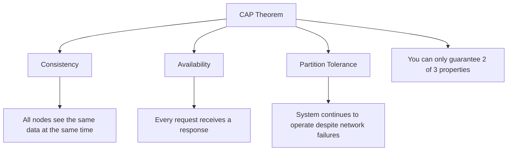

# NoSQL Introduction

## What is NoSQL?

NoSQL (which stands for "Not Only SQL") refers to a broad class of database management systems that differ from the traditional relational database management systems (RDBMS) in significant ways. Developed in response to the limitations of relational databases, NoSQL databases are designed to handle the volume, variety, and velocity of data that modern applications generate.

Unlike relational databases that use structured query language (SQL) for defining and manipulating data, NoSQL databases use various data models for accessing and managing data. These data models include document, key-value, wide-column, and graph formats.

## Why NoSQL?

The rise of NoSQL databases was driven by several factors:

1. **Big Data**: The need to handle massive amounts of structured, semi-structured, and unstructured data
2. **Scalability**: The ability to scale horizontally across multiple servers rather than vertically (on a single server)
3. **Flexibility**: Schema-less or flexible schema design that adapts to changing data requirements
4. **Performance**: Optimized for specific data models and access patterns
5. **Agile Development**: Support for rapid development and iteration

## NoSQL vs Relational Databases

Let's compare the key differences between NoSQL and traditional relational databases:

| Feature | Relational Databases | NoSQL Databases |
|---------|---------------------|-----------------|
| Data Model | Tables with rows and columns | Various (document, key-value, graph, etc.) |
| Schema | Fixed schema | Schema-flexible or schema-less |
| Scaling | Vertical (more powerful hardware) | Horizontal (more servers) |
| ACID Transactions | Fully supported | Varies by database type |
| Query Language | SQL | Database-specific APIs |
| Consistency | Strong consistency | Often eventual consistency |
| Best For | Complex queries, transactions | Large volumes, rapid changes, flexible data |

## The CAP Theorem

When discussing NoSQL databases, it's important to understand the CAP theorem:



The CAP theorem states that a distributed database system can only guarantee two out of three properties:
- **Consistency**: All nodes see the same data at the same time
- **Availability**: Every request receives a response
- **Partition Tolerance**: The system continues to operate despite network failures

NoSQL databases make different trade-offs among these properties based on their design goals.

## Main Types of NoSQL Databases

### 1. Document Stores

Document databases store data in flexible, JSON-like documents. Each document can have a different structure.

**Examples**: MongoDB, CouchDB, Firebase Firestore

**Sample MongoDB Document**:

```javascript
{
  "_id": "5f8a716b1cd6537d3c545d86",
  "name": "John Smith",
  "email": "john@example.com",
  "address": {
    "street": "123 Main St",
    "city": "Boston",
    "state": "MA",
    "zip": "02101"
  },
  "interests": ["programming", "data science", "hiking"],
  "created_at": "2023-10-15T14:30:45Z"
}
```

**Basic CRUD Operations**:

```javascript
// Create a document
db.users.insertOne({
  name: "Jane Doe",
  email: "jane@example.com",
  interests: ["design", "photography"]
});

// Read documents
db.users.find({ interests: "programming" });

// Update a document
db.users.updateOne(
  { email: "john@example.com" },
  { $set: { "address.city": "New York" } }
);

// Delete a document
db.users.deleteOne({ email: "jane@example.com" });
```

### 2. Key-Value Stores

Key-value databases are the simplest NoSQL databases. They store data as a collection of key-value pairs.

**Examples**: Redis, DynamoDB, Riak

**Redis Example**:

```bash
# Set a simple key-value pair
SET user:1001 "John Smith"

# Get the value
GET user:1001
# Output: "John Smith"

# Set a hash (multiple fields for a key)
HMSET user:1002 name "Jane Doe" email "jane@example.com" age 28

# Get a specific field
HGET user:1002 email
# Output: "jane@example.com"

# Get all fields
HGETALL user:1002
# Output: 1) "name" 2) "Jane Doe" 3) "email" 4) "jane@example.com" 5) "age" 6) "28"
```

### 3. Wide-Column Stores

Wide-column stores organize data tables as columns rather than rows, offering high performance and scalability for certain workloads.

**Examples**: Cassandra, HBase, Google BigTable

**Cassandra CQL Example**:

```sql
-- Create a keyspace
CREATE KEYSPACE my_store WITH REPLICATION = {
  'class': 'SimpleStrategy',
  'replication_factor': 3
};

-- Create a table
CREATE TABLE my_store.products (
  product_id UUID PRIMARY KEY,
  name TEXT,
  category TEXT,
  price DECIMAL,
  inventory_count INT
);

-- Insert data
INSERT INTO my_store.products (product_id, name, category, price, inventory_count)
VALUES (uuid(), 'Laptop X1', 'Electronics', 999.99, 157);

-- Query data
SELECT * FROM my_store.products WHERE category = 'Electronics';
```

### 4. Graph Databases

Graph databases excel at managing highly connected data by storing entities and relationships between them.

**Examples**: Neo4j, Amazon Neptune, ArangoDB

**Neo4j Cypher Example**:

```cypher
// Create nodes
CREATE (john:Person {name: 'John', age: 28})
CREATE (jane:Person {name: 'Jane', age: 27})
CREATE (post:Post {title: 'Learning NoSQL', content: 'NoSQL databases are...', date: '2023-10-15'})

// Create relationships
CREATE (john)-[:FRIEND]->(jane)
CREATE (john)-[:WROTE]->(post)
CREATE (jane)-[:LIKED]->(post)

// Query relationships
MATCH (p:Person)-[:WROTE]->(post:Post)<-[:LIKED]-(friend)
WHERE p.name = 'John'
RETURN friend.name, post.title
```

## When to Use NoSQL

NoSQL databases are particularly well-suited for:

1. **Large volumes of rapidly changing data**
   - Social media feeds
   - Real-time analytics
   - IoT device data

2. **Flexible or evolving data structures**
   - Content management systems
   - User profiles with varying attributes
   - Products with different specifications

3. **Geographic distribution**
   - Global applications requiring low latency
   - Systems needing high availability

4. **Specific data models**
   - Document: Nested, hierarchical data
   - Graph: Highly connected data
   - Key-value: Simple, high-performance lookups
   - Wide-column: Time-series data, large-scale analytics

## Real-World NoSQL Use Cases

### Case Study 1: Content Management System

A modern CMS can use MongoDB to store articles with varying structures:

```javascript
// News article
{
  "_id": "article-123",
  "type": "news",
  "title": "New Technology Breakthrough",
  "author": "Jane Smith",
  "content": "...",
  "publishDate": "2023-10-14T09:00:00Z",
  "tags": ["technology", "innovation"]
}

// Video article
{
  "_id": "article-124",
  "type": "video",
  "title": "How to Build a Database",
  "videoUrl": "https://example.com/videos/database-tutorial",
  "duration": "15:24",
  "presenter": "John Doe",
  "transcript": "...",
  "publishDate": "2023-10-15T14:30:00Z"
}
```

The flexibility allows storing different content types without predefined schemas.

### Case Study 2: E-commerce Product Catalog

An e-commerce application might use Redis to cache frequently accessed product information:

```bash
# Cache product details
HMSET product:1001 name "Wireless Headphones" price 129.99 category "Electronics" stock 45
HMSET product:1002 name "Running Shoes" price 89.99 category "Footwear" stock 78

# Set expiration for cache entries
EXPIRE product:1001 3600  # Expire after 1 hour

# Get product details
HGETALL product:1001
```

This approach provides ultra-fast product lookups and reduces load on the primary database.

### Case Study 3: Social Network Connections

A social media platform might use Neo4j to manage user connections and content interactions:

```cypher
// Find friends-of-friends recommendations
MATCH (user:User {id: 'user-123'})-[:FRIEND]->(friend)-[:FRIEND]->(potential)
WHERE NOT (user)-[:FRIEND]->(potential)
RETURN potential.name, COUNT(friend) AS common_connections
ORDER BY common_connections DESC
LIMIT 5

// Find content that user's friends have engaged with
MATCH (user:User {id: 'user-123'})-[:FRIEND]->(friend)-[:LIKED]->(content)
WHERE NOT (user)-[:VIEWED]->(content)
RETURN content.title, COUNT(friend) AS friend_likes
ORDER BY friend_likes DESC
LIMIT 10
```

This graph approach makes complex relationship queries efficient and intuitive.

## Getting Started with NoSQL

If you're new to NoSQL databases, here are some steps to get started:

1. **Choose the right database type** for your use case based on your data model and access patterns
2. **Install a database locally** for development and experimentation
3. **Learn the query language or API** specific to your chosen database
4. **Design your data model** to take advantage of the database's strengths
5. **Set up monitoring and backups** before deploying to production

## Common Challenges and Solutions

### Challenge: Data Consistency

**Solution**: Use transactions where available, implement application-level checks, or choose a strongly consistent NoSQL database if consistency is critical.

### Challenge: Data Modeling

**Solution**: Model data according to access patterns rather than entity relationships. Denormalize data where appropriate to improve read performance.

### Challenge: Schema Evolution

**Solution**: Plan for schema changes by including version fields in documents or implementing migration strategies.

### Challenge: Query Limitations

**Solution**: Design your data model around your query patterns and use secondary indexes to support various access patterns.

## Summary

NoSQL databases offer powerful alternatives to traditional relational databases for specific use cases and challenges. They provide flexibility, scalability, and performance benefits that make them well-suited for modern application development.

By understanding the different types of NoSQL databases and their strengths, you can make informed decisions about which technology best fits your data requirements and application needs.

## Further Learning

To deepen your knowledge of NoSQL databases:

1. Experiment with different NoSQL databases using their cloud-based sandbox environments
2. Build a small project that leverages a NoSQL database
3. Study the data modeling patterns specific to your chosen database
4. Practice migrating a simple relational database to a NoSQL alternative

## Exercises

1. Compare and contrast two different NoSQL database types for a social media application
2. Design a document model for an online bookstore using MongoDB
3. Implement basic CRUD operations using a NoSQL database of your choice
4. Create a simple caching layer using Redis for a web application
5. Design a graph data model for a recommendation engine