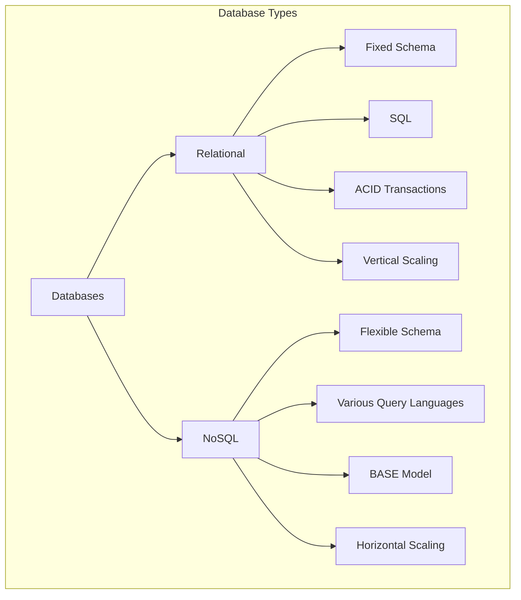
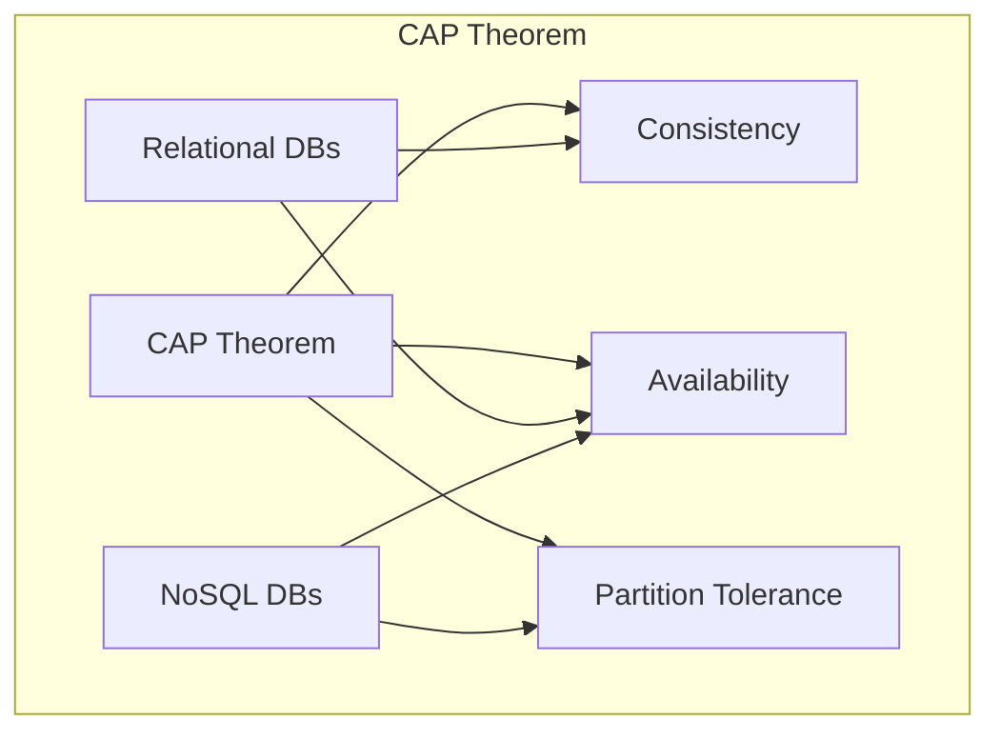
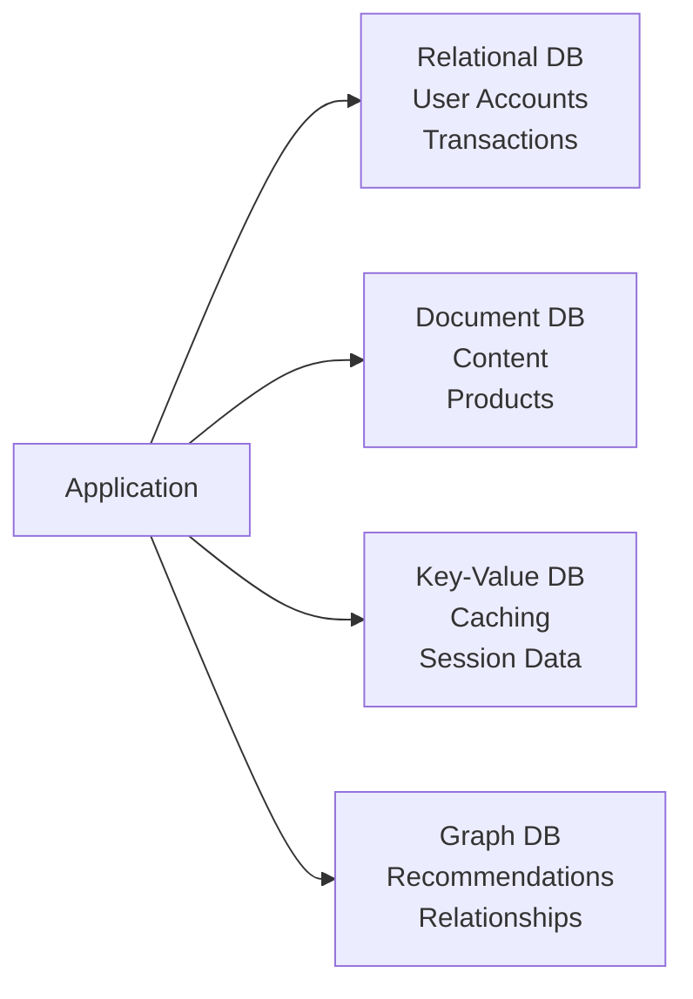

# NoSQL vs Relational Databases

## Introduction

Database systems are the backbone of modern applications, storing and managing the data that powers everything from simple websites to complex enterprise systems. When designing your application, one of the most fundamental decisions you'll make is choosing between relational databases and NoSQL databases.

This guide will help you understand the key differences between these two database paradigms, their strengths and weaknesses, and when to choose one over the other.

## What are Relational Databases?

Relational databases have been the industry standard for decades. They organize data into structured tables with rows and columns, similar to spreadsheets, with strict relationships between tables.

### Key Characteristics

- **Structured Data**: Data is organized in predefined schemas (tables with columns and data types)
- **ACID Compliance**: Ensures Atomicity, Consistency, Isolation, and Durability of transactions
- **SQL Language**: Uses Structured Query Language (SQL) for querying and manipulating data
- **Relationships**: Enforces relationships between tables through foreign keys
- **Scaling**: Typically scales vertically (more powerful hardware)

### Popular Examples

- MySQL
- PostgreSQL
- Oracle Database
- Microsoft SQL Server
- SQLite

## What are NoSQL Databases?

NoSQL ("Not Only SQL") databases emerged as a response to the limitations of relational databases, particularly for handling large volumes of unstructured data and scaling horizontally.

### Key Characteristics

- **Flexible Schema**: Allows storing data without predefined structure
- **Horizontal Scalability**: Easily distributes across multiple servers
- **Variety of Data Models**: Document, key-value, column-family, graph, etc.
- **Eventual Consistency**: May prioritize availability and partition tolerance over consistency
- **No Standard Query Language**: Each NoSQL database may have its own query method

### Popular Examples

- MongoDB (Document)
- Redis (Key-Value)
- Cassandra (Column-Family)
- Neo4j (Graph)
- Couchbase (Document)

## Comparing Data Models

Let's look at how the same data might be represented in both paradigms:

### Relational Model Example

In a relational database, we would create separate tables for users and their orders:

**Users Table:**
```sql
CREATE TABLE users (
  id INT PRIMARY KEY,
  username VARCHAR(50),
  email VARCHAR(100),
  join_date DATE
);
```

**Orders Table:**
```sql
CREATE TABLE orders (
  order_id INT PRIMARY KEY,
  user_id INT,
  product VARCHAR(100),
  amount DECIMAL(10,2),
  order_date DATE,
  FOREIGN KEY (user_id) REFERENCES users(id)
);
```

To retrieve a user with their orders, we would use a JOIN:

```sql
SELECT u.username, o.product, o.amount, o.order_date
FROM users u
JOIN orders o ON u.id = o.user_id
WHERE u.id = 123;
```

### NoSQL Document Model Example

In a document database like MongoDB, we might store each user with their orders embedded:

```javascript
// User document
{
  "_id": 123,
  "username": "johndoe",
  "email": "john@example.com",
  "join_date": "2023-05-15",
  "orders": [
    {
      "product": "Laptop",
      "amount": 999.99,
      "order_date": "2023-06-10"
    },
    {
      "product": "Headphones",
      "amount": 149.99,
      "order_date": "2023-06-25"
    }
  ]
}
```

To retrieve a user with their orders:

```javascript
db.users.findOne({ _id: 123 });
```

## Key Differences Visualized



## When to Use Relational Databases

Relational databases excel in scenarios where:

- **Data Integrity is Critical**: Financial systems, medical records, or anywhere ACID compliance is needed
- **Complex Queries and Transactions**: Systems requiring multiple table joins and complex business logic
- **Structured Data**: When your data structure is well-defined and unlikely to change frequently
- **Established Systems**: Legacy applications or systems built around SQL

### Real-World Example: Banking System

Consider a banking application that needs to manage accounts, transactions, and customer information:

```sql
-- Create account table
CREATE TABLE accounts (
  account_id INT PRIMARY KEY,
  customer_id INT,
  balance DECIMAL(15,2),
  account_type VARCHAR(50),
  FOREIGN KEY (customer_id) REFERENCES customers(id)
);

-- Create transaction table
CREATE TABLE transactions (
  transaction_id INT PRIMARY KEY,
  account_id INT,
  amount DECIMAL(15,2),
  transaction_type VARCHAR(20),
  timestamp DATETIME,
  FOREIGN KEY (account_id) REFERENCES accounts(account_id)
);

-- Query to get account balance after applying all transactions
SELECT a.account_id, a.balance, SUM(t.amount) AS pending_changes
FROM accounts a
LEFT JOIN transactions t ON a.account_id = t.account_id
WHERE a.customer_id = 1001
GROUP BY a.account_id;
```

In this scenario, ACID compliance ensures that money isn't created or destroyed during transfers between accounts.

## When to Use NoSQL Databases

NoSQL databases are better suited for:

- **Handling Big Data**: When dealing with large volumes of unstructured or semi-structured data
- **Rapid Development**: Applications with evolving schemas or agile development practices
- **Horizontal Scaling**: Systems that need to scale out across multiple servers
- **Specific Data Models**: When your data naturally fits into document, graph, or key-value models

### Real-World Example: Content Management System

For a blog or content platform using MongoDB:

```javascript
// Creating a blog post with nested comments
db.posts.insertOne({
  title: "Introduction to NoSQL",
  content: "NoSQL databases provide flexible schemas...",
  author: {
    name: "Jane Smith",
    email: "jane@example.com"
  },
  tags: ["nosql", "databases", "mongodb"],
  published_date: new Date("2023-09-15"),
  comments: [
    {
      user: "bob123",
      text: "Great introduction!",
      date: new Date("2023-09-16")
    },
    {
      user: "tech_enthusiast",
      text: "I'd love to see a comparison with SQL databases",
      date: new Date("2023-09-17")
    }
  ]
});

// Query to find all posts with a specific tag
db.posts.find({ tags: "nosql" });
```

This document structure naturally maps to the nested structure of a blog post with comments, making it easier to work with than a normalized relational model with multiple joins.

## Performance Considerations

### Relational Databases

- **Read Performance**: Excellent for complex joins and aggregations when properly indexed
- **Write Performance**: Can slow down with many constraints and foreign keys
- **Scaling Challenges**: Vertical scaling has physical and cost limitations

### NoSQL Databases

- **Read Performance**: Extremely fast for key-based lookups and document retrieval
- **Write Performance**: Typically faster due to fewer constraints
- **Scaling Advantages**: Can distribute data across multiple nodes easily

## CAP Theorem and Database Design

The CAP theorem states that a distributed database system can only guarantee two of three properties simultaneously:

- **Consistency**: All nodes see the same data at the same time
- **Availability**: Every request receives a response
- **Partition Tolerance**: System continues to operate despite network failures



Relational databases typically prioritize consistency and availability, while many NoSQL systems choose availability and partition tolerance.

## Hybrid Approaches

Modern applications often employ multiple database types in a polyglot persistence approach:

- Using a relational database for transactional data
- Adding a document store for content management
- Implementing a graph database for relationship-heavy features
- Leveraging a key-value store for caching

### Example Architecture



## Migration Considerations

Moving between database paradigms requires careful planning:

1. **Schema Design**: Converting from fixed to flexible schema or vice versa
2. **Data Migration**: Transforming data between formats
3. **Application Changes**: Updating query patterns and data access code
4. **Performance Testing**: Verifying the new system meets performance requirements

## Practical Example: Building a User Profile System

Let's compare how you might implement a user profile system in both paradigms:

### Relational Approach

```sql
-- Create tables
CREATE TABLE users (
  user_id INT PRIMARY KEY,
  username VARCHAR(50) UNIQUE,
  email VARCHAR(100) UNIQUE,
  password_hash VARCHAR(255),
  created_at TIMESTAMP DEFAULT CURRENT_TIMESTAMP
);

CREATE TABLE profiles (
  profile_id INT PRIMARY KEY,
  user_id INT UNIQUE,
  full_name VARCHAR(100),
  bio TEXT,
  location VARCHAR(100),
  website VARCHAR(255),
  FOREIGN KEY (user_id) REFERENCES users(user_id)
);

CREATE TABLE user_skills (
  id INT PRIMARY KEY,
  user_id INT,
  skill VARCHAR(50),
  level VARCHAR(20),
  FOREIGN KEY (user_id) REFERENCES users(user_id)
);

-- Query to get complete user profile
SELECT u.username, u.email, p.full_name, p.bio, p.location, p.website, 
       s.skill, s.level
FROM users u
JOIN profiles p ON u.user_id = p.user_id
LEFT JOIN user_skills s ON u.user_id = s.user_id
WHERE u.username = 'johndoe';
```

### NoSQL Approach (MongoDB)

```javascript
// Create a user document
db.users.insertOne({
  username: "johndoe",
  email: "john@example.com",
  password_hash: "bcrypt_hashed_password_here",
  created_at: new Date(),
  profile: {
    full_name: "John Doe",
    bio: "Web developer and database enthusiast",
    location: "San Francisco, CA",
    website: "https://johndoe.dev"
  },
  skills: [
    { skill: "JavaScript", level: "Expert" },
    { skill: "Python", level: "Intermediate" },
    { skill: "Database Design", level: "Advanced" }
  ]
});

// Query to get complete user profile
db.users.findOne({ username: "johndoe" });
```

The NoSQL approach simplifies retrieval but may lead to data duplication if the same skill needs to be updated across multiple users.

## Common Use Cases and Best Choices

| Use Case | Recommended Type | Reasoning |
|----------|------------------|-----------|
| Financial systems | Relational | ACID compliance, data integrity |
| Content management | NoSQL (Document) | Flexible content structure |
| Real-time analytics | NoSQL (Column) | High write throughput, scalability |
| Social networks | NoSQL (Graph) | Complex relationships |
| E-commerce catalog | NoSQL (Document) | Varied product attributes |
| Caching | NoSQL (Key-Value) | Simple structure, fast access |
| IoT data collection | NoSQL (Time-Series) | High ingestion rates, time-based queries |
| Enterprise applications | Relational | Complex reporting, established patterns |

## Summary

Both relational and NoSQL databases have their strengths and weaknesses:

- **Relational databases** excel in scenarios requiring data integrity, complex queries, and established structures.
- **NoSQL databases** shine when dealing with large volumes of unstructured data, rapid development, and horizontal scaling.

The right choice depends on your specific requirements, including:

- Data structure and flexibility needs
- Scalability requirements
- Query complexity
- Development speed
- Consistency requirements

Modern applications often use both paradigms to leverage their respective strengths in different parts of the system.

## Exercises

1. Design a database schema for an online bookstore in both relational and NoSQL formats. Consider books, authors, categories, and user reviews.
2. Implement a simple user authentication system using both a relational database and a document database. Compare the implementations.
3. Write queries to retrieve the top 5 most reviewed products in both SQL and a NoSQL query language of your choice.
4. Design a database migration plan to move a relational product catalog to a document-based structure.
5. Create a diagram showing how you would implement a social media application using a polyglot persistence approach.

## Additional Resources

- [SQL vs NoSQL: 5 Critical Differences](https://www.mongodb.com/nosql-explained/nosql-vs-sql) (MongoDB Documentation)
- [Understanding the CAP Theorem](https://www.ibm.com/cloud/learn/cap-theorem) (IBM)
- [PostgreSQL Documentation](https://www.postgresql.org/docs/)
- [MongoDB Manual](https://docs.mongodb.com/manual/)
- [Database Scaling Strategies](https://aws.amazon.com/blogs/database/best-practices-for-horizontal-database-scaling/) (AWS)
- [Data Modeling for NoSQL Databases](https://docs.mongodb.com/manual/core/data-modeling-introduction/) (MongoDB)