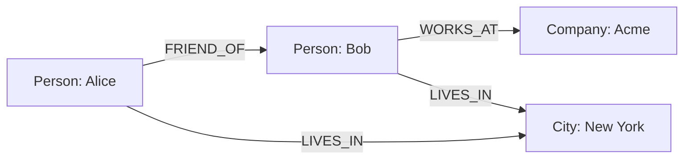

# Neo4j Basics

## Introduction

Neo4j is a popular graph database management system that belongs to the NoSQL family. Unlike traditional relational databases that store data in tables, Neo4j uses a graph structure to represent and store data. This makes it exceptionally powerful for managing highly connected data and performing complex relationship-based queries.

In this tutorial, we'll explore the fundamentals of Neo4j, understand its core concepts, and learn how to perform basic operations using the Cypher query language.

## What is a Graph Database?

At its core, a graph database stores data in nodes (entities) and relationships (connections between entities). This structure closely mirrors how we naturally think about many domains - as objects connected by various relationships.

### Key Components of Neo4j

1. **Nodes** - Represent entities (like a person, place, or thing)
2. **Relationships** - Connect nodes and have a type and direction
3. **Properties** - Key-value pairs that can be attached to both nodes and relationships
4. **Labels** - Used to group nodes into sets

Let's visualize a simple graph model:



## Setting Up Neo4j

Before diving into code examples, you'll need to set up Neo4j. The easiest way to get started is to use Neo4j Desktop or Neo4j Sandbox.

### Using Neo4j Desktop

1. Download and install [Neo4j Desktop](https://neo4j.com/download/)
2. Create a new project
3. Add a database to your project
4. Start the database

### Using Neo4j Sandbox

Neo4j Sandbox provides a free, temporary Neo4j instance in the cloud:

1. Visit [Neo4j Sandbox](https://sandbox.neo4j.com/)
2. Create an account or sign in
3. Launch a blank sandbox

## Basic Cypher Query Language

Cypher is Neo4j's query language, designed to be visually intuitive and easy to understand. Let's explore some basic operations.

### Creating Nodes

To create a simple node:

```cypher
CREATE (n:Person {name: 'John', age: 30})
```

This creates a node with the label `Person` and two properties: `name` and `age`.

To create multiple nodes at once:

```cypher
CREATE (a:Person {name: 'Alice', age: 25}),
       (b:Person {name: 'Bob', age: 27}),
       (c:Company {name: 'Acme', founded: 2010})
```

### Creating Relationships

To create relationships between nodes:

```cypher
MATCH (a:Person {name: 'Alice'}), (b:Person {name: 'Bob'})
CREATE (a)-[:FRIEND_OF]->(b)
```

This creates a `FRIEND_OF` relationship from Alice to Bob.

You can also create nodes and relationships in a single query:

```cypher
CREATE (a:Person {name: 'Alice', age: 25})-[:WORKS_AT]->(c:Company {name: 'Acme'})
```

### Querying Data

To retrieve all Person nodes:

```cypher
MATCH (p:Person)
RETURN p
```

To find specific nodes:

```cypher
MATCH (p:Person {name: 'Alice'})
RETURN p
```

To query relationships:

```cypher
MATCH (p:Person)-[:WORKS_AT]->(c:Company)
RETURN p.name, c.name
```

Example output:

```
╒══════════╤══════════╕
│ p.name   │ c.name   │
╞══════════╪══════════╡
│ "Alice"  │ "Acme"   │
└──────────┴──────────┘
```

### Updating Properties

To update node properties:

```cypher
MATCH (p:Person {name: 'John'})
SET p.age = 31
RETURN p
```

### Deleting Nodes and Relationships

To delete a relationship:

```cypher
MATCH (a:Person {name: 'Alice'})-[r:FRIEND_OF]->(b:Person {name: 'Bob'})
DELETE r
```

To delete a node (and all its relationships):

```cypher
MATCH (p:Person {name: 'John'})
DETACH DELETE p
```

## Practical Example: Building a Movie Recommendation System

Let's build a simple movie recommendation database to demonstrate Neo4j's power with connected data.

### Step 1: Create the Schema

```cypher
// Create Movie nodes
CREATE (matrix:Movie {title: 'The Matrix', released: 1999, tagline: 'Welcome to the Real World'})
CREATE (cloudAtlas:Movie {title: 'Cloud Atlas', released: 2012, tagline: 'Everything is Connected'})
CREATE (forrestGump:Movie {title: 'Forrest Gump', released: 1994, tagline: 'Life is like a box of chocolates'})

// Create Person nodes
CREATE (keanu:Person {name: 'Keanu Reeves', born: 1964})
CREATE (tomHanks:Person {name: 'Tom Hanks', born: 1956})
CREATE (halleBerry:Person {name: 'Halle Berry', born: 1966})

// Create relationships
CREATE (keanu)-[:ACTED_IN {roles: ['Neo']}]->(matrix)
CREATE (keanu)-[:ACTED_IN {roles: ['Robert Frobisher', 'Hae-Joo Chang']}]->(cloudAtlas)
CREATE (tomHanks)-[:ACTED_IN {roles: ['Forrest Gump']}]->(forrestGump)
CREATE (tomHanks)-[:ACTED_IN {roles: ['Dr. Henry Goose', 'Isaac Sachs']}]->(cloudAtlas)
CREATE (halle)-[:ACTED_IN {roles: ['Luisa Rey', 'Jocasta Ayrs']}]->(cloudAtlas)
```

### Step 2: Query for Movie Recommendations

Now, let's find movie recommendations based on actors:

```cypher
// Find movies that Keanu Reeves acted in
MATCH (keanu:Person {name: 'Keanu Reeves'})-[:ACTED_IN]->(movie:Movie)
RETURN movie.title

// Find co-actors (people who acted in the same movies as Keanu)
MATCH (keanu:Person {name: 'Keanu Reeves'})-[:ACTED_IN]->(movie:Movie)<-[:ACTED_IN]-(coActor:Person)
RETURN coActor.name, movie.title

// Find recommendations: Movies that co-actors acted in but Keanu didn't
MATCH (keanu:Person {name: 'Keanu Reeves'})-[:ACTED_IN]->(movie:Movie)<-[:ACTED_IN]-(coActor:Person),
      (coActor)-[:ACTED_IN]->(recommendation:Movie)
WHERE NOT (keanu)-[:ACTED_IN]->(recommendation)
RETURN DISTINCT recommendation.title, coActor.name
```

Example output of the last query:

```
╒═════════════════╤═══════════════╕
│ recommendation  │ coActor.name  │
╞═════════════════╪═══════════════╡
│ "Forrest Gump"  │ "Tom Hanks"   │
└─────────────────┴───────────────┘
```

## Advanced Features

### Indexes

Indexes improve query performance. To create an index:

```cypher
CREATE INDEX FOR (p:Person) ON (p.name)
```

### Constraints

Constraints ensure data integrity. To create a uniqueness constraint:

```cypher
CREATE CONSTRAINT FOR (m:Movie) REQUIRE m.title IS UNIQUE
```

### Path Finding

Neo4j excels at finding paths between nodes:

```cypher
// Find the shortest path between two actors
MATCH p=shortestPath((bacon:Person {name: 'Kevin Bacon'})-[*]-(meg:Person {name: 'Meg Ryan'}))
RETURN p
```

## When to Use Neo4j

Neo4j is particularly well-suited for:

1. **Social networks** - Modeling users, friendships, follows, etc.
2. **Recommendation engines** - "People who bought X also bought Y"
3. **Fraud detection** - Identifying suspicious patterns in connected data
4. **Knowledge graphs** - Representing complex domains with many entity types and relationships
5. **Network and IT operations** - Modeling infrastructure dependencies

## Summary

In this tutorial, we've explored the fundamentals of Neo4j and graph databases:

- Neo4j represents data as nodes (entities) and relationships
- Cypher is a powerful query language for working with graph data
- Basic operations include creating, reading, updating, and deleting nodes and relationships
- Neo4j excels at traversing relationships and finding paths between entities

Graph databases like Neo4j offer a flexible and intuitive way to model and query highly connected data. As your applications grow and require more complex relationship-based queries, Neo4j provides a powerful alternative to traditional relational databases.

## Additional Resources

- [Neo4j Official Documentation](https://neo4j.com/docs/)
- [Neo4j Cypher Manual](https://neo4j.com/docs/cypher-manual/current/)
- [Neo4j Developer Guides](https://neo4j.com/developer/get-started/)

## Practice Exercises

1. Extend the movie database by adding more movies, actors, and relationship types (like `DIRECTED`, `PRODUCED`, etc.)
2. Create a query to find all actors who have worked with the same director more than once
3. Build a small social network model with users, posts, comments, and friendships
4. Implement a query to recommend friends based on mutual connections
5. Try modeling a real-world domain of your choice (e.g., a transportation network, organization chart, or product catalog)