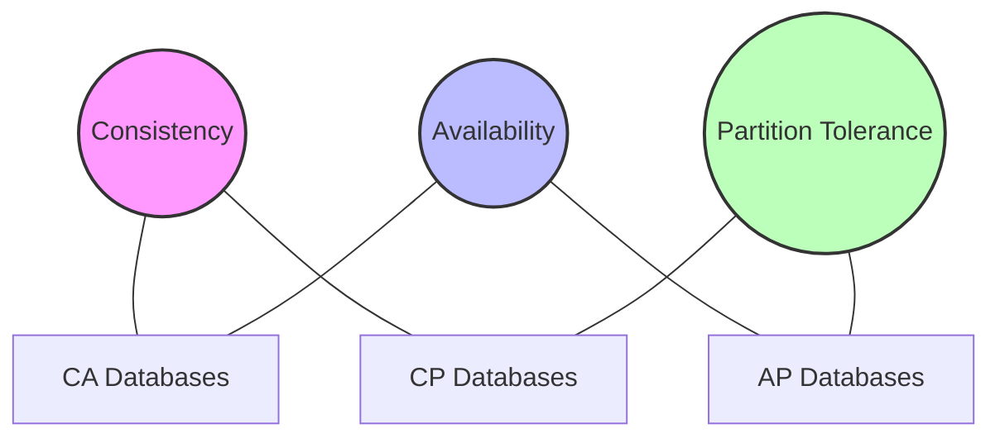

# Understanding the CAP Theorem

## Introduction

When you're working with distributed database systems, especially NoSQL databases, you'll eventually encounter something called the "CAP Theorem." This fundamental principle helps us understand why different database systems make different trade-offs in their design.

The CAP Theorem states that a distributed database system can only guarantee two out of these three properties simultaneously:

- **C**onsistency: All nodes see the same data at the same time
- **A**vailability: Every request receives a response (success or failure)
- **P**artition tolerance: The system continues to operate despite network partitions

Let's break down what this means and why it matters for your database choices.

## Understanding the Three Properties

### Consistency

In a consistent system, all nodes in the distributed database will show the same data at any given time. When you write data to one node, that data is immediately visible to all other nodes.

Think of consistency like this: If you update your social media profile picture, consistency ensures that everyone sees your new profile picture right away, not the old one.

```javascript
// Example of consistency expectation
// When writing data to Node A
writeToNodeA("user_123", {name: "Alex", age: 30});

// When immediately reading from Node B
const userData = readFromNodeB("user_123");
console.log(userData);
// In a fully consistent system, this would output:
// {name: "Alex", age: 30}
```

### Availability

An available system guarantees that every request (read or write) will receive a response, without guarantee that it contains the most recent data. Even if some parts of the system fail, the remaining operational parts will still respond to requests.

Imagine an e-commerce website that keeps working during heavy traffic or partial outages - that's high availability in action.

```javascript
// Example of high availability
try {
  const result = database.query("SELECT * FROM products WHERE id = 42");
  // System returns a response (even if it might be slightly outdated)
  displayProduct(result);
} catch (error) {
  // In a highly available system, this error block would rarely execute
  // as the system prioritizes responding over being down
  displayError("Service temporarily unavailable");
}
```

### Partition Tolerance

Partition tolerance means the system continues to operate even when network communications between nodes fail (network partitions). In a distributed system, these partitions are inevitable.

Imagine if your multi-region database keeps working even when the connection between east and west data centers breaks - that's partition tolerance.

```javascript
// Simplified example of partition tolerance concept
function handleDatabaseRequest(data) {
  try {
    // Attempt to coordinate with all nodes
    const allNodes = ["node1", "node2", "node3"];
    for (const node of allNodes) {
      if (!isNodeReachable(node)) {
        // In a partition-tolerant system, we continue even when some nodes can't be reached
        logWarning(`Node ${node} unreachable, continuing with available nodes`);
        continue;
      }
      sendDataToNode(node, data);
    }
  } catch (error) {
    // Handle the error but keep the system running
    implementRecoveryProcedure();
  }
}
```

## The CAP Triangle: Why You Can Only Pick Two

Let's visualize the CAP theorem as a triangle, where you can only choose two of the three properties:



### Why Partition Tolerance Is Usually Non-Negotiable

In real-world distributed systems, network partitions will happen. Cables get cut, routers fail, and network congestion occurs. Therefore, partition tolerance is almost always required, which means you're really choosing between:

- **CP (Consistency + Partition Tolerance)**: The system might become unavailable during partitions, but data will remain consistent
- **AP (Availability + Partition Tolerance)**: The system stays available during partitions, but might return stale or inconsistent data

## CAP Theorem in Popular NoSQL Databases

Different databases make different choices in the CAP trade-off:

### CP Databases (Consistency + Partition Tolerance)

- **MongoDB** (in its default configuration)
- **HBase**
- **Redis** (in cluster mode)

These databases prioritize consistent data over 100% availability.

```javascript
// MongoDB example with strong consistency configuration
const client = new MongoClient("mongodb://localhost:27017", {
  readConcern: { level: "linearizable" },
  writeConcern: { w: "majority" }
});

// This ensures data is consistent across the cluster
// But might be unavailable during network partitions
```

### AP Databases (Availability + Partition Tolerance)

- **Cassandra**
- **CouchDB**
- **DynamoDB** (configured for high availability)

These databases ensure you can always write and read data, even if it means returning potentially stale information.

```javascript
// Cassandra read with LOCAL_ONE consistency level (favors availability)
const query = "SELECT * FROM users WHERE user_id = ?";
const result = await client.execute(query, [userId], { 
  consistency: cassandra.types.consistencies.LOCAL_ONE 
});
// This will return data from the local node, ensuring high availability
// But you might get stale data if updates haven't propagated
```

### CA Databases (Consistency + Availability)

Traditional single-node relational databases like MySQL or PostgreSQL can provide consistency and availability, but only when running on a single server or in a configuration that can't tolerate network partitions. In a truly distributed environment, this combination isn't fully achievable.

## Real-World Examples

### Banking System (CP)

For a banking application, consistency is critical - you can't have accounts showing different balances on different nodes. Such systems typically choose CP:

```javascript
// Example of a banking transaction requiring consistency
async function transferFunds(fromAccount, toAccount, amount) {
  try {
    await db.beginTransaction();
    
    // Deduct from source account
    await db.execute(
      "UPDATE accounts SET balance = balance - ? WHERE account_id = ?",
      [amount, fromAccount]
    );
    
    // Add to destination account
    await db.execute(
      "UPDATE accounts SET balance = balance + ? WHERE account_id = ?",
      [amount, toAccount]
    );
    
    await db.commit();
    return { success: true };
  } catch (error) {
    await db.rollback();
    // System might become temporarily unavailable rather than risk inconsistency
    throw new Error("Transaction failed, please try again later");
  }
}
```

### Social Media Feed (AP)

For a social media application, availability is often more important than showing perfectly consistent data across all users. These systems typically choose AP:

```javascript
// Example of a social media feed favoring availability
function getUserFeed(userId) {
  try {
    // Try to get the most recent data
    return recentPostsFromAllConnections(userId);
  } catch (networkError) {
    // If some nodes are unreachable, return cached or partial data
    return getCachedFeed(userId) || getPartialFeed(userId);
    
    // The user might not see the absolute latest posts during a partition
    // But they can still view their feed rather than seeing an error
  }
}
```

## Eventual Consistency: A Practical Middle Ground

Many distributed systems implement "eventual consistency" - a model where, given enough time without updates, all nodes will eventually return the same data. This approach allows systems to favor availability while still providing consistency after a short delay.

```javascript
// Example showing eventual consistency
async function updateUserProfile(userId, newData) {
  // Write to primary node
  await primaryNode.update(userId, newData);
  
  // Data will propagate to replica nodes asynchronously
  replicaNodes.forEach(node => {
    node.queueUpdate(userId, newData);
  });
  
  return { 
    success: true, 
    message: "Profile updated. Changes may take a few moments to appear everywhere."
  };
}
```

## How to Choose the Right Database

When selecting a NoSQL database, consider these questions:

1. **Is consistency critical for your application?** (Financial data, inventory)
2. **Is availability more important than perfect consistency?** (Content delivery, social media)
3. **What happens in your application if data is temporarily inconsistent?**
4. **What happens if your database is temporarily unavailable?**

Your answers to these questions will guide you toward the right database type for your specific needs.

## Practical Exercise: Simulating CAP Theorem Trade-offs

Let's create a simple thought experiment to understand the CAP theorem better:

Imagine you're building a multi-player game with leaderboards stored in a distributed database across three regions. Consider what would happen in these scenarios:

1. **CP Scenario**: The connection between regions breaks. Players can still play the game, but leaderboard updates are paused to maintain consistency.

2. **AP Scenario**: The connection between regions breaks. Players see leaderboard updates, but players in different regions might temporarily see different rankings.

**Exercise**: For your application, which would be worse - showing inconsistent data or showing an "unavailable" message during network issues?

## Summary

The CAP theorem teaches us that in distributed systems:

- You cannot have perfect consistency, availability, and partition tolerance simultaneously
- Most real-world distributed systems must be partition-tolerant
- Therefore, you must choose between prioritizing consistency or availability
- Different applications have different requirements that determine which trade-off is appropriate
- Eventual consistency offers a practical middle-ground for many use cases

Understanding the CAP theorem helps you make informed decisions when choosing a database technology, designing system architecture, and setting appropriate expectations for how your application will behave during network issues.

## Additional Resources

- Explore different NoSQL databases and analyze their CAP characteristics
- Read about PACELC theorem, which extends CAP theorem by considering latency
- Learn about different consistency models: strong consistency, causal consistency, and eventual consistency

By understanding these fundamental principles, you'll be better equipped to design resilient, distributed database systems that meet your application's specific needs.