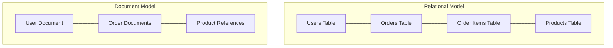

# Document Databases

## Introduction

Document databases are a type of NoSQL database that store data in flexible, semi-structured documents rather than in the rigid tables and rows of relational databases. These documents typically use formats like JSON, BSON, or XML, allowing for nested data structures and variable fields between documents in the same collection.

Document databases emerged as a solution to the limitations of traditional relational databases when dealing with large volumes of unstructured or semi-structured data, rapid development cycles, and the need for horizontal scalability.

## What Makes Document Databases Different?

Document databases differ from relational databases in several key ways:

1. **Schema Flexibility**: Documents in the same collection can have different fields and structures.
2. **Nested Data**: Documents can contain complex nested data structures, avoiding the need for complex joins.
3. **Horizontal Scalability**: Most document databases are designed to scale out across multiple servers.
4. **Simpler Queries**: Many document databases offer simpler query languages focused on document traversal.

Consider this comparison between relational and document models:



## Popular Document Databases

Some of the most widely used document databases include:

- **MongoDB**: Currently the most popular document database
- **CouchDB**: Known for its bidirectional replication and REST API
- **Firestore**: Google's document database for mobile and web applications
- **Amazon DocumentDB**: AWS's MongoDB-compatible document database service

## Basic Concepts

### Collections and Documents

In a document database, data is organized into **collections** (similar to tables in relational databases) containing **documents** (similar to rows). Unlike relational databases, documents in the same collection can have entirely different structures.

Here's a simple example of a document representing a user in JSON format:

```json
{
  "_id": "5f8d3b3e1c9d440000f7e4d1",
  "username": "janedoe",
  "email": "jane@example.com",
  "name": {
    "first": "Jane",
    "last": "Doe"
  },
  "interests": ["programming", "data science", "hiking"],
  "active": true,
  "signupDate": "2023-11-05T14:30:22Z"
}
```

Another document in the same collection might have a different structure:

```json
{
  "_id": "5f8d3b3e1c9d440000f7e4d2",
  "username": "johndoe",
  "email": "john@example.com",
  "fullName": "John Doe",
  "address": {
    "street": "123 Main St",
    "city": "Boston",
    "state": "MA",
    "zip": "02108"
  },
  "premium": true
}
```

Notice how these documents contain different fields but exist in the same collection.

### Document IDs

Each document typically has a unique identifier, often represented as `_id`. This identifier is automatically generated in many document databases, but you can also specify your own.

### Embedded Documents vs. References

Document databases provide two main ways to represent relationships between data:

1. **Embedded Documents**: Nesting related data within a document
2. **References**: Storing IDs of related documents (similar to foreign keys)

#### Embedded Documents Example

```json
{
  "_id": "order123",
  "customer": {
    "name": "Jane Doe",
    "email": "jane@example.com"
  },
  "items": [
    {
      "product": "Laptop",
      "price": 1299.99,
      "quantity": 1
    },
    {
      "product": "Mouse",
      "price": 25.99,
      "quantity": 2
    }
  ],
  "total": 1351.97,
  "date": "2023-11-10T09:45:00Z"
}
```

#### References Example

```json
{
  "_id": "order123",
  "customer_id": "cust456",
  "items": [
    {
      "product_id": "prod789",
      "quantity": 1
    },
    {
      "product_id": "prod101",
      "quantity": 2
    }
  ],
  "total": 1351.97,
  "date": "2023-11-10T09:45:00Z"
}
```

## Working with Document Databases: MongoDB Example

Let's see how to work with a document database using MongoDB, one of the most popular document databases.

### Basic CRUD Operations

Here are examples of Create, Read, Update, and Delete operations in MongoDB:

#### Creating Documents

```javascript
// Connect to MongoDB
const { MongoClient } = require('mongodb');
const uri = "mongodb://localhost:27017";
const client = new MongoClient(uri);

async function createDocument() {
  try {
    await client.connect();
    const database = client.db("bookstore");
    const books = database.collection("books");
    
    // Create a document
    const book = {
      title: "The Hobbit",
      author: "J.R.R. Tolkien",
      published: 1937,
      genres: ["fantasy", "adventure"],
      rating: 4.8,
      inStock: true
    };
    
    const result = await books.insertOne(book);
    console.log(`Book inserted with ID: ${result.insertedId}`);
  } finally {
    await client.close();
  }
}

createDocument();
```

Output:
```
Book inserted with ID: 61243a2b7f4d3a12e4b5c789
```

#### Reading Documents

```javascript
async function findBooks() {
  try {
    await client.connect();
    const database = client.db("bookstore");
    const books = database.collection("books");
    
    // Find all fantasy books
    const query = { genres: "fantasy" };
    const cursor = books.find(query);
    
    if ((await cursor.count()) === 0) {
      console.log("No fantasy books found!");
    } else {
      console.log("Fantasy books:");
      await cursor.forEach(book => {
        console.log(`${book.title} by ${book.author}`);
      });
    }
  } finally {
    await client.close();
  }
}

findBooks();
```

Output:
```
Fantasy books:
The Hobbit by J.R.R. Tolkien
The Fellowship of the Ring by J.R.R. Tolkien
```

#### Updating Documents

```javascript
async function updateBook() {
  try {
    await client.connect();
    const database = client.db("bookstore");
    const books = database.collection("books");
    
    // Update a document
    const filter = { title: "The Hobbit" };
    const update = {
      $set: {
        rating: 4.9,
        lastUpdated: new Date()
      }
    };
    
    const result = await books.updateOne(filter, update);
    console.log(`${result.matchedCount} document(s) matched the filter`);
    console.log(`${result.modifiedCount} document(s) were updated`);
  } finally {
    await client.close();
  }
}

updateBook();
```

Output:
```
1 document(s) matched the filter
1 document(s) were updated
```

#### Deleting Documents

```javascript
async function deleteBook() {
  try {
    await client.connect();
    const database = client.db("bookstore");
    const books = database.collection("books");
    
    // Delete a document
    const query = { title: "The Hobbit" };
    const result = await books.deleteOne(query);
    console.log(`${result.deletedCount} document(s) were deleted`);
  } finally {
    await client.close();
  }
}

deleteBook();
```

Output:
```
1 document(s) were deleted
```

### Querying Documents

MongoDB provides a rich query language for retrieving documents:

```javascript
async function queryExamples() {
  try {
    await client.connect();
    const database = client.db("bookstore");
    const books = database.collection("books");
    
    // Find books published after 1950
    const query1 = { published: { $gt: 1950 } };
    
    // Find books with specific genres (AND condition)
    const query2 = { genres: { $all: ["fantasy", "adventure"] } };
    
    // Find books with either "fantasy" OR "science fiction" genre
    const query3 = { genres: { $in: ["fantasy", "science fiction"] } };
    
    // Find books with a rating between 4.0 and 4.5
    const query4 = { rating: { $gte: 4.0, $lte: 4.5 } };
    
    // Complex query with multiple conditions
    const query5 = {
      $and: [
        { published: { $gte: 1900 } },
        { published: { $lte: 2000 } },
        { $or: [
          { author: "J.R.R. Tolkien" },
          { author: "George Orwell" }
        ]}
      ]
    };
    
    const cursor = books.find(query5);
    console.log("Books matching complex query:");
    await cursor.forEach(book => {
      console.log(`${book.title} (${book.published}) by ${book.author}`);
    });
  } finally {
    await client.close();
  }
}

queryExamples();
```

Output:
```
Books matching complex query:
The Hobbit (1937) by J.R.R. Tolkien
The Fellowship of the Ring (1954) by J.R.R. Tolkien
1984 (1949) by George Orwell
```

## Real-World Applications

Document databases are ideal for many modern application scenarios:

### 1. Content Management Systems

CMS platforms like blogs or news sites benefit from document databases because:
- Content items (posts, articles) have varying structures
- Nested comments and metadata fit naturally in documents
- Easy schema evolution as content requirements change

### 2. E-Commerce Applications

Online stores commonly use document databases for:
- Product catalogs with varying attributes per product category
- Customer profiles with different information based on user type
- Order history with nested line items and shipping details

### 3. Mobile Applications

Mobile apps often use document databases because:
- Offline-first capabilities with local replicas
- Easy synchronization with server when connectivity returns
- Flexible schema accommodates rapid app iteration

### 4. Event Logging and Analytics

Document databases excel at storing and analyzing events:
- Each event type can have different properties
- Documents can be easily timestamped and indexed
- Nested structures represent complex event data

## Example: Building a Simple Blog System

Let's design a simple blog system using MongoDB:

```javascript
// Define our document structures (conceptual, not code)
const postExample = {
  _id: "post123",
  title: "Introduction to Document Databases",
  slug: "intro-to-document-databases",
  content: "Document databases are a type of NoSQL database...",
  author: {
    _id: "user456",
    name: "Jane Developer",
    email: "jane@example.com"
  },
  tags: ["nosql", "databases", "mongodb"],
  comments: [
    {
      _id: "comment789",
      user: "john",
      content: "Great introduction!",
      createdAt: "2023-11-10T10:15:00Z"
    }
  ],
  createdAt: "2023-11-09T14:30:00Z",
  updatedAt: "2023-11-10T11:20:00Z",
  published: true,
  viewCount: 1275
};

// Function to create a new blog post
async function createPost(title, content, authorId, tags) {
  try {
    await client.connect();
    const database = client.db("blogapp");
    const posts = database.collection("posts");
    
    // Get author information
    const users = database.collection("users");
    const author = await users.findOne({ _id: authorId });
    
    if (!author) {
      throw new Error("Author not found");
    }
    
    const post = {
      title,
      slug: title.toLowerCase().replace(/\s+/g, '-').replace(/[^\w-]+/g, ''),
      content,
      author: {
        _id: author._id,
        name: author.name,
        email: author.email
      },
      tags: tags || [],
      comments: [],
      createdAt: new Date(),
      updatedAt: new Date(),
      published: false,
      viewCount: 0
    };
    
    const result = await posts.insertOne(post);
    return result.insertedId;
  } finally {
    await client.close();
  }
}

// Function to add a comment to a post
async function addComment(postId, username, content) {
  try {
    await client.connect();
    const database = client.db("blogapp");
    const posts = database.collection("posts");
    
    const comment = {
      _id: new ObjectId(),
      user: username,
      content,
      createdAt: new Date()
    };
    
    const result = await posts.updateOne(
      { _id: postId },
      { 
        $push: { comments: comment },
        $set: { updatedAt: new Date() }
      }
    );
    
    return result.modifiedCount > 0;
  } finally {
    await client.close();
  }
}

// Function to find posts by tag
async function findPostsByTag(tag) {
  try {
    await client.connect();
    const database = client.db("blogapp");
    const posts = database.collection("posts");
    
    const query = { 
      tags: tag,
      published: true
    };
    
    return await posts.find(query)
      .sort({ createdAt: -1 })
      .project({ title: 1, slug: 1, author: 1, createdAt: 1, tags: 1 })
      .toArray();
  } finally {
    await client.close();
  }
}
```

This example demonstrates how document databases make it easy to handle complex, nested data structures like blog posts with embedded comments and author information.

## Advantages and Disadvantages

### Advantages

1. **Schema Flexibility**: Add or remove fields without affecting other documents
2. **Nested Data Structures**: Store related data together in a single document
3. **Performance**: Faster access to document data without joins
4. **Horizontal Scalability**: Easily distribute data across multiple servers
5. **Developer Productivity**: Data structure matches application objects

### Disadvantages

1. **Lack of ACID Transactions**: Many document databases sacrifice some transactional guarantees (though this is changing with newer versions)
2. **Normalization Challenges**: Can lead to data duplication
3. **Query Limitations**: Complex queries across multiple collections can be challenging
4. **Less Mature**: Fewer standardized tools and practices compared to relational databases
5. **Learning Curve**: Different conceptual model than familiar SQL

## When to Use Document Databases

Document databases are particularly well-suited for:

- Applications with evolving data requirements
- Systems with complex, hierarchical data structures
- High-volume read/write operations
- Distributed systems requiring horizontal scaling
- Rapid development with changing schemas

They may not be the best choice for:

- Systems requiring complex transactions across multiple records
- Applications with highly interconnected data
- Scenarios where data integrity and consistency are paramount
- BI and reporting systems requiring complex aggregations

## Summary

Document databases are a powerful NoSQL solution that store data in flexible, JSON-like documents. They excel in scenarios requiring schema flexibility, nested data structures, and horizontal scalability. Popular implementations include MongoDB, CouchDB, and Firestore.

By removing the constraints of the rigid table structure found in relational databases, document databases allow developers to work with data in a way that closely matches how it's represented in modern programming languages, leading to faster development cycles and easier iteration.

While not a replacement for relational databases in all scenarios, document databases have earned their place in the modern data storage ecosystem, particularly for web and mobile applications dealing with semi-structured data.

## Further Learning

To deepen your understanding of document databases, consider exploring:

- MongoDB University: Free online courses on MongoDB
- The CouchDB Definitive Guide: Comprehensive guide to Apache CouchDB
- Data modeling patterns for document databases
- Performance optimization techniques for document queries
- Multi-document transactions in modern document databases

## Exercises

1. Design a document schema for an e-commerce product catalog that includes products with varying attributes based on category.
2. Create a simple Node.js application that performs CRUD operations on a MongoDB collection.
3. Convert a relational database schema (with at least three related tables) to an equivalent document database design.
4. Implement a function that efficiently retrieves nested data from a document database without overfetching.
5. Compare the performance of a complex query between a relational database and a document database.