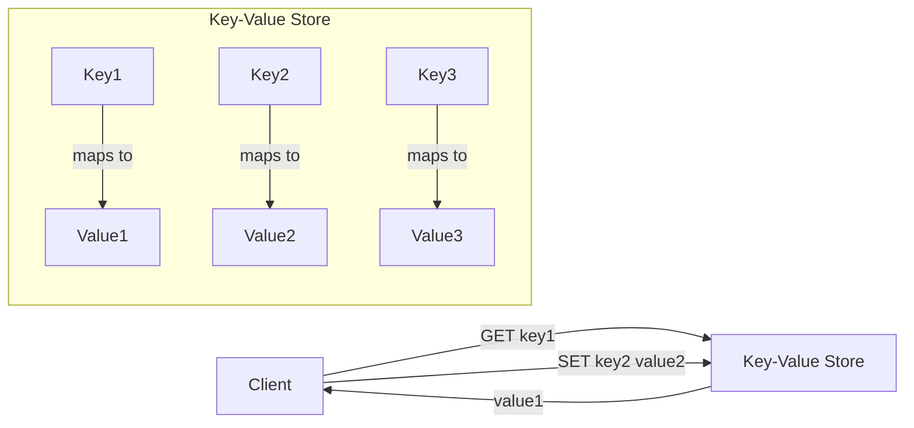

# Key-Value Stores

## Introduction

Key-Value Stores represent one of the simplest yet most powerful types of NoSQL databases. As the name suggests, these databases store data as collections of key-value pairs, similar to dictionaries or hash maps in programming languages.

Unlike relational databases that organize data in tables with predefined schemas, key-value stores offer a more flexible approach. They excel at scenarios requiring high-speed access to large volumes of data, especially when complex relationships between data elements aren't the primary concern.

## What are Key-Value Stores?

A key-value store is essentially a large hash table where:

- Each **key** is unique and used to identify the data
- Each **value** is the actual data being stored
- The values can be simple primitives (strings, numbers) or complex objects (JSON, blobs)



## Key Characteristics

Key-value stores are characterized by:

1. **Simplicity**: Their data model is straightforward and easy to understand
2. **High Performance**: Optimized for fast reads and writes 
3. **Scalability**: Can easily scale horizontally across multiple machines
4. **Schema-less**: No predefined structure for the values
5. **Eventual Consistency**: Many offer eventual consistency model for better performance

## Basic Operations

Key-value stores typically support these fundamental operations:

- **PUT**: Store a value with a given key
- **GET**: Retrieve a value by its key
- **DELETE**: Remove a key-value pair
- **UPDATE**: Modify the value associated with a key

Let's see how these operations look in practice using Redis, a popular key-value store:

```bash
# PUT operation
> SET username:1000 "john_doe"
OK

# GET operation
> GET username:1000
"john_doe"

# UPDATE operation
> SET username:1000 "johnny_doe"
OK

# DELETE operation
> DEL username:1000
(integer) 1

# Check if key exists
> EXISTS username:1000
(integer) 0
```

## Implementing a Simple Key-Value Store in Node.js

Let's implement a basic in-memory key-value store using JavaScript:

```javascript
class SimpleKeyValueStore {
  constructor() {
    this.store = {};
  }

  // Store a value
  put(key, value) {
    this.store[key] = value;
    return true;
  }

  // Retrieve a value
  get(key) {
    if (key in this.store) {
      return this.store[key];
    }
    return null;
  }

  // Delete a value
  delete(key) {
    if (key in this.store) {
      delete this.store[key];
      return true;
    }
    return false;
  }

  // Check if key exists
  has(key) {
    return key in this.store;
  }
}

// Usage example
const store = new SimpleKeyValueStore();
store.put("user:1", { name: "Alice", email: "alice@example.com" });
store.put("user:2", { name: "Bob", email: "bob@example.com" });

console.log(store.get("user:1")); // { name: "Alice", email: "alice@example.com" }
console.log(store.has("user:3")); // false
store.delete("user:1");
console.log(store.get("user:1")); // null
```

## Popular Key-Value Stores

Several key-value stores are widely used in production:

### Redis

Redis is an in-memory key-value store with optional persistence, known for its speed and versatility:

- Supports various data structures (strings, lists, sets, sorted sets, hashes)
- Includes features like pub/sub messaging, transactions, and Lua scripting
- Offers automatic expiration of keys

### Amazon DynamoDB

A fully managed, serverless key-value store by AWS:

- Provides automatic scaling and single-digit millisecond performance
- Supports both key-value and document data models
- Offers strong consistency and ACID transactions

### Riak

A distributed key-value store focusing on high availability:

- Designed with no single point of failure
- Supports multiple backends for storage
- Implements the Amazon Dynamo model for distribution

## When to Use Key-Value Stores

Key-value stores are particularly well-suited for:

1. **Caching**: Storing frequently accessed data to reduce database load
2. **Session Management**: Storing user session information in web applications
3. **User Profiles**: Storing user data indexed by user IDs
4. **Shopping Carts**: Storing temporary cart data keyed by session or user ID
5. **Real-time Analytics**: Collecting and processing streaming data
6. **Leaderboards and Counters**: Managing high-write data like game scores or page view counts

## Real-World Example: Session Store

Let's look at how to implement a session store for a web application using Redis:

```javascript
const express = require('express');
const redis = require('redis');
const session = require('express-session');
const RedisStore = require('connect-redis')(session);

const app = express();
const redisClient = redis.createClient({
  host: 'localhost',
  port: 6379
});

// Configure session middleware with Redis store
app.use(session({
  store: new RedisStore({ client: redisClient }),
  secret: 'your-secret-key',
  resave: false,
  saveUninitialized: false,
  cookie: { 
    secure: process.env.NODE_ENV === 'production',
    maxAge: 86400000 // 1 day in milliseconds
  }
}));

// Example route that uses session
app.get('/view-count', (req, res) => {
  // Initialize view count if not present
  if (!req.session.viewCount) {
    req.session.viewCount = 0;
  }
  
  // Increment the view count
  req.session.viewCount++;
  
  res.send(`You have visited this page ${req.session.viewCount} times.`);
});

app.listen(3000, () => {
  console.log('Server listening on port 3000');
});
```

This example shows how Redis can store session data with automatic expiration, providing fast access without overloading the main database.

## Advantages and Limitations

### Advantages

- **Performance**: Extremely fast read/write operations
- **Scalability**: Easy to scale horizontally
- **Flexibility**: No schema constraints
- **Simplicity**: Straightforward API and data model

### Limitations

- **Limited Query Capabilities**: No complex queries or joins
- **No Relationships**: Can't naturally model relationships between data
- **Eventual Consistency**: Some systems sacrifice immediate consistency for performance
- **No Transactions**: Many key-value stores don't support multi-operation transactions (though some like Redis do)

## Key Design Considerations

When implementing a key-value store in your application:

1. **Key Design**: Create meaningful, consistent key naming conventions
2. **Value Serialization**: Choose appropriate data formats for values (JSON, Protocol Buffers, etc.)
3. **Consistency Requirements**: Understand your application's consistency needs
4. **Expiration Policies**: Implement TTL (Time To Live) for temporary data
5. **Partitioning Strategy**: Plan how data will be distributed across nodes

## Summary

Key-value stores represent a fundamental shift from relational databases toward simpler, more scalable data storage solutions. Their straightforward data model and exceptional performance make them ideal for a wide range of use cases, from caching to session management to high-throughput data processing.

While they may not be suitable for complex relational data or applications requiring sophisticated querying, key-value stores excel at what they're designed for: fast, simple storage and retrieval of data by key.

## Additional Resources

- [Redis Documentation](https://redis.io/documentation)
- [Amazon DynamoDB Developer Guide](https://docs.aws.amazon.com/amazondynamodb/latest/developerguide/)
- [Riak Documentation](https://docs.riak.com/)

## Exercises

1. Implement a simple shopping cart using a key-value store approach.
2. Design a key naming convention for storing different types of user data.
3. Compare the performance of retrieving data from a key-value store versus a relational database.
4. Implement a caching layer using Redis in front of a relational database.
5. Create a leaderboard system using sorted sets in Redis.