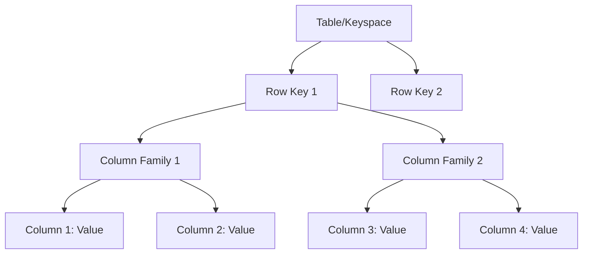

# Column-Family Stores

## Introduction

Column-family stores (also known as wide-column stores) are a type of NoSQL database that stores data in columns rather than rows. Unlike traditional relational databases where data is organized in tables with rows and columns, column-family stores group related columns together into "column families." This design provides high scalability, performance, and flexibility, making them ideal for handling massive amounts of data across distributed systems.

Popular examples of column-family stores include Apache Cassandra, HBase, and Google's Bigtable.

## Core Concepts

### Column Families

The fundamental organizational unit in column-family stores is the **column family**. A column family is a container for a group of related columns. Think of it as a way to organize data that's frequently accessed together.



### Rows and Row Keys

Each row in a column-family store is identified by a unique **row key**. Unlike relational databases, rows in different column families can have different columns, providing schema flexibility.

### Columns and Values

Columns consist of:
- A name/key
- A value
- A timestamp (often used for versioning)

## How Column-Family Stores Differ from Relational Databases

| Feature | Column-Family Stores | Relational Databases |
|---------|---------------------|----------------------|
| Schema | Flexible/dynamic | Fixed/rigid |
| Scaling | Horizontal scaling (distributed) | Primarily vertical scaling |
| Data model | Denormalized | Normalized |
| Query language | Often proprietary APIs | SQL |
| ACID compliance | Usually eventual consistency | Full ACID compliance |
| Best for | Big data, high write throughput | Complex transactions, joins |

## Code Examples

Let's explore how to work with column-family stores using Apache Cassandra as an example.

### Creating a Keyspace and Column Family in Cassandra

```sql
-- Create a keyspace (similar to a database in RDBMS)
CREATE KEYSPACE ecommerce 
WITH replication = {'class': 'SimpleStrategy', 'replication_factor': 3};

-- Create a column family (similar to a table)
CREATE TABLE ecommerce.products (
  product_id uuid PRIMARY KEY,
  name text,
  description text,
  price decimal,
  category text,
  stock_status map<text, int>
);
```

### Inserting Data

```sql
-- Insert data into the column family
INSERT INTO ecommerce.products (
  product_id, name, description, price, category, stock_status
) VALUES (
  uuid(), 
  'Smartphone X', 
  'Latest smartphone with advanced features', 
  799.99, 
  'Electronics',
  {'warehouse_a': 120, 'warehouse_b': 85}
);
```

### Querying Data

```sql
-- Basic query
SELECT * FROM ecommerce.products WHERE product_id = 550e8400-e29b-41d4-a716-446655440000;

-- Query with filtering (requires secondary index)
SELECT * FROM ecommerce.products WHERE category = 'Electronics';
```

## Column-Family Data Modeling Techniques

### Denormalization

Column-family stores typically embrace denormalization to optimize read performance. This means duplicating data rather than using joins.

### Wide Rows vs. Skinny Rows

- **Wide rows**: Store many columns in a single row (good for accessing many attributes of a single entity)
- **Skinny rows**: Store fewer columns (good when you need to scale to a massive number of rows)

## Real-World Applications

### Use Case 1: Time-Series Data

Column-family stores excel at handling time-series data, making them suitable for:
- IoT sensor readings
- Monitoring systems
- Financial market data

Example: Storing temperature readings from thousands of sensors

```sql
CREATE TABLE sensor_data (
  sensor_id text,
  timestamp timestamp,
  temperature decimal,
  humidity decimal,
  pressure decimal,
  PRIMARY KEY (sensor_id, timestamp)
) WITH CLUSTERING ORDER BY (timestamp DESC);
```

This design allows efficient querying of a single sensor's historical data in time order.

### Use Case 2: Content Management Systems

Column-family stores can efficiently handle content with variable attributes:

```sql
CREATE TABLE articles (
  article_id uuid,
  title text,
  author text,
  content text,
  tags set<text>,
  metadata map<text, text>,
  PRIMARY KEY (article_id)
);
```

The flexible schema allows some articles to have extensive metadata while others might have minimal information.

### Use Case 3: E-commerce Product Catalogs

Product catalogs benefit from the flexible schema of column-family stores:

```sql
CREATE TABLE products (
  product_id uuid,
  name text,
  brand text,
  price decimal,
  attributes map<text, text>,
  inventory map<text, int>,
  PRIMARY KEY (product_id)
);
```

This allows different product types to have different attributes without altering the schema.

## Popular Column-Family Database Systems

### Apache Cassandra

Cassandra is designed for high availability and linear scalability with no single point of failure.

**Key features:**
- Decentralized architecture
- Tunable consistency
- CQL (Cassandra Query Language)
- Multi-datacenter replication

### Apache HBase

HBase is built on top of Hadoop and designed for random, real-time read/write access to big data.

**Key features:**
- Strong consistency
- Automatic sharding
- Hadoop integration
- Region-based data distribution

### Google Cloud Bigtable

Bigtable is Google's fully managed column-family database service.

**Key features:**
- Low latency
- Seamless scaling
- Compatible with HBase API
- Integration with Google Cloud services

## Performance Considerations

### When to Use Column-Family Stores

Column-family stores are ideal when:
- You need to store massive amounts of data
- Your application requires high write throughput
- Your data has a natural hierarchical structure
- You need linear scalability
- You can design around eventual consistency

### When Not to Use Column-Family Stores

They may not be the best choice when:
- Your application requires complex joins
- You need ACID transactions
- Your data access patterns aren't well-defined
- Your dataset is relatively small

## Summary

Column-family stores offer a powerful approach to data storage that excels at handling massive datasets with high write throughput. Their flexible schema design and distributed architecture make them ideal for specific use cases like time-series data, content management, and product catalogs.

Key takeaways:
- Column-family stores organize data into column families, providing schema flexibility
- They prioritize scalability and performance over strict consistency
- They work best when data access patterns are known in advance
- Popular implementations include Cassandra, HBase, and Google Bigtable

## Exercises

1. Design a column-family schema for a social media application that needs to store user profiles and posts.
2. Compare and contrast how you would model a simple e-commerce database in a relational database versus a column-family store.
3. Write Cassandra CQL queries to create a column family for storing weather data from multiple locations and querying it efficiently.

## Additional Resources

- [Apache Cassandra Documentation](https://cassandra.apache.org/doc/latest/)
- [Apache HBase Reference Guide](https://hbase.apache.org/book.html)
- [Data Modeling in Apache Cassandra](https://www.datastax.com/dev/data-modeling)
- [Google Cloud Bigtable Documentation](https://cloud.google.com/bigtable/docs)