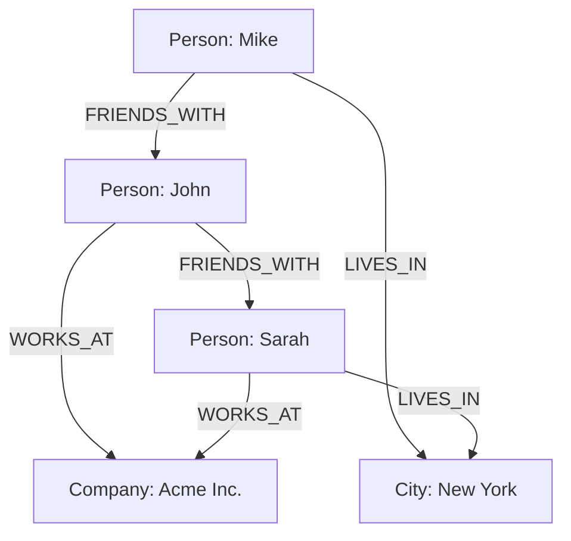
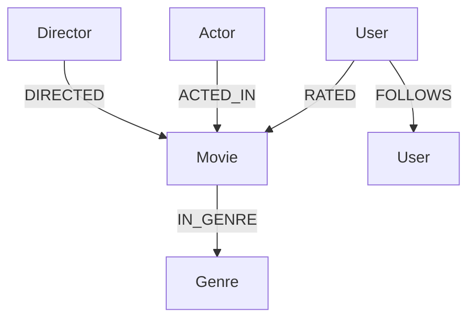

# Graph Databases

## Introduction

Graph databases are a powerful type of NoSQL database designed specifically for storing, managing, and querying highly connected data. Unlike traditional relational databases that organize data in tables, graph databases use a structure that resembles a mathematical graph - a collection of nodes (data entities) and edges (relationships between entities).

In a world where connections and relationships between data points are increasingly important - think social networks, recommendation engines, fraud detection systems, and knowledge graphs - graph databases offer an elegant and efficient way to handle these complex relationships.

## What is a Graph Database?

A graph database stores data in a graph structure where:

- **Nodes** represent entities (like a person, place, or thing)
- **Edges** represent relationships between nodes
- **Properties** can be attached to both nodes and edges to describe them

This structure makes it natural to represent connected data and efficient to query relationships, which can be challenging in traditional databases.

Let's visualize a simple graph database structure:



## Core Concepts of Graph Databases

### 1. Nodes

Nodes are the fundamental entities in a graph database. They can represent any object such as a person, place, thing, or concept.

- Each node can have labels to indicate its type (e.g., Person, Product)
- Nodes can have properties (key-value pairs) to store attributes

### 2. Edges (Relationships)

Edges connect nodes and represent relationships between them.

- Edges are **directional** (they have a start and end node)
- Edges can have types to describe the nature of the relationship (e.g., KNOWS, PURCHASED)
- Like nodes, edges can also have properties

### 3. Properties

Properties are key-value pairs that can be attached to both nodes and edges, providing additional information about them.

### 4. Traversal

Traversal is the process of navigating through a graph by following relationships from node to node. This is a fundamental operation in graph databases and is how queries are executed.

## When to Use Graph Databases

Graph databases excel when:

1. **Your data is highly connected** - When relationships between entities are as important as the entities themselves
2. **You need to perform complex queries on relationships** - When you frequently need to find patterns or paths in your data
3. **Your data has variable structure** - When entities can have different sets of properties
4. **Performance for relationship queries matters** - When traversing relationships needs to be fast

Common use cases include:

- Social networks
- Recommendation engines
- Fraud detection
- Knowledge graphs
- Network and IT operations
- Identity and access management

## Popular Graph Database Systems

Several graph database systems are available today, each with its own strengths:

### Neo4j

Neo4j is one of the most popular graph database systems. It uses a property graph model and comes with its own query language called Cypher.

### Amazon Neptune

A fully managed graph database service by AWS that supports both property graph and RDF models.

### JanusGraph

An open-source, distributed graph database with support for various storage backends.

### ArangoDB

A multi-model database that supports document, key/value, and graph data models.

## Basic Operations in Graph Databases

Let's look at some basic operations you might perform in a graph database, using Neo4j's Cypher query language as an example.

### Creating Nodes

```cypher
// Create a person node
CREATE (p:Person {name: 'John', age: 30})
```

This creates a node with label `Person` and properties `name` and `age`.

### Creating Relationships

```cypher
// Create two people and a relationship between them
CREATE (a:Person {name: 'Alice', age: 25})-[:FRIENDS_WITH {since: 2020}]->(b:Person {name: 'Bob', age: 27})
```

This creates two person nodes and a `FRIENDS_WITH` relationship between them, with a property indicating when they became friends.

### Querying Nodes

```cypher
// Find all people
MATCH (p:Person)
RETURN p

// Find people over 25
MATCH (p:Person)
WHERE p.age > 25
RETURN p.name, p.age
```

### Querying Relationships

```cypher
// Find friends of John
MATCH (p:Person {name: 'John'})-[:FRIENDS_WITH]->(friend)
RETURN friend.name

// Find friends of friends (2 levels deep)
MATCH (p:Person {name: 'John'})-[:FRIENDS_WITH]->()-[:FRIENDS_WITH]->(foaf)
RETURN DISTINCT foaf.name
```

## Practical Example: Building a Movie Recommendation System

Let's build a simple movie recommendation system using a graph database. We'll create a graph with movies, actors, directors, and users to demonstrate how graph databases can power recommendation engines.

### Data Model



### Example Queries

Finding movies to recommend to a user based on what their friends liked:

```cypher
// Find movies that a user's friends rated highly (4+ stars) but the user hasn't seen
MATCH (user:User {name: 'Alice'})-[:FOLLOWS]->(friend)-[rating:RATED]->(movie:Movie)
WHERE rating.stars >= 4
AND NOT EXISTS((user)-[:RATED]->(movie))
RETURN movie.title, COUNT(DISTINCT friend) as friendCount
ORDER BY friendCount DESC
LIMIT 10
```

Finding movies to recommend based on genre preferences:

```cypher
// Find movies in genres that a user typically rates highly
MATCH (user:User {name: 'Alice'})-[rating:RATED]->(movie:Movie)-[:IN_GENRE]->(genre)
WHERE rating.stars >= 4
WITH genre, COUNT(*) AS genreCount
ORDER BY genreCount DESC
LIMIT 3
MATCH (recommendedMovie:Movie)-[:IN_GENRE]->(genre)
WHERE NOT EXISTS((user)-[:RATED]->(recommendedMovie))
RETURN DISTINCT recommendedMovie.title, genre.name
LIMIT 15
```

## Advantages of Graph Databases

1. **Performance for connected data**: Graph databases can traverse millions of connections per second, making them much faster than relational databases for relationship-intensive queries.

2. **Intuitive data modeling**: The graph model often maps more naturally to how we think about and draw data relationships on a whiteboard.

3. **Flexibility**: Graph databases can easily adapt to changing business requirements without extensive schema changes.

4. **Powerful query capabilities**: They enable complex queries that would be difficult or inefficient to express in SQL.

## Challenges and Considerations

1. **Learning curve**: The graph data model and query languages require a different mindset from relational databases.

2. **Maturity**: While growing rapidly, the graph database ecosystem is not as mature as relational databases.

3. **Not ideal for all use cases**: For simple data with few relationships, a graph database may introduce unnecessary complexity.

4. **Scaling**: Some graph databases face challenges with horizontal scaling, though this is improving with newer systems.

## Code Example: Using Neo4j with JavaScript

Here's a simple example of how to connect to a Neo4j database using JavaScript (Node.js) with the official Neo4j driver:

```javascript
// First install the driver: npm install neo4j-driver
const neo4j = require('neo4j-driver');

// Connect to the database
const driver = neo4j.driver(
  'neo4j://localhost:7687',
  neo4j.auth.basic('username', 'password')
);

async function findFriendsOfFriends() {
  const session = driver.session();
  
  try {
    const result = await session.run(
      `MATCH (p:Person {name: $name})-[:FRIENDS_WITH]->()-[:FRIENDS_WITH]->(foaf)
       WHERE NOT (p)-[:FRIENDS_WITH]->(foaf)
       RETURN foaf.name AS friendOfFriend, COUNT(*) AS commonFriends
       ORDER BY commonFriends DESC`,
      { name: 'John' }
    );
    
    result.records.forEach(record => {
      console.log(
        `${record.get('friendOfFriend')} is a friend of a friend, ` +
        `with ${record.get('commonFriends')} common connections`
      );
    });
  } finally {
    await session.close();
  }
  
  // Close the driver when the application exits
  await driver.close();
}

findFriendsOfFriends();
```

Output example:
```
Sarah is a friend of a friend, with 3 common connections
Mike is a friend of a friend, with 2 common connections
Emma is a friend of a friend, with 1 common connections
```

## Summary

Graph databases provide a powerful way to work with connected data, offering significant advantages over traditional databases for certain use cases. By modeling data as nodes and relationships, they enable fast and intuitive queries on complex networks of information.

Key points to remember:
- Graph databases use nodes, edges, and properties to represent connected data
- They excel at traversing relationships and finding patterns in data
- Popular implementations include Neo4j, Amazon Neptune, and JanusGraph
- Common use cases include social networks, recommendations, and fraud detection
- They complement rather than replace traditional databases in a modern data architecture

## Exercises

1. Design a graph database model for a social media platform. What nodes and relationships would you include?

2. Using Neo4j's Cypher language or pseudocode, write a query to find all users who like similar movies to a given user but aren't yet friends with them.

3. Compare and contrast how you would model a product recommendation system in a relational database versus a graph database.

## Additional Resources

1. [Neo4j Graph Database Tutorial](https://neo4j.com/developer/get-started/)
2. [Free O'Reilly Book: Graph Databases](https://neo4j.com/graph-databases-book/)
3. [Graph Database Use Cases](https://neo4j.com/use-cases/)
4. [Cypher Query Language Reference](https://neo4j.com/docs/cypher-manual/current/)
5. [Graph Algorithms in Data Science](https://neo4j.com/docs/graph-data-science/current/)

---

Graph databases represent a fascinating intersection of computer science, mathematics, and real-world problem-solving. As your applications grow in complexity and your data becomes more interconnected, graph databases might be the perfect tool to unlock insights that would otherwise remain hidden in traditional data structures.