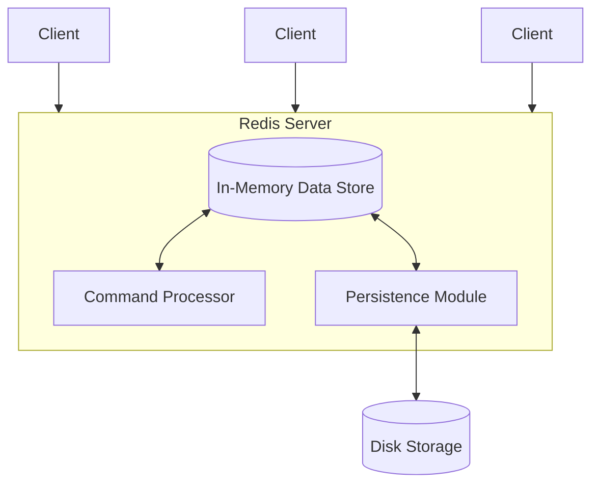

# Redis Basics

## Introduction

Redis (Remote Dictionary Server) is an open-source, in-memory data structure store that can be used as a database, cache, message broker, and streaming engine. Unlike traditional relational databases that store data on disk, Redis primarily stores data in memory, which makes it exceptionally fast and ideal for use cases requiring low-latency data access.

As a NoSQL database, Redis belongs to the key-value store family, but it's much more than a simple key-value store. Redis supports various data structures such as strings, hashes, lists, sets, sorted sets, bitmaps, hyperloglogs, and geospatial indexes, making it versatile for many different applications.

## Key Features of Redis

- **In-memory storage**: Provides extremely fast data access
- **Persistence options**: Can save data to disk for durability
- **Data structures**: Supports multiple data structures beyond simple key-value pairs
- **Atomic operations**: Guarantees that operations are executed without interruption
- **Built-in replication**: Allows for high availability setups
- **Lua scripting**: Enables custom commands and complex operations
- **Transactions**: Allows for executing multiple commands as a single atomic operation
- **Pub/Sub messaging**: Implements the publish/subscribe messaging paradigm

## Redis Architecture Visualization



## Installation and Setup

### Installing Redis

#### On Ubuntu/Debian Linux:

```bash
sudo apt update
sudo apt install redis-server
```

#### On macOS (using Homebrew):

```bash
brew install redis
```

#### On Windows:

Windows is not officially supported, but you can use:
- Windows Subsystem for Linux (WSL)
- Docker
- Redis Windows port (unofficial)

### Starting Redis Server

```bash
redis-server
```

You should see output similar to:

```
                _._                                                  
           _.-``__ ''-._                                             
      _.-``    `.  `_.  ''-._           Redis 7.0.11 (3c9abbf6/0) 64 bit
  .-`` .-```.  ```\/    _.,_ ''-._                                  
 (    '      ,       .-`  | `,    )     Running in standalone mode
 |`-._`-...-` __...-.``-._|'` _.-'|     Port: 6379
 |    `-._   `._    /     _.-'    |     PID: 1833
  `-._    `-._  `-./  _.-'    _.-'                                   
 |`-._`-._    `-.__.-'    _.-'_.-'|                                  
 |    `-._`-._        _.-'_.-'    |           https://redis.io       
  `-._    `-._`-.__.-'_.-'    _.-'                                   
 |`-._`-._    `-.__.-'    _.-'_.-'|                                  
 |    `-._`-._        _.-'_.-'    |                                  
  `-._    `-._`-.__.-'_.-'    _.-'                                   
      `-._    `-.__.-'    _.-'                                       
          `-._        _.-'                                           
              `-.__.-'                                               
```

### Connecting to Redis

Use the Redis CLI to connect to a Redis server:

```bash
redis-cli
```

This will connect to the local Redis server on the default port (6379). You should see:

```
127.0.0.1:6379>
```

Now you're ready to start using Redis commands!

## Redis Data Types

Redis supports several data types, each with specific use cases and commands.

### Strings

Strings are the simplest data type in Redis. They can hold text, integers, or binary data up to 512MB.

#### Basic String Operations

```
> SET username "john_doe"
OK
> GET username
"john_doe"
> EXISTS username
(integer) 1
> DEL username
(integer) 1
> EXISTS username
(integer) 0
```

#### Working with Numbers

```
> SET counter 1
OK
> INCR counter
(integer) 2
> INCRBY counter 8
(integer) 10
> GET counter
"10"
> DECR counter
(integer) 9
```

### Lists

Lists in Redis are linked lists that can be pushed or popped from both ends.

```
> LPUSH tasks "send email"
(integer) 1
> LPUSH tasks "write report"
(integer) 2
> LPUSH tasks "call client"
(integer) 3
> LRANGE tasks 0 -1
1) "call client"
2) "write report"
3) "send email"
> RPOP tasks
"send email"
> LRANGE tasks 0 -1
1) "call client"
2) "write report"
```

### Sets

Sets are unordered collections of unique strings.

```
> SADD fruits "apple"
(integer) 1
> SADD fruits "banana" "orange"
(integer) 2
> SMEMBERS fruits
1) "orange"
2) "banana"
3) "apple"
> SISMEMBER fruits "apple"
(integer) 1
> SISMEMBER fruits "grape"
(integer) 0
> SCARD fruits
(integer) 3
```

### Hashes

Hashes are maps between string fields and string values, perfect for representing objects.

```
> HSET user:1000 username "john_doe" email "john@example.com" age 28
(integer) 3
> HGET user:1000 username
"john_doe"
> HGETALL user:1000
1) "username"
2) "john_doe"
3) "email"
4) "john@example.com"
5) "age"
6) "28"
> HINCRBY user:1000 age 1
(integer) 29
```

### Sorted Sets

Sorted sets combine sets with a score for each element, allowing for ordered operations.

```
> ZADD leaderboard 100 "player1"
(integer) 1
> ZADD leaderboard 80 "player2"
(integer) 1
> ZADD leaderboard 120 "player3"
(integer) 1
> ZRANGE leaderboard 0 -1 WITHSCORES
1) "player2"
2) "80"
3) "player1"
4) "100"
5) "player3"
6) "120"
> ZREVRANGE leaderboard 0 -1 WITHSCORES
1) "player3"
2) "120"
3) "player1"
4) "100"
5) "player2"
6) "80"
```

## Key Naming Conventions and Expiration

### Key Naming Best Practices

Redis has a flat key space without namespaces, so it's common to use colons as separators:

```
user:1000:profile
user:1000:sessions
product:electronics:laptops
```

### Setting Expiration on Keys

Redis allows setting TTL (Time To Live) on keys:

```
> SET session:token "ABC123"
OK
> EXPIRE session:token 3600  # Expire in 3600 seconds (1 hour)
(integer) 1
> TTL session:token
(integer) 3598
> SET temp:otp "123456" EX 300  # Set with expiration in one command
OK
```

## Redis Persistence

Redis offers different persistence options:

1. **RDB (Redis Database)**: Point-in-time snapshots at specified intervals
2. **AOF (Append Only File)**: Logs every write operation
3. **Combined**: Using both methods together

These are configured in the `redis.conf` file:

```
# RDB Configuration
save 900 1
save 300 10
save 60 10000

# AOF Configuration
appendonly yes
appendfsync everysec
```

## Practical Examples

### Example 1: Implementing a Simple Cache

```javascript
// Pseudocode for using Redis as a cache
function getUserData(userId) {
  // Try to get from cache first
  const cachedData = redis.get(`user:${userId}:profile`)
  
  if (cachedData) {
    return JSON.parse(cachedData)
  }
  
  // If not in cache, fetch from database
  const userData = database.fetchUser(userId)
  
  // Store in cache with expiration
  redis.set(`user:${userId}:profile`, JSON.stringify(userData), 'EX', 3600)
  
  return userData
}
```

### Example 2: Implementing a Rate Limiter

```javascript
// Pseudocode for a Redis-based rate limiter
function isRateLimited(userId, maxRequests, timeWindowInSeconds) {
  const key = `ratelimit:${userId}`
  
  // Increment counter
  const currentCount = redis.incr(key)
  
  // Set expiry on first request
  if (currentCount === 1) {
    redis.expire(key, timeWindowInSeconds)
  }
  
  // Check if rate limited
  return currentCount > maxRequests
}

// Usage
if (isRateLimited('user123', 10, 60)) {
  return '429 Too Many Requests'
} else {
  // Process the request
}
```

### Example 3: Implementing a Leaderboard

```javascript
// Pseudocode for a Redis-based leaderboard
function updateScore(userId, score) {
  redis.zadd('leaderboard', score, userId)
}

function getTopUsers(count) {
  return redis.zrevrange('leaderboard', 0, count - 1, 'WITHSCORES')
}

function getUserRank(userId) {
  return redis.zrevrank('leaderboard', userId) + 1 // +1 because Redis ranks are 0-based
}
```

## Redis CLI Common Commands Cheatsheet

Here's a quick reference for some of the most commonly used Redis CLI commands:

| Command | Description | Example |
|---------|-------------|---------|
| `SET` | Set key to hold string value | `SET name "John"` |
| `GET` | Get value of key | `GET name` |
| `DEL` | Delete a key | `DEL name` |
| `EXISTS` | Check if key exists | `EXISTS name` |
| `EXPIRE` | Set key expiration in seconds | `EXPIRE session 3600` |
| `TTL` | Get remaining time to live | `TTL session` |
| `INCR` | Increment integer value | `INCR counter` |
| `LPUSH` | Insert at the head of a list | `LPUSH tasks "new task"` |
| `RPUSH` | Insert at the tail of a list | `RPUSH logs "event"` |
| `LRANGE` | Get elements from a list | `LRANGE tasks 0 -1` |
| `HSET` | Set field in a hash | `HSET user name "John"` |
| `HGET` | Get field from a hash | `HGET user name` |
| `HGETALL` | Get all fields & values from hash | `HGETALL user` |
| `SADD` | Add members to a set | `SADD tags "redis"` |
| `SMEMBERS` | Get all members of a set | `SMEMBERS tags` |
| `ZADD` | Add to a sorted set | `ZADD scores 10 "player1"` |
| `ZRANGE` | Get range from sorted set | `ZRANGE scores 0 -1` |
| `KEYS` | Find all keys matching pattern | `KEYS user:*` |
| `FLUSHDB` | Remove all keys from current DB | `FLUSHDB` |
| `INFO` | Get server info and stats | `INFO` |

## Redis in Production

When deploying Redis in production, consider:

1. **Memory management**: Configure `maxmemory` and eviction policies
2. **Replication**: Set up master-slave replication for high availability
3. **Clustering**: Distribute data across multiple nodes for scalability
4. **Security**: Configure authentication and network security
5. **Monitoring**: Track metrics like memory usage, connections, and operations

## Summary

Redis is a versatile, high-performance NoSQL database that excels in scenarios requiring fast data access, caching, real-time analytics, and message brokering. Its in-memory nature and support for various data structures make it an excellent choice for many modern application architectures.

We've covered:
- Basic Redis concepts and features
- Installation and setup
- Core data types and operations
- Key naming conventions and expiration
- Persistence options
- Practical examples of Redis use cases

## Further Learning

To deepen your knowledge of Redis, consider:

1. Exploring Redis modules like RediSearch, RedisGraph, and RedisTimeSeries
2. Learning about Redis Streams for log processing and messaging
3. Implementing Redis Pub/Sub for real-time messaging applications
4. Studying Redis Lua scripting for complex operations
5. Deploying Redis in a clustered environment for scalability

## Practice Exercises

1. Implement a simple URL shortener using Redis
2. Create a basic session management system
3. Build a real-time chat application using Redis Pub/Sub
4. Design a job queue system with Redis Lists
5. Develop a social media timeline using Redis Sorted Sets