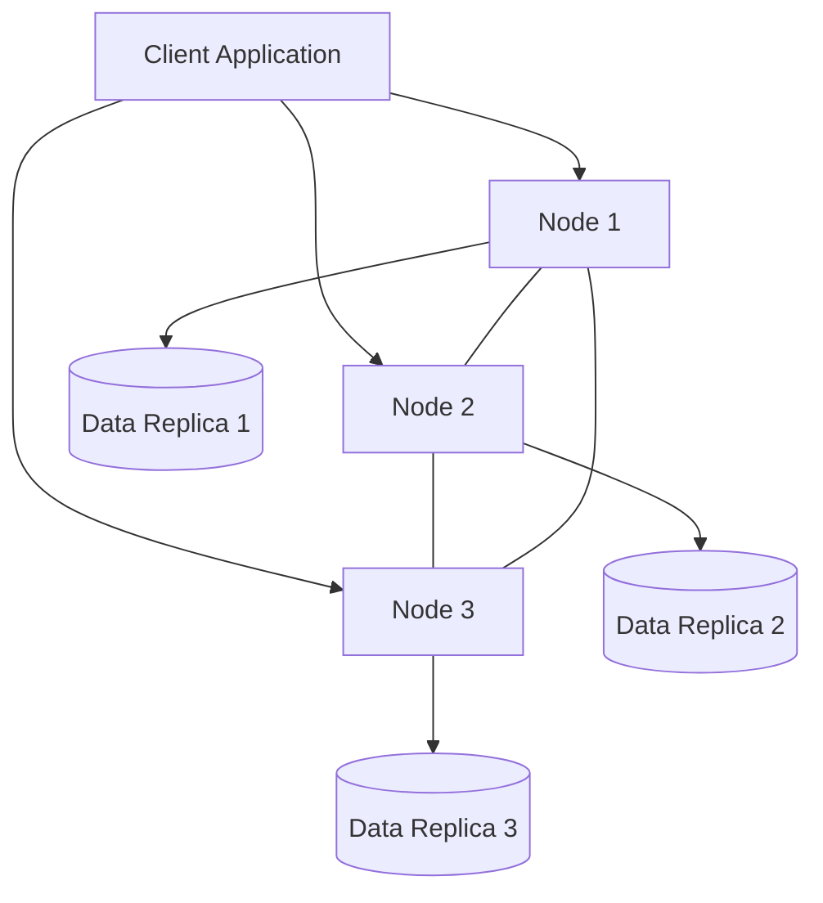

# Cassandra Basics

## Introduction

Apache Cassandra is a highly scalable, distributed NoSQL database designed to handle large amounts of data across many commodity servers, providing high availability with no single point of failure. Originally developed at Facebook to power their Inbox Search feature, Cassandra was released as an open-source project in 2008 and later became a top-level Apache project.

Cassandra is particularly well-suited for applications that cannot afford to lose data, require high performance, and need to scale horizontally with ease. Unlike traditional relational databases, Cassandra uses a ring architecture and offers a flexible schema that can adapt to changing application requirements.

## Key Features of Cassandra

- **Distributed**: Data is automatically replicated across multiple nodes
- **Decentralized**: No single point of failure; every node is identical
- **Scalable**: Linear scalability—just add more nodes to increase capacity
- **Fault-Tolerant**: Data is replicated across nodes for redundancy
- **Tunable Consistency**: Balance between consistency and availability
- **High Performance**: Optimized for write operations
- **Column-oriented**: Stores data in column families rather than rows

## Cassandra Architecture

Cassandra employs a masterless "ring" architecture that distributes data across multiple nodes. This design provides several advantages:



### Node Structure

Each node in a Cassandra cluster contains:

1. **Partitioner**: Determines how data is distributed across nodes
2. **Snitch**: Defines network topology and helps route requests efficiently
3. **Gossip Protocol**: Communication method for nodes to share their state
4. **Memtables**: In-memory write-back caches for recent writes
5. **SSTables**: Immutable, persistent data files on disk

### Data Distribution

Cassandra distributes data using consistent hashing. When data is written:

1. The partitioner hashes the partition key
2. The hash value determines which node stores the data
3. Data is replicated to multiple nodes based on the replication factor
4. Write operations are considered successful when enough replicas acknowledge

## Cassandra Data Model

Cassandra organizes data into:

- **Keyspace**: Similar to a database in RDBMS
- **Table/Column Family**: Similar to a table in RDBMS
- **Row**: A collection of columns identified by a primary key
- **Column**: A name-value pair with a timestamp

### Data Modeling Concepts

When designing a Cassandra data model, remember:

1. **Query-driven design**: Model your tables based on the queries you'll run
2. **Denormalization**: Duplicate data to avoid joins (Cassandra doesn't support joins)
3. **Wide rows**: Group related data in a single row using clustering columns
4. **Primary keys**: Consist of partition key (determines data distribution) and clustering columns (determines data ordering)

## Basic Cassandra Query Language (CQL)

Cassandra Query Language (CQL) provides a SQL-like interface for interacting with Cassandra. Let's look at some basic CQL operations:

### Create a Keyspace

```sql
CREATE KEYSPACE ecommerce 
WITH replication = {'class': 'SimpleStrategy', 'replication_factor': 3};
```

### Create a Table

```sql
USE ecommerce;

CREATE TABLE products (
  product_id UUID PRIMARY KEY,
  name TEXT,
  category TEXT,
  price DECIMAL,
  inventory INT,
  description TEXT
);
```

### Insert Data

```sql
INSERT INTO products (product_id, name, category, price, inventory, description)
VALUES (uuid(), 'Laptop XPS 15', 'Electronics', 1299.99, 50, 'High-performance laptop');

INSERT INTO products (product_id, name, category, price, inventory, description)
VALUES (uuid(), 'Coffee Maker', 'Kitchen', 89.99, 100, 'Programmable coffee maker');
```

### Query Data

```sql
-- Get all products
SELECT * FROM products;

-- Get a specific product
SELECT * FROM products WHERE product_id = 550e8400-e29b-41d4-a716-446655440000;

-- Get products by category (requires a secondary index)
CREATE INDEX ON products(category);
SELECT * FROM products WHERE category = 'Electronics';
```

### Update Data

```sql
UPDATE products 
SET price = 1199.99, inventory = 45 
WHERE product_id = 550e8400-e29b-41d4-a716-446655440000;
```

### Delete Data

```sql
DELETE FROM products 
WHERE product_id = 550e8400-e29b-41d4-a716-446655440000;
```

## Consistency Levels

One of Cassandra's key features is tunable consistency. You can specify the consistency level for each operation, balancing between data consistency, availability, and partition tolerance.

Some common consistency levels:

- **ONE**: Write/read must be confirmed by at least one node
- **QUORUM**: A majority of replicas must respond
- **ALL**: All replicas must respond
- **LOCAL_QUORUM**: A majority of replicas in the local datacenter must respond
- **EACH_QUORUM**: A majority of replicas in each datacenter must respond

Example of setting consistency level in a query:

```sql
CONSISTENCY QUORUM;
SELECT * FROM products WHERE product_id = 550e8400-e29b-41d4-a716-446655440000;
```

## Real-World Use Case: Product Catalog

Let's design a simple product catalog for an e-commerce platform. We need to:

1. Store product information
2. Allow queries by product ID
3. Allow queries by category
4. Track inventory
5. Maintain product reviews

### Schema Design

```sql
-- Create keyspace
CREATE KEYSPACE ecommerce 
WITH replication = {'class': 'NetworkTopologyStrategy', 'DC1': 3, 'DC2': 2};

USE ecommerce;

-- Products table
CREATE TABLE products (
  product_id UUID PRIMARY KEY,
  name TEXT,
  category TEXT,
  price DECIMAL,
  inventory INT,
  description TEXT,
  created_at TIMESTAMP,
  last_updated TIMESTAMP
);

-- Create an index for category queries
CREATE INDEX ON products(category);

-- Products by category (for efficient category-based queries)
CREATE TABLE products_by_category (
  category TEXT,
  product_id UUID,
  name TEXT,
  price DECIMAL,
  inventory INT,
  PRIMARY KEY (category, product_id)
);

-- Product reviews
CREATE TABLE product_reviews (
  product_id UUID,
  review_id TIMEUUID,
  customer_id UUID,
  rating INT,
  review_text TEXT,
  review_date TIMESTAMP,
  PRIMARY KEY (product_id, review_id)
) WITH CLUSTERING ORDER BY (review_id DESC);
```

### Sample Data Operations

Insert a product:

```sql
INSERT INTO products (
  product_id, name, category, price, inventory, description, created_at, last_updated
) VALUES (
  uuid(), 'Smartphone X', 'Electronics', 699.99, 200, 
  '5G smartphone with 6.7" display and 128GB storage', 
  toTimestamp(now()), toTimestamp(now())
);
```

Query products by category:

```sql
SELECT * FROM products_by_category WHERE category = 'Electronics';
```

Add a product review:

```sql
INSERT INTO product_reviews (
  product_id, review_id, customer_id, rating, review_text, review_date
) VALUES (
  550e8400-e29b-41d4-a716-446655440000, now(), 
  123e4567-e89b-12d3-a456-426614174000, 
  5, 'Great product, very happy with my purchase!', toTimestamp(now())
);
```

Get all reviews for a product:

```sql
SELECT * FROM product_reviews 
WHERE product_id = 550e8400-e29b-41d4-a716-446655440000;
```

## Performance Considerations

When working with Cassandra, keep these best practices in mind:

1. **Minimize the number of partitions read** for a single query
2. **Keep related data in the same partition** when possible
3. **Use clustering columns** for range queries
4. **Avoid collection types** for large datasets
5. **Use the ALLOW FILTERING clause sparingly**, as it can lead to performance issues
6. **Set appropriate TTL (Time to Live)** for data that should expire
7. **Use batch statements carefully**, as they can cause performance issues

## Cassandra vs. Traditional RDBMS

| Feature | Cassandra | RDBMS |
|---------|-----------|-------|
| Data Model | Column-family/NoSQL | Relational |
| Schema | Flexible | Rigid |
| Scaling | Horizontal (add nodes) | Vertical (upgrade server) |
| Consistency | Tunable | ACID |
| Joins | Not supported | Supported |
| Transactions | Limited support | Fully supported |
| Best for | Write-heavy, distributed applications | Complex queries, transactions |

## Setting Up Cassandra Locally

To get started with Cassandra on your local machine:

1. Install Java (JDK 8 or later)
2. Download Cassandra from [Apache Cassandra](https://cassandra.apache.org/download/)
3. Extract the downloaded file
4. Set environment variables:
   ```bash
   export CASSANDRA_HOME=/path/to/cassandra
   export PATH=$PATH:$CASSANDRA_HOME/bin
   ```
5. Start Cassandra:
   ```bash
   cassandra -f
   ```
6. Connect using CQL shell:
   ```bash
   cqlsh
   ```

## Summary

Apache Cassandra is a powerful, distributed NoSQL database designed for high availability and scalability. Its key strengths include:

- Masterless architecture with no single point of failure
- Linear scalability by simply adding more nodes
- Tunable consistency levels to balance between consistency and availability
- High write throughput for data-intensive applications
- Flexible schema that can evolve with your application needs

Cassandra excels in use cases like time-series data, product catalogs, recommendation engines, and other scenarios requiring high write throughput and horizontal scalability. While it may not be the best choice for applications requiring complex transactions or joins, its robust architecture makes it ideal for large-scale, distributed applications where uptime and fault tolerance are critical.

## Additional Resources

- [Apache Cassandra Documentation](https://cassandra.apache.org/doc/latest/)
- [DataStax Academy](https://www.datastax.com/learn) - Free Cassandra courses
- [Cassandra: The Definitive Guide](https://www.oreilly.com/library/view/cassandra-the-definitive/9781492097136/) by Eben Hewitt & Jeff Carpenter

## Exercises

1. Set up a local Cassandra instance and create a keyspace for a social media application.
2. Design a data model for storing user profiles, posts, and comments.
3. Write CQL queries to:
   - Create the necessary tables
   - Insert sample data
   - Retrieve a user's posts
   - Retrieve comments for a specific post
4. Experiment with different consistency levels and observe the behavior.
5. Implement a simple application that connects to your Cassandra instance and performs CRUD operations.