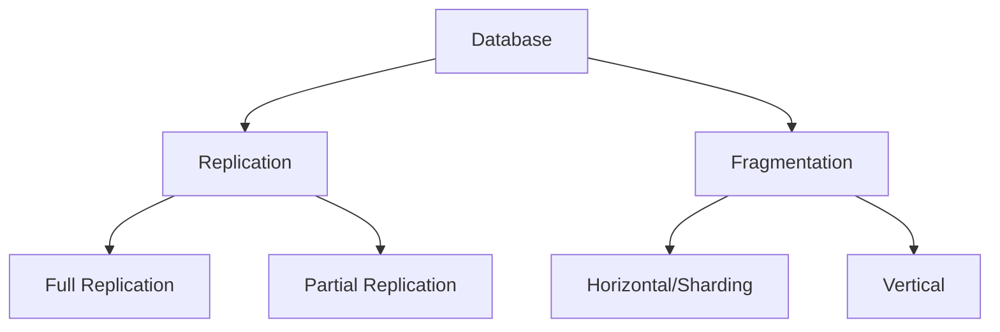
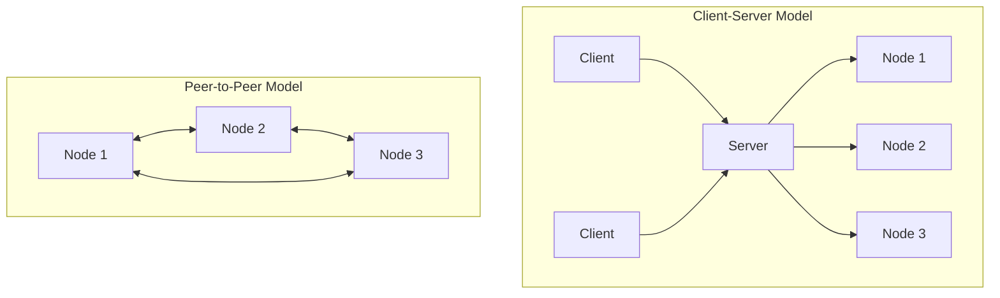
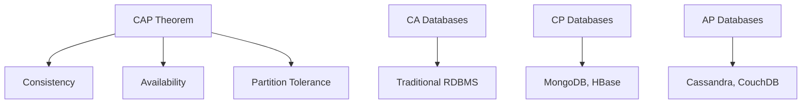

# Distributed Database Concepts

## Introduction

A distributed database is a collection of multiple, logically interrelated databases distributed across a computer network. Unlike traditional centralized databases where all data resides on a single server, distributed databases spread data across multiple physical locations that can communicate with each other. This approach fundamentally changes how we store, access, and manage data at scale.

In today's data-driven world, the ability to handle massive amounts of information efficiently is crucial. Distributed databases emerged as a solution to the limitations of centralized databases, particularly when dealing with large-scale applications serving users worldwide.

## Key Distributed Database Concepts

### 1. Data Distribution

Data distribution refers to how data is spread across multiple nodes in a distributed database system.

#### Types of Data Distribution

- **Replication**: Creating and maintaining duplicate copies of the database on multiple nodes.
- **Fragmentation**: Dividing a database into logical pieces and storing them on different nodes.
  - **Horizontal Fragmentation (Sharding)**: Splits tables by rows
  - **Vertical Fragmentation**: Splits tables by columns



#### Example of Horizontal Fragmentation (Sharding)

Consider a `users` table with millions of records. With sharding, we might split it by user ID ranges:

```sql
-- Shard 1: Users with IDs 1-1,000,000
CREATE TABLE users_shard1 (
  user_id INT PRIMARY KEY,
  username VARCHAR(50),
  email VARCHAR(100),
  -- other columns
) WHERE user_id BETWEEN 1 AND 1000000;

-- Shard 2: Users with IDs 1,000,001-2,000,000
CREATE TABLE users_shard2 (
  user_id INT PRIMARY KEY,
  username VARCHAR(50),
  email VARCHAR(100),
  -- other columns
) WHERE user_id BETWEEN 1000001 AND 2000000;
```

### 2. Distributed Architecture Models

#### Client-Server Model

In this model, client applications connect to a server that coordinates data access across the distributed system.

#### Peer-to-Peer Model

Nodes can act as both clients and servers, with no central coordinator.



### 3. ACID vs. BASE Properties

Distributed databases often must make tradeoffs between consistency and availability.

#### ACID Properties (Traditional Databases)

- **Atomicity**: Transactions are all-or-nothing
- **Consistency**: Transactions maintain database integrity
- **Isolation**: Concurrent transactions don't interfere
- **Durability**: Committed transactions are permanent

#### BASE Properties (Many Distributed Databases)

- **Basically Available**: System guarantees availability
- **Soft state**: State may change without input
- **Eventually consistent**: System will become consistent over time

### 4. CAP Theorem

The CAP theorem states that a distributed database system can only guarantee two of the following three properties simultaneously:

- **Consistency**: All nodes see the same data at the same time
- **Availability**: Every request receives a response
- **Partition Tolerance**: System continues to operate despite network failures



## Real-World Applications

### Example 1: Global E-commerce Platform

An e-commerce company operating worldwide might use a distributed database setup:

```javascript
// Pseudocode for retrieving product information
async function getProductDetails(productId) {
  // Determine which region the request is coming from
  const userRegion = determineUserRegion();
  
  // Connect to the nearest database node
  const dbConnection = await connectToRegionalDatabase(userRegion);
  
  // Retrieve product data
  const productData = await dbConnection.query(
    `SELECT * FROM products WHERE id = ${productId}`
  );
  
  return productData;
}
```

In this example, product data is replicated across multiple regions. Users automatically connect to the nearest database node, reducing latency.

### Example 2: Financial System Using Sharding

A banking application might shard customer data by account number ranges:

```python
def transfer_money(from_account, to_account, amount):
    # Determine which shard contains each account
    from_shard = determine_shard(from_account)
    to_shard = determine_shard(to_account)
    
    # Start a distributed transaction
    transaction = begin_distributed_transaction()
    
    try:
        # Debit from source account
        from_shard.execute(
            "UPDATE accounts SET balance = balance - %s WHERE account_number = %s",
            (amount, from_account)
        )
        
        # Credit to destination account
        to_shard.execute(
            "UPDATE accounts SET balance = balance + %s WHERE account_number = %s",
            (amount, to_account)
        )
        
        # Commit the transaction
        transaction.commit()
        return True
    except Exception as e:
        # Rollback in case of error
        transaction.rollback()
        log_error(e)
        return False
```

This example demonstrates how a distributed database handles transactions that span multiple shards.

## Common Challenges and Solutions

### 1. Distributed Transactions

Managing transactions across multiple nodes is complex. Solutions include:

- Two-Phase Commit (2PC)
- Three-Phase Commit (3PC)
- Saga Pattern

### 2. Concurrency Control

Preventing conflicts when multiple users access the same data:

- Optimistic concurrency control
- Pessimistic locking
- Multi-version concurrency control (MVCC)

### 3. Data Consistency

Ensuring data remains consistent across nodes:

```javascript
// Example of implementing eventual consistency
async function updateUserProfile(userId, newData) {
  // Update primary node immediately
  await primaryNode.update('users', userId, newData);
  
  // Queue asynchronous updates to replica nodes
  replicaNodes.forEach(node => {
    messageQueue.send({
      type: 'PROFILE_UPDATE',
      userId: userId,
      data: newData,
      timestamp: Date.now()
    });
  });
  
  return { status: 'success', message: 'Profile updated (replicas syncing)' };
}
```

## Popular Distributed Database Systems

### SQL-Based Distributed Databases
- Google Spanner
- CockroachDB
- VoltDB

### NoSQL Distributed Databases
- Cassandra (Wide-column)
- MongoDB (Document)
- Redis (Key-value)
- Neo4j (Graph)

## Implementation Example: Setting Up a Basic Cassandra Cluster

Cassandra is a popular distributed NoSQL database that exemplifies many of the concepts we've discussed.

### Step 1: Define a Keyspace (Database)

```sql
CREATE KEYSPACE ecommerce
WITH replication = {
  'class': 'SimpleStrategy',
  'replication_factor': 3
};
```

This creates a keyspace with a replication factor of 3, meaning data is stored on three different nodes.

### Step 2: Create a Table with Appropriate Partitioning

```sql
USE ecommerce;

CREATE TABLE products (
  product_id UUID,
  name TEXT,
  category TEXT,
  price DECIMAL,
  inventory INT,
  PRIMARY KEY (category, product_id)
);
```

The `PRIMARY KEY (category, product_id)` definition means data is partitioned by category, which determines which node stores the data.

### Step 3: Inserting and Retrieving Data

```sql
-- Insert data
INSERT INTO products (product_id, name, category, price, inventory)
VALUES (uuid(), 'Laptop XPS', 'Electronics', 1299.99, 50);

-- Query by partition key (efficient)
SELECT * FROM products WHERE category = 'Electronics';

-- Query without partition key (inefficient, requires scanning all nodes)
SELECT * FROM products WHERE name = 'Laptop XPS' ALLOW FILTERING;
```

This example demonstrates how query efficiency is affected by the partitioning strategy.

## Summary

Distributed database systems solve critical challenges in modern computing by:

1. Scaling horizontally to handle massive amounts of data
2. Providing high availability through redundancy
3. Reducing latency by placing data closer to users
4. Improving fault tolerance against hardware failures

However, these benefits come with tradeoffs in consistency, complexity, and operational overhead. Understanding the concepts covered in this guide will help you make informed decisions when designing and working with distributed database systems.

## Exercises

1. Design a distributed database schema for a social media application. Consider how you would shard the data and what replication strategy you would use.

2. Explain the tradeoffs between the CP and AP sides of the CAP theorem for a banking application versus a content delivery system.

3. Implement a simple key-value store that replicates data across multiple nodes using a programming language of your choice.

## Additional Resources

- "Designing Data-Intensive Applications" by Martin Kleppmann
- "Database Internals" by Alex Petrov
- Apache Cassandra documentation
- MongoDB University distributed systems courses