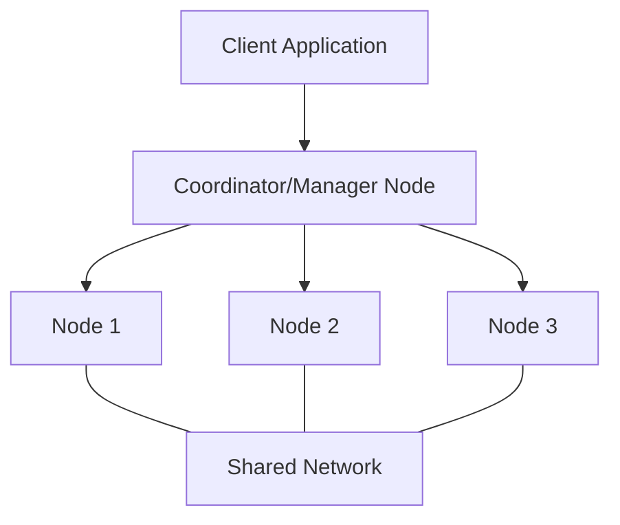
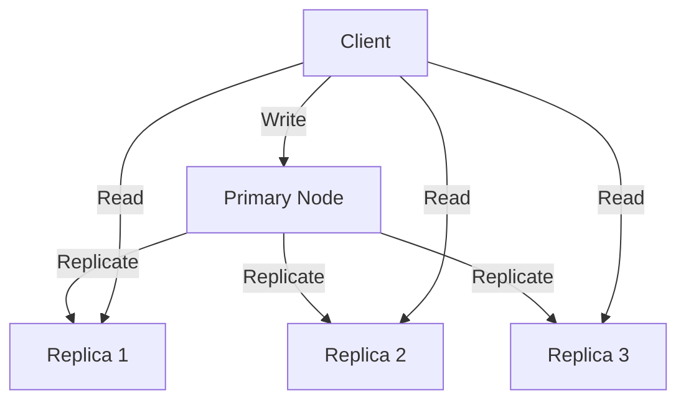

# Distributed Architecture

## Introduction

Distributed architecture forms the backbone of modern distributed database systems. Unlike traditional monolithic databases where all components reside on a single machine, distributed databases spread data, processing, and management across multiple nodes in a network. This approach offers significant advantages in terms of scalability, reliability, and performance, but also introduces unique challenges.

In this guide, we'll explore the core concepts of distributed architecture, examine common patterns used in distributed database systems, and understand how these principles apply in real-world scenarios.

## Core Concepts of Distributed Architecture

### What Makes an Architecture "Distributed"?

A distributed architecture divides a system into separate components that run on different nodes (computers) across a network. These components work together to function as a single coherent system. 

Key characteristics include:

- **Distribution of Data**: Data is partitioned and stored across multiple nodes
- **Distribution of Processing**: Computational tasks are spread across multiple nodes
- **Communication**: Components communicate via network protocols
- **Coordination**: Mechanisms ensure consistent operation despite physical separation

### Basic Distributed Architecture Models



#### 1. Master-Slave Architecture

In this model, a single master node coordinates operations while multiple slave nodes store data and execute queries.

**Characteristics:**
- Master handles write operations and delegates read operations
- Slaves replicate data from the master
- Simple but has a single point of failure (the master)

**Example use case:** Traditional MySQL replication setups

#### 2. Peer-to-Peer Architecture

All nodes have equal roles and responsibilities, with no centralized control point.

**Characteristics:**
- No single point of failure
- Horizontally scalable
- Complex coordination required
- Eventually consistent by default

**Example use case:** Cassandra, BitTorrent

#### 3. Sharded Architecture

Data is horizontally partitioned (sharded) across multiple nodes, with each node responsible for a subset of the data.

**Characteristics:**
- Improved write performance
- Horizontally scalable
- Complex to rebalance
- Requires careful sharding strategy

**Example use case:** MongoDB, MySQL sharding

## Key Components in Distributed Database Architecture

### Partitioning (Sharding)

Partitioning divides the data into smaller, more manageable pieces distributed across multiple nodes.

**Horizontal Partitioning (Sharding)** divides rows across nodes:

```
Database Table (Users)
┌────────────┬──────────┬────────┐
│ User ID    │ Name     │ Email  │
├────────────┼──────────┼────────┤
│ 1          │ Alice    │ a@ex.co│
│ 2          │ Bob      │ b@ex.co│
│ ...        │ ...      │ ...    │
│ 1000       │ Zack     │ z@ex.co│
└────────────┴──────────┴────────┘

       ↓ Horizontal Partitioning ↓

Shard 1 (Node A)         Shard 2 (Node B)
┌────────┬────────┐      ┌────────┬────────┐
│UserID  │ Data   │      │UserID  │ Data   │
├────────┼────────┤      ├────────┼────────┤
│1-500   │ ...    │      │501-1000│ ...    │
└────────┴────────┘      └────────┴────────┘
```

**Vertical Partitioning** divides columns across nodes:

```
Node A                   Node B
┌────────┬────────┐      ┌────────┬──────────┐
│UserID  │ Name   │      │UserID  │ Email    │
├────────┼────────┤      ├────────┼──────────┤
│1-1000  │ ...    │      │1-1000  │ ...      │
└────────┴────────┘      └────────┴──────────┘
```

**Common Sharding Strategies:**

1. **Range-based sharding**: Divides data based on ranges of a key (e.g., UserIDs 1-1000 on Server A)
2. **Hash-based sharding**: Uses a hash function on the key to determine placement
3. **Directory-based sharding**: Maintains a lookup service to track data location

Let's implement a simple hash-based sharding function in JavaScript:

```javascript
function determineShardId(userId, totalShards) {
  // Simple hash function: modulo of the user ID by total shards
  return userId % totalShards;
}

// Example usage
const userId = 42;
const totalShards = 4;
const shardId = determineShardId(userId, totalShards);
console.log(`User ${userId} should be stored on shard ${shardId}`);

// Output: User 42 should be stored on shard 2
```

### Replication

Replication creates and maintains copies of data across multiple nodes to improve availability and durability.

**Types of Replication:**

1. **Synchronous Replication**: Write operations complete only after all replicas confirm successful update
2. **Asynchronous Replication**: Primary node acknowledges writes immediately, replicas update later
3. **Semi-synchronous Replication**: At least one replica must confirm before write is acknowledged



### Consistency Models

Distributed systems must choose between consistency, availability, and partition tolerance (the CAP theorem).

**Common Consistency Models:**

1. **Strong Consistency**: All nodes see the same data at the same time
2. **Eventual Consistency**: Given enough time without updates, all nodes will converge to the same state
3. **Causal Consistency**: Operations causally related appear in the same order to all processes
4. **Session Consistency**: A client's reads reflect its previous writes within a session

Let's see how eventual consistency might manifest in a simple Python implementation:

```python
# Simplified representation of nodes in a distributed system
nodes = [
    {"name": "user_profile", "value": "Initial value", "timestamp": 0},
    {"name": "user_profile", "value": "Initial value", "timestamp": 0},
    {"name": "user_profile", "value": "Initial value", "timestamp": 0}
]

def update_node(node_id, new_value, timestamp):
    """Update a node if the timestamp is newer than current value"""
    if timestamp > nodes[node_id]["timestamp"]:
        nodes[node_id]["value"] = new_value
        nodes[node_id]["timestamp"] = timestamp
        print(f"Node {node_id} updated to: {new_value}")
    else:
        print(f"Node {node_id} ignored update: {new_value} (older timestamp)")

# Client updates node 0
update_node(0, "Updated profile", 1)  # Succeeds

# Network propagation (simulated as direct calls)
update_node(1, "Updated profile", 1)  # Succeeds
update_node(2, "Updated profile", 1)  # Succeeds

# Later update with higher timestamp
update_node(1, "New profile info", 2)  # Succeeds

# Try to apply older update
update_node(2, "Outdated info", 1)  # Fails - already has newer data

# Check system state
for i, node in enumerate(nodes):
    print(f"Node {i}: {node['value']} (timestamp: {node['timestamp']})")

# Output:
# Node 0: Updated profile (timestamp: 1)
# Node 1: New profile info (timestamp: 2)
# Node 2: Updated profile (timestamp: 1)
# System is eventually consistent once all updates propagate
```

### Consensus Algorithms

Consensus algorithms help distributed systems agree on shared values despite node failures or network issues.

**Popular Consensus Algorithms:**

1. **Paxos**: Classic algorithm for reaching consensus in a network of unreliable processors
2. **Raft**: Designed to be more understandable than Paxos, using leader election
3. **ZAB (Zookeeper Atomic Broadcast)**: Used in Apache ZooKeeper
4. **Byzantine Fault Tolerance**: Can handle malicious nodes in the system

## Common Distributed Database Architectures

### Shared-Nothing Architecture

Each node operates independently with its own CPU, memory, and storage.

**Advantages:**
- Highly scalable
- No resource contention between nodes
- Node failures affect only a portion of the data

**Disadvantages:**
- Complex coordination
- Joins across shards can be expensive

**Example systems:** Amazon DynamoDB, Google Bigtable, Apache Cassandra

### Shared-Disk Architecture

Nodes share a common storage system but have their own CPU and memory.

**Advantages:**
- Easier data access across nodes
- Simplified backup and recovery

**Disadvantages:**
- Storage becomes a potential bottleneck
- Limited horizontal scalability

**Example systems:** Oracle RAC, IBM Db2 pureScale

### Multi-Master Architecture

Multiple nodes can accept write operations simultaneously.

**Advantages:**
- High availability for writes
- No single point of failure

**Disadvantages:**
- Complex conflict resolution
- Eventual consistency challenges

**Example systems:** MySQL NDB Cluster, Postgres BDR

## Real-World Implementation: Building a Simple Distributed Key-Value Store

Let's look at a simplified Node.js implementation of a distributed key-value store with multiple nodes:

```javascript
// server.js - A single node in our distributed key-value store
const express = require('express');
const axios = require('axios');
const app = express();
const PORT = process.env.PORT || 3000;

// Our node's data store
const store = new Map();

// Information about peer nodes in the cluster
const peers = [
  'http://localhost:3001',
  'http://localhost:3002'
].filter(peer => peer !== `http://localhost:${PORT}`);

app.use(express.json());

// GET endpoint to retrieve a value
app.get('/data/:key', (req, res) => {
  const { key } = req.params;
  if (store.has(key)) {
    console.log(`Node served key ${key} with value ${store.get(key)}`);
    return res.json({ value: store.get(key) });
  } else {
    return res.status(404).json({ error: 'Key not found' });
  }
});

// PUT endpoint to store a value
app.put('/data/:key', async (req, res) => {
  const { key } = req.params;
  const { value, timestamp = Date.now() } = req.body;
  
  // Check if we already have a newer version
  const existingData = store.get(key);
  if (existingData && existingData.timestamp > timestamp) {
    return res.status(409).json({ 
      error: 'Conflict - a newer version exists',
      existingTimestamp: existingData.timestamp 
    });
  }
  
  // Store the value locally
  store.set(key, { value, timestamp });
  console.log(`Node stored key ${key} with value ${value}`);
  
  // Propagate to peers (async replication)
  try {
    await Promise.allSettled(peers.map(peer => 
      axios.put(`${peer}/replicate/${key}`, { value, timestamp })
    ));
    console.log(`Propagated update for key ${key} to peers`);
  } catch (error) {
    console.error(`Error propagating update: ${error.message}`);
    // We still return success since our node has the update
  }
  
  return res.status(200).json({ success: true });
});

// Endpoint for peer replication
app.put('/replicate/:key', (req, res) => {
  const { key } = req.params;
  const { value, timestamp } = req.body;
  
  // Only update if the incoming data is newer
  const existingData = store.get(key);
  if (!existingData || existingData.timestamp < timestamp) {
    store.set(key, { value, timestamp });
    console.log(`Node replicated key ${key} with value ${value}`);
    return res.status(200).json({ success: true });
  } else {
    console.log(`Node rejected outdated replication for key ${key}`);
    return res.status(409).json({ 
      error: 'Conflict - a newer version exists' 
    });
  }
});

app.listen(PORT, () => {
  console.log(`Node running on port ${PORT}`);
});
```

To run this distributed system, you would start multiple instances of this server on different ports. Each instance represents a node in your distributed architecture.

This simplified example demonstrates:
- Basic replication between nodes
- Timestamp-based conflict resolution
- Asynchronous updates to peers
- Eventual consistency model

## Common Challenges in Distributed Architectures

### 1. Network Partitions (Split Brain)

When nodes can't communicate with each other, they may continue operating independently, leading to inconsistent states.

**Solutions:**
- Quorum-based systems
- Automatic leader election
- Partition detection mechanisms

### 2. Data Consistency

Balancing performance with consistency requirements.

**Solutions:**
- Choose appropriate consistency models for your use case
- Use distributed transactions when necessary
- Implement conflict resolution strategies

### 3. Performance Bottlenecks

Network latency and distributed operation overhead can impact performance.

**Solutions:**
- Data locality (keeping related data together)
- Caching strategies
- Optimizing network communication

### 4. Monitoring and Debugging

Distributed systems are harder to monitor and debug than monolithic ones.

**Solutions:**
- Distributed tracing (e.g., Jaeger, Zipkin)
- Centralized logging
- Health checking and alerting systems

## Real-World Applications

### E-Commerce Platforms

**Challenges:**
- High transaction volume during peak times
- Need for consistent inventory data
- Global distribution requirements

**Solution:**
A distributed architecture using regional sharding for user data, replicated product catalogs, and eventually consistent shopping carts with strong consistency for checkout operations.

### Social Media Platforms

**Challenges:**
- Massive data volume
- High write throughput for status updates
- Complex social graph relationships

**Solution:**
Graph database sharded by user cluster, with asynchronous replication for status updates and strong consistency for authentication services.

### Financial Systems

**Challenges:**
- Absolute data consistency requirements
- High availability needs
- Regulatory compliance

**Solution:**
Shared-nothing architecture with synchronous replication for core transaction processing, using consensus algorithms to ensure data integrity and distributed ACID transactions.

## Summary

Distributed architecture is a foundational concept for building scalable, resilient database systems. Key takeaways include:

1. Distributed systems spread data and processing across multiple nodes
2. Various models (master-slave, peer-to-peer, sharded) offer different trade-offs
3. Key components include partitioning, replication, and consensus mechanisms
4. The CAP theorem forces choices between consistency, availability, and partition tolerance
5. Real-world implementations must address challenges like network partitions, consistency, and monitoring

Understanding these principles enables you to design database systems that can scale to meet the demands of modern applications while maintaining reliability and performance.

## Exercises

1. **Basic Implementation**: Create a simple distributed counter service that maintains a consistent count across multiple nodes.

2. **Architecture Design**: Design a distributed architecture for a blogging platform that needs to support millions of users with high availability.

3. **Trade-off Analysis**: For a given application (e.g., banking system, social media, e-commerce), analyze the trade-offs between different consistency models and recommend the most appropriate model.

4. **Failure Simulation**: Implement a basic distributed key-value store and simulate various failure scenarios (node crash, network partition). Observe how the system behaves.

## Additional Resources

- Books:
  - "Designing Data-Intensive Applications" by Martin Kleppmann
  - "Database Internals" by Alex Petrov

- Online Courses:
  - MIT's Distributed Systems course
  - Stanford's Distributed Systems course

- Open Source Projects to Study:
  - Apache Cassandra
  - Elasticsearch
  - etcd (used by Kubernetes)

Good luck on your distributed architecture journey! Understanding these concepts will make you a more effective database designer and developer.