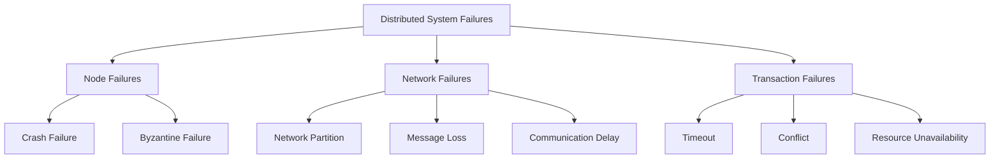
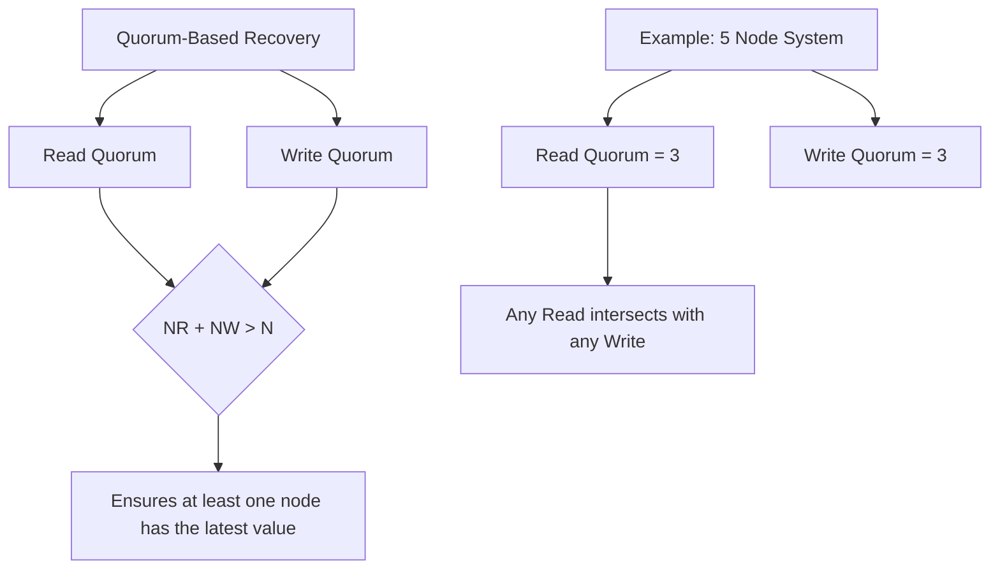

# Distributed Recovery

## Introduction

When working with distributed databases, one of the most critical aspects is ensuring that your system can recover from failures. Unlike centralized databases where recovery primarily concerns a single point of failure, distributed recovery involves coordinating multiple nodes across a network to restore the system to a consistent state.

Distributed recovery mechanisms are essential safeguards that protect your data against various types of failures, including hardware crashes, network partitions, and software bugs. These mechanisms ensure that your distributed database remains reliable and maintains data integrity even in the face of unexpected disruptions.

In this guide, we'll explore the fundamental concepts of distributed recovery, the challenges it addresses, and the techniques used to implement robust recovery solutions in distributed database systems.

## Understanding Failures in Distributed Systems

Before diving into recovery mechanisms, it's important to understand the types of failures that can occur in distributed systems:

### Node Failures

A node failure occurs when an individual database server stops functioning due to hardware issues, software crashes, or maintenance operations.

### Network Failures

Network failures happen when communication between nodes is disrupted, leading to network partitions where groups of nodes can communicate within their group but not with nodes in other groups.

### Transaction Failures

Transaction failures occur when a distributed transaction cannot complete successfully due to conflicts, timeouts, or other issues.

Let's visualize the different types of failures:



## Key Concepts in Distributed Recovery

### 1. Durability and Atomicity

In distributed databases, ensuring both durability (committed transactions survive failures) and atomicity (transactions are all-or-nothing) becomes complex due to the distributed nature of operations.

### 2. Consistency Models

Different distributed systems may adopt different consistency models that influence recovery strategies:

- **Strong Consistency**: All nodes see the same data at the same time
- **Eventual Consistency**: System will become consistent over time
- **Causal Consistency**: Operations that are causally related appear in the same order to all nodes

### 3. Distributed Commit Protocols

These protocols ensure that transactions spanning multiple nodes either commit on all nodes or abort on all nodes.

## Two-Phase Commit (2PC) Protocol

The two-phase commit protocol is a fundamental distributed recovery mechanism that ensures atomicity across multiple nodes participating in a distributed transaction.

### How 2PC Works

The protocol has two phases:

1. **Prepare Phase**: The coordinator asks all participants if they can commit
2. **Commit Phase**: If all participants agree, the coordinator tells them to commit; otherwise, it tells them to abort

Let's implement a simple example of a two-phase commit protocol in Python:

```python
# Simplified Two-Phase Commit implementation
class Coordinator:
    def __init__(self, participants):
        self.participants = participants
    
    def execute_transaction(self, transaction):
        # Phase 1: Prepare
        prepare_responses = []
        for participant in self.participants:
            response = participant.prepare(transaction)
            prepare_responses.append(response)
        
        # Check if all participants are ready
        all_ready = all(response == "READY" for response in prepare_responses)
        
        # Phase 2: Commit or Abort
        if all_ready:
            for participant in self.participants:
                participant.commit(transaction)
            return "COMMITTED"
        else:
            for participant in self.participants:
                participant.abort(transaction)
            return "ABORTED"

class Participant:
    def __init__(self, name):
        self.name = name
        self.prepared_transactions = {}
    
    def prepare(self, transaction):
        # Simulate preparing a transaction
        # In a real system, this would involve writing to a log
        # and ensuring the transaction can be committed
        try:
            self.prepared_transactions[transaction.id] = transaction
            print(f"Participant {self.name}: READY for transaction {transaction.id}")
            return "READY"
        except Exception as e:
            print(f"Participant {self.name}: NOT READY for transaction {transaction.id}")
            return "NOT READY"
    
    def commit(self, transaction):
        # Commit the transaction if it was prepared
        if transaction.id in self.prepared_transactions:
            # In a real system, this would involve making changes permanent
            print(f"Participant {self.name}: COMMITTED transaction {transaction.id}")
            del self.prepared_transactions[transaction.id]
    
    def abort(self, transaction):
        # Abort the transaction if it was prepared
        if transaction.id in self.prepared_transactions:
            # In a real system, this would involve rolling back any changes
            print(f"Participant {self.name}: ABORTED transaction {transaction.id}")
            del self.prepared_transactions[transaction.id]

# Transaction class
class Transaction:
    def __init__(self, id, operations):
        self.id = id
        self.operations = operations
```

### Example Usage:

```python
# Create participants
participant1 = Participant("DB1")
participant2 = Participant("DB2")
participant3 = Participant("DB3")

# Create coordinator
coordinator = Coordinator([participant1, participant2, participant3])

# Create a transaction
transaction = Transaction("T1", ["UPDATE users SET status = 'active' WHERE id = 1"])

# Execute the transaction
result = coordinator.execute_transaction(transaction)
print(f"Transaction {transaction.id} result: {result}")
```

### Output:

```
Participant DB1: READY for transaction T1
Participant DB2: READY for transaction T1
Participant DB3: READY for transaction T1
Participant DB1: COMMITTED transaction T1
Participant DB2: COMMITTED transaction T1
Participant DB3: COMMITTED transaction T1
Transaction T1 result: COMMITTED
```

### Challenges with Two-Phase Commit

While 2PC ensures atomicity, it has several limitations:

1. **Blocking**: If the coordinator fails after the prepare phase, participants may remain blocked waiting for the commit/abort decision.
2. **Performance Overhead**: The protocol requires multiple round-trips of communication.
3. **Single Point of Failure**: The coordinator represents a critical component whose failure can impact the entire system.

## Three-Phase Commit (3PC)

The three-phase commit protocol addresses some of the limitations of 2PC by adding an extra phase:

1. **Prepare Phase**: Same as in 2PC
2. **Pre-commit Phase**: Coordinator confirms that all participants are ready
3. **Commit Phase**: Final commit instruction is sent

This additional phase helps reduce blocking in certain failure scenarios.

## Paxos and Raft Consensus Algorithms

For more robust distributed recovery, modern distributed databases often implement consensus algorithms like Paxos or Raft.

### Raft Consensus Algorithm

Raft is designed to be more understandable than Paxos while providing the same guarantees. It includes:

- **Leader Election**: A single node becomes the leader and manages replication
- **Log Replication**: The leader accepts client requests and replicates them to followers
- **Safety**: If a command is committed, all future leaders will have that command in their logs

Let's look at a simplified implementation of log replication in Raft:

```python
class RaftNode:
    def __init__(self, node_id):
        self.node_id = node_id
        self.current_term = 0
        self.voted_for = None
        self.log = []  # Each entry contains term and command
        self.commit_index = -1
        self.last_applied = -1
        self.is_leader = False
        self.next_index = {}  # For leaders: next log entry to send to each follower
        self.match_index = {}  # For leaders: highest log entry known to be replicated on each server
    
    def become_leader(self, other_nodes):
        self.is_leader = True
        for node in other_nodes:
            self.next_index[node.node_id] = len(self.log)
            self.match_index[node.node_id] = -1
            
    def append_entries(self, term, leader_id, prev_log_index, prev_log_term, 
                       entries, leader_commit):
        # 1. Reply false if term < current_term
        if term < self.current_term:
            return False, self.current_term
        
        # 2. Reply false if log doesn't contain an entry at prev_log_index 
        # whose term matches prev_log_term
        if prev_log_index >= 0 and (prev_log_index >= len(self.log) or 
                                    self.log[prev_log_index]['term'] != prev_log_term):
            return False, self.current_term
        
        # 3. If an existing entry conflicts with a new one, delete the existing entry 
        # and all that follow it
        i = prev_log_index + 1
        j = 0
        while j < len(entries):
            if i < len(self.log) and self.log[i]['term'] != entries[j]['term']:
                del self.log[i:]
                break
            i += 1
            j += 1
        
        # 4. Append any new entries not already in the log
        self.log.extend(entries[j:])
        
        # 5. Update commit_index if leader_commit > commit_index
        if leader_commit > self.commit_index:
            self.commit_index = min(leader_commit, len(self.log) - 1)
            
        return True, self.current_term
    
    def apply_committed_entries(self):
        while self.last_applied < self.commit_index:
            self.last_applied += 1
            command = self.log[self.last_applied]['command']
            # Apply command to state machine
            print(f"Node {self.node_id} applying command: {command}")
```

This simplified implementation demonstrates how Raft handles log replication, which is a critical aspect of distributed recovery.

## Recovery Strategies

### 1. Log-Based Recovery

Log-based recovery is a fundamental approach to recovering from failures in distributed databases:

```python
class RecoveryManager:
    def __init__(self, database):
        self.database = database
        self.log = []
    
    def write_log(self, transaction_id, operation, object_id, old_value, new_value):
        log_entry = {
            'transaction_id': transaction_id,
            'operation': operation,
            'object_id': object_id,
            'old_value': old_value,
            'new_value': new_value,
            'timestamp': time.time()
        }
        self.log.append(log_entry)
        # In a real system, we would flush this to stable storage
        
    def recover(self):
        print("Starting recovery process...")
        # 1. Analysis phase: determine which transactions were active
        active_transactions = set()
        for entry in self.log:
            if entry['operation'] == 'BEGIN':
                active_transactions.add(entry['transaction_id'])
            elif entry['operation'] == 'COMMIT':
                active_transactions.remove(entry['transaction_id'])
        
        # 2. Redo phase: redo all committed transactions
        for entry in self.log:
            if entry['operation'] not in ['BEGIN', 'COMMIT', 'ABORT'] and \
               entry['transaction_id'] not in active_transactions:
                print(f"Redoing operation: {entry['operation']} on {entry['object_id']}")
                self.database.set_value(entry['object_id'], entry['new_value'])
        
        # 3. Undo phase: undo all uncommitted transactions
        for entry in reversed(self.log):
            if entry['operation'] not in ['BEGIN', 'COMMIT', 'ABORT'] and \
               entry['transaction_id'] in active_transactions:
                print(f"Undoing operation: {entry['operation']} on {entry['object_id']}")
                self.database.set_value(entry['object_id'], entry['old_value'])
                
        print("Recovery completed")
```

### 2. Checkpoint-Based Recovery

Checkpoints reduce recovery time by establishing safe points from which recovery can start:

```python
class CheckpointManager:
    def __init__(self, database, log_manager):
        self.database = database
        self.log_manager = log_manager
        self.checkpoint_log_position = -1
    
    def create_checkpoint(self):
        print("Creating checkpoint...")
        # 1. Temporarily suspend new transactions
        # 2. Wait for active transactions to complete
        # 3. Flush all database buffers to disk
        self.database.flush_all_buffers()
        # 4. Write a checkpoint record to the log
        checkpoint_record = {
            'operation': 'CHECKPOINT',
            'timestamp': time.time(),
            'database_state': self.database.get_state_summary()
        }
        self.log_manager.log.append(checkpoint_record)
        self.checkpoint_log_position = len(self.log_manager.log) - 1
        print("Checkpoint created at log position", self.checkpoint_log_position)
    
    def recover_from_checkpoint(self):
        if self.checkpoint_log_position == -1:
            print("No checkpoint found, performing full recovery")
            self.log_manager.recover()
            return
            
        print(f"Recovering from checkpoint at position {self.checkpoint_log_position}")
        # 1. Restore database state from checkpoint
        checkpoint_record = self.log_manager.log[self.checkpoint_log_position]
        self.database.restore_state(checkpoint_record['database_state'])
        
        # 2. Apply only those log records that came after the checkpoint
        relevant_log = self.log_manager.log[self.checkpoint_log_position + 1:]
        
        # Similar to regular recovery, but using only the relevant portion of the log
        active_transactions = set()
        for entry in relevant_log:
            if entry['operation'] == 'BEGIN':
                active_transactions.add(entry['transaction_id'])
            elif entry['operation'] == 'COMMIT':
                if entry['transaction_id'] in active_transactions:
                    active_transactions.remove(entry['transaction_id'])
        
        # Redo committed transactions
        for entry in relevant_log:
            if entry['operation'] not in ['BEGIN', 'COMMIT', 'ABORT', 'CHECKPOINT'] and \
               entry['transaction_id'] not in active_transactions:
                print(f"Redoing operation: {entry['operation']} on {entry['object_id']}")
                self.database.set_value(entry['object_id'], entry['new_value'])
        
        # Undo uncommitted transactions
        for entry in reversed(relevant_log):
            if entry['operation'] not in ['BEGIN', 'COMMIT', 'ABORT', 'CHECKPOINT'] and \
               entry['transaction_id'] in active_transactions:
                print(f"Undoing operation: {entry['operation']} on {entry['object_id']}")
                self.database.set_value(entry['object_id'], entry['old_value'])
                
        print("Recovery from checkpoint completed")
```

## Real-World Example: Recovery in a Distributed E-Commerce System

Let's consider an e-commerce system with distributed databases handling product inventory, user accounts, and order processing.

### Scenario: Order Processing Failure

Imagine a customer places an order for multiple items. The transaction involves:
1. Verifying user account (User DB)
2. Checking item availability (Inventory DB)
3. Processing payment (Payment DB)
4. Creating an order record (Order DB)

If the system crashes after updating inventory but before creating the order record, how do we recover?

```python
# Simplified implementation of an e-commerce distributed transaction system

class ECommerceSystem:
    def __init__(self):
        self.user_db = Database("UserDB")
        self.inventory_db = Database("InventoryDB")
        self.payment_db = Database("PaymentDB")
        self.order_db = Database("OrderDB")
        self.recovery_manager = DistributedRecoveryManager([
            self.user_db, self.inventory_db, self.payment_db, self.order_db
        ])
        
    def process_order(self, user_id, items, payment_info):
        # Create a global transaction ID
        transaction_id = str(uuid.uuid4())
        
        try:
            # Begin transaction
            self.recovery_manager.begin_transaction(transaction_id)
            
            # 1. Verify user account
            user = self.user_db.get_user(user_id, transaction_id)
            if not user:
                raise Exception("User not found")
            
            # 2. Check and update inventory
            for item in items:
                current_stock = self.inventory_db.get_stock(item['product_id'], transaction_id)
                if current_stock < item['quantity']:
                    raise Exception(f"Insufficient stock for product {item['product_id']}")
                
                # Update inventory with new stock level
                new_stock = current_stock - item['quantity']
                self.inventory_db.update_stock(
                    item['product_id'], 
                    new_stock, 
                    transaction_id, 
                    old_value=current_stock
                )
            
            # 3. Process payment
            payment_result = self.payment_db.process_payment(
                user_id, 
                payment_info, 
                calculate_total(items), 
                transaction_id
            )
            if not payment_result['success']:
                raise Exception("Payment failed: " + payment_result['message'])
            
            # 4. Create order record
            order_id = self.order_db.create_order(
                user_id, 
                items, 
                payment_result['payment_id'], 
                transaction_id
            )
            
            # If we get here, everything succeeded, so commit the transaction
            self.recovery_manager.commit_transaction(transaction_id)
            return {"success": True, "order_id": order_id}
            
        except Exception as e:
            # Something went wrong, abort the transaction
            self.recovery_manager.abort_transaction(transaction_id)
            return {"success": False, "error": str(e)}
```

### The Recovery Process

If the system crashes during order processing, the recovery process would:

1. Identify which transactions were in progress when the crash occurred
2. Roll back any uncommitted transactions (e.g., revert inventory changes)
3. Ensure that any committed transactions are fully applied across all databases

The `DistributedRecoveryManager` implements this using a combination of two-phase commit and write-ahead logging:

```python
class DistributedRecoveryManager:
    def __init__(self, databases):
        self.databases = databases
        self.active_transactions = {}  # transaction_id -> status
        self.transaction_logs = {}  # transaction_id -> list of operations
        
    def begin_transaction(self, transaction_id):
        self.active_transactions[transaction_id] = "ACTIVE"
        self.transaction_logs[transaction_id] = []
        self.write_to_log(transaction_id, "BEGIN", None, None, None)
        
    def write_to_log(self, transaction_id, operation, object_id, old_value, new_value):
        log_entry = {
            'transaction_id': transaction_id,
            'operation': operation,
            'object_id': object_id,
            'old_value': old_value,
            'new_value': new_value,
            'timestamp': time.time()
        }
        
        if transaction_id in self.transaction_logs:
            self.transaction_logs[transaction_id].append(log_entry)
            
        # In a real system, we would also write this to a durable log file
        
    def commit_transaction(self, transaction_id):
        # Phase 1: Prepare
        all_prepared = True
        for db in self.databases:
            prepared = db.prepare_commit(transaction_id)
            if not prepared:
                all_prepared = False
                break
        
        # Phase 2: Commit or Abort
        if all_prepared:
            for db in self.databases:
                db.commit(transaction_id)
            self.active_transactions[transaction_id] = "COMMITTED"
            self.write_to_log(transaction_id, "COMMIT", None, None, None)
        else:
            self.abort_transaction(transaction_id)
            
    def abort_transaction(self, transaction_id):
        # Undo all operations in reverse order
        if transaction_id in self.transaction_logs:
            for log_entry in reversed(self.transaction_logs[transaction_id]):
                if log_entry['operation'] not in ['BEGIN', 'COMMIT', 'ABORT']:
                    # Find the appropriate database
                    for db in self.databases:
                        if db.owns_object(log_entry['object_id']):
                            db.rollback_operation(log_entry)
                            break
                            
        for db in self.databases:
            db.abort(transaction_id)
            
        self.active_transactions[transaction_id] = "ABORTED"
        self.write_to_log(transaction_id, "ABORT", None, None, None)
        
    def recover(self):
        print("Starting distributed recovery process...")
        
        # 1. Read the log to identify transaction states
        committed_transactions = set()
        active_transactions = set()
        
        for transaction_id, logs in self.transaction_logs.items():
            # Check the last log entry for this transaction
            last_entry = logs[-1]
            if last_entry['operation'] == 'COMMIT':
                committed_transactions.add(transaction_id)
            elif last_entry['operation'] != 'ABORT':
                active_transactions.add(transaction_id)
        
        # 2. Redo all operations from committed transactions
        for transaction_id in committed_transactions:
            for log_entry in self.transaction_logs[transaction_id]:
                if log_entry['operation'] not in ['BEGIN', 'COMMIT', 'ABORT']:
                    for db in self.databases:
                        if db.owns_object(log_entry['object_id']):
                            db.redo_operation(log_entry)
                            break
        
        # 3. Undo all operations from active (uncommitted) transactions
        for transaction_id in active_transactions:
            for log_entry in reversed(self.transaction_logs[transaction_id]):
                if log_entry['operation'] not in ['BEGIN', 'COMMIT', 'ABORT']:
                    for db in self.databases:
                        if db.owns_object(log_entry['object_id']):
                            db.rollback_operation(log_entry)
                            break
            
            # Mark these transactions as aborted
            self.write_to_log(transaction_id, "ABORT", None, None, None)
            self.active_transactions[transaction_id] = "ABORTED"
            
        print("Distributed recovery process completed")
```

## Advanced Recovery Techniques

### 1. Quorum-Based Recovery

In quorum-based systems, operations are considered successful if they are acknowledged by a minimum number of nodes (a quorum).

During recovery, the system uses quorum to determine the most up-to-date state:



### 2. Gossip Protocol for Failure Detection

Gossip protocols allow nodes to share information about the state of other nodes, helping to detect failures early:

```python
class GossipProtocol:
    def __init__(self, node_id, all_nodes):
        self.node_id = node_id
        self.all_nodes = all_nodes
        self.heartbeats = {node: 0 for node in all_nodes}
        self.suspected_failures = set()
        
    def increment_heartbeat(self):
        self.heartbeats[self.node_id] += 1
        
    def send_gossip(self, target_node):
        # In a real system, this would involve network communication
        return self.heartbeats
        
    def receive_gossip(self, gossip_data):
        # Update our heartbeat records
        for node, heartbeat in gossip_data.items():
            if node in self.heartbeats:
                self.heartbeats[node] = max(self.heartbeats[node], heartbeat)
                
    def check_for_failures(self, failure_threshold):
        # Check if any node hasn't updated its heartbeat recently
        my_heartbeat = self.heartbeats[self.node_id]
        for node, heartbeat in self.heartbeats.items():
            if node != self.node_id and (my_heartbeat - heartbeat) > failure_threshold:
                self.suspected_failures.add(node)
                print(f"Node {self.node_id} suspects node {node} has failed")
                
    def run_gossip_cycle(self):
        # Increment our own heartbeat
        self.increment_heartbeat()
        
        # Select a random subset of nodes to gossip with
        targets = random.sample(
            [node for node in self.all_nodes if node != self.node_id], 
            min(2, len(self.all_nodes) - 1)
        )
        
        # Exchange gossip data
        for target in targets:
            sent_data = self.send_gossip(target)
            # In a real implementation, we would receive gossip back
            # But for this example, we'll just use the same data
            self.receive_gossip(sent_data)
            
        # Check for potential failures
        self.check_for_failures(failure_threshold=5)
```

## Best Practices for Distributed Recovery

1. **Design for Failure**: Assume failures will happen and build recovery mechanisms from the start.

2. **Use Write-Ahead Logging (WAL)**: Always record changes to the log before applying them to the database.

3. **Implement Regular Checkpoints**: Reduce recovery time by creating periodic checkpoints.

4. **Consider Eventual Consistency**: For some applications, eventual consistency might provide better performance with acceptable trade-offs.

5. **Test Recovery Processes**: Regularly test your recovery mechanisms with simulated failures.

6. **Monitor Recovery Metrics**: Track recovery time and success rates to identify improvements.

## Summary

Distributed recovery is a critical aspect of distributed database systems that ensures data integrity and availability even when failures occur. The key components we've covered include:

- Understanding the types of failures in distributed systems
- Implementing protocols like Two-Phase Commit and Three-Phase Commit
- Using consensus algorithms like Raft for more robust recovery
- Applying log-based and checkpoint-based recovery strategies
- Handling real-world recovery scenarios

By implementing proper distributed recovery mechanisms, you can build resilient distributed database systems that maintain consistency and availability despite various types of failures.

## Exercises

1. Implement a simple Two-Phase Commit protocol and test it with simulated node failures.

2. Modify the log-based recovery implementation to handle network partitions.

3. Design a checkpoint system that minimizes the impact on regular database operations.

4. Compare the recovery time of a database with and without checkpoints.

5. Implement a simple Raft consensus algorithm focusing on the leader election process.

## Additional Resources

- "Designing Data-Intensive Applications" by Martin Kleppmann
- "Database System Concepts" by Silberschatz, Korth, and Sudarshan
- "Distributed Systems: Principles and Paradigms" by Tanenbaum and Van Steen
- The Raft Consensus Algorithm Website: raftconsensus.github.io
- GitHub repositories with open-source implementations of consensus algorithms