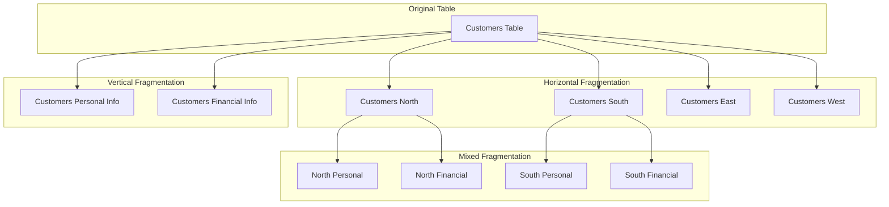

# Data Fragmentation

## Introduction

Data fragmentation is a fundamental concept in distributed database systems that involves breaking down data into smaller, manageable pieces called fragments. Instead of storing an entire database table at a single location, fragmentation allows us to distribute portions of the data across multiple sites in a network. This approach enhances performance, increases data availability, and improves system reliability.

In a distributed environment, data fragmentation plays a crucial role in determining how data is stored, accessed, and maintained across different nodes. As databases grow in size and complexity, properly implemented fragmentation strategies become essential for efficient data management.

## Why Fragment Data?

Before diving into the types of fragmentation, let's understand why we fragment data in the first place:

1. **Improved Performance**: Placing data closer to where it's frequently accessed reduces network traffic and response time.
2. **Enhanced Availability**: Even if some fragments are unavailable, other parts of the database remain accessible.
3. **Increased Parallelism**: Multiple queries can be executed simultaneously on different fragments.
4. **Better Security**: Sensitive data can be isolated and protected with specific access controls.
5. **Optimized Storage**: Data can be distributed based on storage capacity and performance requirements.

## Types of Data Fragmentation

There are three primary types of fragmentation in distributed databases:

1. Horizontal Fragmentation
2. Vertical Fragmentation
3. Mixed/Hybrid Fragmentation

Let's explore each type in detail.

### Horizontal Fragmentation

Horizontal fragmentation divides a table by rows, creating subsets of tuples (records). Each fragment contains a complete set of attributes but only for specific rows that satisfy a particular condition.

#### How It Works

Consider a table containing customer data across different regions. We can fragment this table horizontally by region, creating separate fragments for each geographical area.

```sql
-- Original Table: CUSTOMERS
-- customer_id | name | email | region | balance
-- -------------------------------------------------
-- 1           | John | j@ex  | North  | 1000
-- 2           | Sara | s@ex  | South  | 1500
-- 3           | Mike | m@ex  | North  | 800
-- 4           | Lisa | l@ex  | East   | 2000
-- 5           | Tom  | t@ex  | West   | 1200

-- Horizontal Fragmentation by region:

-- CUSTOMERS_NORTH fragment:
-- customer_id | name | email | region | balance
-- -------------------------------------------------
-- 1           | John | j@ex  | North  | 1000
-- 3           | Mike | m@ex  | North  | 800

-- CUSTOMERS_SOUTH fragment:
-- customer_id | name | email | region | balance
-- -------------------------------------------------
-- 2           | Sara | s@ex  | South  | 1500

-- And so on for EAST and WEST...
```

#### Implementation Example

Here's how we might implement horizontal fragmentation using SQL predicates:

```sql
-- Create North fragment
CREATE TABLE CUSTOMERS_NORTH AS
SELECT * FROM CUSTOMERS
WHERE region = 'North';

-- Create South fragment
CREATE TABLE CUSTOMERS_SOUTH AS
SELECT * FROM CUSTOMERS
WHERE region = 'South';

-- Create East fragment
CREATE TABLE CUSTOMERS_EAST AS
SELECT * FROM CUSTOMERS
WHERE region = 'East';

-- Create West fragment
CREATE TABLE CUSTOMERS_WEST AS
SELECT * FROM CUSTOMERS
WHERE region = 'West';
```

#### Completeness and Disjointness

A good horizontal fragmentation should maintain:

1. **Completeness**: Every row of the original table must appear in at least one fragment.
2. **Disjointness**: In simple fragmentation, rows should not be duplicated across fragments (except for key attributes in some cases).

#### Real-world Application

A multinational e-commerce company might horizontally fragment its customer database by country or region. This approach allows:
- Regional servers to handle local customer queries more efficiently
- Compliance with different data privacy regulations by region
- Optimized performance by keeping data close to where it's most frequently accessed

### Vertical Fragmentation

Vertical fragmentation divides a table by columns, creating subsets of attributes. Each fragment contains only specific columns of the original table but for all rows.

#### How It Works

Consider our CUSTOMERS table again. We might fragment it vertically to separate personal information from financial data.

```sql
-- Original Table: CUSTOMERS
-- customer_id | name | email | region | balance
-- -------------------------------------------------
-- 1           | John | j@ex  | North  | 1000
-- 2           | Sara | s@ex  | South  | 1500
-- ...

-- Vertical Fragmentation:

-- CUSTOMERS_PERSONAL fragment:
-- customer_id | name | email | region
-- ------------------------------------
-- 1           | John | j@ex  | North
-- 2           | Sara | s@ex  | South
-- ...

-- CUSTOMERS_FINANCIAL fragment:
-- customer_id | balance
-- --------------------
-- 1           | 1000
-- 2           | 1500
-- ...
```

Note that each fragment typically includes the primary key (`customer_id` in this case) to maintain data integrity and allow reconstructing the original table when needed.

#### Implementation Example

Here's how we might implement vertical fragmentation:

```sql
-- Create personal information fragment
CREATE TABLE CUSTOMERS_PERSONAL AS
SELECT customer_id, name, email, region
FROM CUSTOMERS;

-- Create financial information fragment
CREATE TABLE CUSTOMERS_FINANCIAL AS
SELECT customer_id, balance
FROM CUSTOMERS;
```

#### Real-world Application

A banking application might vertically fragment its customer database to:
- Store sensitive financial data on more secure servers
- Allow customer service representatives to access personal information without seeing financial details
- Optimize query performance by retrieving only necessary attributes

### Mixed/Hybrid Fragmentation

Mixed fragmentation combines both horizontal and vertical fragmentation techniques. It involves either:
1. Horizontally fragmenting a table and then vertically fragmenting the resulting fragments, or
2. Vertically fragmenting a table and then horizontally fragmenting the resulting fragments.

#### Example of Mixed Fragmentation

Let's say we first horizontally fragment the CUSTOMERS table by region, then vertically fragment the NORTH region data:

```sql
-- First: Horizontal fragmentation by region
-- (creates CUSTOMERS_NORTH, CUSTOMERS_SOUTH, etc.)

-- Then: Vertical fragmentation of CUSTOMERS_NORTH
-- NORTH_PERSONAL fragment:
-- customer_id | name | email | region
-- ------------------------------------
-- 1           | John | j@ex  | North
-- 3           | Mike | m@ex  | North

-- NORTH_FINANCIAL fragment:
-- customer_id | balance
-- --------------------
-- 1           | 1000
-- 3           | 800
```

#### Implementation Example

```sql
-- First horizontal fragmentation
CREATE TABLE CUSTOMERS_NORTH AS
SELECT * FROM CUSTOMERS WHERE region = 'North';

-- Then vertical fragmentation of the horizontal fragment
CREATE TABLE NORTH_PERSONAL AS
SELECT customer_id, name, email, region
FROM CUSTOMERS_NORTH;

CREATE TABLE NORTH_FINANCIAL AS
SELECT customer_id, balance
FROM CUSTOMERS_NORTH;
```

## Fragmentation Schema

To effectively manage a fragmented database, we need to maintain metadata about the fragmentation structure. This is known as the fragmentation schema, which typically includes:

1. Fragment names and their locations
2. Fragmentation type (horizontal, vertical, or mixed)
3. Fragmentation conditions or attributes
4. Mapping between global relations and fragments

This information is stored in the distributed database catalog and is essential for query processing and optimization.

## Visualizing Fragmentation Types

Let's visualize the different types of fragmentation:



## Query Processing with Fragmentation

When a query is issued against a distributed database, the system must determine which fragments are relevant. This process involves:

1. **Fragment Localization**: Identifying which fragments contain the required data
2. **Query Transformation**: Rewriting the query to operate on specific fragments
3. **Query Optimization**: Determining the most efficient execution plan

### Example: Query Processing with Horizontal Fragmentation

Suppose we want to find all customers in the North region with a balance over 500:

```sql
-- Original query on global relation
SELECT name, email FROM CUSTOMERS
WHERE region = 'North' AND balance > 500;

-- With horizontal fragmentation, this transforms to:
SELECT name, email FROM CUSTOMERS_NORTH
WHERE balance > 500;

-- Note: We only need to query the NORTH fragment
```

### Example: Query Processing with Vertical Fragmentation

Suppose we want to retrieve customer names and balances for all customers:

```sql
-- Original query on global relation
SELECT name, balance FROM CUSTOMERS;

-- With vertical fragmentation, this requires joining fragments:
SELECT P.name, F.balance
FROM CUSTOMERS_PERSONAL P JOIN CUSTOMERS_FINANCIAL F
ON P.customer_id = F.customer_id;
```

## Implementing Data Fragmentation in a Simple Distributed System

Let's look at a practical example of how to implement fragmentation in a simple Python-based distributed system using SQLite databases as our storage. This example shows horizontal fragmentation across different "nodes":

```python
import sqlite3
import os

def create_database(db_name):
    """Create a new database file"""
    conn = sqlite3.connect(db_name)
    cursor = conn.cursor()
    
    # Create a customers table
    cursor.execute('''
    CREATE TABLE IF NOT EXISTS customers (
        customer_id INTEGER PRIMARY KEY,
        name TEXT NOT NULL,
        email TEXT NOT NULL,
        region TEXT NOT NULL,
        balance REAL NOT NULL
    )
    ''')
    
    conn.commit()
    return conn, cursor

def fragment_horizontally(main_db, fragment_dbs):
    """Horizontally fragment the customers table by region"""
    # Connect to main database
    main_conn = sqlite3.connect(main_db)
    main_cursor = main_conn.cursor()
    
    # Get all regions
    main_cursor.execute("SELECT DISTINCT region FROM customers")
    regions = [region[0] for region in main_cursor.fetchall()]
    
    # Create fragment databases for each region
    for region in regions:
        # Create region-specific database
        db_file = f"{fragment_dbs}/{region.lower()}_customers.db"
        region_conn, region_cursor = create_database(db_file)
        
        # Copy data from main database to fragment
        main_cursor.execute("SELECT * FROM customers WHERE region = ?", (region,))
        customers = main_cursor.fetchall()
        
        for customer in customers:
            region_cursor.execute('''
            INSERT INTO customers VALUES (?, ?, ?, ?, ?)
            ''', customer)
        
        region_conn.commit()
        region_conn.close()
        print(f"Created fragment for {region} region with {len(customers)} customers")
    
    main_conn.close()

def query_fragmented_db(fragment_dbs, region, condition=None):
    """Query a specific fragment based on region"""
    db_file = f"{fragment_dbs}/{region.lower()}_customers.db"
    
    if not os.path.exists(db_file):
        print(f"No fragment exists for region: {region}")
        return []
    
    conn = sqlite3.connect(db_file)
    cursor = conn.cursor()
    
    if condition:
        cursor.execute(f"SELECT * FROM customers WHERE {condition}")
    else:
        cursor.execute("SELECT * FROM customers")
        
    results = cursor.fetchall()
    conn.close()
    
    return results

# Example usage
if __name__ == "__main__":
    # Setup directories
    if not os.path.exists("fragments"):
        os.makedirs("fragments")
    
    # Create and populate main database
    main_conn, main_cursor = create_database("customers.db")
    
    # Sample data
    customers = [
        (1, "John Smith", "john@example.com", "North", 1000),
        (2, "Sara Johnson", "sara@example.com", "South", 1500),
        (3, "Mike Williams", "mike@example.com", "North", 800),
        (4, "Lisa Brown", "lisa@example.com", "East", 2000),
        (5, "Tom Davis", "tom@example.com", "West", 1200)
    ]
    
    # Insert sample data
    for customer in customers:
        main_cursor.execute('''
        INSERT INTO customers VALUES (?, ?, ?, ?, ?)
        ''', customer)
    
    main_conn.commit()
    
    # Fragment horizontally by region
    fragment_horizontally("customers.db", "fragments")
    
    # Query example: Find North customers with balance > 500
    results = query_fragmented_db("fragments", "North", "balance > 500")
    print("
North customers with balance > 500:")
    for customer in results:
        print(f"ID: {customer[0]}, Name: {customer[1]}, Balance: {customer[4]}")
```

Output:
```
Created fragment for North region with 2 customers
Created fragment for South region with 1 customers
Created fragment for East region with 1 customers
Created fragment for West region with 1 customers

North customers with balance > 500:
ID: 1, Name: John Smith, Balance: 1000.0
```

## Challenges and Considerations

While data fragmentation offers numerous benefits, it also introduces some challenges:

### 1. Fragmentation Design

Determining the optimal fragmentation strategy requires careful analysis of:
- Query patterns and access frequencies
- Network topology and latency
- Data dependencies and relationships
- Security and privacy requirements

### 2. Data Integrity

Ensuring consistency across fragments requires proper mechanisms for:
- Distributed transaction management
- Concurrency control
- Replication and synchronization

### 3. Query Optimization

Query processing becomes more complex with fragmentation, requiring sophisticated optimization techniques to:
- Minimize data transfer between sites
- Reduce query response time
- Balance workload across nodes

### 4. Reconstruction Overhead

Reconstructing the original relation from fragments may incur overhead due to:
- Network communication costs
- Join operations for vertical fragments
- Union operations for horizontal fragments

## Best Practices for Data Fragmentation

To effectively implement data fragmentation, consider these best practices:

1. **Analyze Access Patterns**: Fragment data based on how it's accessed most frequently.
2. **Consider Locality**: Place fragments close to where they're most often used.
3. **Balance Fragment Size**: Avoid creating fragments that are too small (excessive overhead) or too large (defeats the purpose).
4. **Minimize Inter-Fragment Dependencies**: Reduce the need for operations across multiple fragments.
5. **Plan for Evolution**: Design fragmentation schemes that can adapt to changing requirements.
6. **Document Fragmentation Schema**: Maintain clear documentation of fragmentation strategies and reasoning.

## Summary

Data fragmentation is a powerful technique in distributed database systems that breaks down tables into smaller, manageable pieces that can be stored across different locations in a network. The three main types of fragmentation—horizontal, vertical, and mixed—offer different advantages depending on the application requirements and usage patterns.

Effective fragmentation improves performance, enhances availability, increases parallelism, and can provide better security for sensitive data. However, it also introduces challenges in terms of fragmentation design, data integrity, query optimization, and reconstruction overhead.

By understanding the principles and techniques of data fragmentation, database designers can create distributed systems that efficiently handle large amounts of data while meeting performance and reliability requirements.

## Exercises

1. Design a horizontal fragmentation scheme for a university database that contains student records from different departments.
2. Implement vertical fragmentation for an e-commerce product catalog, separating basic product information from detailed descriptions and pricing data.
3. Write SQL queries to create and populate fragments for a customer order database, using mixed fragmentation based on order date and product category.
4. Create a diagram showing how query processing would work for a distributed database with fragmented tables, tracing the steps from query submission to result assembly.
5. Analyze the trade-offs between different fragmentation strategies for a social media application's user data, considering performance, privacy, and regulatory requirements.

## Additional Resources

- "Principles of Distributed Database Systems" by Tamer Özsu and Patrick Valduriez
- "Database Systems: The Complete Book" by Hector Garcia-Molina, Jeffrey D. Ullman, and Jennifer Widom
- "Fundamentals of Database Systems" by Ramez Elmasri and Shamkant B. Navathe
- [ACM Digital Library - Research Papers on Data Fragmentation](https://dl.acm.org/)
- [IEEE Xplore - Distributed Database Systems](https://ieeexplore.ieee.org/)