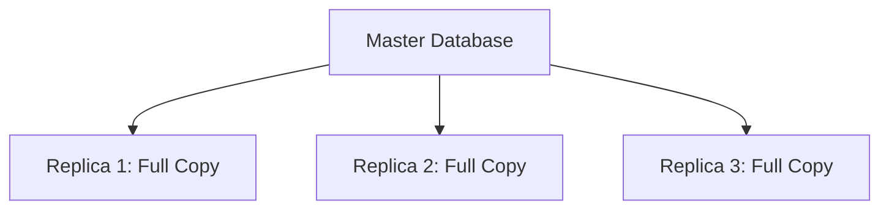
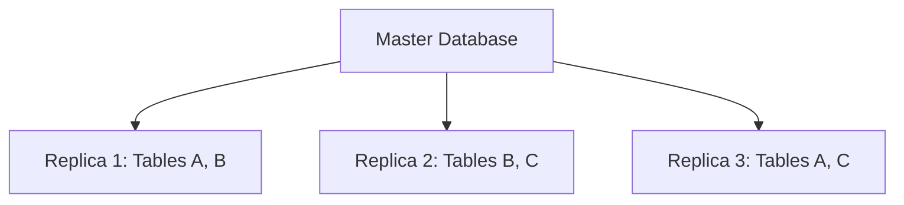
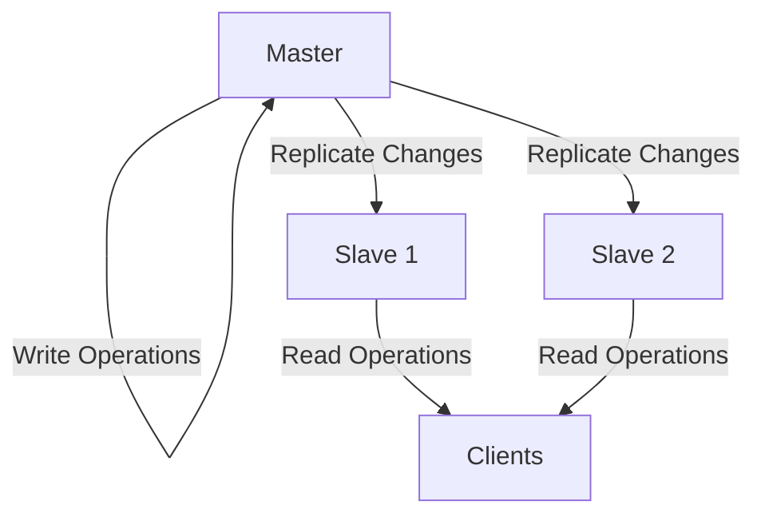
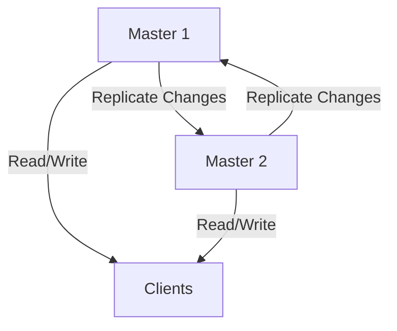
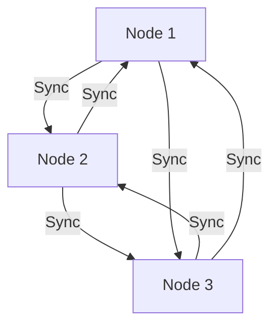
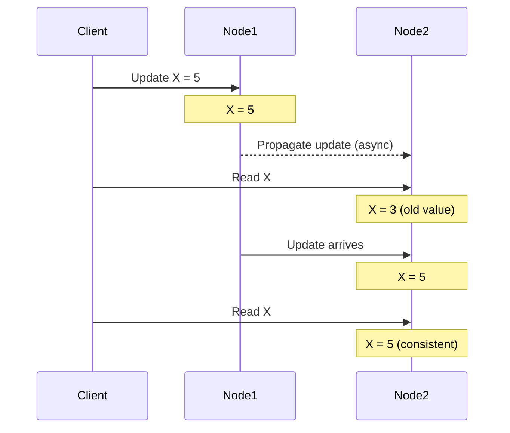
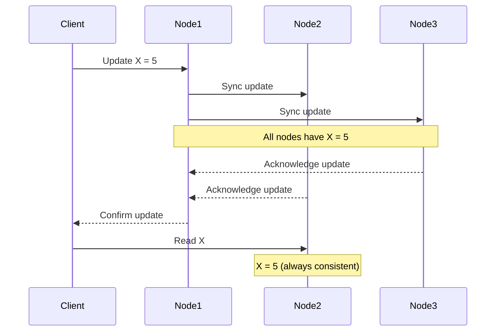
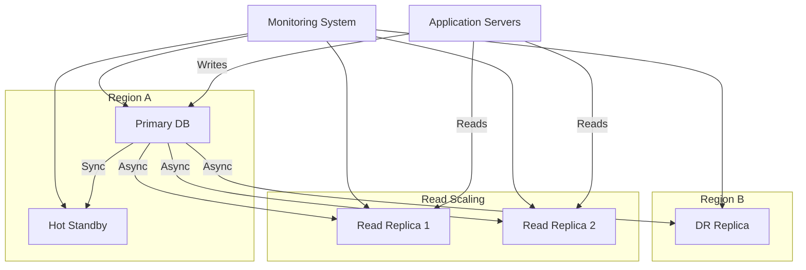

# Data Replication

## Introduction

Data replication is a fundamental concept in distributed database systems that involves creating and maintaining multiple copies of data across different locations. In a distributed environment, replication serves as a cornerstone for achieving high availability, fault tolerance, and improved performance.

Imagine having your favorite book in multiple locations: at home, at work, and in your backpack. If one copy becomes unavailable or gets damaged, you can still access the content from another copy. This is essentially how data replication works in distributed databases.

## Why Replicate Data?

Replication offers several critical advantages in distributed systems:

- **Increased Availability**: If one server fails, data remains accessible through other replicas
- **Improved Performance**: Local copies reduce network latency and distribute query load
- **Fault Tolerance**: The system can continue operating even when some nodes fail
- **Disaster Recovery**: Geographically distributed replicas provide protection against site-wide failures
- **Scalability**: Read operations can be distributed across multiple replicas

## Replication Strategies

Let's explore the main strategies for implementing data replication:

### 1. Full Replication

In full replication, complete copies of the entire database are stored on multiple nodes.



**Pros**:
- Highest availability
- Any node can serve any query
- Simple to implement

**Cons**:
- High storage requirements
- Updates must be propagated to all replicas
- Potentially high synchronization overhead

### 2. Partial Replication

With partial replication, only subsets of the database are replicated across different nodes.



**Pros**:
- Reduced storage requirements
- Lower update overhead
- Can be tailored to access patterns

**Cons**:
- More complex query routing
- Some nodes can't serve all queries
- Requires more sophisticated management

### 3. No Replication

Some data may not be replicated at all, usually for non-critical or easily reproducible data.

## Replication Models

### Master-Slave Replication

In this model, one database server acts as the master (or primary), while others function as slaves (or replicas).



#### How it works:

1. All write operations (INSERT, UPDATE, DELETE) are directed to the master
2. The master records changes in a log (often called a replication log or binary log)
3. Slave servers continuously pull these changes from the master
4. Slaves apply the changes to keep their data in sync with the master
5. Read operations can be served by any slave, distributing the load

Let's see a simple example using MySQL configuration:

```sql
-- On the master server
CREATE USER 'replication_user'@'%' IDENTIFIED BY 'password';
GRANT REPLICATION SLAVE ON *.* TO 'replication_user'@'%';

-- Get the current binary log position
SHOW MASTER STATUS;
```

Output might look like:

```
+------------------+----------+--------------+------------------+
| File             | Position | Binlog_Do_DB | Binlog_Ignore_DB |
+------------------+----------+--------------+------------------+
| mysql-bin.000003 | 73       | example_db   |                  |
+------------------+----------+--------------+------------------+
```

Then on the slave server:

```sql
CHANGE MASTER TO
  MASTER_HOST='master_server_ip',
  MASTER_USER='replication_user',
  MASTER_PASSWORD='password',
  MASTER_LOG_FILE='mysql-bin.000003',
  MASTER_LOG_POS=73;

START SLAVE;
```

### Multi-Master Replication

Multi-master replication allows writes to occur on multiple database servers, with changes synchronized between them.



This model offers higher write availability but introduces more complexity in conflict resolution.

### Peer-to-Peer Replication

In peer-to-peer replication, all nodes have equal status and can process both reads and writes.



This approach provides maximum flexibility but requires sophisticated conflict detection and resolution mechanisms.

## Replication Methods

### Synchronous Replication

In synchronous replication, a write operation is considered complete only after it has been applied to all replicas.

```javascript
// Pseudocode for synchronous write operation
function writeData(data) {
  try {
    // Begin transaction
    beginTransaction();
    
    // Write to master
    writeToMaster(data);
    
    // Write to all replicas and wait for confirmation
    for (const replica of replicas) {
      writeToReplica(replica, data);
    }
    
    // If all writes successful, commit
    commitTransaction();
    return SUCCESS;
  } catch (error) {
    // If any write fails, rollback
    rollbackTransaction();
    return FAILURE;
  }
}
```

**Pros**:
- Strong consistency guarantees
- All replicas are always up-to-date

**Cons**:
- Higher latency for write operations
- System availability limited by the slowest replica
- Potential for blocking if a replica is down

### Asynchronous Replication

With asynchronous replication, the master confirms a write operation as soon as it's recorded locally, without waiting for replicas to apply the change.

```javascript
// Pseudocode for asynchronous write operation
function writeData(data) {
  try {
    // Write to master
    writeToMaster(data);
    
    // Acknowledge successful write to client
    acknowledgeWrite();
    
    // Asynchronously propagate to replicas
    for (const replica of replicas) {
      asyncWriteToReplica(replica, data);
    }
    
    return SUCCESS;
  } catch (error) {
    return FAILURE;
  }
}
```

**Pros**:
- Lower latency for write operations
- System remains available even if some replicas are slow or down
- Better performance overall

**Cons**:
- Weaker consistency guarantees
- Potential for data loss if the master fails before replication completes
- Replicas may be temporarily out of sync

### Semi-Synchronous Replication

A middle ground where a write is confirmed after it has been applied to at least one replica, but not necessarily all.

## Consistency Challenges

Data replication introduces several consistency challenges:

### 1. Eventual Consistency

In eventually consistent systems, replicas may temporarily have different data but will converge to the same state over time.



This model sacrifices immediate consistency for availability and partition tolerance.

### 2. Strong Consistency

Strong consistency ensures that all replicas show the same data at all times, often at the cost of availability or latency.



### 3. Conflict Resolution

When multiple replicas can accept writes, conflicts may occur when different changes are made to the same data simultaneously.

Common conflict resolution strategies include:

- **Last-Writer-Wins**: The most recent update (by timestamp) takes precedence
- **Vector Clocks**: Track causality between events to determine ordering
- **Custom Merge Functions**: Application-specific logic to reconcile differences
- **Conflict-Free Replicated Data Types (CRDTs)**: Special data structures designed to automatically resolve conflicts

Here's a simple example of a last-writer-wins approach:

```javascript
// Simplified last-writer-wins implementation
function resolveConflict(localVersion, remoteVersion) {
  if (localVersion.timestamp > remoteVersion.timestamp) {
    return localVersion.value;
  } else {
    return remoteVersion.value;
  }
}
```

## Real-World Implementation Examples

### Example 1: PostgreSQL Replication

PostgreSQL offers several replication options, including streaming replication for master-slave setups:

```bash
# On the master server, in postgresql.conf:
wal_level = replica
max_wal_senders = 10
wal_keep_segments = 64

# Create a replication user
CREATE ROLE replication_user WITH REPLICATION LOGIN PASSWORD 'password';

# On the replica, initialize from the master
pg_basebackup -h master_host -D /var/lib/postgresql/data -U replication_user -P -v
```

Then configure the replica with a `recovery.conf` file:

```
standby_mode = 'on'
primary_conninfo = 'host=master_host port=5432 user=replication_user password=password'
trigger_file = '/tmp/promote_to_master'
```

### Example 2: MongoDB Replication

MongoDB uses replica sets to provide redundancy and high availability:

```javascript
// Initialize a new replica set
rs.initiate({
  _id: "myReplicaSet",
  members: [
    { _id: 0, host: "mongodb0.example.net:27017" },
    { _id: 1, host: "mongodb1.example.net:27017" },
    { _id: 2, host: "mongodb2.example.net:27017" }
  ]
});

// Check replica set status
rs.status();
```

MongoDB automatically manages primary election and synchronization between replicas.

### Example 3: Redis Replication

Redis offers simple master-slave replication that can be set up with minimal configuration:

```bash
# On the slave server
redis-cli> SLAVEOF master_host 6379
```

For more advanced scenarios, Redis Sentinel or Redis Cluster provide automatic failover and sharding.

## Practical Application: Building a Resilient E-commerce System

Let's consider how replication might be used in an e-commerce platform:



In this architecture:

1. The primary database handles all write operations
2. A synchronous hot standby provides immediate failover capability
3. Read replicas distribute query load for better performance
4. A disaster recovery replica in another region protects against site-wide failures
5. A monitoring system continuously checks replica health and lag

## Common Challenges and Solutions

### Replication Lag

Asynchronous replicas can fall behind the master, especially under heavy write loads.

**Solutions**:
- Monitor replication lag metrics
- Scale up replica hardware
- Use read-after-write consistency patterns in applications
- Implement write throttling during peak periods

### Failover Management

When a master fails, the system needs to promote a replica and redirect traffic.

**Solutions**:
- Automated failover tools (like Orchestrator for MySQL)
- Health check systems with automated promotion logic
- Connection poolers that can redirect traffic (like PgBouncer)
- Global load balancers for geographic failover

### Data Drift

Over time, replicas may develop subtle differences from the master due to bugs or replication errors.

**Solutions**:
- Regular integrity checks
- Periodic rebuild of replicas from scratch
- Checksums and validation tools
- Monitoring for replication errors

## Summary

Data replication is an essential technique in distributed databases that provides redundancy, fault tolerance, and performance benefits. We've explored:

- Various replication strategies (full, partial)
- Common replication models (master-slave, multi-master, peer-to-peer)
- Synchronization methods (synchronous, asynchronous, semi-synchronous)
- Consistency challenges and resolution techniques
- Real-world implementation examples in PostgreSQL, MongoDB, and Redis
- Practical applications and common challenges

By carefully selecting and implementing the right replication approach for your specific requirements, you can build resilient, high-performance distributed database systems.

## Exercises

1. **Basic Replication Setup**: Configure a master-slave replication setup using MySQL or PostgreSQL on your local machine.

2. **Failover Testing**: Implement a script that monitors database health and performs automatic failover when the master becomes unavailable.

3. **Consistency Analysis**: Create a test application that writes to a master database and immediately reads from a replica. Measure the replication lag and its impact on data consistency.

4. **Conflict Resolution**: Implement a simple last-writer-wins conflict resolution strategy for a multi-master setup.

5. **Design Challenge**: Design a replication strategy for a global application with users in North America, Europe, and Asia. Consider latency, disaster recovery, and consistency requirements.

## Additional Resources

- [Database Internals: A Deep Dive into How Distributed Data Systems Work](https://www.databass.dev/) by Alex Petrov
- [Designing Data-Intensive Applications](https://dataintensive.net/) by Martin Kleppmann
- [The PostgreSQL documentation on replication](https://www.postgresql.org/docs/current/high-availability.html)
- [MongoDB's replication guide](https://www.mongodb.com/docs/manual/replication/)
- [Redis replication documentation](https://redis.io/topics/replication)