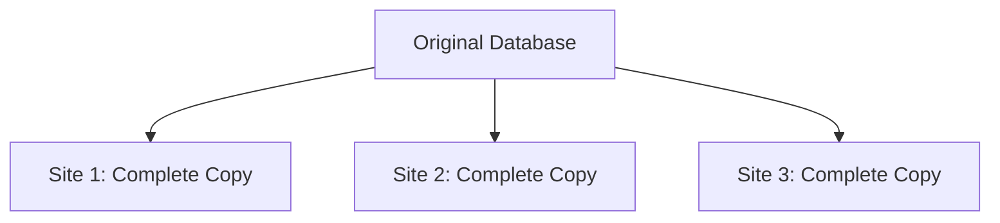
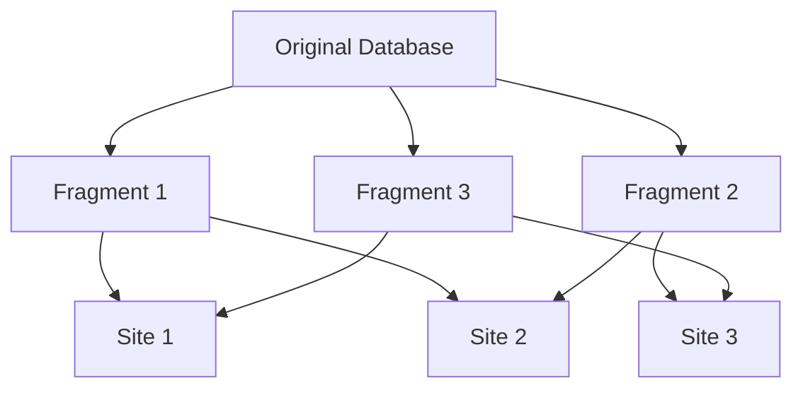
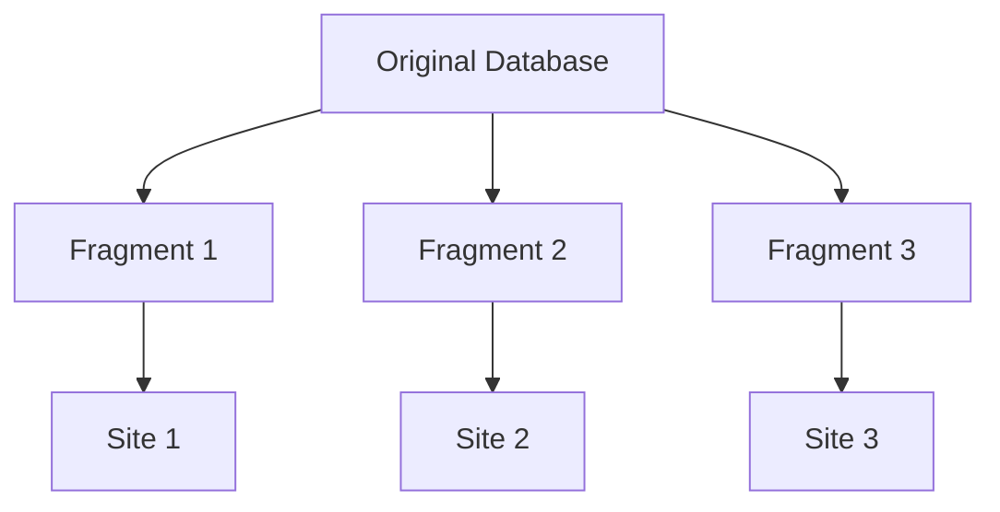
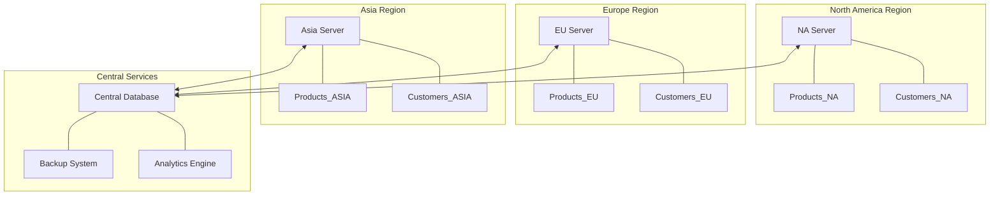

# Data Allocation in Distributed Databases

## Introduction

Data allocation is a fundamental concept in distributed database systems that determines how data is distributed across multiple sites or nodes in a network. When working with distributed databases, one of the critical decisions is deciding where to store data to optimize performance, reliability, and availability.

Unlike centralized databases where all data resides in a single location, distributed databases require strategic decisions about how to divide and place data across the network. These decisions directly impact query processing speed, system reliability, and overall efficiency.

In this article, we'll explore the core concepts of data allocation, including fragmentation, replication, and allocation strategies, to help you understand how to design efficient distributed database systems.

## What is Data Allocation?

Data allocation refers to the process of determining where data should be stored in a distributed database system. It involves deciding which pieces of data should be placed at which sites in the network based on various factors such as:

- Usage patterns
- Network topology
- Hardware capabilities
- Reliability requirements
- Performance objectives

The goal of data allocation is to optimize system performance while ensuring data availability and reliability.

## Data Fragmentation

Before data can be allocated across sites, we typically need to divide it into smaller pieces called fragments. This process is known as **fragmentation**.

### Types of Fragmentation

#### 1. Horizontal Fragmentation

Horizontal fragmentation divides a relation (table) into subsets of tuples (rows) based on certain conditions. Each fragment contains a subset of rows from the original relation.

```sql
-- Original Employee table at central site
CREATE TABLE Employee (
  emp_id INT PRIMARY KEY,
  name VARCHAR(50),
  department VARCHAR(50),
  salary DECIMAL(10,2),
  location VARCHAR(50)
);

-- Horizontal fragment for New York employees
CREATE TABLE Employee_NY (
  emp_id INT PRIMARY KEY,
  name VARCHAR(50),
  department VARCHAR(50),
  salary DECIMAL(10,2),
  location VARCHAR(50),
  CHECK (location = 'New York')
);

-- Horizontal fragment for San Francisco employees
CREATE TABLE Employee_SF (
  emp_id INT PRIMARY KEY,
  name VARCHAR(50),
  department VARCHAR(50),
  salary DECIMAL(10,2),
  location VARCHAR(50),
  CHECK (location = 'San Francisco')
);
```

#### 2. Vertical Fragmentation

Vertical fragmentation divides a relation into subsets of attributes (columns). Each fragment contains a subset of columns from the original relation, always including the primary key.

```sql
-- Vertical fragment with employee details
CREATE TABLE Employee_Details (
  emp_id INT PRIMARY KEY,
  name VARCHAR(50),
  department VARCHAR(50)
);

-- Vertical fragment with employee financial info
CREATE TABLE Employee_Financial (
  emp_id INT PRIMARY KEY,
  salary DECIMAL(10,2),
  location VARCHAR(50),
  FOREIGN KEY (emp_id) REFERENCES Employee_Details(emp_id)
);
```

#### 3. Hybrid Fragmentation

Hybrid fragmentation combines both horizontal and vertical fragmentation approaches. For example, first applying vertical fragmentation and then horizontally fragmenting the results.

### Correctness Rules for Fragmentation

For fragmentation to be considered correct, it must satisfy these properties:

1. **Completeness**: All data in the original relation must appear in at least one fragment.
2. **Reconstruction**: It must be possible to reconstruct the original relation from the fragments.
3. **Disjointness**: Data items in horizontal fragments should be disjoint to avoid redundancy (except for primary keys in vertical fragmentation).

## Data Replication

Data replication involves storing copies of the same data at multiple sites. This strategy improves data availability and read performance but introduces complexity in maintaining consistency.

### Replication Strategies

#### 1. Full Replication

Every site contains a complete copy of the entire database.



**Advantages:**
- Maximum availability
- Local access to all data
- Improved read performance

**Disadvantages:**
- High storage requirements
- Complex update synchronization
- High network overhead for writes

#### 2. Partial Replication

Only selected fragments are replicated at various sites based on usage patterns.



**Advantages:**
- Balance between availability and storage costs
- Flexibility in optimizing for common access patterns
- Reduced update overhead compared to full replication

**Disadvantages:**
- More complex design decisions
- Some queries may still require network access

#### 3. No Replication

Each fragment exists at exactly one site with no redundancy.



**Advantages:**
- Minimal storage requirements
- Simplified update management
- No consistency issues

**Disadvantages:**
- Lower availability
- Network dependency for many queries
- Single point of failure for specific data

## Data Allocation Strategies

Once we've decided on fragmentation and replication approaches, we need to determine the actual allocation of fragments to sites.

### Factors Influencing Allocation Decisions

1. **Query frequency**: Place data close to sites that access it most frequently
2. **Update frequency**: Consider the cost of propagating updates
3. **Storage capacity**: Each site has limited storage capabilities
4. **Communication costs**: Network bandwidth and latency between sites
5. **Processing capabilities**: Computing power at each site
6. **Reliability requirements**: Critical data may need more redundancy

### Common Allocation Methods

#### 1. Centralized Allocation

All data is stored at a single central site, while other sites contain only the necessary application programs.

**Example scenario:**
```
Central Database Server: Contains all employee data
Branch Offices: Run applications that connect to central server
```

#### 2. Partitioned Allocation

Data is partitioned (fragmented) without replication, with each fragment allocated to exactly one site.

**Implementation example:**

```python
# Pseudocode for partitioned allocation
def allocate_fragments(fragments, sites):
    allocation = {}
    
    # Simple allocation based on fragment and site IDs
    for i, fragment in enumerate(fragments):
        site_index = i % len(sites)  # Round-robin allocation
        allocated_site = sites[site_index]
        allocation[fragment] = allocated_site
        
    return allocation

# Example usage
fragments = ["emp_ny", "emp_sf", "emp_chicago", "emp_boston", "emp_miami"]
sites = ["east_coast_server", "west_coast_server", "central_server"]

allocation = allocate_fragments(fragments, sites)
print(allocation)

# Output:
# {
#   "emp_ny": "east_coast_server",
#   "emp_sf": "west_coast_server",
#   "emp_chicago": "central_server",
#   "emp_boston": "east_coast_server",
#   "emp_miami": "west_coast_server"
# }
```

#### 3. Replicated Allocation

Multiple copies of fragments are stored at different sites based on various optimization criteria.

**Cost model example:**

```python
# Simplified cost model for replicated allocation
def calculate_allocation_cost(fragment, site, query_freq, update_freq):
    # Cost components
    storage_cost = get_storage_cost(fragment, site)
    query_cost = query_freq * get_query_cost(fragment, site)
    update_cost = update_freq * get_update_cost(fragment, site)
    
    # Total cost
    total_cost = storage_cost + query_cost + update_cost
    return total_cost

def optimize_allocation(fragments, sites, query_patterns, update_patterns):
    allocation = {}
    
    for fragment in fragments:
        min_cost = float('inf')
        best_site = None
        
        for site in sites:
            q_freq = query_patterns.get((fragment, site), 0)
            u_freq = update_patterns.get((fragment, site), 0)
            cost = calculate_allocation_cost(fragment, site, q_freq, u_freq)
            
            if cost < min_cost:
                min_cost = cost
                best_site = site
        
        allocation[fragment] = best_site
    
    return allocation
```

## Real-world Application: E-commerce Database

Let's consider an e-commerce application with a distributed database to illustrate data allocation principles.

### Example Scenario

An e-commerce company operates in multiple regions (North America, Europe, Asia) and needs to design a distributed database system that provides fast access to product information and customer data while ensuring system reliability.

### Data Fragmentation Plan

```sql
-- Original tables
CREATE TABLE Products (
  product_id INT PRIMARY KEY,
  name VARCHAR(100),
  description TEXT,
  price DECIMAL(10,2),
  category VARCHAR(50),
  inventory_count INT,
  region VARCHAR(20)
);

CREATE TABLE Customers (
  customer_id INT PRIMARY KEY,
  name VARCHAR(100),
  email VARCHAR(100),
  address TEXT,
  region VARCHAR(20),
  join_date DATE
);

-- Horizontal fragmentation by region
CREATE TABLE Products_NA (
  /* same schema as Products */
  CHECK (region = 'North America')
);

CREATE TABLE Products_EU (
  /* same schema as Products */
  CHECK (region = 'Europe')
);

CREATE TABLE Products_ASIA (
  /* same schema as Products */
  CHECK (region = 'Asia')
);

-- Similar fragmentation for Customers
CREATE TABLE Customers_NA (
  /* same schema as Customers */
  CHECK (region = 'North America')
);

-- And so on for other regions...
```

### Allocation Strategy

**1. Product Catalog:**
- **Basic product information** (ID, name, category): Fully replicated across all regional servers
- **Detailed product information** (descriptions, images): Partitioned by region with partial replication
- **Inventory data**: Primary copy at the regional server with hourly synchronization to central backup

**2. Customer Data:**
- **Account information**: Primary copy in the customer's home region
- **Purchase history**: Partitioned by region with central backup
- **Sensitive payment data**: Centralized at secure payment processing center

### Implementation Approach



### Performance Considerations

In this design:
- Products and customer data are primarily stored in their respective regional servers
- Common product data is replicated to all regions for fast local access
- Transaction data is synchronized with the central database for consistency
- Analytics operations run on the central database to avoid impacting regional systems

## Challenges in Data Allocation

### 1. Consistency Management

Keeping multiple copies of data consistent is challenging, especially with frequent updates.

```python
# Simplified example of a two-phase commit for updating replicated data
def update_replicated_data(data_item, new_value, replica_sites):
    # Phase 1: Prepare
    prepared_sites = []
    for site in replica_sites:
        if prepare_update(site, data_item, new_value):
            prepared_sites.append(site)
        else:
            # Abort if any site cannot prepare
            abort_update(prepared_sites)
            return False
    
    # Phase 2: Commit
    for site in prepared_sites:
        commit_update(site, data_item, new_value)
    
    return True
```

### 2. Query Optimization

Distributed query processing requires determining the optimal execution plan across multiple sites.

### 3. Network Failures

The system must handle situations where sites become temporarily unreachable.

### 4. Dynamic Reallocation

As usage patterns change, data allocation may need to be adjusted over time.

## Best Practices for Data Allocation

1. **Start with thorough analysis**:
   - Understand query patterns
   - Map communication costs
   - Identify critical data

2. **Use data-driven fragmentation**:
   - Base horizontal fragments on common query predicates
   - Create vertical fragments based on access patterns

3. **Consider hybrid approaches**:
   - Different strategies for different types of data
   - Mix replication strategies based on data criticality

4. **Plan for growth**:
   - Design allocation schemes that can accommodate new sites
   - Build in flexibility for changing query patterns

5. **Measure and adjust**:
   - Monitor performance metrics
   - Be prepared to reallocate as usage evolves

## Summary

Data allocation in distributed databases involves strategic decisions about how to fragment data, whether to replicate it, and where to place it across the network. These decisions significantly impact system performance, reliability, and scalability.

Key concepts we've covered include:

- Data fragmentation (horizontal, vertical, and hybrid)
- Replication strategies (full, partial, and none)
- Allocation methods (centralized, partitioned, and replicated)
- Real-world application in an e-commerce scenario
- Challenges and best practices

By understanding these principles, you can design distributed database systems that effectively balance performance, availability, and consistency requirements.

## Exercises

1. Design a fragmentation and allocation scheme for a university database with students, courses, and enrollment data across multiple campuses.

2. Compare the performance implications of full replication versus partial replication for a social media application with users worldwide.

3. Implement a simple program that simulates different allocation strategies and measures their performance under various query workloads.

4. Consider an IoT application collecting sensor data. Design an appropriate data allocation strategy that balances real-time access with historical analysis needs.

5. Analyze how different consistency models (strong, eventual) affect data allocation decisions in a distributed system.

## Further Reading

- Distributed Database Systems: Concepts and Design
- Transaction Processing: Concepts and Techniques
- Data Replication: Techniques and Best Practices
- Query Processing in Distributed Database Systems
- Consistency Models in Distributed Systems