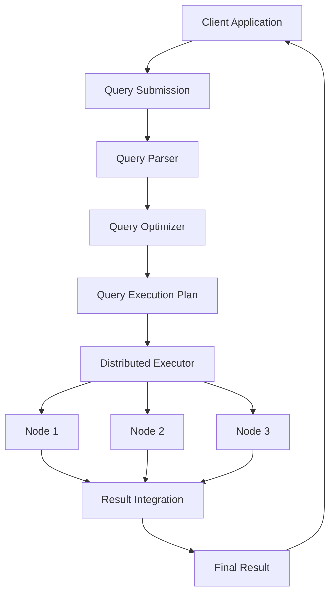
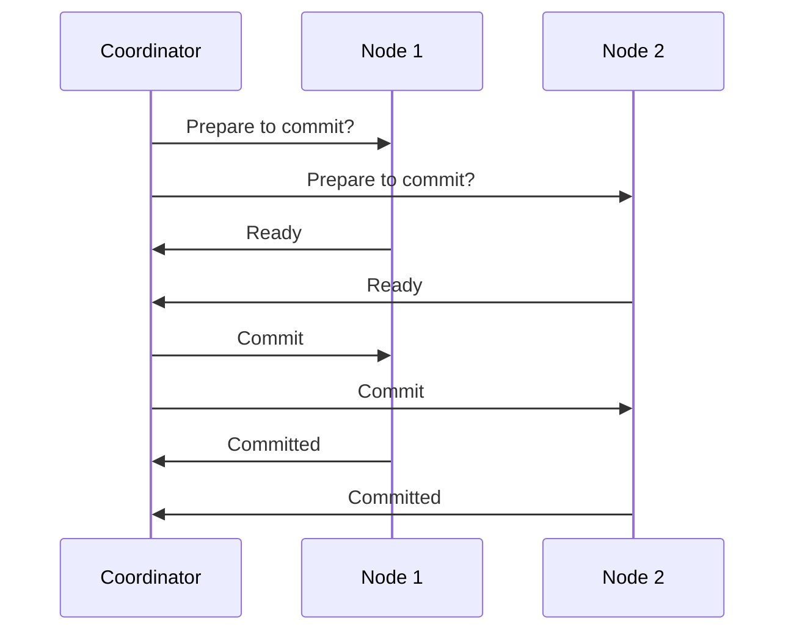

# Distributed Query Processing

## Introduction

Distributed Query Processing (DQP) is a fundamental concept in distributed database systems where a query is executed across multiple database nodes rather than on a single centralized server. This approach allows for parallel processing, improved performance, and better resource utilization when dealing with large datasets spread across different locations.

In a distributed database environment, data is partitioned and stored on multiple nodes, which can be geographically dispersed. When a query is submitted, the system must determine how to efficiently retrieve and process the required data from these different locations, combine intermediate results, and return the final outcome to the user.

## Understanding Distributed Query Processing

### Basic Components

A distributed query processing system typically consists of:

1. **Query Parser**: Analyzes the query syntax and creates a parse tree
2. **Query Optimizer**: Determines the most efficient execution plan
3. **Query Executor**: Carries out the actual execution across distributed nodes
4. **Data Communication Layer**: Handles data transfer between nodes
5. **Result Integrator**: Combines results from different nodes

### The Distributed Query Processing Workflow

Let's examine how a query travels through a distributed system:



## Query Decomposition and Optimization

### Query Decomposition

When a query is submitted to a distributed database system, it undergoes decomposition - breaking it down into smaller, manageable subqueries that can be executed on different nodes.

For example, consider a simple SQL query that joins two tables:

```sql
SELECT customers.name, orders.order_date, orders.amount
FROM customers JOIN orders
ON customers.customer_id = orders.customer_id
WHERE orders.amount > 1000;
```

In a distributed environment where the `customers` table is on Node A and the `orders` table is on Node B, this query might be decomposed into:

1. Retrieve relevant customer data from Node A
2. Retrieve qualifying orders from Node B
3. Perform the join operation either at Node A, Node B, or a coordinator node

### Query Optimization Techniques

Optimizing distributed queries involves several strategies:

#### 1. Join Order Optimization

The order in which tables are joined significantly impacts performance. Consider our previous example:

```js
// Simplified pseudocode for two possible join orders
// Option 1: Start with customers, then find matching orders
function joinCustomersFirst() {
  const customers = getAllCustomers();  // Potentially large result set
  let result = [];
  
  for (const customer of customers) {
    const orders = getOrdersForCustomer(customer.id, 1000); // Filter by amount > 1000
    if (orders.length > 0) {
      for (const order of orders) {
        result.push({
          name: customer.name,
          order_date: order.order_date,
          amount: order.amount
        });
      }
    }
  }
  
  return result;
}

// Option 2: Start with filtered orders, then get matching customers
function joinOrdersFirst() {
  const orders = getOrdersAboveThreshold(1000); // Smaller result set after filtering
  let result = [];
  
  for (const order of orders) {
    const customer = getCustomer(order.customer_id);
    result.push({
      name: customer.name,
      order_date: order.order_date,
      amount: order.amount
    });
  }
  
  return result;
}
```

In this case, `joinOrdersFirst()` would likely be more efficient because it first applies the filter (`amount > 1000`), reducing the number of records that need to be processed in the join.

#### 2. Semi-Join Strategy

Semi-joins reduce the amount of data transferred between nodes:

```
Step 1: Send only customer_ids from Node A to Node B
Step 2: Node B filters orders to only those matching received customer_ids
Step 3: Node B sends filtered orders to Node A
Step 4: Node A completes the join with its local customer data
```

#### 3. Data Shipping vs. Query Shipping

- **Data Shipping**: Moving data to the node where processing will occur
- **Query Shipping**: Moving query operations to nodes where data resides

The choice depends on factors like data size, network bandwidth, and processing power at each node.

## Distributed Query Execution

### Parallel Execution

A key advantage of distributed query processing is the ability to execute operations in parallel:

```js
// Simplified example of parallel query execution
async function executeDistributedQuery(query) {
  // Parse and decompose the query
  const subqueries = queryDecomposer(query);
  
  // Execute subqueries in parallel
  const results = await Promise.all(
    subqueries.map(subquery => {
      const targetNode = determineTargetNode(subquery);
      return executeOnNode(targetNode, subquery);
    })
  );
  
  // Integrate results
  return resultIntegrator(results);
}
```

### Handling Node Failures

Robust distributed query processing must account for potential node failures:

```js
async function executeWithFaultTolerance(nodeId, subquery) {
  try {
    // Try primary node
    return await executeOnNode(nodeId, subquery);
  } catch (error) {
    // Log failure
    console.error(`Node ${nodeId} failed: ${error.message}`);
    
    // Find alternative node
    const alternativeNodeId = findAlternativeNode(nodeId);
    
    if (alternativeNodeId) {
      console.log(`Retrying on node ${alternativeNodeId}`);
      return await executeOnNode(alternativeNodeId, subquery);
    } else {
      throw new Error("Query execution failed - no alternative nodes available");
    }
  }
}
```

## Practical Examples

### Example 1: E-commerce System

Consider an e-commerce platform with:
- Customer data in North America data centers
- Order data in multiple regional data centers
- Product information replicated across all data centers

When a customer service representative needs to look up a customer's order history:

```sql
-- Query sent to distributed query processor
SELECT o.order_id, o.order_date, o.status, p.name, oi.quantity, oi.price
FROM customers c
JOIN orders o ON c.customer_id = o.customer_id
JOIN order_items oi ON o.order_id = oi.order_id
JOIN products p ON oi.product_id = p.product_id
WHERE c.email = 'customer@example.com'
ORDER BY o.order_date DESC;
```

The distributed query processor might:
1. Locate the customer record in the North America data center
2. Identify which regional data centers contain this customer's orders
3. Send subqueries to those data centers to retrieve order and order item information
4. Join with product information (available locally at each data center)
5. Combine and sort the results before returning them to the user

### Example 2: Financial Data Analysis

A financial institution analyzing transaction patterns across its global branches:

```sql
-- Complex analytical query across distributed data
SELECT 
    branch.region,
    DATE_TRUNC('month', txn.transaction_date) AS month,
    COUNT(*) AS transaction_count,
    SUM(txn.amount) AS total_amount,
    AVG(txn.amount) AS avg_amount
FROM transactions txn
JOIN accounts acc ON txn.account_id = acc.account_id
JOIN branches branch ON acc.branch_id = branch.branch_id
WHERE txn.transaction_date BETWEEN '2023-01-01' AND '2023-12-31'
GROUP BY branch.region, DATE_TRUNC('month', txn.transaction_date)
ORDER BY branch.region, month;
```

This query could be optimized by:
1. Pushing down filters to each regional database node
2. Performing local aggregations at each node
3. Transferring only the aggregated results to the coordinator node
4. Combining the aggregated results for final presentation

## Implementation Considerations

### Cost-Based Optimization

Modern distributed database systems use sophisticated cost models to determine the most efficient execution plan. Factors in these models include:

- CPU processing costs at each node
- Data transfer costs between nodes
- I/O costs for reading data
- Current load on each node
- Network latency and bandwidth

### Data Locality

One of the most important principles in distributed query processing is maximizing data locality - processing data where it resides whenever possible to minimize network transfer.

```js
// Pseudocode for locality-aware query planning
function createQueryPlan(query, dataLocations) {
  const plan = [];
  
  // Identify operations that can be pushed to source nodes
  for (const [nodeId, tables] of Object.entries(dataLocations)) {
    const localOperations = identifyLocalOperations(query, tables);
    plan.push({
      nodeId,
      operations: localOperations
    });
  }
  
  // Identify necessary data movements and joins
  const dataMovements = identifyRequiredDataMovements(query, plan);
  const finalAggregations = identifyFinalOperations(query, plan);
  
  return {
    localOperations: plan,
    dataMovements,
    finalAggregations
  };
}
```

## Advanced Topics in Distributed Query Processing

### Distributed Transactions

When queries modify data across multiple nodes, distributed transaction protocols ensure consistency:



### Adaptive Query Processing

Modern distributed systems can adapt query execution plans based on runtime conditions:

```js
function executeAdaptiveQuery(initialPlan) {
  let currentPlan = initialPlan;
  let statistics = {};
  
  while (!isQueryComplete(currentPlan)) {
    // Execute next stage of the plan
    const stageResult = executeQueryStage(currentPlan.nextStage);
    
    // Collect runtime statistics
    statistics = {...statistics, ...stageResult.statistics};
    
    // Re-optimize remaining stages if needed
    if (shouldReoptimize(statistics, currentPlan)) {
      currentPlan = reoptimizePlan(currentPlan, statistics);
    }
  }
  
  return currentPlan.finalResult;
}
```

## Summary

Distributed Query Processing is a fundamental concept in distributed database systems that enables efficient execution of queries across multiple nodes. Key aspects include:

- Query decomposition and optimization
- Parallel execution strategies
- Data locality and transfer minimization
- Fault tolerance and handling node failures
- Cost-based planning and optimization

Mastering distributed query processing is essential for building scalable, high-performance database applications that can handle large volumes of data across distributed environments.

## Exercises

1. Design a distributed query execution plan for a query joining three tables located on different database nodes.

2. Compare the efficiency of different join strategies (nested loop join, hash join, sort-merge join) in a distributed environment.

3. Implement a simple distributed query executor using a programming language of your choice that can process a basic SQL query across two in-memory databases.

4. Analyze how network latency affects distributed query performance and develop strategies to minimize its impact.

## Additional Resources

- "Principles of Distributed Database Systems" by Tamer Özsu and Patrick Valduriez
- "Designing Data-Intensive Applications" by Martin Kleppmann
- [MIT OpenCourseWare: Database Systems](http://ocw.mit.edu/courses/electrical-engineering-and-computer-science/6-830-database-systems-fall-2010/)
- [CMU Database Group: Advanced Database Systems](https://15721.courses.cs.cmu.edu/)