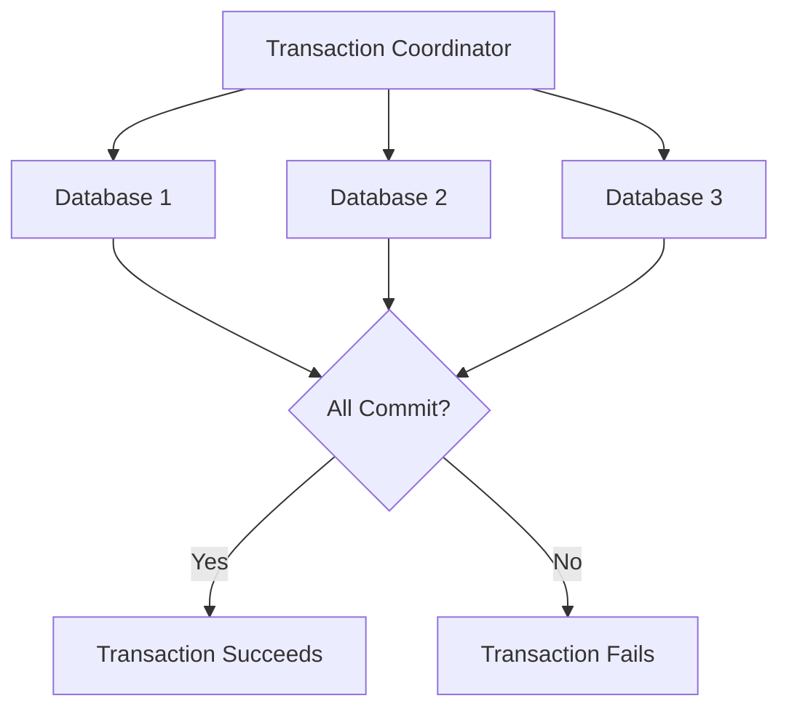
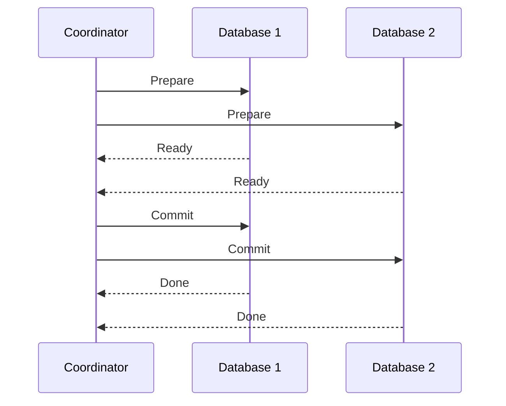

# Distributed Transactions

## Introduction

When you work with a single database, transactions help ensure data consistency. But what happens when your data is spread across multiple databases or services? This is where **distributed transactions** come into play.

A distributed transaction is a database transaction that spans multiple databases or services, often running on different servers across a network. These transactions ensure that a group of related operations either all succeed or all fail, maintaining data consistency across distributed systems.

In this tutorial, we'll explore:
- What distributed transactions are and why they're important
- The ACID properties in a distributed context
- Common protocols for implementing distributed transactions
- Real-world applications and considerations
- Practical implementation examples

## The Challenge of Distributed Transactions

Imagine you're building an e-commerce application. When a customer places an order, several things need to happen:

1. Verify the payment with the payment service
2. Update inventory in the warehouse system
3. Create the order in the order management system
4. Send a confirmation email

Each of these steps might involve different services or databases. If the payment is processed but the inventory update fails, you have an inconsistent state. Distributed transactions help solve this problem.

## ACID Properties in Distributed Systems

Traditional database transactions follow ACID properties:

- **Atomicity**: All operations either complete or none do
- **Consistency**: The database moves from one valid state to another
- **Isolation**: Concurrent transactions don't interfere with each other
- **Durability**: Committed changes are permanent

In distributed systems, maintaining these properties becomes much more complex:



## Two-Phase Commit Protocol (2PC)

The most common protocol for implementing distributed transactions is the **Two-Phase Commit (2PC)** protocol. As the name suggests, it involves two phases:

### Phase 1: Prepare Phase

The transaction coordinator asks all participants if they're ready to commit:

```javascript
// Pseudo-code for transaction coordinator
function preparePhase(participants) {
  for (let participant of participants) {
    let response = participant.prepare();
    if (response !== 'READY') {
      return false; // Abort if any participant is not ready
    }
  }
  return true; // All participants are ready
}
```

### Phase 2: Commit Phase

If all participants respond positively, the coordinator tells everyone to commit:

```javascript
// Pseudo-code for transaction coordinator
function commitPhase(participants) {
  if (preparePhase(participants)) {
    // All participants are ready to commit
    for (let participant of participants) {
      participant.commit();
    }
    return "TRANSACTION_COMMITTED";
  } else {
    // At least one participant failed, abort transaction
    for (let participant of participants) {
      participant.abort();
    }
    return "TRANSACTION_ABORTED";
  }
}
```

## Implementation Example: Java with JTA

Here's a real example using Java Transaction API (JTA) for a distributed transaction:

```java
// Import necessary libraries
import javax.naming.InitialContext;
import javax.transaction.UserTransaction;
import java.sql.Connection;
import java.sql.PreparedStatement;
import javax.sql.DataSource;

public class DistributedTransactionExample {
    
    public void transferFunds(int fromAccount, int toAccount, double amount) {
        UserTransaction userTransaction = null;
        Connection connectionA = null;
        Connection connectionB = null;
        
        try {
            // Get the transaction controller
            InitialContext context = new InitialContext();
            userTransaction = (UserTransaction) context.lookup("java:comp/UserTransaction");
            
            // Get connections to both databases
            DataSource dataSourceA = (DataSource) context.lookup("java:comp/env/jdbc/DatabaseA");
            DataSource dataSourceB = (DataSource) context.lookup("java:comp/env/jdbc/DatabaseB");
            
            connectionA = dataSourceA.getConnection();
            connectionB = dataSourceB.getConnection();
            
            // Start the distributed transaction
            userTransaction.begin();
            
            // Withdraw from account in Database A
            PreparedStatement pstmtA = connectionA.prepareStatement(
                "UPDATE accounts SET balance = balance - ? WHERE account_id = ?");
            pstmtA.setDouble(1, amount);
            pstmtA.setInt(2, fromAccount);
            pstmtA.executeUpdate();
            
            // Deposit to account in Database B
            PreparedStatement pstmtB = connectionB.prepareStatement(
                "UPDATE accounts SET balance = balance + ? WHERE account_id = ?");
            pstmtB.setDouble(1, amount);
            pstmtB.setInt(2, toAccount);
            pstmtB.executeUpdate();
            
            // Commit the transaction
            userTransaction.commit();
            System.out.println("Transfer completed successfully!");
            
        } catch (Exception e) {
            // If anything goes wrong, roll back the transaction
            System.err.println("Transaction failed: " + e.getMessage());
            try {
                if (userTransaction != null) {
                    userTransaction.rollback();
                }
            } catch (Exception ex) {
                System.err.println("Rollback failed: " + ex.getMessage());
            }
        } finally {
            // Close the connections
            try {
                if (connectionA != null) connectionA.close();
                if (connectionB != null) connectionB.close();
            } catch (Exception e) {
                System.err.println("Error closing connections: " + e.getMessage());
            }
        }
    }
}
```

This code demonstrates a bank transfer between accounts in two different databases. The transaction ensures that both operations (withdrawal and deposit) succeed or fail together.

## Practical Considerations and Challenges

While distributed transactions are powerful, they come with challenges:

### 1. Performance Overhead

The coordination required for distributed transactions introduces latency:



### 2. Resource Locking

During a distributed transaction, resources may be locked for longer periods, reducing concurrency:

```javascript
// The longer a transaction takes, the longer resources are locked
// This is exacerbated in distributed transactions due to network delays
db1.lock(resourceA);
// Network latency
db2.lock(resourceB);
// More latency
// ... operations ...
// Even more latency
db1.unlock(resourceA);
db2.unlock(resourceB);
```

### 3. Failure Handling

If a participant fails after the prepare phase but before committing, the system might need manual intervention.

## Alternative Approaches

### Saga Pattern

For long-running transactions, the Saga pattern provides an alternative. It breaks a distributed transaction into a series of local transactions, each with a corresponding compensating transaction:

```javascript
// Pseudo-code for a saga
function orderSaga() {
  try {
    // Local transaction 1
    const payment = processPayment();
    
    try {
      // Local transaction 2
      updateInventory();
      
      try {
        // Local transaction 3
        createOrder();
        
        // Everything succeeded
        return "SUCCESS";
      } catch (error) {
        // Compensating transaction for inventory
        revertInventoryUpdate();
        // Compensating transaction for payment
        refundPayment(payment);
        throw error;
      }
    } catch (error) {
      // Compensating transaction for payment
      refundPayment(payment);
      throw error;
    }
  } catch (error) {
    return "FAILURE: " + error.message;
  }
}
```

### Event-Driven Architecture

Another approach is to use events and eventual consistency:

```javascript
// Instead of a distributed transaction, use events:
function placeOrder() {
  // Step 1: Create the order with status "pending"
  const order = createPendingOrder();
  
  // Step 2: Publish an event
  publishEvent("ORDER_CREATED", order);
  
  // Other services listen for this event and process their part
  // If they fail, they publish failure events that trigger compensating actions
}
```

## Real-World Applications

### 1. Banking Systems

Banks use distributed transactions for money transfers between accounts, especially when accounts are in different systems or branches.

### 2. E-commerce Platforms

Online shopping platforms use distributed transactions to manage inventory, payments, and order processing across multiple services.

### 3. Airline Reservation Systems

Airlines use distributed transactions to coordinate seat reservations, pricing, and payment processing.

## Implementation Strategies

### 1. Use Transaction Managers

Transaction managers like Atomikos, Narayana, or Bitronix can simplify implementing distributed transactions:

```java
// Example with Atomikos
import com.atomikos.icatch.jta.UserTransactionManager;
import com.atomikos.jdbc.AtomikosDataSourceBean;

// Initialize Atomikos transaction manager
UserTransactionManager utm = new UserTransactionManager();
utm.init();

// Configure data sources
AtomikosDataSourceBean dataSourceA = new AtomikosDataSourceBean();
dataSourceA.setUniqueResourceName("DATASOURCE_A");
dataSourceA.setXaDataSourceClassName("com.mysql.jdbc.jdbc2.optional.MysqlXADataSource");
// ... set other properties

// Now use utm.begin(), utm.commit(), etc.
```

### 2. Use Distributed Transaction Frameworks

Frameworks like Spring's `@Transactional` can abstract away much of the complexity:

```java
import org.springframework.transaction.annotation.Transactional;

public class PaymentService {
    private final AccountRepository accountRepo;
    private final TransactionRepository transactionRepo;
    
    // Constructor injection
    
    @Transactional
    public void transferMoney(String fromAccountId, String toAccountId, BigDecimal amount) {
        Account fromAccount = accountRepo.findById(fromAccountId);
        Account toAccount = accountRepo.findById(toAccountId);
        
        fromAccount.debit(amount);
        toAccount.credit(amount);
        
        accountRepo.save(fromAccount);
        accountRepo.save(toAccount);
        
        Transaction transaction = new Transaction(fromAccountId, toAccountId, amount);
        transactionRepo.save(transaction);
    }
}
```

## Summary

Distributed transactions are essential for maintaining data consistency across multiple databases or services. While they provide strong consistency guarantees, they come with performance and complexity trade-offs.

Key points to remember:
- Distributed transactions ensure ACID properties across multiple systems
- Two-Phase Commit is the most common protocol
- Performance and availability challenges exist
- Alternative patterns like Sagas or event-driven architectures can be used for specific cases
- Implementation is simplified with transaction managers and frameworks

## Exercises

1. Implement a simple distributed transaction using a transaction manager of your choice.
2. Compare the performance of a system using distributed transactions versus a system using the Saga pattern.
3. Design a distributed transaction system for a hotel booking application that interacts with multiple external services.

## Additional Resources

- [Java Transaction API (JTA) Documentation](https://javaee.github.io/jta-spec/)
- [Atomikos Documentation](https://www.atomikos.com/Documentation/WebHome)
- [Understanding the Saga Pattern](https://microservices.io/patterns/data/saga.html)
- [Spring Framework Transaction Management](https://docs.spring.io/spring-framework/docs/current/reference/html/data-access.html#transaction)