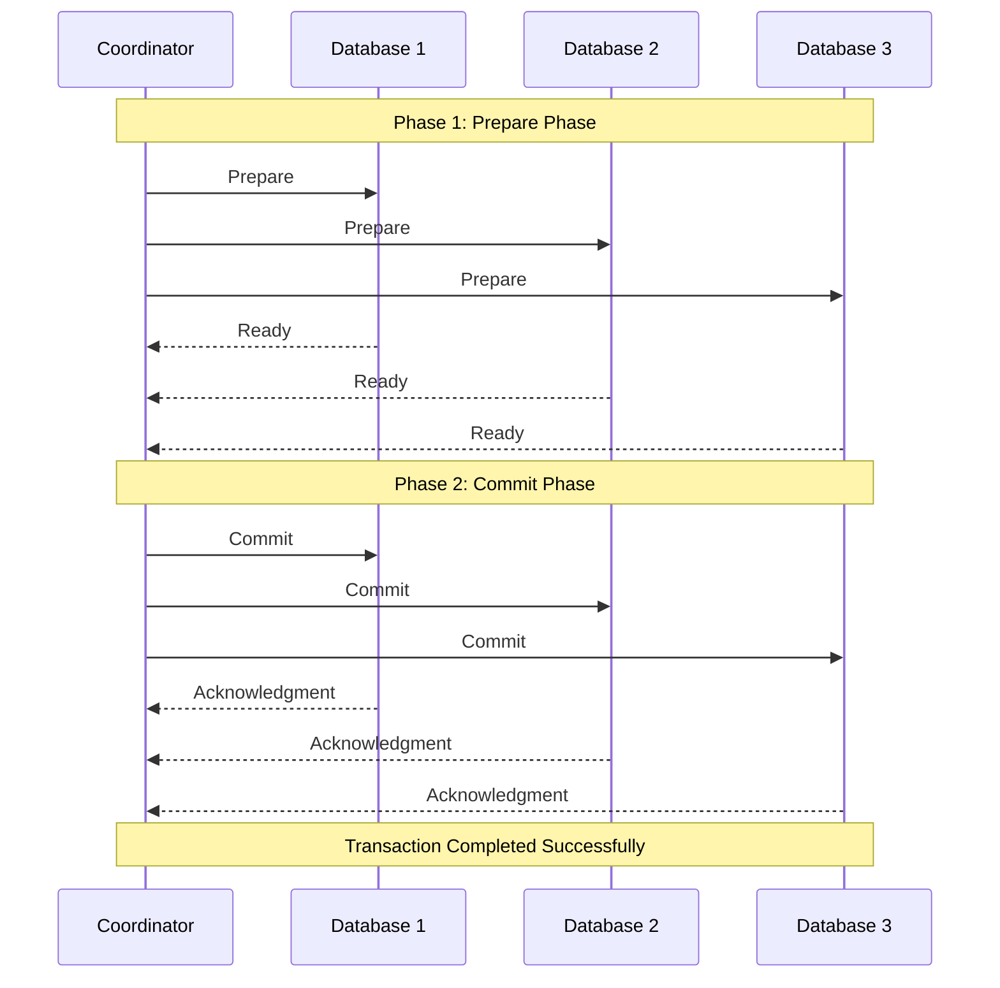

# Two-Phase Commit Protocol

## Introduction

When working with distributed databases, one of the major challenges is ensuring that transactions across multiple database nodes remain consistent. How do we guarantee that a transaction either completes successfully on all nodes or fails completely? This is where the **Two-Phase Commit (2PC) Protocol** comes in.

The Two-Phase Commit Protocol is a distributed algorithm that coordinates all the processes that participate in a distributed transaction, ensuring that either all nodes commit the transaction or all nodes abort it. This property, known as **atomicity**, is crucial for maintaining data consistency across distributed systems.

In this article, we'll explore how the Two-Phase Commit Protocol works, look at practical implementations, and understand its strengths and limitations.

## How Two-Phase Commit Works

As the name suggests, the Two-Phase Commit Protocol consists of two phases:

1. **Prepare Phase**: The coordinator asks all participants if they're ready to commit
2. **Commit Phase**: Based on responses, the coordinator decides whether to proceed with the commit or abort

Let's break down each phase in detail.

### Phase 1: Prepare Phase

In this phase, the coordinator (transaction manager) asks all participating nodes if they're ready to commit:

1. The coordinator sends a "prepare" message to all participants
2. Each participant executes the transaction up to the point of commit
3. Each participant records information needed to either commit or roll back in its transaction log
4. Each participant replies with either "ready" (if able to commit) or "abort" (if unable to commit)

### Phase 2: Commit Phase

Based on the responses received during the Prepare Phase:

- If **all** participants responded with "ready":
  1. The coordinator sends a "commit" message to all participants
  2. Each participant completes the transaction and releases resources
  3. Each participant sends an acknowledgment to the coordinator
  
- If **any** participant responded with "abort" or timed out:
  1. The coordinator sends an "abort" message to all participants
  2. Each participant rolls back the transaction
  3. Each participant sends an acknowledgment to the coordinator

After receiving all acknowledgments, the coordinator completes the transaction.

## Visual Representation

Let's visualize the Two-Phase Commit Protocol:



## Code Example: Implementing Two-Phase Commit

Let's look at a simplified example of how the Two-Phase Commit Protocol might be implemented in a distributed database system using Java.

### Coordinator Implementation

```java
public class TransactionCoordinator {
    private List<DatabaseParticipant> participants;
    private String transactionId;
    
    public TransactionCoordinator(List<DatabaseParticipant> participants, String transactionId) {
        this.participants = participants;
        this.transactionId = transactionId;
    }
    
    public boolean executeTransaction() {
        try {
            // Phase 1: Prepare phase
            boolean allPrepared = preparePhase();
            if (!allPrepared) {
                abortTransaction();
                return false;
            }
            
            // Phase 2: Commit phase
            commitTransaction();
            return true;
        } catch (Exception e) {
            abortTransaction();
            System.err.println("Transaction failed: " + e.getMessage());
            return false;
        }
    }
    
    private boolean preparePhase() {
        System.out.println("Starting prepare phase for transaction " + transactionId);
        
        for (DatabaseParticipant participant : participants) {
            boolean prepared = participant.prepare(transactionId);
            if (!prepared) {
                System.out.println("Participant " + participant.getId() + " failed to prepare!");
                return false;
            }
        }
        
        System.out.println("All participants prepared successfully");
        return true;
    }
    
    private void commitTransaction() {
        System.out.println("Starting commit phase for transaction " + transactionId);
        
        for (DatabaseParticipant participant : participants) {
            participant.commit(transactionId);
        }
        
        System.out.println("Transaction " + transactionId + " committed successfully");
    }
    
    private void abortTransaction() {
        System.out.println("Aborting transaction " + transactionId);
        
        for (DatabaseParticipant participant : participants) {
            try {
                participant.abort(transactionId);
            } catch (Exception e) {
                System.err.println("Error during abort for participant " + 
                                  participant.getId() + ": " + e.getMessage());
            }
        }
        
        System.out.println("Transaction " + transactionId + " aborted");
    }
}
```

### Participant Implementation

```java
public interface DatabaseParticipant {
    String getId();
    boolean prepare(String transactionId);
    void commit(String transactionId);
    void abort(String transactionId);
}

public class DatabaseNode implements DatabaseParticipant {
    private String nodeId;
    private Map<String, TransactionLog> pendingTransactions = new HashMap<>();
    
    public DatabaseNode(String nodeId) {
        this.nodeId = nodeId;
    }
    
    @Override
    public String getId() {
        return nodeId;
    }
    
    @Override
    public boolean prepare(String transactionId) {
        System.out.println("Node " + nodeId + " preparing transaction " + transactionId);
        
        try {
            // Execute the transaction locally but don't commit yet
            // Write data to transaction log for recovery purposes
            TransactionLog log = new TransactionLog(transactionId);
            // ... perform actual database operations and record in log
            
            pendingTransactions.put(transactionId, log);
            return true;
        } catch (Exception e) {
            System.err.println("Node " + nodeId + " failed to prepare: " + e.getMessage());
            return false;
        }
    }
    
    @Override
    public void commit(String transactionId) {
        System.out.println("Node " + nodeId + " committing transaction " + transactionId);
        
        TransactionLog log = pendingTransactions.get(transactionId);
        if (log != null) {
            // Commit the transaction using the prepared data
            // ... actual commit implementation
            
            pendingTransactions.remove(transactionId);
        } else {
            System.err.println("No pending transaction found with ID " + transactionId);
        }
    }
    
    @Override
    public void abort(String transactionId) {
        System.out.println("Node " + nodeId + " aborting transaction " + transactionId);
        
        TransactionLog log = pendingTransactions.get(transactionId);
        if (log != null) {
            // Roll back any changes made during prepare phase
            // ... actual rollback implementation
            
            pendingTransactions.remove(transactionId);
        }
    }
    
    // Helper class to store transaction data for recovery
    private static class TransactionLog {
        private String transactionId;
        // ... other transaction data
        
        public TransactionLog(String transactionId) {
            this.transactionId = transactionId;
        }
    }
}
```

### Usage Example

```java
public class TwoPhaseCommitExample {
    public static void main(String[] args) {
        // Create database participants
        List<DatabaseParticipant> participants = Arrays.asList(
            new DatabaseNode("DB1"),
            new DatabaseNode("DB2"),
            new DatabaseNode("DB3")
        );
        
        // Create transaction coordinator
        String transactionId = "TX-" + UUID.randomUUID().toString();
        TransactionCoordinator coordinator = new TransactionCoordinator(participants, transactionId);
        
        // Execute transaction
        boolean success = coordinator.executeTransaction();
        
        System.out.println("Transaction " + (success ? "succeeded" : "failed"));
    }
}
```

### Sample Output

```
Starting prepare phase for transaction TX-f47ac10b-58cc-4372-a567-0e02b2c3d479
Node DB1 preparing transaction TX-f47ac10b-58cc-4372-a567-0e02b2c3d479
Node DB2 preparing transaction TX-f47ac10b-58cc-4372-a567-0e02b2c3d479
Node DB3 preparing transaction TX-f47ac10b-58cc-4372-a567-0e02b2c3d479
All participants prepared successfully
Starting commit phase for transaction TX-f47ac10b-58cc-4372-a567-0e02b2c3d479
Node DB1 committing transaction TX-f47ac10b-58cc-4372-a567-0e02b2c3d479
Node DB2 committing transaction TX-f47ac10b-58cc-4372-a567-0e02b2c3d479
Node DB3 committing transaction TX-f47ac10b-58cc-4372-a567-0e02b2c3d479
Transaction TX-f47ac10b-58cc-4372-a567-0e02b2c3d479 committed successfully
Transaction succeeded
```

## Real-World Applications

The Two-Phase Commit Protocol is widely used in distributed database systems and transaction processing systems. Here are some real-world applications:

### 1. Banking Transactions

Consider a scenario where a customer transfers money from their savings account to their checking account, but these accounts are stored on different database servers.

1. The transaction coordinator initiates the transfer
2. During the prepare phase, both database servers validate they can execute the operation
3. If both confirm readiness, the commit phase completes the transfer on both accounts
4. If any issue occurs, both accounts return to their original state

### 2. E-commerce Order Processing

When a customer places an order, multiple systems must be updated:

1. Inventory system (reduce item count)
2. Payment processing system (charge credit card)
3. Order management system (create new order)

Using 2PC ensures that either all these operations succeed or none do. This prevents situations like charging a customer's credit card but failing to create the order.

### 3. Cloud-Based Microservices

In modern microservice architectures, a single business operation might require changes to data managed by multiple services. The Two-Phase Commit Protocol ensures data consistency across these distributed services.

## Limitations and Alternatives

While the Two-Phase Commit Protocol ensures data consistency, it has some limitations:

### Blocking Protocol

The 2PC is a blocking protocol. If the coordinator fails after the prepare phase, participants might remain blocked indefinitely, holding locks on resources.

### Performance Overhead

The protocol requires multiple rounds of communication and synchronous responses, which can impact performance, especially in high-latency environments.

### Alternatives

Due to these limitations, some distributed systems use alternative approaches:

1. **Three-Phase Commit (3PC)**: Adds an extra phase to reduce blocking issues
2. **Saga Pattern**: Breaks transactions into subtransactions with compensating transactions
3. **Eventually Consistent Models**: Prioritize availability over immediate consistency

## Summary

The Two-Phase Commit Protocol provides a robust mechanism for ensuring transaction atomicity across distributed database systems. It guarantees that all participants either commit or abort a transaction, maintaining data consistency.

Key points to remember:

1. The protocol consists of two phases: prepare and commit
2. All participants must agree to commit for the transaction to succeed
3. If any participant cannot commit, the entire transaction is aborted
4. 2PC ensures atomicity but can lead to blocking and performance issues
5. Alternative approaches may be preferred in certain scenarios

## Exercises

1. Implement a simple Two-Phase Commit Protocol simulation with three participants where one randomly fails during the prepare phase. What happens to the transaction?

2. Modify the example code to include timeout handling. What should happen if a participant doesn't respond within a specific time?

3. Compare the Two-Phase Commit Protocol with the Saga Pattern. When would you choose one over the other?

4. Design a recovery mechanism for when the coordinator fails after sending "prepare" messages but before completing the commit phase.

5. Implement a distributed banking transfer system using the Two-Phase Commit Protocol.

## Additional Resources

- [Distributed Transactions and the XA Architecture](https://docs.oracle.com/cd/E13203_01/TUXEDO/html/pctran5/jtran.htm)
- [MIT Distributed Systems Lecture on Commit Protocols](http://hdl.handle.net/1721.1/121258)
- [Martin Kleppmann's "Designing Data-Intensive Applications"](https://dataintensive.net) - Chapter 9 discusses distributed transactions and consensus