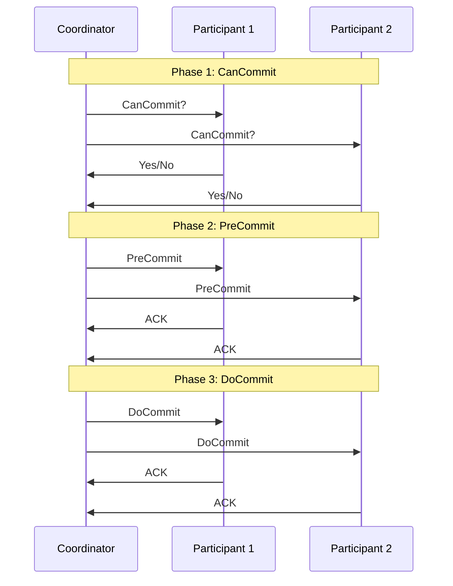

# Three-Phase Commit Protocol

## Introduction

The Three-Phase Commit Protocol (3PC) is a distributed algorithm designed to coordinate transaction commit decisions across multiple nodes in a distributed database system. It builds upon the Two-Phase Commit Protocol by adding an extra phase to address some of its limitations, particularly around handling coordinator failures and reducing blocking issues.

In distributed databases, a single transaction might involve multiple database nodes. For data consistency, either all nodes must successfully complete their part of the transaction (commit) or none should (abort). The Three-Phase Commit Protocol helps achieve this coordination even in the presence of certain types of failures.

## Why Do We Need Three-Phase Commit?

Before diving into 3PC, let's understand why the Two-Phase Commit Protocol (2PC) sometimes isn't enough:

In 2PC, if the coordinator fails after sending "prepare" messages but before sending "commit" messages, participants can become blocked indefinitely - they've prepared to commit but don't know whether to proceed or abort.

The Three-Phase Commit Protocol addresses this limitation by introducing an intermediate phase that allows participants to reach a decision even if the coordinator fails.

## The Three Phases Explained

The Three-Phase Commit Protocol, as the name suggests, consists of three distinct phases:



### Phase 1: CanCommit (Voting Phase)

The coordinator asks all participants if they can commit the transaction.

#### Coordinator Actions:
1. Sends a `CanCommit` query to all participants
2. Waits for responses from all participants
3. If all participants vote "Yes", proceeds to Phase 2; otherwise sends an "Abort" message

#### Participant Actions:
1. Checks if it can commit the transaction
2. Responds with "Yes" if ready to commit, "No" otherwise
3. If voted "No", can abort immediately

### Phase 2: PreCommit (Preparation Phase)

The coordinator tells participants to prepare to commit, but doesn't finalize yet.

#### Coordinator Actions:
1. If all participants voted "Yes" in Phase 1:
   - Sends `PreCommit` message to all participants
   - Waits for acknowledgments
2. If any participant voted "No" or timed out in Phase 1:
   - Sends `Abort` message to all participants

#### Participant Actions:
1. Upon receiving `PreCommit`:
   - Prepares to commit (writes to log, etc.)
   - Enters the "prepared" state
   - Sends acknowledgment to coordinator
2. Upon receiving `Abort`:
   - Aborts the transaction
   - Releases resources
   - Acknowledges the abort

### Phase 3: DoCommit (Commit Phase)

The coordinator finalizes the transaction commit decision.

#### Coordinator Actions:
1. Once all `PreCommit` acknowledgments are received:
   - Sends `DoCommit` message to all participants
   - Waits for acknowledgments
   - Completes the transaction

#### Participant Actions:
1. Upon receiving `DoCommit`:
   - Commits the transaction
   - Releases resources
   - Sends acknowledgment to coordinator

## Timeout and Recovery Mechanisms

The key advantage of 3PC over 2PC is its handling of failures:

### Participant Timeouts:
- If a participant doesn't hear from the coordinator, it can take action based on its state:
  - In the initial state: Abort
  - In the prepared state: Commit (assuming others also prepared)

### Coordinator Recovery:
- If the coordinator recovers from a failure, it can determine the transaction state from its log:
  - If no `PreCommit` was logged: Send `Abort` to all
  - If `PreCommit` was logged: Continue with `DoCommit`

## Example Implementation

### Coordinator Code

```java
    // Phase 2: PreCommit
    logDecision("PreCommit", transaction);
    for (Participant p : participants) {
        p.preCommit(transaction);
    }

    // Wait for acknowledgments
    boolean allAcknowledged = waitForAcknowledgments(participants);

    if (!allAcknowledged) {
        for (Participant p : participants) {
            p.abort(transaction);
        }
        return false; // Transaction aborted
    }

    // Phase 3: DoCommit
    logDecision("DoCommit", transaction);
    for (Participant p : participants) {
        p.doCommit(transaction);
    }

    // Wait for final acknowledgments
    waitForAcknowledgments(participants);

    return true; // Transaction committed
}
```

### Participant Code

```java
// State variables
enum State { INITIAL, READY, PREPARED, COMMITTED, ABORTED }
State currentState = State.INITIAL;

function canCommit(transaction) {
    if (canExecuteTransaction(transaction)) {
        currentState = State.READY;
        return true;
    }
    currentState = State.ABORTED;
    return false;
}

function preCommit(transaction) {
    if (currentState == State.READY) {
        writeToLog(transaction);
        currentState = State.PREPARED;
        sendAcknowledgment();
    }
}

function doCommit(transaction) {
    if (currentState == State.PREPARED) {
        commitTransaction(transaction);
        currentState = State.COMMITTED;
        releaseResources();
        sendAcknowledgment();
    }
}

function abort(transaction) {
    if (currentState != State.COMMITTED) {
        abortTransaction(transaction);
        currentState = State.ABORTED;
        releaseResources();
        sendAcknowledgment();
    }
}

// Timeout handler
function handleTimeout() {
    if (currentState == State.INITIAL) {
        // If no decision yet, abort
        abort(currentTransaction);
    } else if (currentState == State.PREPARED) {
        // If already prepared, assume others also prepared and commit
        commitTransaction(currentTransaction);
        currentState = State.COMMITTED;
        releaseResources();
    }
}
```

## Advantages Over Two-Phase Commit

The Three-Phase Commit Protocol offers several advantages over its predecessor:

1. **Reduced Blocking**: By introducing the PreCommit phase, participants can make progress even if the coordinator fails.

2. **Better Failure Handling**: The protocol can tolerate coordinator failures more gracefully, reducing system downtime.

3. **Improved Consistency**: In certain failure scenarios, all participants can reach the same decision independently.

4. **Timeout-Based Recovery**: Participants can take action based on timeouts, reducing the chance of indefinite blocking.

## Limitations

Despite its improvements, 3PC still has some limitations:

1. **Network Partitions**: The protocol can still lead to inconsistencies in the case of network partitions.

2. **Performance Overhead**: The additional phase increases message traffic and commit latency.

3. **Resource Locking**: Resources remain locked for a longer period compared to other commit protocols.

4. **Complexity**: The implementation and recovery procedures are more complex than 2PC.

## Real-World Usage

The Three-Phase Commit Protocol is used in various distributed systems:

- **Distributed Databases**: Some advanced distributed database systems implement 3PC for transaction coordination.

- **Cloud Services**: Certain cloud providers use variations of 3PC for coordinating distributed operations.

- **Distributed File Systems**: Some distributed file systems employ 3PC for maintaining consistency across replicas.

## Conclusion

The Three-Phase Commit Protocol provides a more robust solution for distributed transaction coordination than the Two-Phase Commit Protocol. While it adds some overhead in terms of additional messages and complexity, it significantly reduces the blocking problem and handles coordinator failures more gracefully.

For critical systems where data consistency is paramount, 3PC offers a viable solution despite its limitations. Modern distributed systems often implement optimized versions of 3PC or alternative consensus protocols like Paxos or Raft that address some of its remaining limitations.