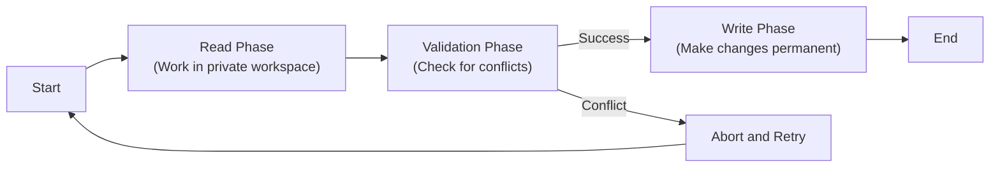
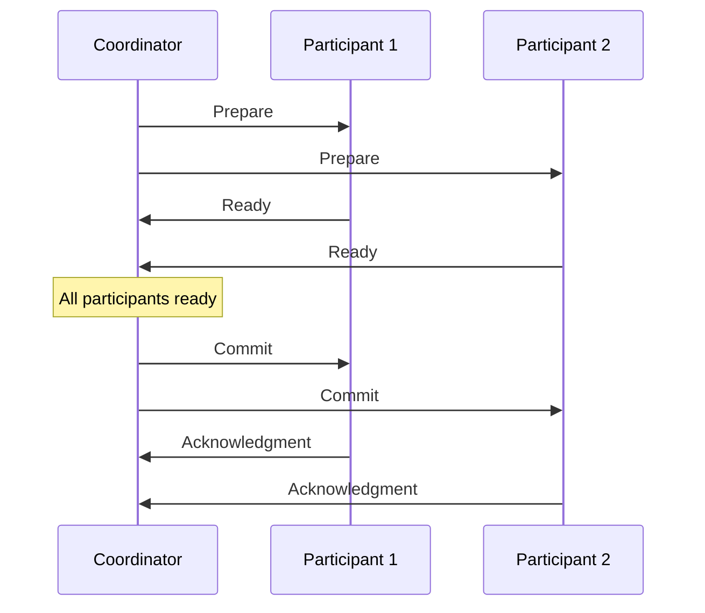
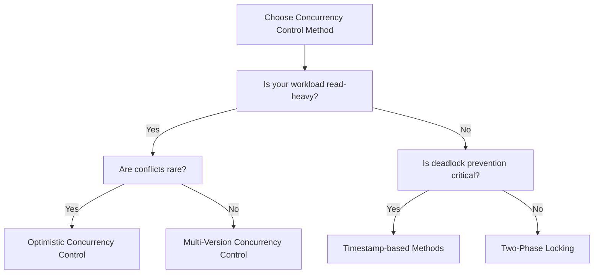

# Distributed Concurrency Control

## Introduction

When multiple users or applications access a database simultaneously, they may try to read or modify the same data at the same time. In a distributed database system, where data is spread across multiple locations, this challenge becomes even more complex. **Distributed Concurrency Control** refers to the techniques and protocols used to ensure that concurrent transactions in a distributed database environment maintain data consistency and integrity.

In this article, we'll explore how distributed systems manage concurrent access to data, the challenges unique to distributed environments, and the common approaches used to solve these problems.

## What is Concurrency Control?

Before diving into distributed concurrency control, let's understand the basic concept of concurrency control.

Concurrency control ensures that database transactions (a sequence of operations performed as a single logical unit of work) are executed in a way that preserves the ACID properties:

- **Atomicity**: A transaction is treated as a single, indivisible unit that either completely succeeds or completely fails.
- **Consistency**: A transaction brings the database from one valid state to another valid state.
- **Isolation**: Concurrent transactions should not interfere with each other.
- **Durability**: Once a transaction is committed, its effects persist even in the event of system failures.

In a distributed environment, these challenges are magnified because:

1. Data is physically spread across multiple locations
2. Network delays can affect the order of operations
3. Partial system failures can occur
4. Clock synchronization between nodes is imperfect

## The Challenge of Distributed Concurrency

Let's illustrate the challenge with a simple example:

```javascript
// Transaction 1 (running on Node A)
function transfer(fromAccount, toAccount, amount) {
  const fromBalance = readBalance(fromAccount); // Read operation
  const toBalance = readBalance(toAccount);     // Read operation
  
  if (fromBalance >= amount) {
    writeBalance(fromAccount, fromBalance - amount); // Write operation
    writeBalance(toAccount, toBalance + amount);     // Write operation
    return true;
  }
  return false;
}

// Meanwhile, Transaction 2 (running on Node B)
function addInterest(account, rate) {
  const balance = readBalance(account);        // Read operation
  writeBalance(account, balance * (1 + rate)); // Write operation
}
```

If these transactions execute concurrently on different nodes without proper concurrency control:

1. Transaction 1 might read an account balance
2. Transaction 2 might update the same balance
3. Transaction 1 then writes based on the old balance value

This is known as the **lost update problem** and can lead to inconsistent data.

## Fundamental Approaches to Distributed Concurrency Control

There are three main approaches to handling concurrency in distributed systems:

### 1. Pessimistic Concurrency Control

This approach assumes conflicts between transactions are likely and prevents them beforehand.

#### Two-Phase Locking (2PL)

The most common pessimistic approach is Two-Phase Locking (2PL), which works as follows:

1. **Growing Phase**: A transaction acquires all needed locks but doesn't release any.
2. **Shrinking Phase**: The transaction releases locks and cannot acquire new ones.


For distributed systems, we typically use a variant called **Distributed 2PL**:

```javascript
// Simplified example of Distributed 2PL
async function transferWithLocking(fromAccount, toAccount, amount) {
  try {
    // Growing phase - acquire locks
    await lockManager.lock(fromAccount);
    await lockManager.lock(toAccount);
    
    // Perform operations
    const fromBalance = await readBalance(fromAccount);
    const toBalance = await readBalance(toAccount);
    
    if (fromBalance >= amount) {
      await writeBalance(fromAccount, fromBalance - amount);
      await writeBalance(toAccount, toBalance + amount);
      
      // Shrinking phase - release locks (in commit phase)
      await lockManager.unlock(fromAccount);
      await lockManager.unlock(toAccount);
      return true;
    }
    
    // Shrinking phase - release locks (in abort phase)
    await lockManager.unlock(fromAccount);
    await lockManager.unlock(toAccount);
    return false;
  } catch (error) {
    // Handle errors and release locks
    await lockManager.unlock(fromAccount);
    await lockManager.unlock(toAccount);
    throw error;
  }
}
```

#### Distributed Deadlock Detection

A challenge with locking in distributed systems is deadlock detection. A deadlock can occur when:

1. Transaction 1 (on Node A) holds a lock on resource X and requests resource Y
2. Transaction 2 (on Node B) holds a lock on resource Y and requests resource X

Distributed systems use techniques like:

- **Timeout-based detection**: Abort transactions that wait too long for locks
- **Wait-for graphs**: Track which transaction is waiting for which resource
- **Global deadlock detection**: Periodically combine local wait-for graphs to detect cycles

### 2. Timestamp-Based Concurrency Control

This approach assigns a unique timestamp to each transaction and processes operations in timestamp order.

```javascript
// Simplified Timestamp-based Concurrency Control example
function timestampOrderedRead(transaction, dataItem) {
  if (transaction.timestamp < dataItem.writeTimestamp) {
    // This transaction is trying to read data that was written by a "future" transaction
    // Abort and restart this transaction with a new timestamp
    abortAndRestart(transaction);
  } else {
    // Read operation can proceed
    dataItem.readTimestamp = Math.max(dataItem.readTimestamp, transaction.timestamp);
    return dataItem.value;
  }
}

function timestampOrderedWrite(transaction, dataItem, newValue) {
  if (transaction.timestamp < dataItem.readTimestamp || 
      transaction.timestamp < dataItem.writeTimestamp) {
    // This transaction is trying to write data that was already read or written 
    // by a "future" transaction
    abortAndRestart(transaction);
  } else {
    // Write operation can proceed
    dataItem.writeTimestamp = transaction.timestamp;
    dataItem.value = newValue;
  }
}
```

Timestamp ordering in distributed systems requires coordinated clock synchronization, which can be achieved through:

- **Logical clocks** (e.g., Lamport timestamps)
- **Vector clocks**
- **Hybrid approaches**

### 3. Optimistic Concurrency Control (OCC)

This approach assumes conflicts are rare and validates transactions only at commit time.

OCC works in three phases:

1. **Read Phase**: Transaction reads data without acquiring locks and records this data in a private workspace.
2. **Validation Phase**: Before committing, check if any conflicts occurred.
3. **Write Phase**: If validation succeeds, make changes permanent; otherwise, abort and retry.



Here's a simplified code example:

```javascript
async function optimisticTransfer(fromAccount, toAccount, amount) {
  // Read Phase - work in local workspace
  const readSet = new Map();
  const writeSet = new Map();
  
  // Read current balances
  readSet.set(fromAccount, await readBalance(fromAccount));
  readSet.set(toAccount, await readBalance(toAccount));
  
  // Perform calculations in local workspace
  const fromBalance = readSet.get(fromAccount);
  const toBalance = readSet.get(toAccount);
  
  if (fromBalance >= amount) {
    writeSet.set(fromAccount, fromBalance - amount);
    writeSet.set(toAccount, toBalance + amount);
    
    // Validation Phase
    const validationResult = await validateTransaction(readSet);
    
    if (validationResult.success) {
      // Write Phase - commit changes
      for (const [account, newBalance] of writeSet.entries()) {
        await writeBalance(account, newBalance);
      }
      return true;
    } else {
      // Conflict detected, retry the transaction
      console.log("Conflict detected, retrying transaction");
      return optimisticTransfer(fromAccount, toAccount, amount);
    }
  }
  return false;
}

async function validateTransaction(readSet) {
  // Check if any values in the read set have changed
  for (const [key, value] of readSet.entries()) {
    const currentValue = await readBalance(key);
    if (currentValue !== value) {
      return { success: false, reason: `Value for ${key} has changed` };
    }
  }
  return { success: true };
}
```

## Advanced Distributed Concurrency Control Techniques

### Two-Phase Commit (2PC)

Two-Phase Commit is a protocol that ensures all nodes in a distributed system agree to commit a transaction or abort it entirely. It works in two phases:

1. **Prepare Phase**: The coordinator asks all participants if they can commit.
2. **Commit Phase**: If all participants vote "yes," the coordinator tells everyone to commit; otherwise, it tells everyone to abort.



### Three-Phase Commit (3PC)

An extension of 2PC that addresses some of its limitations by adding a pre-commit phase to better handle coordinator failures.

### Distributed MVCC (Multi-Version Concurrency Control)

MVCC keeps multiple versions of data items, allowing readers to see a consistent snapshot without being blocked by writers.

```javascript
// Simplified MVCC example
function mvccRead(transaction, dataItem) {
  // Find the most recent version of dataItem that was created
  // before this transaction started
  const version = dataItem.versions
    .filter(v => v.timestamp <= transaction.startTimestamp)
    .sort((a, b) => b.timestamp - a.timestamp)[0];
  
  return version ? version.value : null;
}

function mvccWrite(transaction, dataItem, newValue) {
  // Create a new version of the data item
  dataItem.versions.push({
    value: newValue,
    timestamp: transaction.commitTimestamp,
    transactionId: transaction.id
  });
}
```

## Real-World Applications

### Case Study 1: Banking System

Consider a distributed banking system where accounts are stored across multiple data centers:

1. **Challenge**: Ensuring a transfer between accounts remains consistent even if some nodes fail.
2. **Solution**: Use Two-Phase Commit to ensure all parts of the transaction succeed or fail together.

```javascript
// Two-Phase Commit example for a banking system
async function distributedTransfer(fromAccount, toAccount, amount) {
  const coordinator = new TransactionCoordinator();
  const participants = [
    new AccountNode("node1", fromAccount),
    new AccountNode("node2", toAccount)
  ];
  
  // Phase 1: Prepare
  let allReady = true;
  for (const participant of participants) {
    const ready = await coordinator.askPrepare(participant, {
      fromAccount, toAccount, amount
    });
    if (!ready) {
      allReady = false;
      break;
    }
  }
  
  // Phase 2: Commit or Abort
  if (allReady) {
    for (const participant of participants) {
      await coordinator.sendCommit(participant);
    }
    return true;
  } else {
    for (const participant of participants) {
      await coordinator.sendAbort(participant);
    }
    return false;
  }
}
```

### Case Study 2: E-commerce Platform

An e-commerce platform that handles thousands of concurrent orders:

1. **Challenge**: Managing inventory updates across distributed warehouses.
2. **Solution**: Use Optimistic Concurrency Control for better performance under high read loads.

```javascript
async function reserveInventory(productId, quantity, userId) {
  let maxRetries = 3;
  let attempts = 0;
  
  while (attempts < maxRetries) {
    attempts++;
    
    // Read current inventory (Optimistic approach)
    const productVersion = await readProductWithVersion(productId);
    const { inventory, version } = productVersion;
    
    if (inventory >= quantity) {
      // Try to update with version check
      const updateSuccess = await updateInventoryIfVersionMatches(
        productId, 
        inventory - quantity, 
        version
      );
      
      if (updateSuccess) {
        // Successfully reserved inventory
        await createReservation(userId, productId, quantity);
        return true;
      }
      // Version conflict, retry
      console.log(`Optimistic concurrency conflict, retrying (attempt ${attempts})`);
    } else {
      // Not enough inventory
      return false;
    }
  }
  
  // Exceeded retry limit
  throw new Error("Failed to reserve inventory after multiple attempts");
}
```

## Performance Considerations

Different concurrency control methods have different performance characteristics:

1. **Pessimistic approaches** (like 2PL):
   - Pros: Prevents conflicts completely
   - Cons: Higher overhead due to lock management, potential for deadlocks

2. **Optimistic approaches** (like OCC):
   - Pros: Better performance in read-heavy workloads with few conflicts
   - Cons: Wasted work when conflicts occur and transactions must be restarted

3. **Timestamp-based approaches**:
   - Pros: No deadlocks
   - Cons: Potential for unnecessary aborts, clock synchronization overhead

Choosing the right approach depends on your specific workload:



## Summary

Distributed concurrency control is essential for maintaining data consistency when multiple users access a distributed database simultaneously. We've explored three main approaches:

1. **Pessimistic Concurrency Control**: Prevents conflicts before they happen using locks (2PL)
2. **Timestamp-Based Concurrency Control**: Orders transactions based on their timestamps
3. **Optimistic Concurrency Control**: Assumes conflicts are rare and validates at commit time

Each approach has its strengths and weaknesses, and the choice depends on your specific use case, data access patterns, and performance requirements.

## Exercises

1. Implement a simple two-phase locking mechanism for a distributed bank transfer system.
2. Design an optimistic concurrency control system for an online shopping cart.
3. Compare the performance of pessimistic and optimistic approaches in a simulated environment with varying conflict rates.
4. Modify the MVCC example to handle transaction rollbacks.
5. Implement a simple distributed deadlock detection algorithm.

## Additional Resources

- **Books**:
  - "Transaction Processing: Concepts and Techniques" by Jim Gray and Andreas Reuter
  - "Principles of Distributed Database Systems" by M. Tamer Özsu and Patrick Valduriez

- **Online Courses**:
  - MIT OpenCourseWare: Distributed Systems
  - Stanford's Databases: Advanced Topics in Database Systems

- **Research Papers**:
  - "A Critique of ANSI SQL Isolation Levels" by Berenson et al.
  - "Concurrency Control in Distributed Database Systems" by Bernstein and Goodman