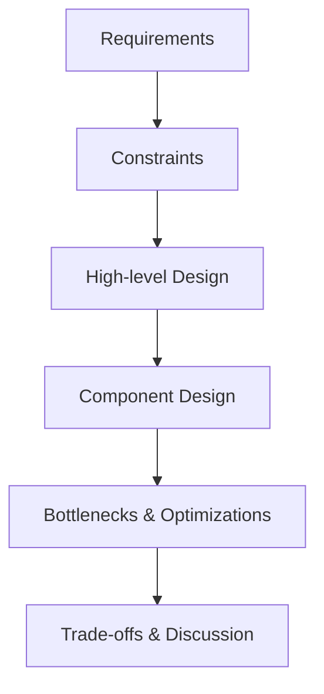
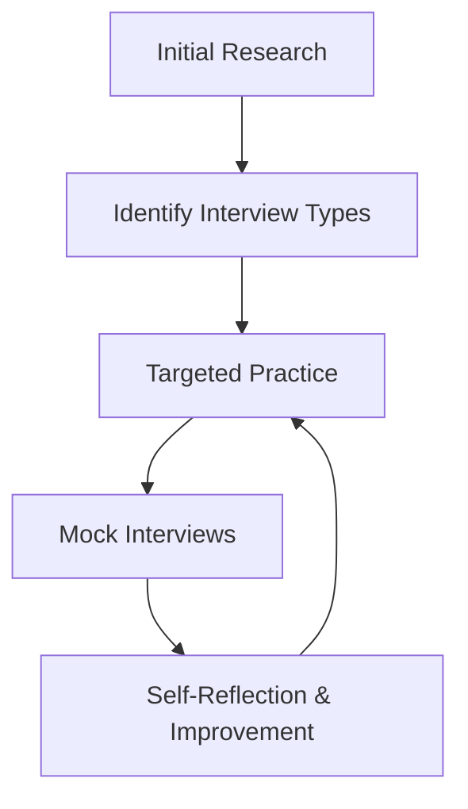

# Interview Types

## Introduction

When applying for programming jobs, you'll encounter various interview formats designed to assess different aspects of your skills and fit for the role. Understanding these interview types in advance will help you prepare effectively and increase your chances of success. This guide breaks down the common interview types in the tech industry, what to expect from each, and how to prepare for them.

## Common Interview Types

### 1. Phone/Video Screening Interviews

Phone or video screening interviews are typically the first step in the hiring process after your application is reviewed.

#### What to Expect:
- Duration: Usually 15-30 minutes
- Format: Conversation with a recruiter or hiring manager
- Purpose: To verify your basic qualifications and communication skills

#### Common Questions:
- Brief overview of your background and experience
- Your interest in the company and role
- Clarification of items on your resume
- Basic technical knowledge assessment
- Salary expectations and availability

#### Example Scenario:
```
Recruiter: "Could you walk me through your experience with Python?"

Good Response: "I've been working with Python for three years, starting with personal projects and later using it professionally. I've built web applications using Django, automated tasks with scripts, and worked on data analysis using pandas and NumPy. I've also contributed to open-source Python projects to improve my skills."
```

### 2. Technical Coding Interviews

Technical coding interviews assess your programming skills, problem-solving abilities, and coding style.

#### What to Expect:
- Duration: 45-90 minutes
- Format: Live coding with an interviewer observing
- Tools: Collaborative editors like CoderPad, HackerRank, or whiteboard
- Purpose: To evaluate your coding skills, algorithm knowledge, and problem-solving approach

#### Common Components:
- Data structure implementation
- Algorithm challenges
- Debugging exercises
- Code optimization tasks

#### Example Problem:
```javascript
// Problem: Write a function to find the first non-repeating character in a string.
// Input: "programming"
// Output: "p" (p is the first character that doesn't repeat)

function firstNonRepeatingChar(str) {
  // Create a map to store character frequencies
  const charCount = {};
  
  // Count characters
  for (const char of str) {
    charCount[char] = (charCount[char] || 0) + 1;
  }
  
  // Find first character with count of 1
  for (const char of str) {
    if (charCount[char] === 1) {
      return char;
    }
  }
  
  // No non-repeating character found
  return null;
}

console.log(firstNonRepeatingChar("programming")); // "p"
console.log(firstNonRepeatingChar("aabbcc")); // null
console.log(firstNonRepeatingChar("aabbc")); // "c"
```

### 3. Behavioral Interviews

Behavioral interviews focus on your soft skills, past experiences, and how you might fit into the company culture.

#### What to Expect:
- Duration: 30-60 minutes
- Format: Structured questions about your past experiences and behaviors
- Purpose: To assess your interpersonal skills, teamwork, leadership, and how you handle challenges

#### Common Question Structures:
- "Tell me about a time when..."
- "How would you handle..."
- "Describe a situation where..."

#### Preparation Strategy: The STAR Method
- **S**ituation: Describe the context
- **T**ask: Explain your responsibility
- **A**ction: Detail the steps you took
- **R**esult: Share the outcome and what you learned

#### Example Scenario:
```
Interviewer: "Tell me about a time when you had to deal with a tight deadline."

STAR Response:
- Situation: "While working on a web application project, our team discovered a critical security vulnerability just two days before the scheduled release."
- Task: "As the lead developer, I needed to coordinate the fix and ensure it wouldn't compromise other features."
- Action: "I immediately prioritized tasks, assigned the most experienced security developer to address the vulnerability, reallocated resources from non-critical features, and implemented a comprehensive testing plan."
- Result: "We successfully patched the vulnerability and deployed on time. We also established a new security review process that became standard for all future releases."
```

### 4. System Design Interviews

System design interviews assess your ability to design scalable, reliable, and efficient software systems.

#### What to Expect:
- Duration: 45-60 minutes
- Format: Open-ended design problem
- Purpose: To evaluate your architectural thinking, technical knowledge, and ability to make design trade-offs

#### Common Components:
- Gathering requirements
- Creating high-level architecture
- Detailing specific components
- Discussing tradeoffs and constraints
- Addressing scalability and edge cases

#### Approach Framework:
1. Clarify requirements
2. Calculate system constraints (traffic, storage, bandwidth)
3. Design high-level system
4. Deep dive into critical components
5. Discuss bottlenecks and optimizations



#### Example Scenario:
```
Interviewer: "Design a URL shortening service like bit.ly."

Approach:
1. Requirements:
   - Shorten long URLs
   - Redirect users to original URL
   - Custom short URLs (optional)
   - Analytics (optional)

2. Constraints:
   - Read-heavy (many redirects, fewer creations)
   - Storage for 100M URLs over 5 years
   - 100:1 read:write ratio

3. High-level components:
   - API service for URL shortening
   - Database for URL mapping
   - Redirection service
   - Analytics service (optional)

4. Database design:
   ```sql
   CREATE TABLE urls (
     id BIGINT PRIMARY KEY AUTO_INCREMENT,
     original_url VARCHAR(2048) NOT NULL,
     short_key VARCHAR(10) NOT NULL,
     user_id INT,
     created_at TIMESTAMP DEFAULT CURRENT_TIMESTAMP,
     expire_at TIMESTAMP,
     UNIQUE KEY (short_key)
   );
   ```

5. URL shortening algorithm:
   - Base62 encoding (a-z, A-Z, 0-9)
   - Hash function or counter-based approach
```

### 5. Take-Home Coding Assignments

Take-home assignments are coding projects you complete on your own time.

#### What to Expect:
- Duration: Usually given 2-7 days to complete
- Format: Building a small application or solving a complex problem
- Purpose: To assess your coding practices, project organization, and ability to work independently

#### Common Components:
- Project requirements document
- Time limit (suggested or hard)
- Submission guidelines
- Evaluation criteria

#### Tips for Success:
- Follow requirements precisely
- Write clean, well-documented code
- Include tests
- Add a README with setup instructions
- Explain trade-offs in your solution

#### Example Assignment:
```
Assignment: Build a command-line TODO application in your preferred language.

Requirements:
- Allow users to add, list, mark as done, and delete tasks
- Persist tasks between program runs
- Include basic error handling
- Implement at least one advanced feature (due dates, priorities, or categories)

Example Implementation (Node.js):

```js
// app.js
const fs = require('fs');
const readline = require('readline');

class TodoApp {
  constructor() {
    this.tasks = [];
    this.dataFile = 'tasks.json';
    this.loadTasks();
  }

  loadTasks() {
    try {
      const data = fs.readFileSync(this.dataFile, 'utf8');
      this.tasks = JSON.parse(data);
    } catch (err) {
      // File might not exist yet, start with empty tasks
      this.tasks = [];
    }
  }

  saveTasks() {
    fs.writeFileSync(this.dataFile, JSON.stringify(this.tasks, null, 2));
  }

  addTask(description, dueDate = null) {
    const task = {
      id: Date.now(),
      description,
      completed: false,
      createdAt: new Date().toISOString(),
      dueDate
    };
    
    this.tasks.push(task);
    this.saveTasks();
    console.log(`Task added: ${description}`);
  }

  listTasks() {
    if (this.tasks.length === 0) {
      console.log("No tasks found.");
      return;
    }
    
    console.log("
Your Tasks:");
    this.tasks.forEach((task, index) => {
      const status = task.completed ? "✓" : "☐";
      const due = task.dueDate ? `(Due: ${task.dueDate})` : "";
      console.log(`${index + 1}. ${status} ${task.description} ${due}`);
    });
  }

  markAsDone(taskIndex) {
    if (taskIndex < 0 || taskIndex >= this.tasks.length) {
      console.log("Invalid task number.");
      return;
    }
    
    this.tasks[taskIndex].completed = true;
    this.saveTasks();
    console.log(`Task "${this.tasks[taskIndex].description}" marked as done.`);
  }

  deleteTask(taskIndex) {
    if (taskIndex < 0 || taskIndex >= this.tasks.length) {
      console.log("Invalid task number.");
      return;
    }
    
    const removed = this.tasks.splice(taskIndex, 1);
    this.saveTasks();
    console.log(`Task "${removed[0].description}" deleted.`);
  }
}

// Usage example
const app = new TodoApp();
app.addTask("Complete the take-home assignment", "2023-05-20");
app.addTask("Prepare for interviews");
app.listTasks();
app.markAsDone(0);
app.listTasks();
```

### 6. Pair Programming Interviews

Pair programming interviews involve collaborating with an interviewer on a coding task.

#### What to Expect:
- Duration: 60-90 minutes
- Format: Collaborative coding with an interviewer
- Purpose: To assess your collaboration skills, communication, and how you work with others

#### Common Components:
- Shared codebase or problem to solve
- Discussion of approaches
- Taking turns writing code
- Code review discussions

#### Tips for Success:
- Communicate your thinking process
- Ask clarifying questions
- Be open to feedback
- Build on your partner's ideas
- Discuss trade-offs in your approach

## Specialized Interview Types

### 1. Domain-Specific Technical Interviews

These interviews focus on knowledge specific to a technology or domain.

#### Examples:
- Frontend-specific (HTML, CSS, JavaScript frameworks)
- Backend-specific (databases, API design)
- Mobile development (iOS, Android)
- Data science (statistical methods, ML algorithms)
- DevOps (CI/CD, infrastructure)

#### Frontend Example:
```jsx
// React component question
// Create a simple counter component with increment and decrement buttons

function Counter() {
  const [count, setCount] = React.useState(0);
  
  const increment = () => {
    setCount(prevCount => prevCount + 1);
  };
  
  const decrement = () => {
    setCount(prevCount => prevCount - 1);
  };
  
  return (
    <div>
      <h2>Count: {count}</h2>
      <button onClick={decrement}>-</button>
      <button onClick={increment}>+</button>
    </div>
  );
}
```

### 2. Architecture Interviews

These focus on higher-level system design and architectural principles.

#### Common Topics:
- Microservice architecture
- Event-driven design
- Data modeling
- Scalability patterns
- Performance optimization

### 3. Security Interviews

For security-focused roles, these assess your knowledge of secure coding practices.

#### Common Topics:
- OWASP vulnerabilities
- Secure authentication
- Input validation
- Encryption
- Threat modeling

## How to Prepare for Different Interview Types

### General Preparation Tips
1. **Research the company** and their interview process
2. **Review the job description** to identify key skills
3. **Practice regularly** with problems similar to what you expect
4. **Prepare questions** to ask your interviewers
5. **Set up your environment** properly for remote interviews

### Technical Preparation
1. Review core data structures and algorithms
2. Practice on platforms like LeetCode, HackerRank, or CodeSignal
3. Study system design principles for senior roles
4. Prepare to explain your thought process clearly



### Behavioral Preparation
1. Compile stories using the STAR method
2. Practice explaining complex technical problems to non-technical people
3. Prepare examples demonstrating leadership, teamwork, and problem-solving
4. Research company values and align your responses

## Summary

Understanding the different types of technical interviews you may encounter helps you prepare effectively for each one. Remember that:

- **Phone/video screens** assess basic qualifications and communication
- **Technical coding interviews** test your problem-solving and coding skills
- **Behavioral interviews** evaluate your soft skills and cultural fit
- **System design interviews** examine your architectural thinking
- **Take-home assignments** show your independent working style
- **Pair programming** reveals your collaboration abilities
- **Specialized interviews** test domain-specific knowledge

The most successful candidates prepare specifically for each interview type they'll face, practice consistently, and reflect on their performance to continuously improve.

## Additional Resources

### Practice Platforms
- LeetCode for algorithm practice
- HackerRank for varied coding challenges
- System Design Primer (GitHub) for design interview prep
- Pramp for mock interviewing with peers

### Books
- "Cracking the Coding Interview" by Gayle Laakmann McDowell
- "System Design Interview" by Alex Xu
- "Programming Interviews Exposed" by John Mongan et al.

### Practice Exercises

1. **Algorithm Practice**: Implement a function to determine if a string has all unique characters without using additional data structures.

2. **System Design Exercise**: Design a simplified version of Twitter focusing on the tweet posting and timeline viewing functionality.

3. **Behavioral Preparation**: Prepare STAR method responses for these scenarios:
   - A time you resolved a technical disagreement with a coworker
   - How you handled a project that went off track
   - When you had to learn a new technology quickly

4. **Take-Home Project Ideas**: Build a simple weather app that fetches data from a public API and displays forecasts for locations entered by users.