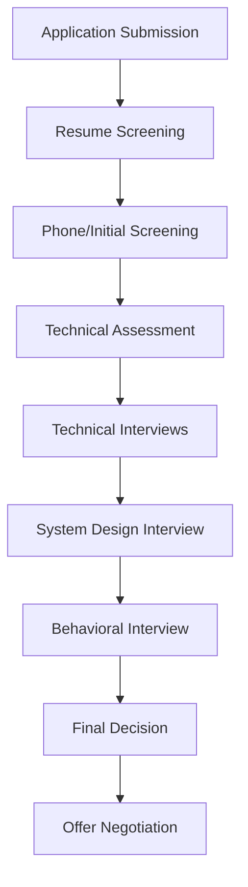

# Interview Process Overview

## Introduction

The technical interview process for software engineering roles can seem daunting, especially for beginners. Understanding what to expect at each stage helps you prepare effectively and approach interviews with confidence. This guide breaks down the typical interview process for programming jobs, from application to offer, with practical advice for each step.

## The Interview Pipeline

Most companies follow a similar interview pipeline, though specific details may vary. Here's what you can generally expect:



## Application and Resume Screening

### Resume Preparation

Your resume is your first impression. Optimize it for both human recruiters and Applicant Tracking Systems (ATS).

Key resume tips:
- Keep it to 1-2 pages
- Include relevant skills, languages, and technologies
- Highlight projects with measurable outcomes
- Tailor it to the job description using relevant keywords
- Use action verbs and quantify achievements where possible

For example, instead of writing:
```
Worked on a web application
```

Write:
```
Developed a responsive React web application that reduced load time by 40% and increased user engagement by 25%
```

## Initial Screening

The first human interaction is typically a phone or video call with a recruiter. This 15-30 minute conversation assesses:

1. Basic qualifications
2. Communication skills
3. Salary expectations
4. Work authorization
5. General interest in the role

**Pro Tip:** Prepare a concise (1-2 minute) answer to "Tell me about yourself" focused on relevant professional experience.

## Technical Assessment

Many companies require a take-home assignment or online coding assessment before proceeding to interviews.

Common formats include:

### 1. Timed Algorithmic Challenges

These are typically completed on platforms like HackerRank, LeetCode, or CodeSignal.

Example problem:

```javascript
// Problem: Write a function that returns the sum of two numbers
function addNumbers(a, b) {
  return a + b;
}

// Test cases
console.log(addNumbers(5, 3)); // Output: 8
console.log(addNumbers(-1, 8)); // Output: 7
console.log(addNumbers(0, 0)); // Output: 0
```

### 2. Take-Home Projects

These are more comprehensive assignments that may take several hours to complete.

Example prompt:
```
Build a simple Todo application with the following features:
- Add new todos
- Mark todos as complete
- Delete todos
- Filter todos by status
```

## Technical Interviews

This is often the most challenging phase. You may face 2-5 technical interviews, each 45-60 minutes long.

### Coding Interviews

These focus on problem-solving abilities, coding skills, and algorithmic thinking.

Common topics include:
- Arrays and strings
- Linked lists
- Trees and graphs
- Sorting and searching algorithms
- Dynamic programming
- Time and space complexity analysis

Example problem-solving approach:

1. **Understand the problem** - Clarify requirements and edge cases
2. **Develop a strategy** - Think about possible approaches
3. **Plan your solution** - Outline the algorithm before coding
4. **Implement your solution** - Write clean, readable code
5. **Test your solution** - Verify with examples, including edge cases
6. **Analyze complexity** - Discuss time and space complexity
7. **Optimize if needed** - Consider more efficient solutions

Example coding interview question:

```python
# Problem: Given an array of integers, return indices of two numbers that add up to a target

def two_sum(nums, target):
    # Create a dictionary to store numbers and their indices
    num_map = {}
    
    # Iterate through the array
    for i, num in enumerate(nums):
        # Calculate the complement
        complement = target - num
        
        # If the complement exists in the map, return both indices
        if complement in num_map:
            return [num_map[complement], i]
        
        # Add the current number to the map
        num_map[num] = i
    
    # If no solution is found
    return None

# Example usage:
nums = [2, 7, 11, 15]
target = 9
print(two_sum(nums, target))  # Output: [0, 1]
```

### System Design Interviews

For mid to senior-level positions, you'll likely face system design questions. These assess your ability to design scalable software systems.

Topics may include:
- Database schema design
- API design
- Scalability considerations
- Load balancing
- Caching strategies
- Microservices vs. monoliths

Example approach to a system design problem:

1. **Clarify requirements** - Understand functional and non-functional requirements
2. **Define capacity estimation** - Estimate traffic, storage, and bandwidth
3. **System interface definition** - Define API endpoints
4. **Data model** - Design database schema
5. **High-level design** - Create a diagram showing major components
6. **Detailed design** - Dive into key components
7. **Identify bottlenecks** - Discuss potential issues and solutions

## Behavioral Interviews

These assess your soft skills, cultural fit, and past experiences. Common questions follow the STAR format (Situation, Task, Action, Result):

- "Tell me about a time when you faced a challenging technical problem."
- "Describe a situation where you had a conflict with a team member."
- "Share an example of a project where you demonstrated leadership."

**Preparation Tip:** Prepare 5-7 stories from your experience that demonstrate different skills and can be adapted to multiple questions.

## Final Rounds and Offer

The final stage often includes:
- Meeting with senior team members or executives
- Discussions about team fit
- Salary negotiations
- Benefits overview

**Negotiation Tip:** Research salary ranges beforehand using resources like Glassdoor, Levels.fyi, or Payscale.

## Interview Preparation Strategies

### 1. Technical Preparation

```javascript
// Sample study plan (pseudocode)
const studyPlan = {
  daily: [
    "Solve 1-2 algorithm problems",
    "Study one data structure concept",
    "Review past projects or solutions"
  ],
  weekly: [
    "Complete 1 mock interview",
    "Build a small project to reinforce skills",
    "Review industry news and trends"
  ]
};
```

### 2. Company Research

Before each interview:
- Study the company's products and services
- Understand their tech stack and engineering culture
- Research recent news or developments
- Review the job description for key skills

### 3. Questions to Ask Interviewers

Prepare thoughtful questions for your interviewers, such as:
- "What does the day-to-day look like for this role?"
- "How does the team approach code reviews and quality assurance?"
- "What are the biggest challenges facing the team right now?"
- "How do you measure success for engineers in this role?"

## Summary

The technical interview process for programming roles typically follows these stages:
1. Application and resume screening
2. Initial phone or video screening
3. Technical assessment or take-home project
4. Multiple technical interviews (coding and/or system design)
5. Behavioral interviews
6. Final rounds and offer discussions

Success requires preparation in technical skills, communication, and company research. Remember that interviewing is a skill that improves with practice.

## Additional Resources

To further prepare for technical interviews:

### Practice Platforms
- LeetCode
- HackerRank
- CodeSignal
- Pramp (for mock interviews)

### Books
- "Cracking the Coding Interview" by Gayle Laakmann McDowell
- "System Design Interview" by Alex Xu
- "Programming Interviews Exposed" by John Mongan et al.

### Online Courses
- AlgoExpert
- Interview Cake
- Grokking the Coding Interview

## Practice Exercises

1. **Mock Screening Call**: Record yourself answering common screening questions and review for clarity.

2. **Algorithmic Challenge**: Solve this problem and analyze its time and space complexity:
   ```
   Given an array of integers, find the longest subarray where the absolute difference between any two elements is less than or equal to 1.
   ```

3. **System Design Exercise**: Design a URL shortening service like bit.ly, considering scalability, database design, and potential bottlenecks.

4. **Behavioral Preparation**: Write out STAR-format responses for three common behavioral questions based on your past experiences.

Remember, interviewing is as much about demonstrating your problem-solving process as it is about reaching the correct solution. Practice thinking aloud and communicating your thought process clearly.