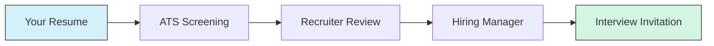

# Resume Preparation

## Introduction

Your resume is often the first impression you make on potential employers. For programmers and developers, a well-crafted resume not only showcases your technical skills but also demonstrates your ability to communicate clearly and organize information effectively. This guide will help you create a resume that highlights your programming expertise and increases your chances of landing interviews.

## Why Your Resume Matters

A technical resume serves several important purposes:

- Acts as your **professional first impression**
- Demonstrates your **relevant skills and experience**
- Provides a **summary of your technical knowledge**
- Serves as a **conversation starter** during interviews
- Helps recruiters determine if you're a **good fit** for the position



## Resume Format and Structure

A well-structured resume should typically include these key sections:

### 1. Contact Information

Place this prominently at the top of your resume:

- Full name
- Phone number
- Professional email address
- LinkedIn profile
- GitHub profile (essential for programmers)
- Personal website or portfolio (if applicable)

### 2. Professional Summary/Objective

This brief section (2-3 sentences) highlights your experience, skills, and career goals. For programming roles, emphasize your technical expertise and specialization.

**Example:**
```
Full-stack developer with 3 years of experience building responsive web applications using React, Node.js, and MongoDB. Passionate about clean code, performance optimization, and creating intuitive user interfaces. Seeking a mid-level developer position where I can contribute to meaningful projects.
```

### 3. Technical Skills

Create a concise, scannable section listing your programming languages, frameworks, tools, and methodologies. Group related skills to improve readability.

**Example:**
```
TECHNICAL SKILLS
- Languages: JavaScript, Python, Java, HTML5, CSS3
- Frameworks: React, Express.js, Django, Spring Boot
- Databases: MongoDB, MySQL, PostgreSQL
- Tools: Git, Docker, AWS, Jira, Webpack
- Methodologies: Agile/Scrum, Test-Driven Development
```

### 4. Work Experience

List your relevant work experience in reverse chronological order (most recent first). For each position, include:

- Company name and location
- Your job title
- Employment dates
- 3-5 bullet points describing your accomplishments

**Key tip:** Focus on achievements rather than responsibilities. Use the PAR formula: Problem, Action, Result.

**Example:**
```
WORK EXPERIENCE

Frontend Developer | TechSolutions Inc. | Seattle, WA | June 2020 - Present
- Developed a responsive dashboard that reduced data access time by 40%, leading to improved user satisfaction scores
- Refactored legacy code to modern React standards, resulting in a 30% reduction in bundle size and faster page load times
- Collaborated with UX team to implement accessible components that increased ADA compliance by 95%
- Mentored two junior developers through paired programming sessions and code reviews
```

### 5. Projects

For entry-level developers or those with limited work experience, a dedicated projects section is crucial. Include:

- Project name and description
- Technologies used
- Your role and contributions
- Links to GitHub or live demos

**Example:**
```
PROJECTS

Weather Alert App | github.com/yourusername/weather-alert
- Built a React Native mobile app that sends personalized weather alerts based on user location
- Implemented geolocation services and integrated with OpenWeatherMap API
- Utilized Redux for state management and Jest for unit testing
- Achieved 4.7/5 rating from beta testers and 1,000+ downloads
```

### 6. Education

Include your formal education, coding bootcamps, and relevant courses:

- Degree/certification name
- Institution name
- Graduation date (or expected)
- Relevant coursework (optional)
- Academic achievements (if notable)

### 7. Additional Sections (Optional)

Consider adding these sections if relevant:

- Certifications
- Languages (spoken/written)
- Open-source contributions
- Conferences or presentations
- Hackathons or competitions

## Resume Writing Tips for Programmers

### Use Action Verbs

Start your bullet points with strong action verbs to convey impact:

| Instead of | Use |
|------------|-----|
| Worked on | Developed, Architected, Engineered |
| Made | Created, Designed, Implemented |
| Helped with | Led, Coordinated, Facilitated |
| Fixed | Debugged, Resolved, Optimized |

### Quantify Achievements

Include metrics and numbers to demonstrate impact:

- "Optimized database queries, reducing load time by 75%"
- "Automated testing process, saving 10 hours per week"
- "Built API that handled 1M+ requests daily with 99.9% uptime"

### Tailor Your Resume for Each Application

Customize your resume for each job application by:

- Matching keywords from the job description
- Emphasizing relevant skills and experiences
- Adjusting your professional summary to align with the role

### Technical Resume Do's and Don'ts

#### Do:
- Keep your resume to 1-2 pages
- Use consistent formatting and bullet structure
- Include links to your GitHub, portfolio, and projects
- Proofread carefully for errors
- Save and send as a PDF to preserve formatting

#### Don't:
- Include outdated or irrelevant technologies
- Use generic phrases without concrete examples
- Overload with technical jargon without context
- Include personal information (age, marital status, photo)
- Lie or exaggerate your skills or experience

## ATS Optimization

Most companies use Applicant Tracking Systems (ATS) to filter resumes before human review. To ensure your resume passes these systems:

1. Use standard section headings (Experience, Education, Skills)
2. Include keywords from the job description naturally throughout
3. Avoid using tables, headers/footers, or complex formatting
4. Don't hide keywords in white text (unethical and easily detected)
5. Use a clean, ATS-friendly format (avoid complex templates)

## Sample Technical Resume Structure

```
JANE DEVELOPER
Seattle, WA | (555) 123-4567 | jane@email.com
github.com/janedeveloper | linkedin.com/in/janedeveloper

PROFESSIONAL SUMMARY
Full-stack developer with 3 years of experience in JavaScript frameworks and Python backends. Passionate about clean code, performance optimization, and user-centric design. Seeking to leverage my technical skills in a challenging role at a forward-thinking tech company.

TECHNICAL SKILLS
Languages: JavaScript (ES6+), Python, HTML5, CSS3, SQL
Frameworks: React, Vue.js, Express.js, Django
Tools: Git, Docker, AWS (S3, EC2, Lambda), Jest, Webpack
Databases: MongoDB, PostgreSQL
Methodologies: Agile/Scrum, Test-Driven Development, CI/CD

PROFESSIONAL EXPERIENCE

Software Developer | InnovateTech | Seattle, WA | June 2020 - Present
- Architected and implemented a customer portal using React and Node.js, reducing support tickets by 35%
- Optimized API endpoints, improving response times by 60% and enhancing overall application performance
- Implemented automated testing with Jest, achieving 90% code coverage and reducing bugs in production by 25%
- Collaborated with a team of 6 developers using Agile methodologies to deliver features on time and within scope

Junior Developer | WebSolutions | Portland, OR | January 2019 - May 2020
- Developed responsive UI components using JavaScript and CSS that improved mobile user engagement by 45%
- Created RESTful APIs using Express.js to integrate with third-party payment services
- Participated in code reviews and pair programming sessions to maintain code quality standards
- Assisted in database schema design and optimization for improved query performance

PROJECTS

Expense Tracker App | github.com/janedeveloper/expense-tracker
- Built a full-stack application using the MERN stack (MongoDB, Express, React, Node.js)
- Implemented JWT authentication and authorization for secure user access
- Created data visualization components using D3.js to display spending patterns
- Deployed the application using Docker containers on AWS EC2

EDUCATION

Bachelor of Science in Computer Science
University of Washington, Seattle
Graduated: May 2018
Relevant Coursework: Data Structures, Algorithms, Database Systems, Web Development
```

## Resume Preparation Process

Follow these steps to create an effective programming resume:

1. **Gather Information**: List all your experiences, projects, skills, and accomplishments
2. **Choose a Format**: Select a clean, professional template
3. **Write Your Content**: Craft compelling bullet points for each section
4. **Optimize for ATS**: Incorporate relevant keywords
5. **Review and Edit**: Check for clarity, conciseness, and errors
6. **Get Feedback**: Ask peers or mentors to review your resume
7. **Finalize and Save**: Format as PDF for submission

## Common Resume Mistakes to Avoid

1. **One-size-fits-all approach**: Not tailoring your resume for specific positions
2. **Focusing on duties instead of achievements**: Listing what you did rather than what you accomplished
3. **Technical overkill**: Listing every technology you've ever used
4. **Poor formatting**: Using inconsistent styles or hard-to-read fonts
5. **Lack of specific examples**: Making claims without supporting evidence
6. **Grammar and spelling errors**: Showing lack of attention to detail
7. **Missing online presence**: Not including GitHub or portfolio links

## Summary

A well-crafted technical resume is your ticket to getting noticed in the competitive programming job market. By highlighting your skills, experiences, and achievements in a clear, concise format, you significantly increase your chances of landing interviews.

Remember that your resume should:
- Be tailored to each position you apply for
- Highlight your technical skills and achievements
- Demonstrate your value through quantifiable results
- Present information in a clean, scannable format
- Pass both ATS screening and human review

## Additional Resources

- [GitHub Resume](https://github.com/resume/resume.github.com) - Generate a resume from your GitHub account
- [HackerRank Skills Certification](https://www.hackerrank.com/skills-certification) - Get certified in various programming skills
- [LinkedIn Learning's Resume Writing Courses](https://www.linkedin.com/learning/)
- [Resume Review Communities on Reddit](https://www.reddit.com/r/resumes/)

## Practice Exercises

1. **Skill Inventory**: Create a comprehensive list of all your technical skills, categorized by proficiency level (beginner, intermediate, advanced).

2. **Achievement Mining**: For each past role or project, identify at least three quantifiable achievements using the PAR (Problem-Action-Result) format.

3. **Keyword Optimization**: Take a job posting you're interested in and highlight all the technical skills and requirements. Then check how many are represented in your current resume.

4. **Peer Review Exchange**: Swap resumes with a fellow programmer and provide each other with constructive feedback.

5. **ATS Test**: Run your resume through a free ATS simulator online to see if it correctly parses your information and skills.