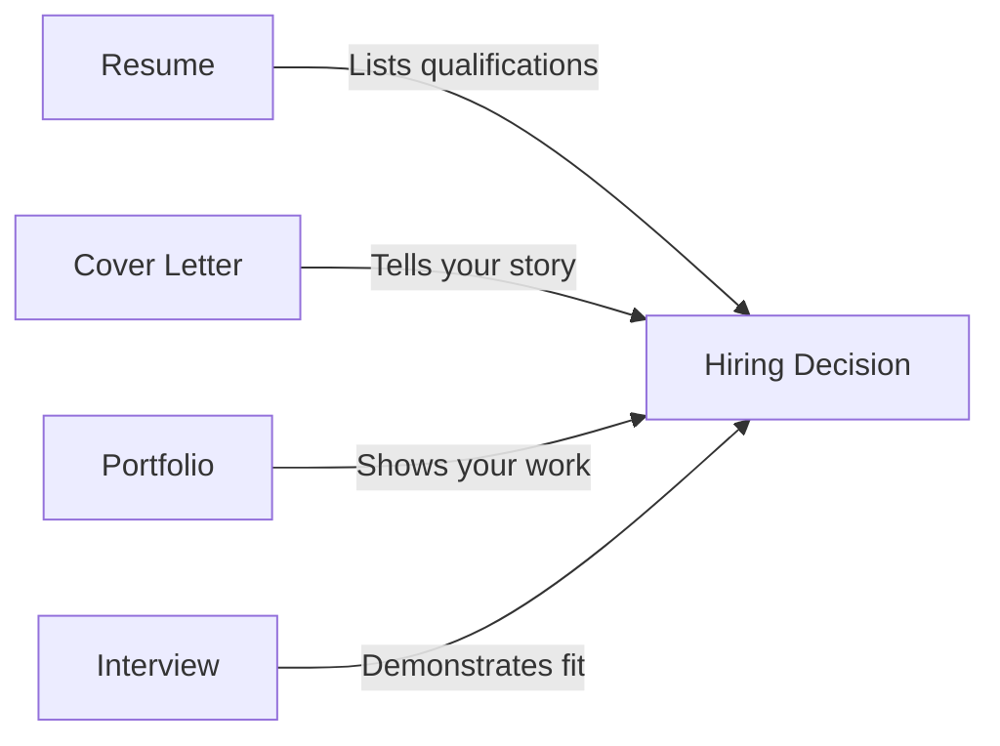

# Cover Letter Writing

## Introduction

A cover letter is your personal introduction to potential employers—a document that accompanies your resume and explains why you're the ideal candidate for a specific programming position. While resumes provide a structured overview of your skills and experiences, cover letters allow you to tell your story, demonstrate your writing abilities, and show how your background aligns with the company's needs.

In the competitive tech industry, a well-crafted cover letter can set you apart from other candidates with similar technical qualifications. This guide will walk you through the process of creating a compelling cover letter specifically tailored for programming and software development roles.

## Why Cover Letters Matter for Programmers

Many developers wonder if cover letters are still relevant in the tech industry. The answer is yes—for several important reasons:

1. They demonstrate communication skills (crucial for team collaboration)
2. They show genuine interest in the specific company and role
3. They provide context for career transitions or gaps
4. They highlight soft skills that complement your technical abilities
5. They give you an opportunity to explain how your experience directly applies to the job requirements



## Cover Letter Structure

A effective programmer cover letter typically follows this structure:

### 1. Header and Contact Information

Include:
- Your name
- Phone number
- Email address
- LinkedIn profile
- GitHub/portfolio URL
- Date
- Recipient's name and title
- Company name and address

Example:
```
Jane Developer
(555) 123-4567 | jane.dev@email.com
github.com/janedev | linkedin.com/in/janedev

April 15, 2025

Alex Hiring-Manager
Technical Recruiting Lead
Innovative Tech Company
123 Coding Lane
San Francisco, CA 94107
```

### 2. Professional Greeting

Address the hiring manager by name whenever possible:
- "Dear Mr./Ms./Mx. [Last Name],"
- "Dear [Full Name],"

If you can't find their name:
- "Dear Hiring Manager,"
- "Dear [Team/Department] Team,"

Avoid outdated greetings like "To Whom It May Concern" or "Dear Sir/Madam."

### 3. Opening Paragraph

Your opening paragraph should:
- State the specific position you're applying for
- Mention how you discovered the job opening
- Include a brief statement about why you're excited about the role
- Provide a concise preview of why you're a strong candidate

Example:
```
I am applying for the Junior Frontend Developer position at Innovative Tech Company, which I discovered through your posting on Stack Overflow Jobs. With my React.js expertise and recent completion of a Computer Science degree, I'm excited about the opportunity to join your team in building accessible web applications that serve diverse user needs.
```

### 4. Body Paragraphs (1-2)

The body of your cover letter should:
- Highlight relevant programming skills and experiences
- Provide specific examples of projects or achievements
- Explain how your skills align with job requirements
- Demonstrate knowledge of the company's products, technologies, or values

Example:
```
At CodeLearn Academy's internship program, I collaborated with a team of four developers to build a responsive e-commerce platform using React, Node.js, and MongoDB. I led the implementation of the user authentication system and payment processing integration, which reduced cart abandonment by 23%. This experience aligns perfectly with your requirement for developers familiar with modern JavaScript frameworks and payment gateway integration.

I'm particularly drawn to Innovative Tech's commitment to accessibility, as mentioned in your job posting. In my personal projects, I've implemented ARIA attributes and followed WCAG guidelines to ensure applications are usable by people of all abilities. My capstone project, an accessible recipe management application, received recognition for its inclusive design at my university's project showcase.
```

### 5. Closing Paragraph

Your conclusion should:
- Express enthusiasm for the opportunity to interview
- Thank the reader for their consideration
- Include a call to action
- Reference your attached resume and any other materials

Example:
```
I'm excited about the possibility of bringing my technical skills and passion for accessible development to the Innovative Tech team. I would welcome the opportunity to discuss how my background and experiences align with your needs. Thank you for considering my application. I look forward to hearing from you.
```

### 6. Professional Sign-off

End with a professional closing:
- "Sincerely,"
- "Best regards,"
- "Kind regards,"

Followed by your full name:
```
Sincerely,

Jane Developer
```

## Writing Tips for Programmer Cover Letters

### Focus on Relevant Skills

Tailor your cover letter to highlight skills mentioned in the job description:

| Job Requirement | How to Address It |
|-----------------|-------------------|
| "Proficient in Python" | "Built three data visualization tools using Python and Pandas" |
| "Experience with AWS" | "Deployed and managed microservices on AWS using Lambda and API Gateway" |
| "Agile environment" | "Collaborated in two-week sprint cycles using Jira and daily standups" |

### Quantify Your Achievements

Use metrics to demonstrate your impact:
- "Optimized database queries, reducing load times by 40%"
- "Automated testing process, saving 10 hours of manual work weekly"
- "Contributed 15+ pull requests to an open-source project with 1,000+ stars"

### Show Your Problem-Solving Approach

Briefly describe how you tackle coding challenges:
```
When faced with the challenge of scaling our authentication service, I researched various solutions, prototyped three alternatives, and ultimately implemented a token-based system with Redis caching that handled a 300% increase in traffic without performance degradation.
```

### Demonstrate Company Knowledge

Show you've done your research:
```
I was impressed by your recent launch of AI-powered recommendation features, which aligns with my graduate research in machine learning models for content personalization.
```

## Common Cover Letter Mistakes to Avoid

1. **Generic templates**: Sending the same cover letter to multiple companies
2. **Focusing only on technical skills**: Neglecting to highlight communication and teamwork
3. **Excessive length**: Writing more than one page
4. **Repeating your resume**: Simply restating what's already in your resume
5. **Grammatical errors**: Not proofreading carefully
6. **Overused buzzwords**: Relying on terms like "passionate," "hardworking," or "detail-oriented" without evidence

## Cover Letter Examples

### Example 1: Entry-Level Software Developer

```
Maya Programmer
maya@coderemail.com | (555) 987-6543
github.com/mayacodes | linkedin.com/in/mayaprogrammer

May 5, 2025

Taylor Recruiter
Talent Acquisition
TechStart Solutions
456 Innovation Avenue
Austin, TX 78701

Dear Taylor Recruiter,

I am excited to apply for the Junior Software Developer position at TechStart Solutions, which I discovered through your company's presentation at my university's career fair last month. As a recent Computer Science graduate with hands-on experience in Java and Spring Boot, I am eager to contribute to your team's mission of creating affordable financial technology solutions for small businesses.

During my internship at LocalFinTech, I assisted in developing a Java-based payment processing system that integrated with multiple banking APIs. I implemented unit tests that increased code coverage by 27% and identified three critical security vulnerabilities before deployment. This experience directly relates to your job requirement for developers who understand secure financial transactions.

My capstone project involved creating a budgeting application using React and Java Spring Boot, where I implemented responsive UI components and RESTful APIs. The project received an A+ grade and is currently being used by the university's student association to manage event budgets. I'm particularly drawn to TechStart's focus on creating intuitive user experiences, as mentioned in your company blog, and would be thrilled to apply my front-end skills to similar challenges.

I welcome the opportunity to discuss how my technical foundation and eagerness to learn could benefit TechStart Solutions. Thank you for considering my application, and I look forward to the possibility of contributing to your innovative team.

Sincerely,

Maya Programmer
```

### Example 2: Experienced Developer Changing Specializations

```
Alex Backend
alex@developermail.com | (555) 234-5678
github.com/alexbackend | linkedin.com/in/alexbackend

June 15, 2025

Jamie Technical-Director
Engineering Director
FrontEnd Innovations
789 UI Boulevard
Seattle, WA 98101

Dear Jamie Technical-Director,

I am applying for the Senior Frontend Developer position at FrontEnd Innovations, which I discovered through your CTO's LinkedIn post. While my seven years of experience has primarily been in backend development with Node.js and MongoDB, I have spent the past 18 months transitioning to frontend technologies, specifically React and TypeScript, and am excited about the opportunity to bring my unique perspective to your user experience team.

At DataSystems Inc., I initially worked as a backend engineer but volunteered to help with our dashboard redesign when the team was shorthanded. This experience sparked my interest in frontend development, leading me to complete three advanced courses in modern JavaScript frameworks and contribute to the company's component library. I led a project to standardize our React components, resulting in a 30% reduction in development time for new features and consistent UI across all products.

I was particularly impressed by FrontEnd Innovations' case study on improving accessibility for your client's e-commerce platform. This resonates with my recent work implementing WCAG 2.1 standards across DataSystems' applications. I initiated and completed an audit that identified 24 accessibility issues, then methodically resolved them while documenting best practices for the team.

My background in backend development gives me a unique perspective on frontend challenges, particularly regarding API integration and state management. I understand the full stack and can collaborate effectively with backend teams to create seamless user experiences.

I would welcome the opportunity to discuss how my technical versatility and passion for accessible user interfaces could benefit FrontEnd Innovations. Thank you for considering my application.

Best regards,

Alex Backend
```

## Adapting Your Cover Letter for Different Situations

### For Remote Positions

Emphasize:
- Self-discipline and time management
- Communication skills across digital channels
- Previous remote work experience
- Familiarity with collaboration tools
- Ability to work across time zones if applicable

### For Career Changers

Focus on:
- Transferable skills (problem-solving, analysis, project management)
- Relevant programming projects or courses
- How your previous experience provides unique value
- Your motivation for changing careers
- Commitment to learning and growth

### For Internships

Highlight:
- Relevant coursework and academic projects
- Eagerness to learn specific technologies
- Soft skills like teamwork and adaptability
- Extracurricular coding activities
- Clear career goals that align with the company

## Cover Letter Checklist

Before submitting your cover letter, review this checklist:

- [ ] Addressed to the correct person/company
- [ ] Specific position mentioned
- [ ] Tailored to match job requirements
- [ ] Contains specific examples, not just statements
- [ ] Includes quantifiable achievements
- [ ] Shows knowledge of the company
- [ ] Demonstrates both technical and soft skills
- [ ] One page or less in length
- [ ] Free of grammar and spelling errors
- [ ] Formatted consistently (font, spacing, margins)
- [ ] Saved as PDF with a professional filename

## Summary

A well-crafted cover letter complements your resume by telling your unique story and demonstrating why you're the ideal candidate for a programming position. By following the structure outlined in this guide and tailoring your letter to each application, you can make a strong impression on hiring managers in the competitive tech industry.

Remember that your cover letter should be concise, specific, and focused on what you can offer the employer. It's an opportunity to showcase your communication skills while highlighting the most relevant aspects of your technical background and personal attributes.

## Additional Resources

- Practice analyzing job descriptions to identify key requirements
- Ask peers or mentors to review your cover letters
- Create a master template that you can customize for each application
- Keep a document of your quantifiable achievements to reference when writing cover letters

## Exercises

1. Find a real job posting for a position you're interested in and draft a cover letter addressing the specific requirements.

2. Identify three achievements from your programming experience and practice describing them with specific metrics.

3. Write an opening paragraph for three different types of companies: a startup, an enterprise corporation, and a non-profit organization.

4. Review a past cover letter you've written and revise it using the guidelines in this guide. What improvements can you make?